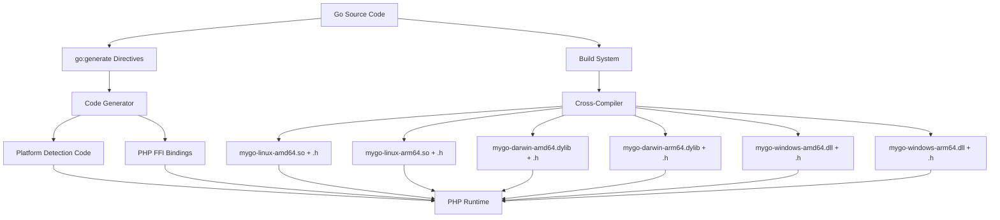
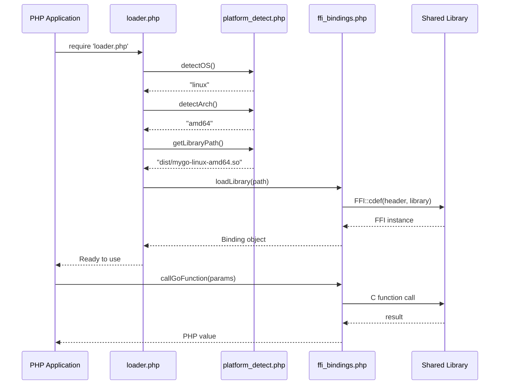

# Cross-Platform Go Shared Library Build System for PHP FFI Integration

## Overview

This design establishes a standardized build system for generating Go shared libraries that can be consumed by PHP through FFI (Foreign Function Interface). The system automates the generation of platform-specific shared libraries following a unified naming convention, along with their corresponding C header files and PHP binding code.

## Business Context

### Purpose
Enable seamless integration between Go backend libraries and PHP applications by providing a robust, automated build system that handles cross-platform compilation and FFI binding generation.

### Target Use Case
PHP applications need to call high-performance Go libraries (e.g., cryptographic operations, data processing, system utilities) through PHP FFI without requiring manual compilation or platform detection.

## Design Goals

1. **Standardized Naming**: Establish consistent naming convention for all platform-specific artifacts
2. **Build Automation**: Fully automated build process using Go toolchain and go:generate
3. **Platform Detection**: Automatic runtime detection and loading of correct shared library in PHP
4. **Zero Manual Intervention**: Developers should only write Go code; all bindings and platform handling are auto-generated
5. **Maintainability**: Single source of truth for build configuration

## Naming Convention

### Shared Library Naming Standard

All generated shared libraries follow the pattern:

```
mygo-{GOOS}-{GOARCH}.{extension}
```

Where:
- `{GOOS}`: Target operating system (linux, darwin, windows)
- `{GOARCH}`: Target architecture (amd64, arm64)
- `{extension}`: Platform-specific extension (so, dylib, dll)

### Supported Platform Matrix

| Platform | GOOS | GOARCH | Output Filename |
|----------|------|--------|-----------------|
| Linux x64 | linux | amd64 | mygo-linux-amd64.so |
| Linux ARM64 | linux | arm64 | mygo-linux-arm64.so |
| macOS x64 | darwin | amd64 | mygo-darwin-amd64.dylib |
| macOS ARM64 | darwin | arm64 | mygo-darwin-arm64.dylib |
| Windows x64 | windows | amd64 | mygo-windows-amd64.dll |
| Windows ARM64 | windows | arm64 | mygo-windows-arm64.dll |

### Header File Naming

Each platform generates a corresponding C header file:

```
mygo-{GOOS}-{GOARCH}.h
```

This header contains the C function declarations exported from the Go shared library.

## Architecture Components

### Component Overview



### Core Components

#### 1. Go Source Library
- Contains the business logic to be exposed
- Exports functions using CGO directives
- Includes go:generate directives for automation

#### 2. Code Generator (Go-based)
- Generates platform detection logic
- Generates PHP FFI binding code
- Reads exported functions and creates appropriate bindings
- Outputs PHP files with proper FFI definitions

#### 3. Build Orchestrator
- Coordinates cross-compilation for all target platforms
- Invokes Go compiler with appropriate GOOS/GOARCH combinations
- Manages output directory structure
- Ensures header files are generated alongside binaries

#### 4. Platform Detection Module (Auto-generated)
- PHP code that detects current OS and architecture
- Selects appropriate shared library at runtime
- Provides error handling for unsupported platforms

#### 5. PHP FFI Binding Layer (Auto-generated)
- Loads the correct platform-specific shared library
- Defines FFI interface matching C header definitions
- Provides PHP-friendly function wrappers

## Build Workflow

### Build Process Flow

```mermaid
flowchart TD
    Start[Developer runs: go generate] --> Parse[Parse Go source for exports]
    Parse --> GenDetect[Generate platform_detect.php]
    Parse --> GenBinding[Generate ffi_bindings.php]
    GenDetect --> BuildStart[Developer runs: go run build.go]
    GenBinding --> BuildStart
    BuildStart --> Loop{For each platform}
    Loop --> SetEnv[Set GOOS and GOARCH]
    SetEnv --> Compile[go build -buildmode=c-shared]
    Compile --> Output[Output: mygo-GOOS-GOARCH.{ext} + .h]
    Output --> Loop
    Loop --> Done[All platforms built]
    Done --> Package[Package dist/ directory]
```

### Step-by-Step Build Sequence

#### Phase 1: Code Generation (go generate)

1. Developer adds `//go:generate go run generator/main.go` directive in main Go file
2. Generator scans exported functions (those with `//export` comment)
3. Generator produces:
   - `platform_detect.php`: Runtime platform detection logic
   - `ffi_bindings.php`: FFI interface definitions and function wrappers
   - `loader.php`: Main entry point for PHP applications

#### Phase 2: Cross-Platform Compilation (go run build.go)

1. Build script iterates through target platform matrix
2. For each (GOOS, GOARCH) combination:
   - Sets environment variables
   - Invokes: `go build -buildmode=c-shared -o dist/mygo-{GOOS}-{GOARCH}.{ext}`
   - Go automatically generates corresponding `.h` file
3. Verifies all expected artifacts are created
4. Copies generated PHP files to dist directory

#### Phase 3: Distribution Packaging

1. Collect all `.so`/`.dylib`/`.dll` files
2. Collect all `.h` files
3. Collect all generated PHP files
4. Create dist package with proper directory structure

## Data Structures and Interfaces

### Build Configuration Structure

The build system uses a configuration structure to define platform targets:

| Field | Type | Description |
|-------|------|-------------|
| GOOS | string | Target operating system |
| GOARCH | string | Target architecture |
| Extension | string | Shared library file extension |
| OutputName | string | Final library filename (computed) |

### PHP Platform Detection Logic

The auto-generated platform detection module provides:

| Function | Return Type | Purpose |
|----------|-------------|---------|
| detectOS() | string | Returns current OS (linux/darwin/windows) |
| detectArch() | string | Returns current architecture (amd64/arm64) |
| getLibraryPath() | string | Returns full path to appropriate shared library |
| isSupported() | boolean | Checks if current platform is supported |

### FFI Binding Interface

The auto-generated FFI bindings expose:

| Element | Type | Description |
|---------|------|-------------|
| FFI instance | object | Loaded FFI instance with library and definitions |
| Function wrappers | callable | PHP functions that map to Go exports |
| Type definitions | struct | PHP representations of Go structs |
| Error handlers | callable | Functions to handle cross-language errors |

## Generator Implementation Strategy

### Generator Responsibilities

#### Input Processing
- Parse Go source files to extract `//export` annotated functions
- Extract function signatures (parameters, return types)
- Identify required C type mappings

#### Platform Detection Code Generation

Generate PHP code that:
- Uses `PHP_OS_FAMILY` to detect OS
- Uses `php_uname('m')` to detect architecture
- Maps PHP values to GOOS/GOARCH equivalents
- Constructs library filename using naming convention

#### FFI Binding Code Generation

Generate PHP code that:
- Reads appropriate `.h` file for current platform
- Creates FFI instance with header definitions
- Wraps each exported Go function with PHP callable
- Handles type conversions between PHP and C types
- Provides error handling and validation

### Generated File Structure

```
dist/
├── mygo-linux-amd64.so
├── mygo-linux-amd64.h
├── mygo-linux-arm64.so
├── mygo-linux-arm64.h
├── mygo-darwin-amd64.dylib
├── mygo-darwin-amd64.h
├── mygo-darwin-arm64.dylib
├── mygo-darwin-arm64.h
├── mygo-windows-amd64.dll
├── mygo-windows-amd64.h
├── mygo-windows-arm64.dll
├── mygo-windows-arm64.h
├── platform_detect.php
├── ffi_bindings.php
└── loader.php
```

## Build Tool Design

### Build Script Architecture

The build script (`build.go`) operates as a standalone Go program that:

#### Configuration Definition
Defines the complete platform matrix as a data structure containing all target combinations.

#### Environment Management
- Saves original GOOS/GOARCH environment variables
- Sets target-specific environment for each build
- Restores original environment after completion

#### Compilation Orchestration
- Executes Go compiler with `-buildmode=c-shared` flag
- Specifies output path following naming convention
- Captures compilation output and errors
- Validates successful compilation

#### Verification
- Checks existence of generated `.so`/`.dylib`/`.dll` file
- Checks existence of corresponding `.h` file
- Validates file sizes (non-zero)
- Reports missing or failed builds

#### Error Handling
- Logs compilation errors with platform context
- Continues building other platforms on failure
- Provides summary report of successes and failures

## PHP Integration Design

### Runtime Library Loading Flow



### PHP Usage Pattern

The end-user PHP code follows this pattern:

1. Include the loader
2. Obtain library instance
3. Call Go functions through PHP interface
4. Handle results and errors

The loader automatically:
- Detects current platform
- Loads appropriate shared library
- Initializes FFI with correct header
- Provides callable interface

### Error Handling Strategy

The PHP layer handles multiple error scenarios:

| Error Scenario | Detection | Response |
|----------------|-----------|----------|
| Unsupported platform | Platform detection returns unknown OS/arch | Throw exception with platform info |
| Library file missing | File existence check fails | Throw exception with expected path |
| FFI load failure | FFI::cdef() throws | Catch and rethrow with context |
| Function call error | Go function returns error code | Convert to PHP exception |
| Type mismatch | FFI type validation | Throw TypeError with details |

## Go Code Requirements

### Export Function Guidelines

Go functions must follow these conventions to be properly exported:

#### Function Signature Requirements
- Use C-compatible types (int, char*, etc.)
- Avoid Go-specific types (slices, maps, interfaces)
- Return error codes as integers
- Use pointers for output parameters

#### Export Annotation
Each exported function requires the `//export` comment directive immediately before the function declaration.

#### CGO Import
The main package must import "C" to enable CGO functionality.

### Main Function Requirement

For shared library builds, an empty main() function is required but never called.

## Build Automation Integration

### go:generate Directive Placement

The go:generate directive should be placed in the main Go source file:

```
//go:generate go run generator/main.go
```

This directive triggers the code generator before compilation.

### Development Workflow

The developer workflow consists of:

1. Write Go library code with exported functions
2. Run `go generate ./...` to create PHP bindings
3. Run `go run build.go` to compile all platform variants
4. Test with PHP application using generated loader
5. Distribute dist/ directory with PHP application

### Continuous Integration Considerations

In CI/CD pipelines:
- Run code generation as first step
- Execute cross-platform builds
- Validate all artifacts are created
- Package dist directory as release artifact
- Optionally run PHP integration tests on each platform

## Platform-Specific Considerations

### Linux Considerations
- Default shared library extension: `.so`
- No special linker flags typically needed
- Consider static linking for portability

### macOS Considerations
- Shared library extension: `.dylib`
- Code signing may be required for distribution
- Gatekeeper restrictions on unsigned libraries
- Consider universal binaries for both architectures

### Windows Considerations
- Shared library extension: `.dll`
- May require Visual C++ runtime dependencies
- Path separators differ (backslash vs forward slash)
- Case-insensitive filesystem

### Architecture Detection Mapping

PHP architecture detection to GOARCH mapping:

| PHP uname('m') | GOARCH |
|----------------|--------|
| x86_64, amd64 | amd64 |
| aarch64, arm64 | arm64 |

## Extensibility and Future Enhancements

### Adding New Platforms

To support additional platforms:

1. Add new entry to platform matrix in build script
2. Define extension mapping for new OS
3. Update platform detection logic in generator
4. Update PHP OS/architecture mapping if needed
5. Rebuild all artifacts

### Adding New Functions

When adding new exported Go functions:

1. Add `//export` directive to new function
2. Run `go generate` to update bindings
3. Run build script to recompile libraries
4. New functions automatically available in PHP

### Custom Build Options

The build system can be extended to support:
- Custom compiler flags per platform
- Optimization levels (debug vs release)
- Static vs dynamic linking preferences
- Custom output directory structures
- Version numbering in filenames

## Security Considerations

### Library Loading Security
- Validate library file integrity before loading
- Use absolute paths to prevent DLL hijacking
- Implement checksum verification for distributed libraries

### FFI Safety
- Validate all input parameters before passing to Go
- Sanitize string inputs to prevent buffer overflows
- Handle memory allocation failures gracefully
- Limit exposed functions to necessary subset

### Distribution Security
- Sign shared libraries for each platform
- Provide checksums for all artifacts
- Use secure channels for library distribution
- Document supported platforms explicitly

## Performance Considerations

### Build Performance
- Parallel compilation across platforms using goroutines
- Cache compiled artifacts when source unchanged
- Incremental builds for development workflow

### Runtime Performance
- Library loading happens once per PHP process
- FFI calls have minimal overhead vs native C
- Consider persistent PHP processes (FPM) for better performance
- Avoid repeated library loading in request loop

## Testing Strategy

### Build System Testing
- Verify each platform generates expected artifacts
- Validate header file content matches exports
- Check filename conventions are followed
- Test build script on all development platforms

### PHP Integration Testing
- Test platform detection on all target platforms
- Verify library loading succeeds
- Test each exported function through PHP
- Validate error handling paths
- Test unsupported platform behavior

### Cross-Platform Testing
- Run integration tests on actual target platforms
- Validate architecture-specific builds (ARM vs x64)
- Test library compatibility with different PHP versions
- Verify no runtime dependencies missing

## Documentation Requirements

### Developer Documentation
- Guide for adding new exported functions
- Build system usage instructions
- Troubleshooting common build errors
- Platform-specific setup requirements

### User Documentation
- PHP integration guide
- Function reference (auto-generated)
- Example usage patterns
- Error handling guide

### Operational Documentation
- Deployment instructions per platform
- Dependency requirements
- Performance tuning guide
- Security best practices
