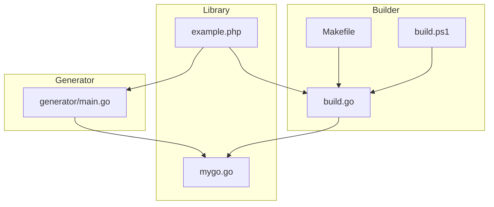
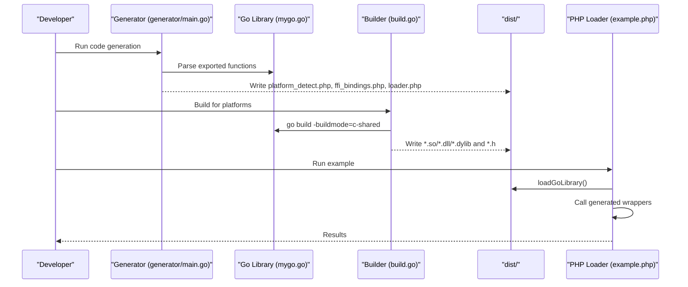
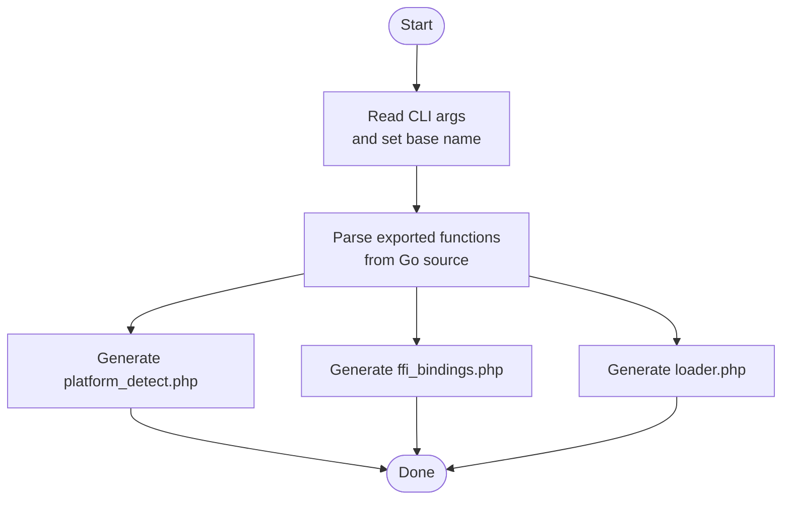
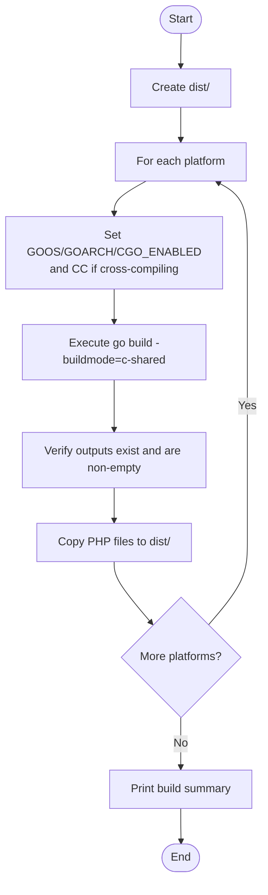
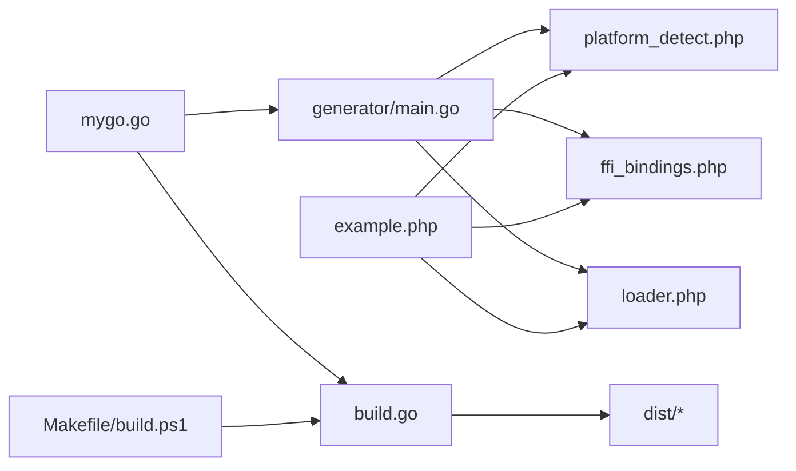

# Advanced Topics

<cite>
**Referenced Files in This Document**
- [build.go](file://build.go)
- [generator/main.go](file://generator/main.go)
- [mygo.go](file://mygo.go)
- [example.php](file://example.php)
- [README.md](file://README.md)
- [QUICKSTART.md](file://QUICKSTART.md)
- [AGENTS.MD](file://AGENTS.MD)
- [Makefile](file://Makefile)
- [build.ps1](file://build.ps1)
</cite>

## Table of Contents
1. [Introduction](#introduction)
2. [Project Structure](#project-structure)
3. [Core Components](#core-components)
4. [Architecture Overview](#architecture-overview)
5. [Detailed Component Analysis](#detailed-component-analysis)
6. [Dependency Analysis](#dependency-analysis)
7. [Performance Considerations](#performance-considerations)
8. [Security Considerations](#security-considerations)
9. [Debugging and Profiling](#debugging-and-profiling)
10. [Extending Beyond Defaults](#extending-beyond-defaults)
11. [Troubleshooting Guide](#troubleshooting-guide)
12. [Conclusion](#conclusion)

## Introduction
This document focuses on advanced usage scenarios for the cross-platform Go shared library build system designed for PHP FFI integration. It covers:
- Customizing the code generator to handle different Go source patterns and alternative binding styles
- Extending the build orchestrator to support additional platforms or build configurations
- Performance optimization techniques to minimize FFI overhead and optimize Go function signatures for PHP consumption
- Security considerations when exposing Go functions to PHP, including input validation and sandboxing
- Strategies for debugging complex cross-language issues and profiling performance bottlenecks
- Practical examples of extending the system beyond the default configuration

## Project Structure
The repository provides a cohesive build pipeline:
- A Go-based code generator that parses exported functions and produces PHP FFI bindings
- A cross-platform build orchestrator that compiles shared libraries and copies PHP assets
- A minimal example library with exported functions and a PHP example application
- Supporting scripts for Windows and Unix-like systems

**Diagram sources**
- [generator/main.go](file://generator/main.go#L1-L705)
- [build.go](file://build.go#L1-L183)
- [Makefile](file://Makefile#L1-L54)
- [build.ps1](file://build.ps1#L1-L152)
- [mygo.go](file://mygo.go#L1-L39)
- [example.php](file://example.php#L1-L95)

**Section sources**
- [README.md](file://README.md#L1-L120)
- [QUICKSTART.md](file://QUICKSTART.md#L1-L80)
- [AGENTS.MD](file://AGENTS.MD#L1-L120)

## Core Components
- Code Generator: Parses exported functions from a Go source file and generates three PHP files:
  - Platform detection module
  - FFI bindings module
  - Loader module
- Build Orchestrator: Compiles shared libraries for multiple platforms, verifies outputs, and copies PHP assets to a distribution directory
- Example Library: Demonstrates exported functions and usage patterns
- Build Scripts: Provide convenience commands for Windows and Unix-like environments

**Section sources**
- [generator/main.go](file://generator/main.go#L1-L120)
- [build.go](file://build.go#L1-L120)
- [mygo.go](file://mygo.go#L1-L39)
- [example.php](file://example.php#L1-L40)
- [Makefile](file://Makefile#L1-L54)
- [build.ps1](file://build.ps1#L1-L90)

## Architecture Overview
The system follows a deterministic pipeline:
- Generate PHP bindings from Go exports
- Build shared libraries for target platforms
- Package artifacts and provide runtime platform detection and loading

**Diagram sources**
- [generator/main.go](file://generator/main.go#L20-L120)
- [build.go](file://build.go#L100-L183)
- [example.php](file://example.php#L1-L40)

## Detailed Component Analysis

### Code Generator: Customization and Alternative Binding Styles
The generator identifies exported functions by scanning for specific directives and comments, extracting signatures and types, and generating PHP classes with instance methods and PHPDoc. It supports dynamic library naming based on the source file and enforces a fixed namespace for generated classes.

Key customization points:
- Source file selection: The generator accepts a CLI argument to process a custom Go source file, enabling multiple libraries in one project
- Type mapping: The generator maps C/Go types to PHP types for documentation and type hints, with conservative defaults for unknown types
- Output composition: Three PHP files are generated with distinct responsibilities

Recommended customization strategies:
- Extend type mapping for new C/Go types by updating the mapping functions to emit appropriate PHPDoc and type hints
- Adjust the namespace and class naming scheme by modifying the generation templates
- Introduce alternative binding styles by adding new generation modes (e.g., static methods, traits, or interfaces) while preserving the core parsing logic

**Diagram sources**
- [generator/main.go](file://generator/main.go#L20-L120)

**Section sources**
- [generator/main.go](file://generator/main.go#L20-L120)
- [generator/main.go](file://generator/main.go#L120-L220)
- [generator/main.go](file://generator/main.go#L340-L420)
- [generator/main.go](file://generator/main.go#L420-L500)
- [generator/main.go](file://generator/main.go#L500-L705)

### Build Orchestrator: Extending Platform Support and Build Configurations
The builder defines supported platforms and constructs platform-specific filenames and extensions. It sets environment variables for cross-compilation, configures compilers when needed, executes builds, validates outputs, and copies PHP assets to the distribution directory.

Extending platform support:
- Add new entries to the supported platforms list with appropriate GOOS/GOARCH and extension
- Configure cross-compilers as needed (e.g., CC environment variables)
- Update platform detection logic in the generated PHP files to recognize new platforms

Extending build configurations:
- Introduce build modes (e.g., debug, release) by adding flags and toggles
- Parameterize output paths and naming conventions for multi-library projects
- Add post-build verification steps (checksums, size thresholds)

**Diagram sources**
- [build.go](file://build.go#L1-L120)
- [build.go](file://build.go#L120-L183)

**Section sources**
- [build.go](file://build.go#L1-L120)
- [build.go](file://build.go#L120-L183)

### Example Library and PHP Integration
The example library demonstrates exported functions and usage patterns. The example PHP application loads the library, prints platform information, and exercises several functions, including string handling and memory management.

Practical insights:
- Always free strings allocated by Go when returning pointers to C strings
- Use the loader to automatically detect and load the correct platform-specific library
- Validate inputs before passing to Go functions to prevent unexpected behavior

**Section sources**
- [mygo.go](file://mygo.go#L1-L39)
- [example.php](file://example.php#L1-L95)

## Dependency Analysis
The system exhibits clear separation of concerns:
- Generator depends on the Go source file and emits PHP files
- Builder depends on the Go source file and emits shared libraries and headers
- Scripts orchestrate generator and builder across platforms
- PHP example consumes the generated loader and bindings

**Diagram sources**
- [generator/main.go](file://generator/main.go#L1-L120)
- [build.go](file://build.go#L1-L120)
- [Makefile](file://Makefile#L1-L54)
- [build.ps1](file://build.ps1#L1-L90)
- [example.php](file://example.php#L1-L40)

**Section sources**
- [generator/main.go](file://generator/main.go#L1-L120)
- [build.go](file://build.go#L1-L120)
- [Makefile](file://Makefile#L1-L54)
- [build.ps1](file://build.ps1#L1-L90)
- [example.php](file://example.php#L1-L40)

## Performance Considerations
- Library loading: FFI initialization occurs once per process; use persistent processes (e.g., PHP-FPM) to amortize startup costs
- FFI overhead: Compared to native C extensions, FFI overhead is modest; batch operations when possible to reduce call frequency
- String handling: Converting between PHP and C strings incurs overhead; minimize round-trips and reuse buffers where feasible
- Memory management: Always free Go-allocated strings to prevent leaks; ensure callers follow the documented pattern

**Section sources**
- [README.md](file://README.md#L296-L310)

## Security Considerations
- Input validation: Validate and sanitize all inputs before invoking Go functions to prevent unexpected behavior or crashes
- Memory safety: Improper pointer usage can lead to crashes or memory corruption; follow the documented memory management guidelines
- Library integrity: Verify checksums of distributed libraries to ensure integrity
- Code injection: Avoid passing unsanitized user input to string functions; prefer typed parameters and strict validation
- Sandboxing: Restrict the environment where libraries are loaded; avoid loading untrusted binaries

**Section sources**
- [README.md](file://README.md#L303-L310)

## Debugging and Profiling
Common debugging strategies:
- Validate platform detection and library paths; confirm the loader resolves the correct platform-specific files
- Inspect generated PHP files to ensure function signatures and type hints match expectations
- Use PHP error reporting and stack traces to identify binding or loading issues
- Profile FFI calls by measuring latency around library invocations and identifying hotspots

Profiling techniques:
- Measure end-to-end latency in PHP to isolate FFI overhead versus business logic
- Compare performance across architectures and platforms to identify regressions
- Monitor memory usage to detect leaks or excessive allocations

**Section sources**
- [example.php](file://example.php#L1-L40)
- [generator/main.go](file://generator/main.go#L340-L420)
- [build.go](file://build.go#L1-L120)

## Extending Beyond Defaults

### Customizing the Code Generator for Different Go Source Patterns
- Multi-file libraries: Pass a custom Go source file to the generator to process multiple files and aggregate exported functions
- Alternative binding styles: Modify the generator to emit static methods, traits, or interfaces while keeping the parsing logic intact
- Enhanced PHPDoc: Extend the generator to include richer documentation metadata (e.g., parameter descriptions, return value semantics)
- Namespace customization: Update the generator to accept a namespace parameter and apply it consistently across generated classes

Implementation anchors:
- Source selection and base name extraction
- Type mapping and PHPDoc generation
- Template-driven generation of platform detection, FFI bindings, and loader

**Section sources**
- [generator/main.go](file://generator/main.go#L20-L120)
- [generator/main.go](file://generator/main.go#L420-L500)
- [generator/main.go](file://generator/main.go#L500-L705)

### Extending the Build Orchestrator for Additional Platforms or Configurations
- Platform expansion: Add new platform entries with correct GOOS/GOARCH and extension; configure cross-compilers as needed
- Build modes: Introduce flags for debug/release builds and inject appropriate compiler/linker flags
- Multi-library support: Parameterize output naming to support multiple libraries in a single project
- Post-build checks: Add checksum verification and size validation to ensure artifact integrity

Operational anchors:
- Supported platforms list and filename construction
- Environment variable setup for cross-compilation
- Output verification and asset copying

**Section sources**
- [build.go](file://build.go#L1-L120)
- [build.go](file://build.go#L120-L183)

### Optimizing Go Function Signatures for PHP Consumption
- Prefer primitive types and simple arrays/maps for FFI boundaries
- Avoid complex nested structures; flatten or serialize where appropriate
- Return pointers to C strings only when necessary; provide explicit free functions
- Use consistent naming and clear comments for exported functions

**Section sources**
- [mygo.go](file://mygo.go#L1-L39)
- [example.php](file://example.php#L1-L95)

### Integrating with CI/CD Pipelines
- Automate generation and building across platforms using the provided scripts
- Publish artifacts as build artifacts for downstream consumption
- Add quality gates (tests, checksums) before releasing

**Section sources**
- [Makefile](file://Makefile#L1-L54)
- [build.ps1](file://build.ps1#L1-L90)
- [README.md](file://README.md#L320-L356)

## Troubleshooting Guide
- PHP FFI not enabled: Ensure the FFI extension is enabled in php.ini
- Library not found: Confirm generation and build steps were executed and that the distribution directory contains the correct files
- Platform not supported: Build for your platform or extend platform support in the builder and generator
- CGO disabled: Enable CGO and ensure a C compiler is available
- DLL loading errors on Windows: Verify architecture alignment and runtime dependencies

**Section sources**
- [README.md](file://README.md#L238-L310)

## Conclusion
This advanced guide outlined practical strategies for customizing the code generator, extending the build orchestrator, optimizing performance, and ensuring security and reliability when integrating Go shared libraries with PHP via FFI. By following the provided patterns and leveraging the existing scripts and documentation, teams can adapt the system to diverse environments and requirements while maintaining robustness and maintainability.