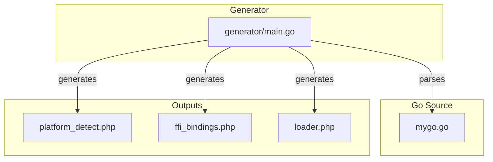
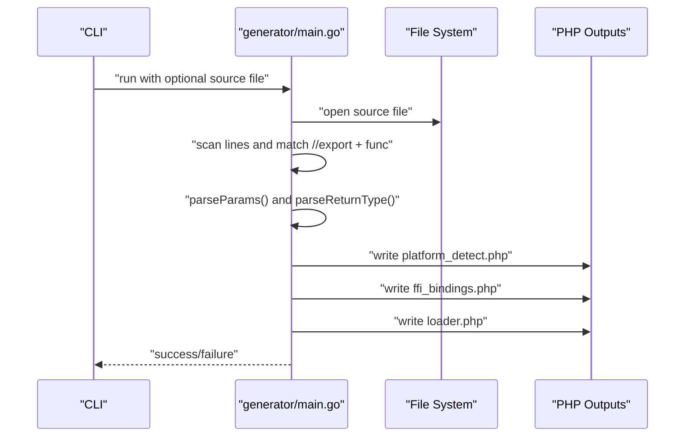
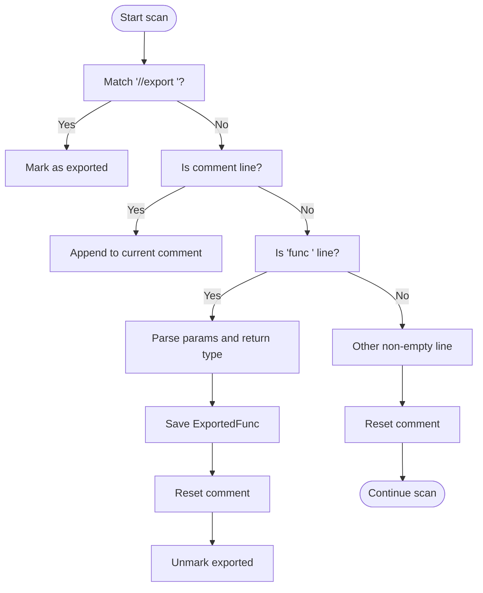
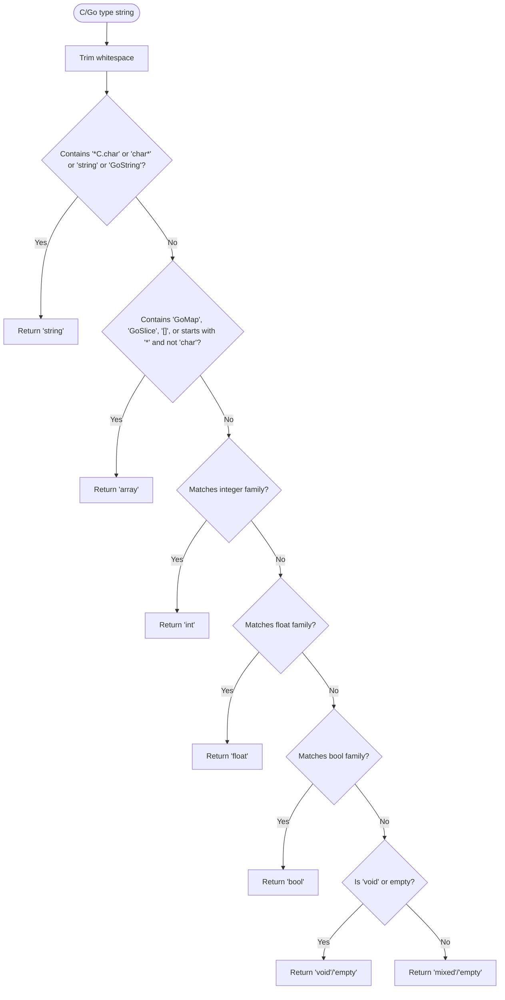
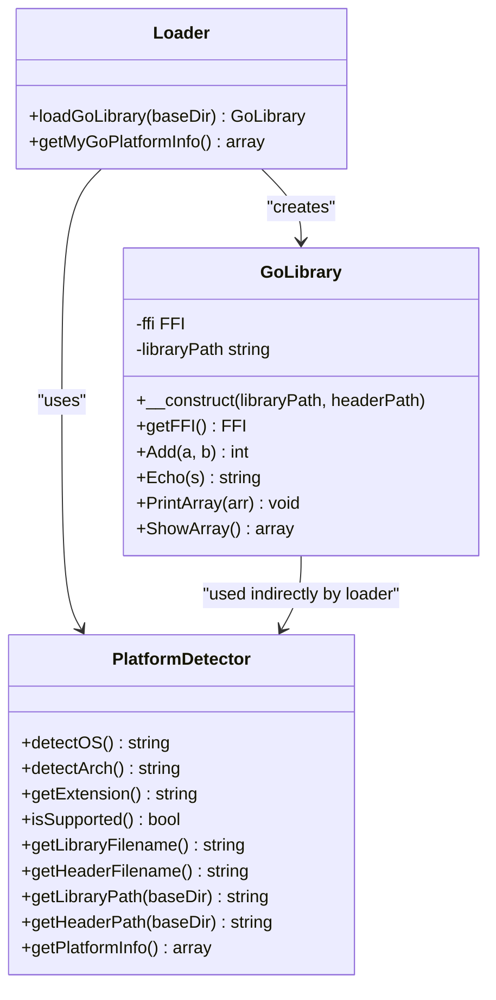
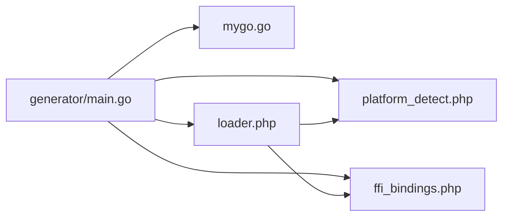

# Customizing the Code Generator

<cite>
**Referenced Files in This Document**
- [generator/main.go](file://generator/main.go)
- [mygo.go](file://mygo.go)
- [README.md](file://README.md)
- [QUICKSTART.md](file://QUICKSTART.md)
- [example.php](file://example.php)
- [build.go](file://build.go)
- [.gitignore](file://.gitignore)
</cite>

## Table of Contents
1. [Introduction](#introduction)
2. [Project Structure](#project-structure)
3. [Core Components](#core-components)
4. [Architecture Overview](#architecture-overview)
5. [Detailed Component Analysis](#detailed-component-analysis)
6. [Dependency Analysis](#dependency-analysis)
7. [Performance Considerations](#performance-considerations)
8. [Troubleshooting Guide](#troubleshooting-guide)
9. [Conclusion](#conclusion)
10. [Appendices](#appendices)

## Introduction
This document explains how to customize the Go-to-PHP FFI code generator implemented in generator/main.go. It covers how the generator parses Go source files to discover exported functions, extracts their signatures, parameters, and return types, and how it maps C/Go types to PHP types. It also provides guidance on extending the generator to support custom type mappings, alternative PHP binding styles, and different Go source file structures. Finally, it includes practical examples for extending the generated PHP classes and adapting the generator for complex scenarios.

## Project Structure
The project is organized around a small, focused generator that produces three PHP files from a single Go source file containing exported functions. The generator is invoked via a Go generate directive in the Go module and can also be run manually with a custom source file.

**Diagram sources**
- [generator/main.go](file://generator/main.go#L27-L75)
- [mygo.go](file://mygo.go#L1-L39)

**Section sources**
- [README.md](file://README.md#L25-L41)
- [.gitignore](file://.gitignore#L13-L16)

## Core Components
- ExportedFunc and Param: Data structures representing parsed exported functions and their parameters.
- parseExports: Scans the Go source file, identifies //export directives, collects comments, and parses function signatures.
- parseParams and parseReturnType: Helpers to split and normalize parameter lists and return types.
- Type mapping functions: cTypeToPHPType and cTypeToPHPDoc convert C/Go types to PHPDoc types and documentation types.
- Generation functions: generatePlatformDetect, generateFFIBindings, generateLoader produce the three PHP files.

Key behaviors:
- The generator reads a Go source file (default mygo.go) and writes three PHP files in the current directory.
- It uses regular expressions to match //export directives and function declarations.
- It preserves comments preceding exported functions to annotate PHPDoc.
- It generates a PlatformDetector class, a GoLibrary class with wrapper methods, and a loader function.

**Section sources**
- [generator/main.go](file://generator/main.go#L12-L26)
- [generator/main.go](file://generator/main.go#L77-L145)
- [generator/main.go](file://generator/main.go#L147-L187)
- [generator/main.go](file://generator/main.go#L481-L640)
- [generator/main.go](file://generator/main.go#L190-L339)
- [generator/main.go](file://generator/main.go#L341-L418)
- [generator/main.go](file://generator/main.go#L642-L705)

## Architecture Overview
The generator’s lifecycle consists of parsing, type mapping, and file generation.

**Diagram sources**
- [generator/main.go](file://generator/main.go#L27-L75)
- [generator/main.go](file://generator/main.go#L77-L145)
- [generator/main.go](file://generator/main.go#L190-L339)
- [generator/main.go](file://generator/main.go#L341-L418)
- [generator/main.go](file://generator/main.go#L642-L705)

## Detailed Component Analysis

### Parsing Exported Functions
The parser:
- Uses a regular expression to detect lines with //export followed by a function name.
- Collects preceding comments (excluding //go: lines) and associates them with the upcoming function.
- Recognizes function declarations with func Name(...), splits parameters, and determines return types.
- Resets comment accumulation when encountering non-comment, non-function lines.

**Diagram sources**
- [generator/main.go](file://generator/main.go#L77-L145)

**Section sources**
- [generator/main.go](file://generator/main.go#L77-L145)

### Parameter and Return Type Extraction
- parseParams splits the parameter list by commas, trims whitespace, and reconstructs multi-word types while preserving the first field as the parameter name.
- parseReturnType trims leading/trailing parentheses and defaults to “void” when absent.

Complexity:
- parseParams: O(n) over the parameter string length.
- parseReturnType: O(n) for trimming and normalization.

Edge cases handled:
- Empty parameter list yields zero params.
- Missing return type becomes “void”.

**Section sources**
- [generator/main.go](file://generator/main.go#L147-L187)

### Type Mapping from C/Go to PHP
The generator maps C/Go types to PHPDoc types and documentation types using two functions:

- cTypeToPHPType: Used for PHPDoc annotations. Returns “string”, “int”, “float”, “bool”, “array”, “void”, or “mixed”.
- cTypeToPHPDoc: Used for PHP type hints. Returns “string”, “int”, “float”, “bool”, “array”, or empty (no hint) for void.

Mapping highlights:
- Strings: char*, *C.char, string, GoString -> “string”
- Arrays/Slices/Maps: []T, GoSlice, GoMap, map[K]V, pointer to non-char -> “array”
- Integers: int*, uint*, char, short, long, long long, unsigned variants, size_t/ssize_t, GoInt*, C.int/* -> “int”
- Floats: float, double, GoFloat*, C.float/* -> “float”
- Booleans: bool, GoBool, _Bool -> “bool”
- Void: void or empty -> “void” (no PHP type hint)
- Unknown types -> “mixed” (doc) or empty (hint)

**Diagram sources**
- [generator/main.go](file://generator/main.go#L481-L640)

**Section sources**
- [generator/main.go](file://generator/main.go#L481-L640)

### Generated PHP Classes and Loader
- platform_detect.php: Defines a PlatformDetector class with methods to detect OS/arch, compute file extensions, and construct platform-specific filenames. It uses a fixed namespace and returns arrays with platform metadata.
- ffi_bindings.php: Defines a GoLibrary class that loads the shared library via FFI using the header file and exposes wrapper methods mirroring exported functions. It includes PHPDoc annotations and type hints derived from the type mapping.
- loader.php: Provides loadGoLibrary() and get{BaseName}PlatformInfo() functions. It composes PlatformDetector and GoLibrary, validates platform support, and returns a configured GoLibrary instance.

**Diagram sources**
- [generator/main.go](file://generator/main.go#L190-L339)
- [generator/main.go](file://generator/main.go#L341-L418)
- [generator/main.go](file://generator/main.go#L642-L705)

**Section sources**
- [generator/main.go](file://generator/main.go#L190-L339)
- [generator/main.go](file://generator/main.go#L341-L418)
- [generator/main.go](file://generator/main.go#L642-L705)

## Dependency Analysis
The generator depends on:
- Standard library packages for file I/O, path manipulation, regular expressions, and string processing.
- The Go source file to parse, which is either the default mygo.go or a user-specified file.
- The generated PHP files depend on each other: loader.php requires platform_detect.php and ffi_bindings.php.

**Diagram sources**
- [generator/main.go](file://generator/main.go#L27-L75)
- [generator/main.go](file://generator/main.go#L642-L705)

**Section sources**
- [generator/main.go](file://generator/main.go#L27-L75)
- [generator/main.go](file://generator/main.go#L642-L705)

## Performance Considerations
- Parsing is linear in the number of lines in the source file.
- Type mapping is constant-time per type string.
- File I/O is minimal and occurs only at startup and write time.
- Recommendations:
  - Keep the source file well-formatted to simplify parsing.
  - Limit the number of exported functions to reduce generated code volume.
  - Consider caching or batching regeneration in CI/CD pipelines.

[No sources needed since this section provides general guidance]

## Troubleshooting Guide
Common issues and debugging strategies:

- FFI extension not loaded
  - Symptom: Runtime error indicating FFI extension is not loaded.
  - Action: Enable FFI in php.ini and restart the service.
  - Reference: [README.md](file://README.md#L57-L65)

- Library file not found
  - Symptom: “Library file not found” error.
  - Action: Ensure the library was built for the current platform and copied into the distribution directory.
  - Reference: [README.md](file://README.md#L252-L260)

- Unsupported platform
  - Symptom: “Unsupported platform” error.
  - Action: Build the library for your platform or update supported platforms.
  - Reference: [README.md](file://README.md#L261-L266)

- CGO not enabled
  - Symptom: “CGO_ENABLED=0 or not available”.
  - Action: Enable CGO and install a C compiler.
  - Reference: [README.md](file://README.md#L267-L278)

- DLL loading error on Windows
  - Symptom: “not a valid Win32 application”.
  - Action: Match PHP architecture with the compiled DLL and install required runtime libraries.
  - Reference: [README.md](file://README.md#L279-L295)

- Generator fails to parse complex function signatures
  - Causes:
    - Non-standard comment placement before exported functions.
    - Function signatures spanning multiple lines without proper formatting.
    - Unrecognized type names that do not match the mapping rules.
  - Debugging steps:
    - Verify //export appears on its own line immediately before the function.
    - Ensure function parameters and return types are on the same line as func.
    - Confirm types are recognized by the mapping functions; unknown types will default to “mixed” or no hint.
  - Reference: [generator/main.go](file://generator/main.go#L77-L145), [generator/main.go](file://generator/main.go#L481-L640)

**Section sources**
- [README.md](file://README.md#L239-L301)
- [generator/main.go](file://generator/main.go#L77-L145)
- [generator/main.go](file://generator/main.go#L481-L640)

## Conclusion
The generator provides a straightforward pipeline to transform exported Go functions into PHP FFI wrappers with predictable type mappings. By understanding the parsing logic, type mapping rules, and generated class structure, you can customize the generator for different Go source layouts, extend type mappings, and tailor the generated PHP classes to your application’s needs.

[No sources needed since this section summarizes without analyzing specific files]

## Appendices

### How to Customize the Generator

- Modify the source file used by the generator
  - Default: mygo.go
  - Override via CLI argument when invoking the generator.
  - Reference: [generator/main.go](file://generator/main.go#L30-L35)

- Extend type mappings
  - Update cTypeToPHPType and cTypeToPHPDoc to recognize additional C/Go types.
  - After updating, regenerate bindings and test with representative functions.
  - Reference: [generator/main.go](file://generator/main.go#L481-L640)

- Change namespace or naming conventions
  - The generator writes a fixed namespace in the generated PHP files. To change it, edit the namespace literals in the generation functions.
  - The loader function name is derived from the base name of the source file. To change the function name, adjust the generation logic that constructs the loader function name.
  - References: [generator/main.go](file://generator/main.go#L190-L339), [generator/main.go](file://generator/main.go#L341-L418), [generator/main.go](file://generator/main.go#L642-L705)

- Support alternative PHP binding styles
  - Current style: One wrapper method per exported function inside a GoLibrary class.
  - Alternative ideas:
    - Generate separate PHP classes per Go package or category of functions.
    - Emit static factory methods or builder patterns.
    - Add optional parameter validation and conversion helpers.
  - Implementation tip: Modify the generation functions to emit different class layouts or method signatures.

- Adapt for different Go source file structures
  - The parser expects //export on its own line immediately before func. If your functions are annotated differently, adjust the regular expressions and parsing logic accordingly.
  - Reference: [generator/main.go](file://generator/main.go#L77-L145)

- Add support for additional type conversions
  - Extend the mapping functions to handle new types (e.g., complex structs, enums).
  - For complex types, consider returning “mixed” or adding explicit conversion helpers in PHP.
  - Reference: [generator/main.go](file://generator/main.go#L481-L640)

### Practical Examples

- Extending the generated PHP classes
  - PlatformDetector: Add helper methods to compute library paths or validate headers.
  - GoLibrary: Add convenience methods for repeated operations or caching of FFI instances.
  - Loader: Centralize platform checks and logging.
  - References: [generator/main.go](file://generator/main.go#L190-L339), [generator/main.go](file://generator/main.go#L341-L418), [generator/main.go](file://generator/main.go#L642-L705)

- Using the generated loader in practice
  - Load the library and call functions as shown in the example application.
  - Reference: [example.php](file://example.php#L1-L95)

- Integrating with the build system
  - Use the build orchestrator to compile for multiple platforms and copy generated PHP files to the distribution directory.
  - Reference: [build.go](file://build.go#L1-L183)

**Section sources**
- [generator/main.go](file://generator/main.go#L190-L339)
- [generator/main.go](file://generator/main.go#L341-L418)
- [generator/main.go](file://generator/main.go#L642-L705)
- [example.php](file://example.php#L1-L95)
- [build.go](file://build.go#L1-L183)