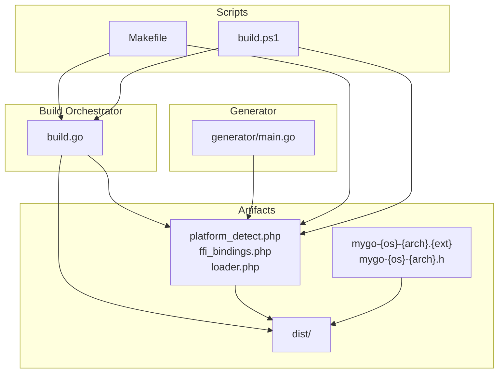
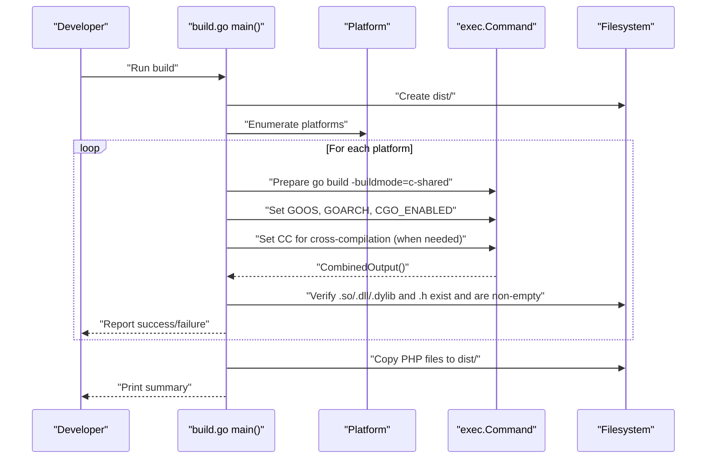
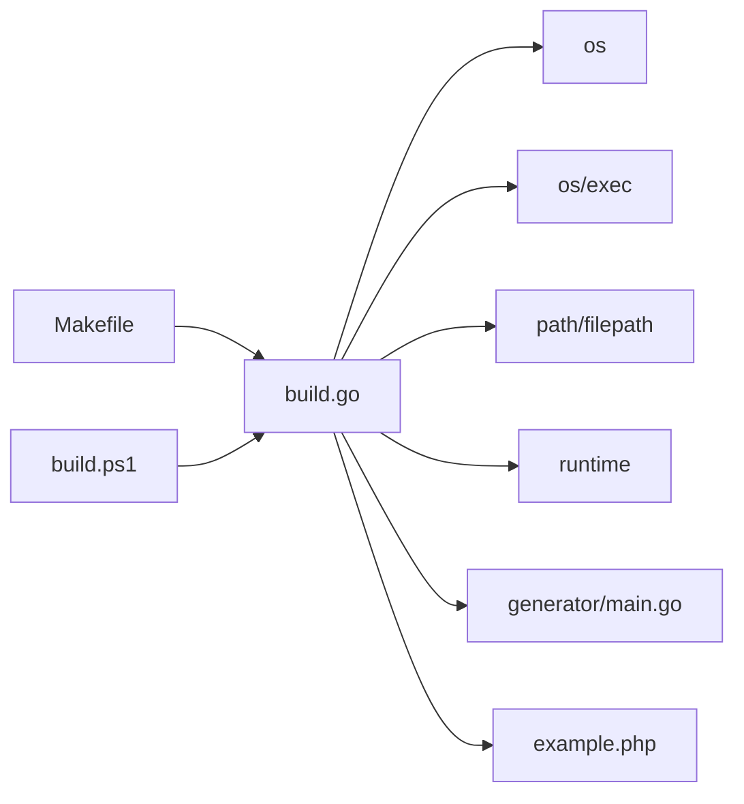

# Extending the Build System

<cite>
**Referenced Files in This Document**
- [build.go](file://build.go)
- [README.md](file://README.md)
- [QUICKSTART.md](file://QUICKSTART.md)
- [Makefile](file://Makefile)
- [build.ps1](file://build.ps1)
- [generator/main.go](file://generator/main.go)
- [example.php](file://example.php)
- [mygo.go](file://mygo.go)
</cite>

## Table of Contents
1. [Introduction](#introduction)
2. [Project Structure](#project-structure)
3. [Core Components](#core-components)
4. [Architecture Overview](#architecture-overview)
5. [Detailed Component Analysis](#detailed-component-analysis)
6. [Dependency Analysis](#dependency-analysis)
7. [Performance Considerations](#performance-considerations)
8. [Troubleshooting Guide](#troubleshooting-guide)
9. [Conclusion](#conclusion)
10. [Appendices](#appendices)

## Introduction
This document explains how to extend the build system in build.go to support additional platforms and architectures. It covers:
- How the build orchestrator sets GOOS, GOARCH, and CGO_ENABLED for cross-platform compilation
- How to configure cross-compilation toolchains (CC) for Linux, macOS, and Windows
- How to modify getSupportedPlatforms() and buildPlatform() to add new targets
- How tolerant failure handling enables partial success builds
- How to customize output directory and library naming
- Practical examples for adding new platforms and configuring build environments

## Project Structure
The build system centers around a small Go program that orchestrates cross-platform builds, a generator that produces PHP binding files, and supporting scripts for convenience.

**Diagram sources**
- [build.go](file://build.go#L1-L183)
- [generator/main.go](file://generator/main.go#L1-L705)
- [Makefile](file://Makefile#L1-L54)
- [build.ps1](file://build.ps1#L1-L152)

**Section sources**
- [build.go](file://build.go#L1-L183)
- [generator/main.go](file://generator/main.go#L1-L705)
- [Makefile](file://Makefile#L1-L54)
- [build.ps1](file://build.ps1#L1-L152)

## Core Components
- Platform model: defines GOOS, GOARCH, and file extension for each target.
- getSupportedPlatforms(): enumerates all supported platforms.
- buildPlatform(): executes cross-compilation with environment variables and validates outputs.
- main(): orchestrates platform iteration, failure tolerance, and copying of PHP files.

Key behaviors:
- Cross-compilation is controlled via environment variables set on the exec command.
- Toolchain selection is handled by setting the CC environment variable for specific host-target combinations.
- Output filenames follow a standardized naming scheme.
- Partial build success is tolerated; the system continues to build remaining platforms and reports a summary.

**Section sources**
- [build.go](file://build.go#L12-L183)

## Architecture Overview
The build orchestrator coordinates:
- Platform enumeration
- Environment setup for cross-compilation
- Toolchain selection
- Build execution and output verification
- Distribution packaging

**Diagram sources**
- [build.go](file://build.go#L41-L183)

**Section sources**
- [build.go](file://build.go#L41-L183)

## Detailed Component Analysis

### Platform Model and Enumeration
- Platform struct holds GOOS, GOARCH, and Extension.
- getSupportedPlatforms() returns a slice of Platform entries for Linux/amd64, Linux/arm64, macOS/amd64/darwin/arm64, Windows/amd64/windows/arm64.
- Output and header filenames are derived from the Platform fields.

Extending platforms:
- Add a new Platform entry with the desired GOOS, GOARCH, and Extension.
- Ensure the corresponding shared library and header files are produced by the Go build process.

**Section sources**
- [build.go](file://build.go#L12-L39)

### Cross-Compilation Environment Variables
- The orchestrator sets GOOS, GOARCH, and CGO_ENABLED=1 for each platform.
- When the target differs from the host OS, the orchestrator sets CC to the appropriate cross-compiler:
  - Linux arm64: aarch64-linux-gnu-gcc
  - Windows amd64: x86_64-w64-mingw32-gcc
  - Windows arm64: aarch64-w64-mingw32-gcc

Compiler requirements:
- Linux arm64: aarch64-linux-gnu-gcc
- Windows: mingw-w64 toolchain (x86_64-w64-mingw32-gcc or aarch64-w64-mingw32-gcc)
- macOS cross-compilation typically requires osxcross; see the README for guidance.

**Section sources**
- [build.go](file://build.go#L108-L144)
- [README.md](file://README.md#L210-L237)

### Build Execution and Validation
- The orchestrator constructs a go build command with -buildmode=c-shared and an output path under dist/.
- After execution, it verifies:
  - The shared library file exists and is not empty
  - The corresponding header file exists and is not empty
- On failure, the error includes combined output for diagnostics.

Tolerant failure handling:
- The orchestrator counts successes and failures, aggregates failure messages, and continues building other platforms.
- At the end, it prints a summary and lists any failures.

**Section sources**
- [build.go](file://build.go#L108-L164)

### Output Directory and Naming Convention
- Output directory: dist/
- Naming convention: mygo-{GOOS}-{GOARCH}.{ext}
- Header naming: mygo-{GOOS}-{GOARCH}.h
- The orchestrator writes both the shared library and the header file to dist/.

Customization tips:
- To change the output directory, update the distDir constant and all downstream paths.
- To change the library prefix, update the filename generation methods in the Platform struct.

**Section sources**
- [build.go](file://build.go#L41-L59)
- [build.go](file://build.go#L31-L39)

### Extending getSupportedPlatforms()
Steps to add a new platform:
1. Add a new Platform entry in getSupportedPlatforms() with:
   - GOOS: target OS
   - GOARCH: target architecture
   - Extension: target file extension (.so, .dylib, .dll)
2. Ensure the target OS/architecture is supported by your cross-compilation toolchain.
3. If cross-compiling to a new OS/arch combination, add a corresponding CC assignment in buildPlatform().

Example additions:
- Linux riscv64: add a Platform entry with GOOS=linux, GOARCH=riscv64, Extension=so; install the appropriate cross-compiler and add a CC mapping if needed.
- Windows arm64: already supported; ensure aarch64-w64-mingw32-gcc is installed.

**Section sources**
- [build.go](file://build.go#L19-L29)
- [build.go](file://build.go#L122-L137)

### Extending buildPlatform()
Steps to handle additional architectures:
1. Add a new case in buildPlatform() for the target GOOS.
2. Under that GOOS, add a branch for the new GOARCH and set the appropriate CC.
3. Ensure the target toolchain is installed on the host system.

Examples:
- Linux arm64: CC=aarch64-linux-gnu-gcc
- Windows amd64: CC=x86_64-w64-mingw32-gcc
- Windows arm64: CC=aarch64-w64-mingw32-gcc

Validation remains the same: verify output and header files exist and are non-empty.

**Section sources**
- [build.go](file://build.go#L122-L137)
- [build.go](file://build.go#L145-L164)

### Integrating with Scripts and Workflows
- Makefile:
  - make build runs go run build.go after generating bindings.
  - make build-current builds for the current platform only.
- PowerShell build.ps1:
  - build.ps1 build runs go run build.go after generating bindings.
  - build.ps1 build-current builds for the current platform only.

These scripts demonstrate how to integrate the orchestrator into development workflows and CI/CD.

**Section sources**
- [Makefile](file://Makefile#L12-L31)
- [build.ps1](file://build.ps1#L32-L93)

### Generator Integration
- The generator parses exported functions from mygo.go and generates platform_detect.php, ffi_bindings.php, and loader.php.
- These files are copied to dist/ alongside the compiled libraries.
- The generator also sets up the Go generate directive in mygo.go.

Practical implications:
- When adding new exported functions, regenerate bindings and rebuild libraries.
- The generator ensures PHP-side wrappers match the exported C ABI.

**Section sources**
- [generator/main.go](file://generator/main.go#L1-L75)
- [generator/main.go](file://generator/main.go#L36-L75)
- [mygo.go](file://mygo.go#L11-L12)

## Dependency Analysis
The build orchestrator depends on:
- Standard library packages for environment manipulation, process execution, and filesystem operations
- The generator for PHP binding files
- The example PHP application for testing

**Diagram sources**
- [build.go](file://build.go#L1-L20)
- [generator/main.go](file://generator/main.go#L1-L20)
- [Makefile](file://Makefile#L1-L10)
- [build.ps1](file://build.ps1#L1-L10)

**Section sources**
- [build.go](file://build.go#L1-L20)
- [generator/main.go](file://generator/main.go#L1-L20)
- [Makefile](file://Makefile#L1-L10)
- [build.ps1](file://build.ps1#L1-L10)

## Performance Considerations
- Cross-compilation can be slower than native builds; consider building locally for the current platform during development.
- Parallelizing builds across platforms is not implemented; the orchestrator iterates sequentially. For large platform matrices, consider external parallelization.
- Reusing generated PHP files avoids repeated regeneration costs.

[No sources needed since this section provides general guidance]

## Troubleshooting Guide
Common issues and resolutions:
- FFI not enabled in PHP: enable the extension and restart the service.
- Library not found: ensure dist/ contains the correct .so/.dll/.dylib and that paths are correct.
- Unsupported platform: add support in build.go or build for your current platform only.
- CGO disabled: set CGO_ENABLED=1 and ensure a C compiler is installed.
- Windows DLL loading errors: ensure architecture alignment (32-bit vs 64-bit) and install required runtime libraries.

**Section sources**
- [README.md](file://README.md#L238-L309)

## Conclusion
The build orchestrator in build.go provides a robust foundation for cross-platform compilation with configurable environment variables and toolchain selection. By extending getSupportedPlatforms() and buildPlatform(), you can add new platforms and architectures while maintaining tolerant failure handling and consistent output naming. Integrate the orchestrator with Make and PowerShell scripts to streamline developer workflows and CI/CD pipelines.

[No sources needed since this section summarizes without analyzing specific files]

## Appendices

### A. Adding a New Platform: Step-by-Step
1. Extend getSupportedPlatforms():
   - Add a new Platform entry with GOOS, GOARCH, and Extension.
2. Configure toolchain in buildPlatform():
   - Add a switch for the target GOOS and a branch for the new GOARCH.
   - Set CC to the appropriate cross-compiler.
3. Verify toolchain installation:
   - Ensure the required cross-compiler is installed on the host system.
4. Build and test:
   - Run go run build.go and inspect dist/ for the new artifacts.
5. Update documentation:
   - Add the platform to README.md and any workflow documentation.

**Section sources**
- [build.go](file://build.go#L19-L29)
- [build.go](file://build.go#L122-L137)
- [README.md](file://README.md#L14-L24)

### B. Customizing Output Directory and Naming
- Change distDir to a different directory if desired.
- Modify the filename generation methods in the Platform struct to alter the naming convention.
- Update scripts and documentation to reflect the new naming and directory.

**Section sources**
- [build.go](file://build.go#L41-L59)
- [build.go](file://build.go#L31-L39)

### C. Development Workflows
- Local development: use make build-current or build.ps1 build-current for quick iteration.
- Full matrix: use make build or build.ps1 build to compile all supported platforms.
- CI/CD: integrate go generate and go run build.go as part of your pipeline.

**Section sources**
- [Makefile](file://Makefile#L12-L31)
- [build.ps1](file://build.ps1#L32-L93)
- [README.md](file://README.md#L310-L351)