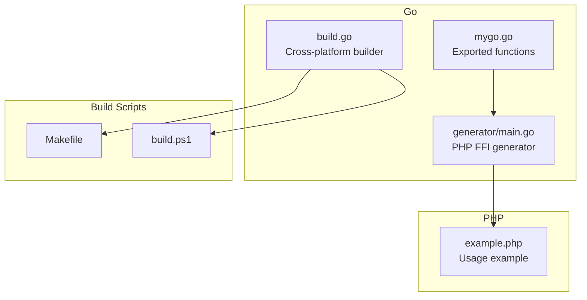
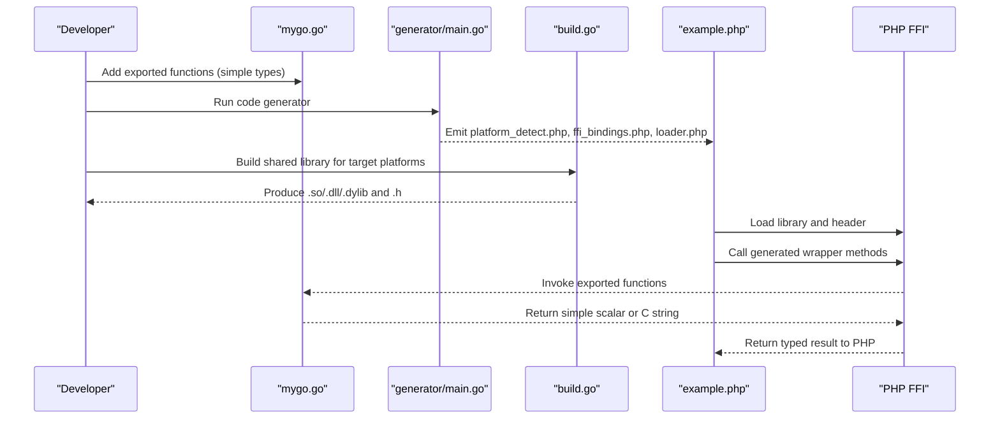
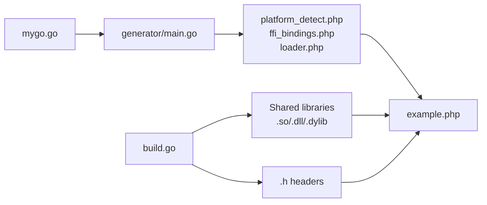

# Performance Optimization

<cite>
**Referenced Files in This Document**
- [mygo.go](file://mygo.go)
- [build.go](file://build.go)
- [generator/main.go](file://generator/main.go)
- [README.md](file://README.md)
- [example.php](file://example.php)
- [Makefile](file://Makefile)
- [build.ps1](file://build.ps1)
- [go.mod](file://go.mod)
</cite>

## Table of Contents
1. [Introduction](#introduction)
2. [Project Structure](#project-structure)
3. [Core Components](#core-components)
4. [Architecture Overview](#architecture-overview)
5. [Detailed Component Analysis](#detailed-component-analysis)
6. [Dependency Analysis](#dependency-analysis)
7. [Performance Considerations](#performance-considerations)
8. [Troubleshooting Guide](#troubleshooting-guide)
9. [Conclusion](#conclusion)
10. [Appendices](#appendices)

## Introduction
This document focuses on performance optimization for the Go-PHP FFI integration. It explains how to minimize FFI overhead by designing Go function signatures with simple data types, how to structure functions for efficient parameter passing, and how to leverage build-time and code-generation optimizations to reduce binding overhead. It also covers profiling FFI call performance, identifying bottlenecks in the cross-language interface, and optimizing memory management between Go and PHP.

## Project Structure
The project is organized around a minimal shared library in Go, a code generator that produces PHP FFI bindings, and a cross-platform build orchestrator. The structure enables rapid iteration and packaging of platform-specific binaries alongside auto-generated PHP files.

**Diagram sources**
- [mygo.go](file://mygo.go#L1-L39)
- [build.go](file://build.go#L1-L183)
- [generator/main.go](file://generator/main.go#L1-L705)
- [Makefile](file://Makefile#L1-L54)
- [build.ps1](file://build.ps1#L1-L152)
- [example.php](file://example.php#L1-L95)

**Section sources**
- [README.md](file://README.md#L1-L120)
- [Makefile](file://Makefile#L1-L54)
- [build.ps1](file://build.ps1#L1-L152)

## Core Components
- Go exported functions define the FFI surface. They should use simple scalar types and pointer-to-C-string types to minimize marshaling overhead.
- The code generator parses exported functions and emits PHP FFI wrappers that call into the shared library.
- The cross-platform builder compiles the shared library for multiple platforms and generates corresponding headers and PHP files.

Key performance-relevant observations:
- The example library exports functions returning scalars and C strings, and includes a function that returns a Go map, which introduces marshaling overhead.
- The generator maps C/Go types to PHP types for documentation and type hints, which affects how PHP code interacts with the FFI layer.

**Section sources**
- [mygo.go](file://mygo.go#L1-L39)
- [generator/main.go](file://generator/main.go#L1-L120)
- [build.go](file://build.go#L1-L120)

## Architecture Overview
The integration pipeline consists of:
- Writing Go functions with the //export directive and simple types.
- Running the code generator to produce PHP FFI bindings.
- Building the shared library for the target platform(s).
- Loading the library in PHP via FFI and invoking generated wrappers.

**Diagram sources**
- [mygo.go](file://mygo.go#L1-L39)
- [generator/main.go](file://generator/main.go#L1-L120)
- [build.go](file://build.go#L100-L183)
- [example.php](file://example.php#L1-L95)

## Detailed Component Analysis

### Go Function Signatures and Type Mappings
- Prefer simple scalar types (int, float, bool) and C strings (pointer to char) for minimal marshaling overhead.
- Returning complex Go structures (maps, slices) incurs marshaling costs and increases FFI overhead. If you must return structured data, consider flattening it into arrays or returning a C string representation and reconstructing in PHP.
- The generator maps C/Go types to PHP types for documentation and type hints. This helps PHP developers write efficient calls and manage memory correctly.

Best practices:
- Use int and float for numeric computations.
- Use string for C strings; remember to free Go-allocated strings in PHP.
- Avoid returning Go maps/slices directly; consider returning a C string or flattened arrays.

**Section sources**
- [mygo.go](file://mygo.go#L1-L39)
- [generator/main.go](file://generator/main.go#L480-L640)

### Code Generation Optimizations
- The generator scans exported functions and writes PHP wrappers that forward arguments and return values directly to the FFI layer. This reduces boilerplate and ensures consistent type mapping.
- Type conversion helpers translate C/Go types to PHPDoc and type hints, guiding developers to pass compatible values.

Optimization tips:
- Keep exported function signatures minimal and flat.
- Ensure the generator’s type mapping aligns with your intended PHP usage to avoid unnecessary conversions.

**Section sources**
- [generator/main.go](file://generator/main.go#L1-L120)
- [generator/main.go](file://generator/main.go#L480-L640)

### Build-Time Optimizations
- The builder compiles the shared library with -buildmode=c-shared and sets platform-specific environment variables for cross-compilation.
- It validates output files and sizes to ensure successful builds.

Optimization tips:
- Use the current-platform build for development iterations to speed up feedback loops.
- For production, build all target platforms and package the distribution directory.

**Section sources**
- [build.go](file://build.go#L100-L183)
- [Makefile](file://Makefile#L1-L54)
- [build.ps1](file://build.ps1#L46-L93)

### Memory Management Between Go and PHP
- When Go allocates memory for strings, PHP must free it to avoid leaks. The example demonstrates freeing Go-allocated strings after reading them in PHP.
- Passing large buffers or arrays across the FFI boundary can increase overhead; batch operations when possible.

Guidance:
- Always free C strings returned by Go.
- Consider passing raw buffers (pointers) only when necessary and ensure lifetime guarantees.
- Avoid frequent small allocations across the boundary; prefer larger, coalesced operations.

**Section sources**
- [example.php](file://example.php#L54-L86)
- [README.md](file://README.md#L296-L309)

### Profiling FFI Call Performance
- Measure end-to-end latency in PHP by timing calls around the FFI wrapper.
- Compare timings for simple scalar operations versus string and complex data transfers.
- Profile repeated calls to identify overhead hotspots and optimize batching.

[No sources needed since this section provides general guidance]

### Function Design Best Practices
- Favor simple, scalar-heavy APIs for high-frequency operations.
- Use C strings for textual data and ensure proper lifecycle management.
- Avoid returning complex structures; prefer flattened arrays or compact serialized forms.

[No sources needed since this section provides general guidance]

## Dependency Analysis
The code generator depends on the exported function declarations in the Go library. The builder orchestrates cross-platform compilation and file copying. The PHP example consumes the generated bindings.

**Diagram sources**
- [mygo.go](file://mygo.go#L1-L39)
- [generator/main.go](file://generator/main.go#L1-L120)
- [build.go](file://build.go#L1-L120)
- [example.php](file://example.php#L1-L95)

**Section sources**
- [generator/main.go](file://generator/main.go#L1-L120)
- [build.go](file://build.go#L1-L120)

## Performance Considerations
- Library loading cost: Load once per process and reuse the FFI instance.
- String handling: Conversions between PHP and C strings incur overhead; batch operations and minimize round-trips.
- Memory management: Always free Go-allocated strings to prevent leaks and reduce GC pressure.
- Cross-platform builds: Use the current-platform build during development; build all platforms for production distribution.

[No sources needed since this section provides general guidance]

## Troubleshooting Guide
Common issues and remedies:
- FFI extension disabled: Enable it in php.ini and restart the service.
- Library not found: Ensure the distribution directory contains the correct platform binary and header.
- Platform not supported: Build for your platform or extend the builder to support additional combinations.
- CGO disabled: Enable CGO and ensure a C compiler is available.
- Windows DLL loading errors: Match PHP architecture with the compiled DLL and install required runtime libraries.

**Section sources**
- [README.md](file://README.md#L238-L309)

## Conclusion
By focusing on simple, scalar-heavy function signatures, minimizing marshaling of complex structures, and leveraging the provided build and generator tools, you can significantly reduce FFI overhead. Proper memory management and profiling practices will help sustain high performance in production environments.

[No sources needed since this section summarizes without analyzing specific files]

## Appendices

### Appendix A: Recommended Function Design Patterns
- Scalar arithmetic and comparisons: Use int and float for numeric operations.
- Text processing: Use C strings; free returned strings in PHP.
- Data transfer: Prefer flattened arrays or compact serialized forms over maps/slices.
- Batch operations: Combine multiple small calls into fewer larger calls to amortize FFI overhead.

[No sources needed since this section provides general guidance]

### Appendix B: Build Targets and Scripts
- Makefile targets: generate, build, build-current, test, clean.
- PowerShell script: generate, build, build-current, test, clean.

**Section sources**
- [Makefile](file://Makefile#L1-L54)
- [build.ps1](file://build.ps1#L1-L152)