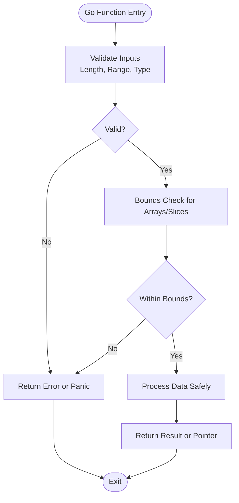

# Security Considerations

<cite>
**Referenced Files in This Document**
- [mygo.go](file://mygo.go)
- [generator/main.go](file://generator/main.go)
- [build.go](file://build.go)
- [example.php](file://example.php)
- [README.md](file://README.md)
- [Makefile](file://Makefile)
- [build.ps1](file://build.ps1)
- [QUICKSTART.md](file://QUICKSTART.md)
- [go.mod](file://go.mod)
</cite>

## Table of Contents
1. [Introduction](#introduction)
2. [Project Structure](#project-structure)
3. [Core Components](#core-components)
4. [Architecture Overview](#architecture-overview)
5. [Detailed Component Analysis](#detailed-component-analysis)
6. [Dependency Analysis](#dependency-analysis)
7. [Performance Considerations](#performance-considerations)
8. [Troubleshooting Guide](#troubleshooting-guide)
9. [Conclusion](#conclusion)
10. [Appendices](#appendices)

## Introduction
This document focuses on security considerations when exposing Go functions to PHP via FFI. It explains the risks associated with FFI execution, outlines secure coding practices for Go functions, and details how to harden the code generator and build system. It also covers strategies for sandboxing, limiting exposed functionality, protecting against privilege escalation, and securing distribution of compiled libraries.

## Project Structure
The repository provides a minimal yet instructive example of a Go shared library exposed to PHP via FFI, along with a code generator and build system that produce platform-specific binaries and PHP binding files.

**Diagram sources**
- [mygo.go](file://mygo.go#L1-L39)
- [generator/main.go](file://generator/main.go#L1-L705)
- [build.go](file://build.go#L1-L183)
- [example.php](file://example.php#L1-L95)
- [Makefile](file://Makefile#L1-L54)
- [build.ps1](file://build.ps1#L1-L152)

**Section sources**
- [README.md](file://README.md#L1-L120)
- [QUICKSTART.md](file://QUICKSTART.md#L1-L80)

## Core Components
- Go exported functions: The primary entry points for FFI are declared with the export directive and are intended to be pure, deterministic, and safe with respect to input validation and memory safety.
- Code generator: Parses exported functions from Go source and generates PHP FFI bindings, loaders, and platform detection logic.
- Build system: Orchestrates cross-platform compilation of shared libraries and header files, and copies generated PHP files into a distribution directory.
- PHP example: Demonstrates loading the library, invoking functions, and managing memory for strings returned by Go.

Security-relevant responsibilities:
- Input validation and sanitization in Go functions before processing.
- Proper error handling and resource management to avoid leaks and crashes.
- Secure generation of PHP bindings and platform detection logic.
- Controlled exposure of functionality and strict verification of library integrity during distribution.

**Section sources**
- [mygo.go](file://mygo.go#L1-L39)
- [generator/main.go](file://generator/main.go#L1-L120)
- [build.go](file://build.go#L1-L100)
- [example.php](file://example.php#L1-L95)

## Architecture Overview
The system architecture exposes Go functions to PHP via FFI. The generator produces PHP classes that wrap FFI invocations, while the build system compiles platform-specific shared libraries and headers. The example PHP application loads the library and invokes functions.

**Diagram sources**
- [generator/main.go](file://generator/main.go#L341-L418)
- [example.php](file://example.php#L1-L95)

**Section sources**
- [generator/main.go](file://generator/main.go#L341-L418)
- [example.php](file://example.php#L1-L95)

## Detailed Component Analysis

### Go Functions Security (mygo.go)
- Risk profile:
  - FFI passes raw pointers and primitive types across boundaries. Incorrect handling can lead to buffer overflows, use-after-free, and undefined behavior.
  - String handling requires careful memory management; returning pointers to Go-managed memory without proper freeing can cause leaks or crashes.
  - Arrays/slices passed from PHP are represented as C arrays; bounds must be enforced to avoid overruns.
- Recommended practices:
  - Validate all inputs (length, range, type) before processing.
  - Enforce strict bounds checking for arrays and slices.
  - Avoid returning pointers to Go-managed memory unless accompanied by a dedicated free function.
  - Use explicit error returns or panics with recoverable semantics to signal invalid inputs.
  - Limit exported functions to the minimal set required by the application.
  - Apply least privilege: restrict filesystem/network access and avoid executing untrusted commands.
- Example patterns to review:
  - Addition and echo functions are safe as they operate on primitives and return values.
  - Array printing iterates safely but should still validate array length and indices.
  - Map return is acceptable but ensure keys/values are serializable and bounded.

**Diagram sources**
- [mygo.go](file://mygo.go#L13-L35)

**Section sources**
- [mygo.go](file://mygo.go#L13-L35)

### Code Generator Security (generator/main.go)
- Risk profile:
  - The generator parses Go source to extract exported functions and generates PHP code. If the parser is not robust, it could misinterpret comments or signatures, leading to incorrect bindings.
  - Generated PHP code must enforce type safety and platform checks; weak checks can expose the system to misuse.
- Security hardening:
  - Robust parsing: Validate function signatures and comments; reject malformed or ambiguous declarations.
  - Strict type mapping: Ensure C/Go types are mapped to PHP types accurately; avoid unsafe defaults.
  - Platform detection: Validate OS/architecture and reject unsupported combinations early.
  - File generation: Use safe file permissions and avoid writing to unexpected locations.
  - Error handling: Fail fast on parsing errors and log meaningful diagnostics.
- Generated outputs:
  - Platform detection module enforces supported platforms and throws on unsupported combinations.
  - FFI bindings module validates presence of library and header files and initializes FFI safely.
  - Loader module orchestrates platform detection and library instantiation.

**Diagram sources**
- [generator/main.go](file://generator/main.go#L27-L75)
- [generator/main.go](file://generator/main.go#L190-L339)
- [generator/main.go](file://generator/main.go#L341-L418)
- [generator/main.go](file://generator/main.go#L642-L705)

**Section sources**
- [generator/main.go](file://generator/main.go#L27-L75)
- [generator/main.go](file://generator/main.go#L190-L339)
- [generator/main.go](file://generator/main.go#L341-L418)
- [generator/main.go](file://generator/main.go#L642-L705)

### Build System Security (build.go, Makefile, build.ps1)
- Risk profile:
  - Cross-compilation depends on external toolchains; missing compilers or wrong architectures can cause silent failures or insecure builds.
  - Distribution packaging must include both libraries and headers; missing files can break runtime or enable tampering.
  - Build scripts must isolate environments and avoid leaking secrets.
- Security hardening:
  - Explicitly set GOOS/GOARCH and CGO_ENABLED; fail if cross-compilers are unavailable.
  - Verify output files exist and are non-empty; reject zero-length artifacts.
  - Copy only expected PHP files to dist; avoid unintended file inclusion.
  - Use deterministic build flags and reproducible outputs where possible.
  - Restrict write permissions for generated files and enforce checksum verification post-build.
- Orchestration:
  - Makefile and build.ps1 coordinate generation and building across platforms.
  - build.go enumerates supported platforms and builds shared libraries with headers.

**Diagram sources**
- [build.go](file://build.go#L41-L105)
- [build.go](file://build.go#L107-L164)
- [Makefile](file://Makefile#L1-L54)
- [build.ps1](file://build.ps1#L1-L152)

**Section sources**
- [build.go](file://build.go#L1-L100)
- [Makefile](file://Makefile#L1-L54)
- [build.ps1](file://build.ps1#L1-L152)

### PHP Usage Security (example.php)
- Risk profile:
  - FFI enables direct memory access; improper handling of returned pointers can cause crashes or leaks.
  - Passing unsanitized user input to string functions increases risk of injection or misuse.
- Safe usage patterns:
  - Always load the library via the generated loader and platform detector.
  - Free strings allocated by Go using the provided free function.
  - Validate and sanitize inputs before calling Go functions.
  - Use persistent processes (e.g., PHP-FPM) to reduce repeated library loading overhead.

**Diagram sources**
- [example.php](file://example.php#L1-L95)

**Section sources**
- [example.php](file://example.php#L1-L95)

## Dependency Analysis
The build system and generator depend on the Go module and rely on external toolchains for cross-compilation. The PHP example depends on the generated loader and bindings.

**Diagram sources**
- [go.mod](file://go.mod#L1-L3)
- [build.go](file://build.go#L1-L100)
- [generator/main.go](file://generator/main.go#L1-L120)
- [example.php](file://example.php#L1-L95)

**Section sources**
- [go.mod](file://go.mod#L1-L3)
- [build.go](file://build.go#L1-L100)
- [generator/main.go](file://generator/main.go#L1-L120)
- [example.php](file://example.php#L1-L95)

## Performance Considerations
- Library loading occurs once per process; use persistent processes to minimize overhead.
- String conversion between PHP and C has overhead; batch operations when possible.
- Memory management: always free Go-allocated strings to prevent leaks.

**Section sources**
- [README.md](file://README.md#L296-L302)

## Troubleshooting Guide
Common issues and mitigations:
- FFI extension disabled: Enable FFI in php.ini and restart the service.
- Library not found: Ensure generation and build steps were executed and that dist contains the correct binary.
- Platform not supported: Build for the current platform or add support in the build system.
- CGO disabled or missing compiler: Enable CGO and install the appropriate C compiler.
- Windows DLL loading errors: Match PHP architecture to the DLL and install required runtime libraries.

**Section sources**
- [README.md](file://README.md#L239-L295)
- [QUICKSTART.md](file://QUICKSTART.md#L109-L134)

## Conclusion
Exposing Go functions to PHP via FFI introduces unique security challenges around memory safety, input validation, and resource management. By enforcing strict input validation in Go, generating robust and secure PHP bindings, isolating build environments, and controlling distribution, teams can significantly reduce risks. Limit exposed functionality, apply sandboxing, and verify library integrity to protect systems from buffer overflows, injection attacks, and privilege escalation.

## Appendices

### Security Checklist for Go Functions Exposed via FFI
- Validate all inputs (length, range, type).
- Enforce bounds for arrays/slices.
- Avoid returning Go-managed pointers without a free function.
- Use explicit error signaling and avoid undefined behavior.
- Limit exported functions to essential operations.
- Apply least privilege and restrict I/O and network access.
- Add unit tests covering boundary conditions and malicious inputs.

### Security Checklist for Code Generator and Build System
- Validate parsed function signatures and reject malformed inputs.
- Map types strictly and avoid unsafe defaults.
- Fail fast on unsupported platforms or missing toolchains.
- Verify outputs exist and are non-empty.
- Copy only expected files to dist.
- Enforce checksum verification for distribution packages.
- Use isolated build environments and avoid embedding secrets.

### Secure Distribution Practices
- Sign and checksum all binaries and headers.
- Distribute the entire dist folder and keep it intact.
- Monitor for tampering and reject unsigned artifacts.
- Pin versions of Go, PHP, and toolchains in CI/CD.
- Audit dependencies and update regularly.