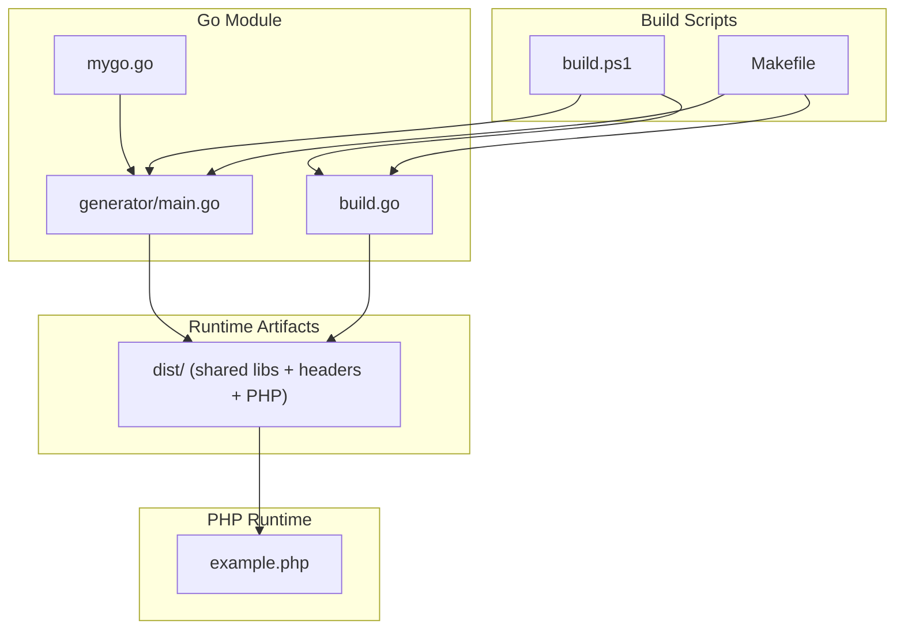
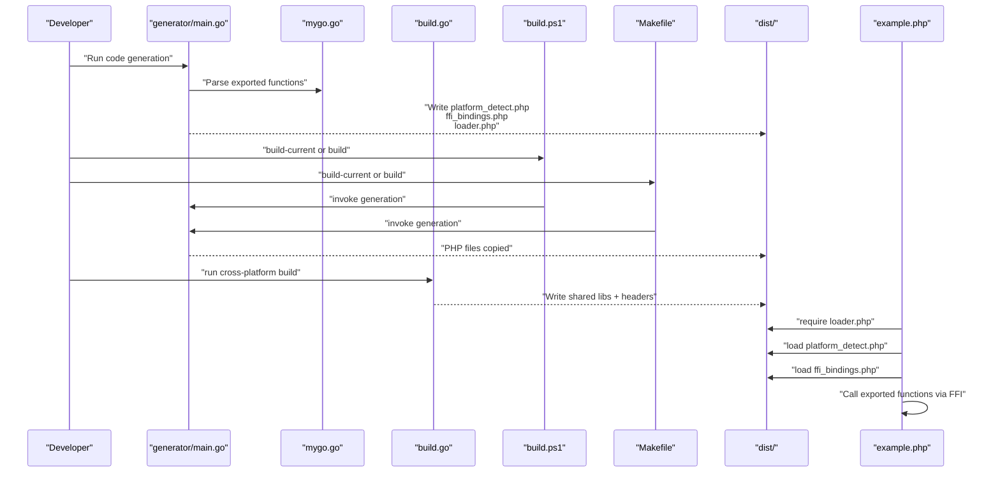
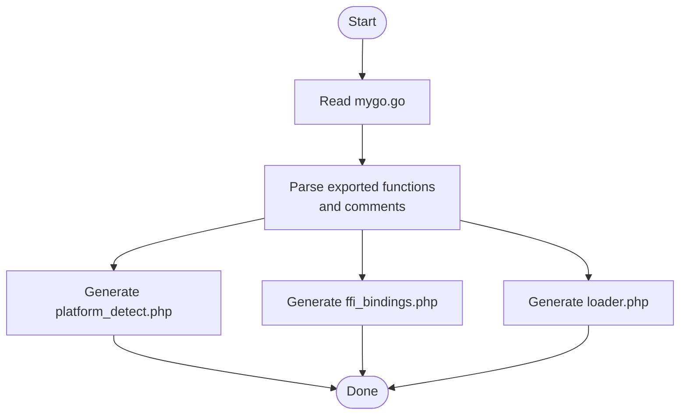
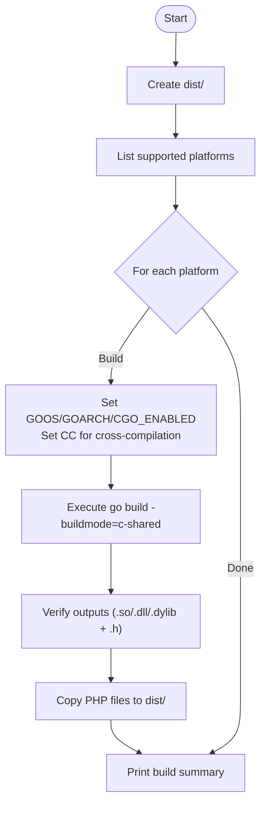
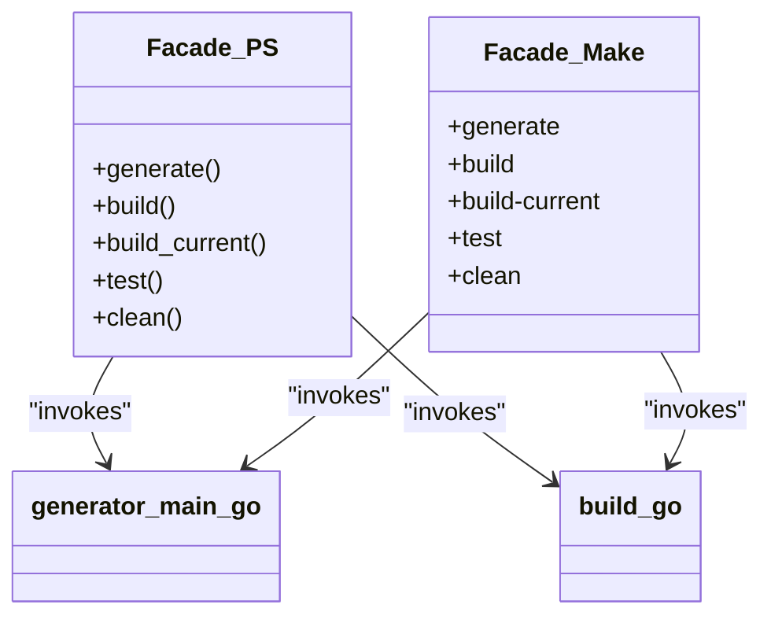
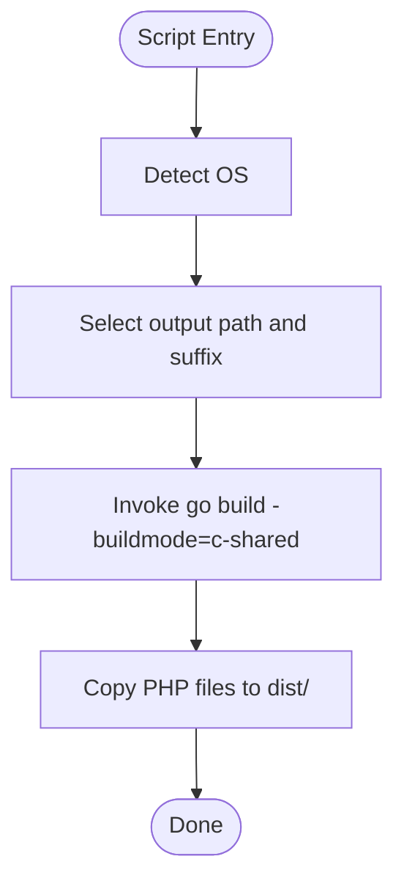
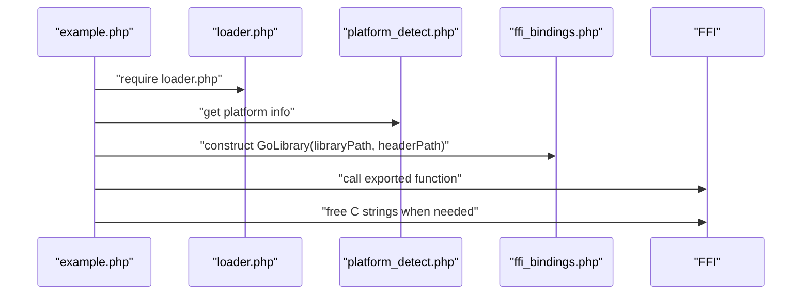
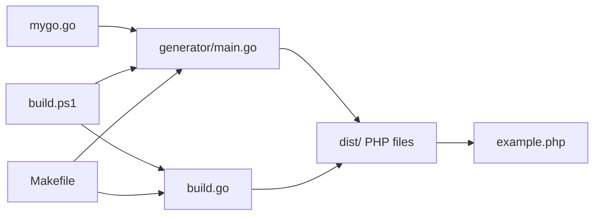
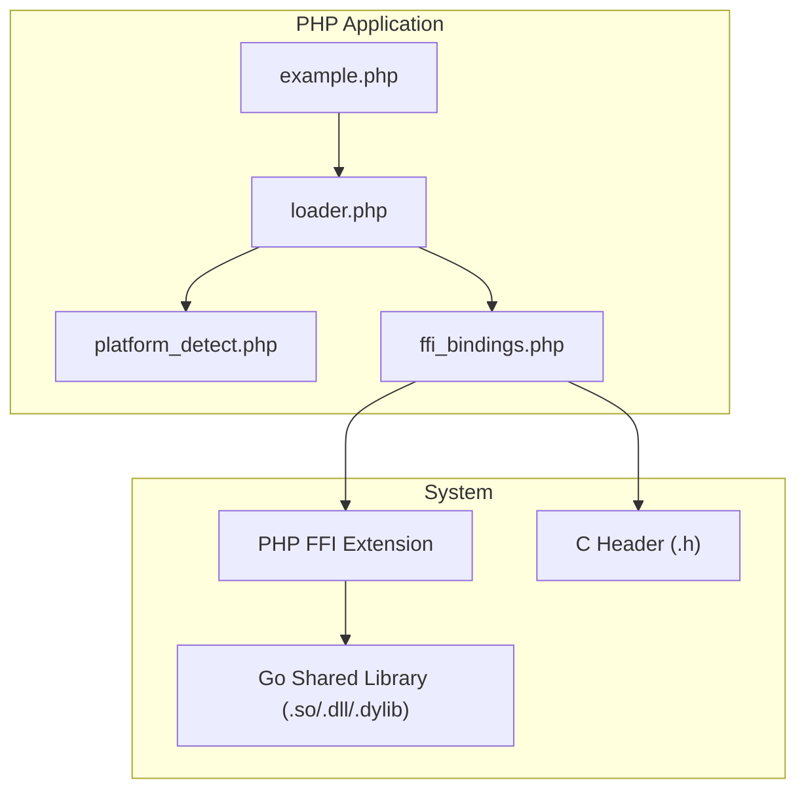

# Architecture and Design

<cite>
**Referenced Files in This Document**
- [mygo.go](file://mygo.go)
- [generator/main.go](file://generator/main.go)
- [build.go](file://build.go)
- [build.ps1](file://build.ps1)
- [Makefile](file://Makefile)
- [example.php](file://example.php)
- [README.md](file://README.md)
- [QUICKSTART.md](file://QUICKSTART.md)
- [go.mod](file://go.mod)
</cite>

## Table of Contents
1. [Introduction](#introduction)
2. [Project Structure](#project-structure)
3. [Core Components](#core-components)
4. [Architecture Overview](#architecture-overview)
5. [Detailed Component Analysis](#detailed-component-analysis)
6. [Dependency Analysis](#dependency-analysis)
7. [Performance Considerations](#performance-considerations)
8. [Troubleshooting Guide](#troubleshooting-guide)
9. [Conclusion](#conclusion)
10. [Appendices](#appendices)

## Introduction
This document describes the architecture of the serviceLib system, a hybrid pipeline that combines:
- Code generation to produce PHP FFI bindings from Go exported functions
- Cross-platform compilation of Go shared libraries
- PHP FFI integration to expose Go functions to PHP applications

It explains the architectural patterns used:
- Code Generation for PHP bindings
- Facade Pattern in build orchestration
- Template Method in platform-specific scripts

It also documents component interactions among mygo.go, generator/main.go, build.go, and the generated dist/ output, and illustrates data flows from Go source to shared libraries and PHP bindings. Finally, it covers platform detection, naming conventions, build automation, constraints (CGO and PHP FFI), and scalability considerations for adding new platforms or functions.

## Project Structure
The repository organizes the system into:
- A Go module with a primary library file exporting functions for FFI consumption
- A code generator that parses exported functions and produces PHP FFI bindings
- A cross-platform build orchestrator that compiles shared libraries and copies PHP files
- Platform-specific build scripts for Windows PowerShell and Unix Make
- A PHP example application demonstrating usage
- Documentation and quick-start guides

**Diagram sources**
- [mygo.go](file://mygo.go#L1-L39)
- [generator/main.go](file://generator/main.go#L1-L705)
- [build.go](file://build.go#L1-L183)
- [build.ps1](file://build.ps1#L1-L152)
- [Makefile](file://Makefile#L1-L54)
- [example.php](file://example.php#L1-L95)

**Section sources**
- [README.md](file://README.md#L1-L120)
- [QUICKSTART.md](file://QUICKSTART.md#L1-L80)
- [go.mod](file://go.mod#L1-L4)

## Core Components
- mygo.go: Defines exported functions for FFI and serves as the source-of-truth for code generation and compilation.
- generator/main.go: Parses exported functions and generates platform detection, FFI binding wrappers, and loader PHP files.
- build.go: Orchestrates cross-platform builds, sets environment variables, handles cross-compilation toolchain selection, and copies generated PHP files to dist/.
- build.ps1: Windows PowerShell facade that wraps generation and build steps.
- Makefile: Unix-style facade for generation, building, testing, and cleaning.
- example.php: Demonstrates loading the library and invoking exported functions via FFI.

Key architectural patterns:
- Code Generation: generator/main.go scans exported functions and emits PHP FFI bindings and loaders.
- Facade Pattern: build.go, build.ps1, and Makefile provide simplified entry points for developers.
- Template Method: build.ps1 and Makefile define platform-specific steps while delegating core logic to generator/main.go and build.go.

**Section sources**
- [mygo.go](file://mygo.go#L1-L39)
- [generator/main.go](file://generator/main.go#L1-L120)
- [build.go](file://build.go#L1-L120)
- [build.ps1](file://build.ps1#L1-L80)
- [Makefile](file://Makefile#L1-L40)
- [example.php](file://example.php#L1-L40)

## Architecture Overview
The system follows a hybrid pipeline:
- Code Generation Phase: generator/main.go reads mygo.go, extracts exported functions, and writes platform_detect.php, ffi_bindings.php, and loader.php.
- Compilation Phase: build.go (and scripts) compile c-shared libraries per platform and produce headers; generator/main.go also writes loader.php that depends on platform_detect.php and ffi_bindings.php.
- Distribution Phase: build.go copies PHP files into dist/, alongside compiled libraries and headers.
- Runtime Phase: example.php loads loader.php, uses PlatformDetector to locate the correct library, constructs a GoLibrary FFI wrapper, and invokes exported functions.

**Diagram sources**
- [generator/main.go](file://generator/main.go#L20-L120)
- [build.go](file://build.go#L40-L120)
- [build.ps1](file://build.ps1#L20-L90)
- [Makefile](file://Makefile#L7-L31)
- [example.php](file://example.php#L1-L25)

## Detailed Component Analysis

### Code Generation Pipeline (generator/main.go)
The generator performs:
- Parsing exported functions from mygo.go
- Generating platform detection logic (PHP)
- Generating FFI binding wrappers (PHP)
- Generating a loader that composes platform detection and FFI bindings

**Diagram sources**
- [generator/main.go](file://generator/main.go#L27-L75)
- [generator/main.go](file://generator/main.go#L190-L339)
- [generator/main.go](file://generator/main.go#L341-L418)
- [generator/main.go](file://generator/main.go#L642-L705)

**Section sources**
- [generator/main.go](file://generator/main.go#L27-L75)
- [generator/main.go](file://generator/main.go#L190-L339)
- [generator/main.go](file://generator/main.go#L341-L418)
- [generator/main.go](file://generator/main.go#L642-L705)

### Cross-Platform Build Orchestration (build.go)
The build orchestrator:
- Defines supported platforms and naming conventions
- Builds c-shared libraries per platform with appropriate environment variables
- Handles cross-compilation toolchain selection
- Copies generated PHP files into dist/

**Diagram sources**
- [build.go](file://build.go#L41-L120)
- [build.go](file://build.go#L120-L183)

**Section sources**
- [build.go](file://build.go#L12-L29)
- [build.go](file://build.go#L31-L40)
- [build.go](file://build.go#L107-L164)
- [build.go](file://build.go#L166-L183)

### Facade Pattern in Build Scripts
Windows PowerShell and Makefile act as facades:
- build.ps1: Wraps generation and build steps, supports commands like generate, build, build-current, test, clean
- Makefile: Provides generate, build, build-current, test, clean targets

**Diagram sources**
- [build.ps1](file://build.ps1#L20-L90)
- [Makefile](file://Makefile#L7-L31)

**Section sources**
- [build.ps1](file://build.ps1#L1-L80)
- [Makefile](file://Makefile#L1-L40)

### Template Method in Platform-Specific Scripts
The scripts define platform-specific steps:
- build.ps1 selects output paths and compilers per OS
- Makefile expands GOARCH and selects output suffixes per OS

**Diagram sources**
- [build.ps1](file://build.ps1#L46-L93)
- [Makefile](file://Makefile#L18-L31)

**Section sources**
- [build.ps1](file://build.ps1#L46-L93)
- [Makefile](file://Makefile#L18-L31)

### PHP FFI Integration (example.php)
The example demonstrates:
- Loading loader.php
- Getting platform information
- Constructing a GoLibrary via FFI
- Invoking exported functions and freeing C strings

**Diagram sources**
- [example.php](file://example.php#L1-L25)
- [example.php](file://example.php#L26-L95)
- [generator/main.go](file://generator/main.go#L341-L418)

**Section sources**
- [example.php](file://example.php#L1-L25)
- [example.php](file://example.php#L26-L95)

## Dependency Analysis
The system exhibits layered dependencies:
- generator/main.go depends on mygo.go for parsing exported functions
- build.go depends on generator/main.go indirectly via the generated PHP files
- build.ps1 and Makefile depend on generator/main.go and build.go
- example.php depends on loader.php, which depends on platform_detect.php and ffi_bindings.php

**Diagram sources**
- [mygo.go](file://mygo.go#L1-L39)
- [generator/main.go](file://generator/main.go#L27-L75)
- [build.go](file://build.go#L41-L120)
- [build.ps1](file://build.ps1#L20-L90)
- [Makefile](file://Makefile#L7-L31)
- [example.php](file://example.php#L1-L25)

**Section sources**
- [mygo.go](file://mygo.go#L1-L39)
- [generator/main.go](file://generator/main.go#L27-L75)
- [build.go](file://build.go#L41-L120)
- [build.ps1](file://build.ps1#L20-L90)
- [Makefile](file://Makefile#L7-L31)
- [example.php](file://example.php#L1-L25)

## Performance Considerations
- Library loading occurs once per PHP process; using persistent processes (PHP-FPM) improves performance.
- FFI overhead is minimal compared to native C extensions.
- String conversions between PHP and C incur overhead; batch operations when possible.
- Always free Go-allocated strings to prevent memory leaks.

[No sources needed since this section provides general guidance]

## Troubleshooting Guide
Common constraints and fixes:
- PHP FFI extension disabled: enable FFI in php.ini and restart services.
- Library not found: ensure generation and build were executed and that dist/ contains the correct artifact.
- Unsupported platform: add platform support in build.go or build the library for your platform.
- CGO disabled: set CGO_ENABLED=1 and ensure a C compiler is installed.
- Windows DLL loading errors: verify architecture match (32-bit vs 64-bit) and install required runtime libraries.

**Section sources**
- [README.md](file://README.md#L239-L309)
- [QUICKSTART.md](file://QUICKSTART.md#L110-L134)

## Conclusion
The serviceLib system integrates code generation, cross-platform compilation, and PHP FFI to deliver a portable, automated pipeline. It uses code generation to keep PHP bindings synchronized with exported Go functions, a facade pattern to simplify developer workflows, and template method in platform-specific scripts to encapsulate OS differences. The resulting dist/ package enables PHP applications to call Go functions seamlessly, with clear constraints around CGO and PHP FFI. Extending the system to new platforms or functions is straightforward: add exports to mygo.go, regenerate bindings, and rebuild.

[No sources needed since this section summarizes without analyzing specific files]

## Appendices

### System Context Diagram: PHP Applications and Go Libraries via FFI

**Diagram sources**
- [example.php](file://example.php#L1-L25)
- [generator/main.go](file://generator/main.go#L341-L418)
- [generator/main.go](file://generator/main.go#L190-L339)

### Naming Conventions and Platform Detection
- Standardized naming: mygo-{GOOS}-{GOARCH}.{ext}
- Platform detection maps OS family and machine architecture to supported combinations
- Headers accompany each library for FFI declarations

**Section sources**
- [README.md](file://README.md#L7-L24)
- [generator/main.go](file://generator/main.go#L190-L339)
- [build.go](file://build.go#L31-L40)

### Scalability Considerations
- Adding new platforms: extend supported platforms in build.go and ensure cross-compilers are available
- Adding new functions: export functions in mygo.go; regenerate bindings; rebuild libraries; copy PHP files to dist/
- CI/CD: automate generation and builds; upload dist/ as artifacts

**Section sources**
- [README.md](file://README.md#L100-L184)
- [build.go](file://build.go#L12-L29)
- [QUICKSTART.md](file://QUICKSTART.md#L1-L22)