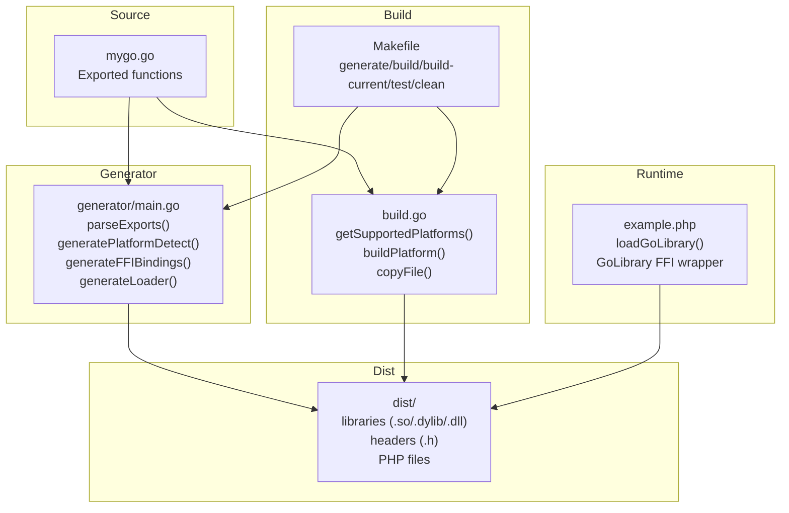
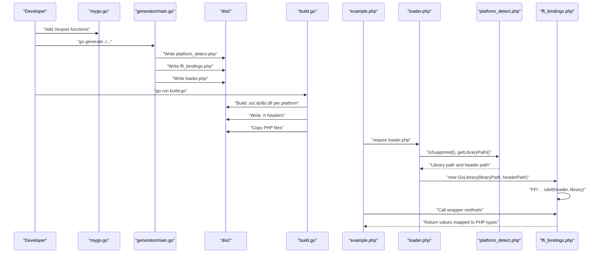
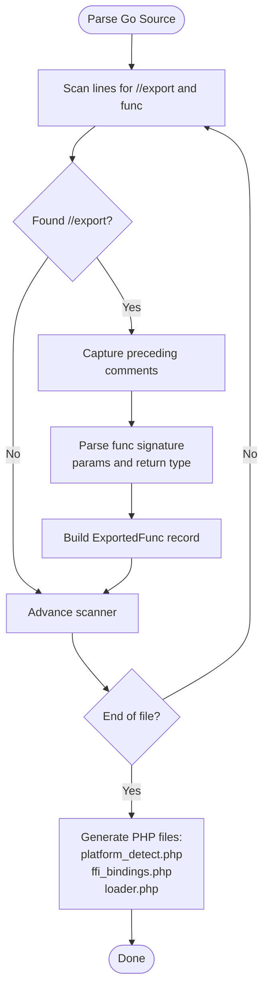
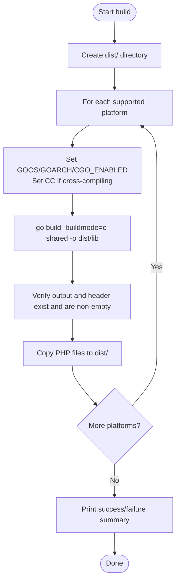
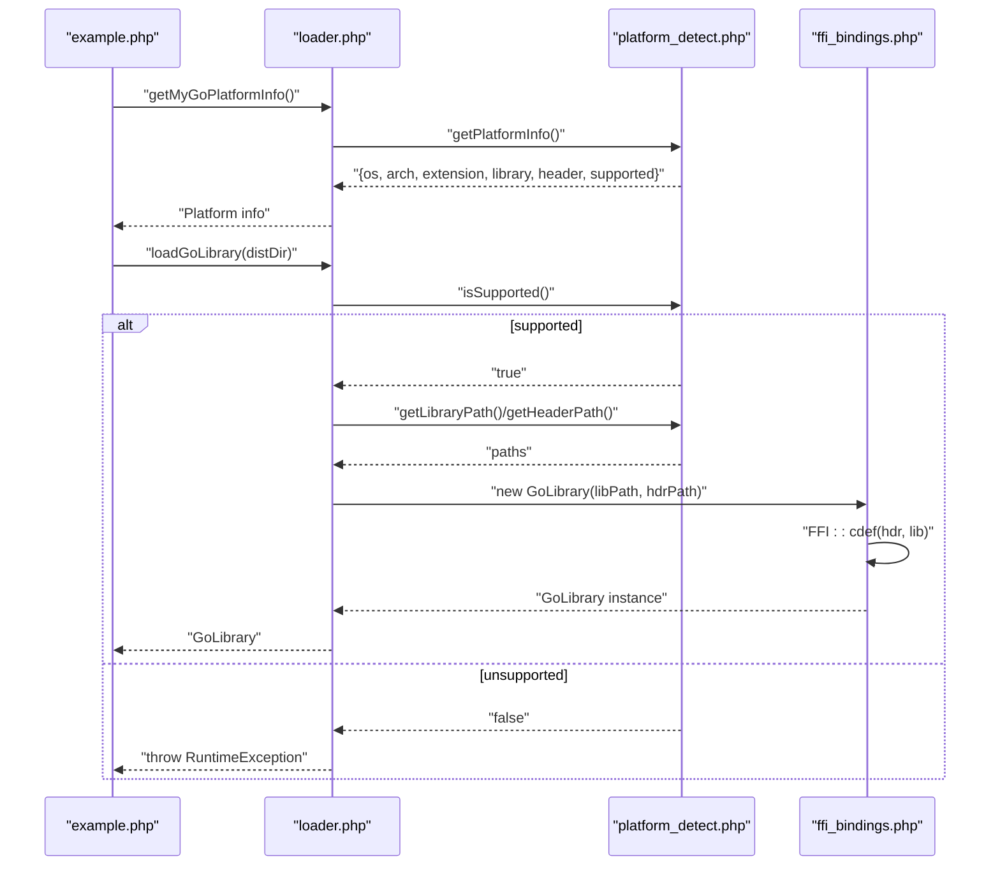
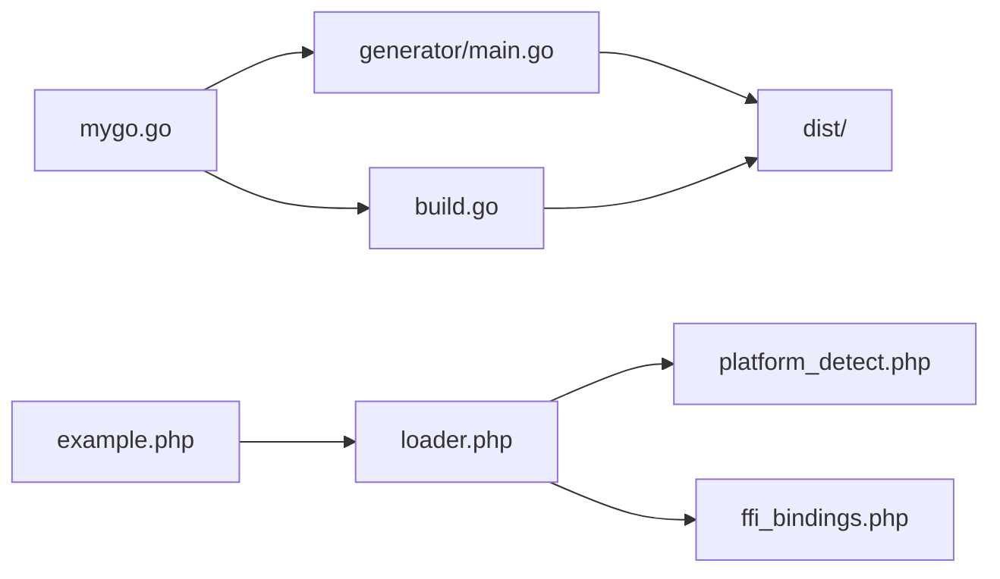

# Data Flow

<cite>
**Referenced Files in This Document**
- [mygo.go](file://mygo.go)
- [generator/main.go](file://generator/main.go)
- [build.go](file://build.go)
- [Makefile](file://Makefile)
- [example.php](file://example.php)
- [README.md](file://README.md)
- [QUICKSTART.md](file://QUICKSTART.md)
- [AGENTS.MD](file://AGENTS.MD)
</cite>

## Table of Contents
1. [Introduction](#introduction)
2. [Project Structure](#project-structure)
3. [Core Components](#core-components)
4. [Architecture Overview](#architecture-overview)
5. [Detailed Component Analysis](#detailed-component-analysis)
6. [Dependency Analysis](#dependency-analysis)
7. [Performance Considerations](#performance-considerations)
8. [Troubleshooting Guide](#troubleshooting-guide)
9. [Conclusion](#conclusion)
10. [Appendices](#appendices)

## Introduction
This document explains the end-to-end data flow from Go source code to PHP integration using FFI. It covers:
- How exported Go functions are discovered and transformed into PHP FFI bindings
- How cross-compiled shared libraries are produced per platform
- How the distribution package is assembled and shipped
- How PHP loads the correct library at runtime via automatic platform detection and FFI

It also includes sequence diagrams for the build process and runtime library loading, plus a detailed breakdown of function signature extraction, type mapping, environment variable propagation for cross-compilation, and platform detection logic.

## Project Structure
The repository organizes the pipeline into distinct stages:
- Source: Go code with exported functions
- Generator: Parses Go exports and produces PHP FFI bindings and loader
- Build orchestrator: Compiles shared libraries per platform and packages outputs
- Distribution: A dist/ directory containing libraries, headers, and PHP loader
- Runtime: PHP application uses the loader to detect platform and load the appropriate library via FFI

**Diagram sources**
- [mygo.go](file://mygo.go#L1-L39)
- [generator/main.go](file://generator/main.go#L1-L705)
- [build.go](file://build.go#L1-L183)
- [Makefile](file://Makefile#L1-L54)
- [example.php](file://example.php#L1-L95)

**Section sources**
- [README.md](file://README.md#L1-L120)
- [QUICKSTART.md](file://QUICKSTART.md#L1-L80)
- [AGENTS.MD](file://AGENTS.MD#L1-L120)

## Core Components
- Go source with exports: Defines the functions exposed to PHP via CGO export directives.
- Code generator: Scans Go source for exported functions, extracts signatures and types, and generates three PHP files:
  - Platform detection module
  - FFI bindings wrapper
  - Loader entrypoint
- Build orchestrator: Cross-compiles shared libraries for supported platforms, writes headers, validates outputs, and copies PHP files into dist/.
- Distribution: The dist/ directory becomes the consumer artifact for PHP projects.
- Runtime loader: PHP code that detects the current OS/architecture, locates the correct library/header, and initializes FFI.

**Section sources**
- [mygo.go](file://mygo.go#L1-L39)
- [generator/main.go](file://generator/main.go#L1-L120)
- [build.go](file://build.go#L1-L120)
- [example.php](file://example.php#L1-L40)

## Architecture Overview
The system follows a deterministic pipeline:
1. Developer edits mygo.go and adds //export directives for functions to expose.
2. go generate runs the code generator to produce platform_detect.php, ffi_bindings.php, and loader.php.
3. The build orchestrator compiles c-shared libraries per platform, writes headers, and copies PHP files to dist/.
4. PHP applications require loader.php, call loadGoLibrary(), and use the generated GoLibrary wrapper to call Go functions via FFI.

**Diagram sources**
- [generator/main.go](file://generator/main.go#L1-L120)
- [build.go](file://build.go#L1-L120)
- [example.php](file://example.php#L1-L40)
- [README.md](file://README.md#L110-L160)

## Detailed Component Analysis

### Code Generator: Function Signature Extraction and Type Mapping
The generator parses Go source to extract exported functions and their types, then generates PHP FFI bindings with appropriate type hints.

Key behaviors:
- Parses //export directives and adjacent function declarations
- Extracts parameter names and types, and return types
- Generates:
  - platform_detect.php: PlatformDetector class with methods to detect OS, arch, extension, and compute filenames
  - ffi_bindings.php: GoLibrary class wrapping FFI::cdef and exposing typed wrapper methods
  - loader.php: loadGoLibrary() and get{BaseName}PlatformInfo() helpers

Type mapping from C/Go to PHP:
- Integers: int, GoInt*, C.int/*, uint*, char/short/long variants -> int
- Floats: float, double, GoFloat*, C.float/* -> float
- Strings: *C.char, char*, string, GoString -> string
- Booleans: bool, GoBool, _Bool -> bool
- Arrays/Collections: map[], GoMap, GoSlice, [], pointers (non-char) -> array
- Void: void -> void (no PHP return type hint)

**Diagram sources**
- [generator/main.go](file://generator/main.go#L77-L145)
- [generator/main.go](file://generator/main.go#L147-L187)
- [generator/main.go](file://generator/main.go#L341-L418)
- [generator/main.go](file://generator/main.go#L481-L640)
- [generator/main.go](file://generator/main.go#L642-L705)

**Section sources**
- [generator/main.go](file://generator/main.go#L77-L145)
- [generator/main.go](file://generator/main.go#L341-L418)
- [generator/main.go](file://generator/main.go#L481-L640)
- [generator/main.go](file://generator/main.go#L642-L705)

### Build Orchestrator: Cross-Compilation and Packaging
The build orchestrator defines supported platforms, sets environment variables for cross-compilation, executes go build -buildmode=c-shared, verifies outputs, and copies PHP files to dist/.

Key behaviors:
- Supported platforms: linux/amd64, linux/arm64, darwin/amd64/dylib, darwin/arm64/dylib, windows/amd64/dll, windows/arm64/dll
- Environment variables:
  - GOOS, GOARCH, CGO_ENABLED=1
  - CC set conditionally for cross-compilers (e.g., aarch64-linux-gnu-gcc, x86_64-w64-mingw32-gcc)
- Output verification: checks existence and non-empty size for both library and header
- Packaging: copies platform_detect.php, ffi_bindings.php, loader.php into dist/

**Diagram sources**
- [build.go](file://build.go#L1-L120)
- [build.go](file://build.go#L107-L164)
- [build.go](file://build.go#L166-L183)
- [Makefile](file://Makefile#L1-L54)

**Section sources**
- [build.go](file://build.go#L1-L120)
- [build.go](file://build.go#L107-L164)
- [build.go](file://build.go#L166-L183)
- [Makefile](file://Makefile#L1-L54)

### Runtime Loader: Platform Detection and FFI Initialization
At runtime, PHP code uses loader.php to:
- Detect OS family and architecture
- Compute the correct library and header filenames
- Validate platform support
- Instantiate GoLibrary with FFI::cdef using the header and library path
- Expose typed wrapper methods mirroring the exported Go functions

**Diagram sources**
- [example.php](file://example.php#L1-L40)
- [generator/main.go](file://generator/main.go#L190-L339)
- [generator/main.go](file://generator/main.go#L341-L418)
- [generator/main.go](file://generator/main.go#L642-L705)

**Section sources**
- [example.php](file://example.php#L1-L40)
- [generator/main.go](file://generator/main.go#L190-L339)
- [generator/main.go](file://generator/main.go#L341-L418)
- [generator/main.go](file://generator/main.go#L642-L705)

### Data Pathways and Transformations
- Function signature extraction:
  - The generator scans Go source for //export and func lines, captures comments, and parses parameters and return types.
- Type mapping from Go/C to PHP:
  - The generator maps C/Go primitive and composite types to PHP built-in types for documentation and type hints.
- Environment variable propagation during cross-compilation:
  - build.go sets GOOS, GOARCH, CGO_ENABLED, and CC for cross-compilers when the target differs from the host OS.
- FFI interface creation:
  - The loader constructs a GoLibrary instance that calls FFI::cdef with the header content and library path, enabling typed calls to exported functions.

**Section sources**
- [generator/main.go](file://generator/main.go#L77-L145)
- [generator/main.go](file://generator/main.go#L481-L640)
- [build.go](file://build.go#L107-L164)
- [generator/main.go](file://generator/main.go#L341-L418)

## Dependency Analysis
The components depend on each other as follows:
- generator/main.go depends on mygo.go for parsing exported functions
- build.go depends on mygo.go for building c-shared outputs
- example.php depends on loader.php, which depends on platform_detect.php and ffi_bindings.php
- Makefile coordinates generation and builds across platforms

**Diagram sources**
- [mygo.go](file://mygo.go#L1-L39)
- [generator/main.go](file://generator/main.go#L1-L120)
- [build.go](file://build.go#L1-L120)
- [example.php](file://example.php#L1-L40)

**Section sources**
- [README.md](file://README.md#L1-L120)
- [QUICKSTART.md](file://QUICKSTART.md#L1-L80)
- [AGENTS.MD](file://AGENTS.MD#L1-L120)

## Performance Considerations
- Library loading occurs once per PHP process; using persistent processes (e.g., PHP-FPM) reduces repeated initialization overhead.
- FFI overhead is minimal compared to native C extensions.
- String conversion between PHP and C has overhead; batch operations where possible.
- Always free Go-allocated strings to prevent memory leaks.

[No sources needed since this section provides general guidance]

## Troubleshooting Guide
Common issues and resolutions:
- PHP FFI not enabled: Enable the extension and restart the server.
- Library not found: Ensure go generate and build were executed and that dist/ contains the correct .so/.dll/.dylib.
- Unsupported platform: Build for your platform or add support in build.go.
- CGO disabled: Set CGO_ENABLED=1 and ensure a C compiler is installed.
- DLL loading errors on Windows: Verify architecture match and install required runtime libraries.

**Section sources**
- [README.md](file://README.md#L238-L310)
- [QUICKSTART.md](file://QUICKSTART.md#L110-L134)
- [AGENTS.MD](file://AGENTS.MD#L326-L412)

## Conclusion
The serviceLib pipeline cleanly separates concerns:
- Source authoring in Go with explicit exports
- Automated generation of PHP FFI bindings and loaders
- Robust cross-platform build orchestration with environment-aware compilation
- Runtime platform detection and safe FFI initialization

This design yields a portable, maintainable solution for integrating Go functions into PHP applications.

[No sources needed since this section summarizes without analyzing specific files]

## Appendices

### Appendix A: Supported Platforms and Filenames
- Linux: mygo-linux-amd64.so, mygo-linux-arm64.so
- macOS: mygo-darwin-amd64.dylib, mygo-darwin-arm64.dylib
- Windows: mygo-windows-amd64.dll, mygo-windows-arm64.dll

**Section sources**
- [README.md](file://README.md#L14-L24)
- [build.go](file://build.go#L20-L29)

### Appendix B: Example Usage Flow
- Require loader.php
- Call getMyGoPlatformInfo() to inspect detected platform
- Call loadGoLibrary(distDir) to initialize FFI
- Invoke generated wrapper methods on the returned GoLibrary instance

**Section sources**
- [example.php](file://example.php#L1-L40)
- [generator/main.go](file://generator/main.go#L642-L705)