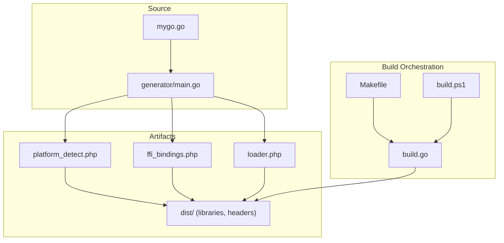
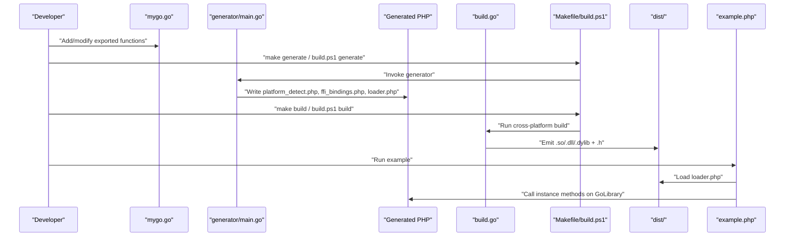
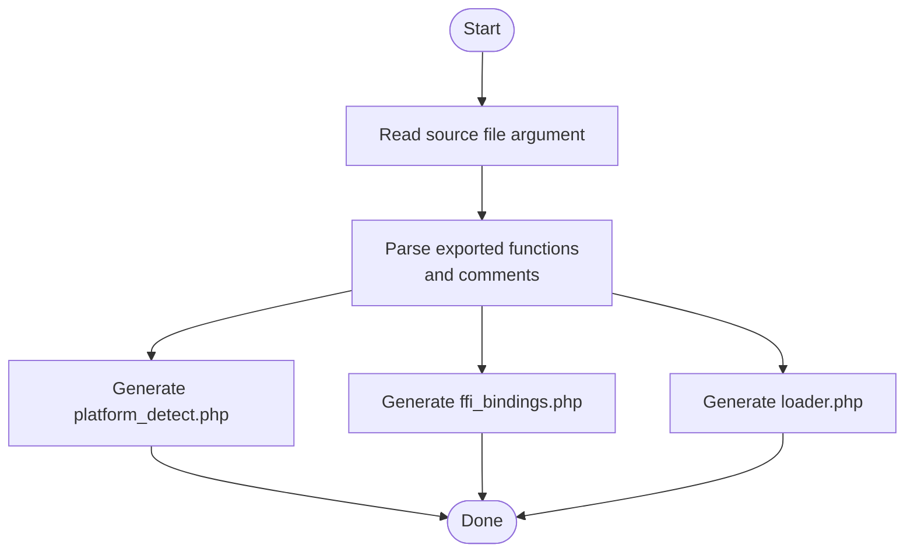
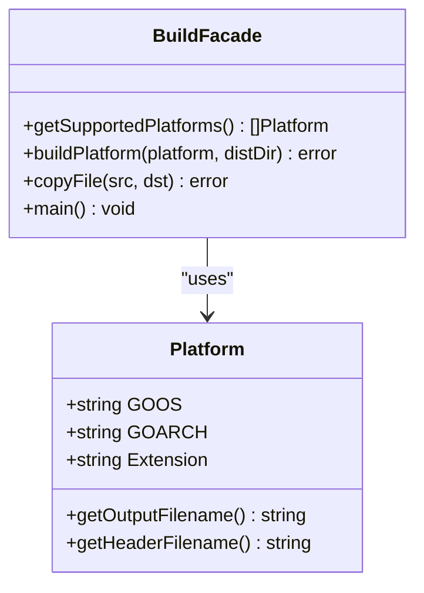
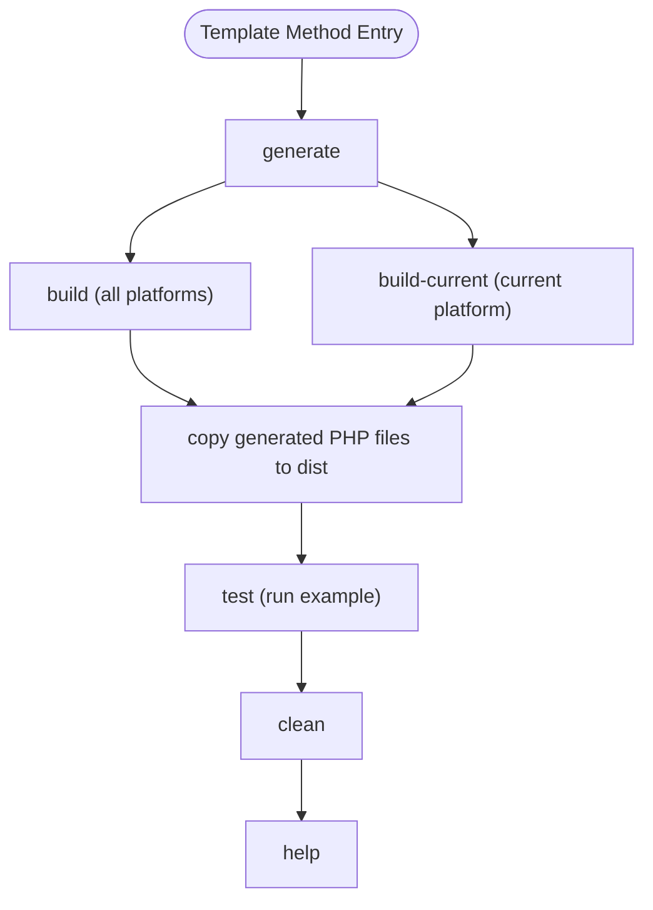
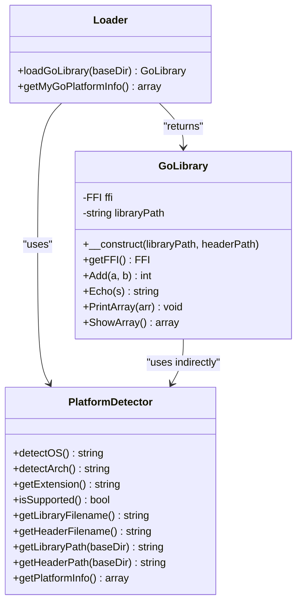
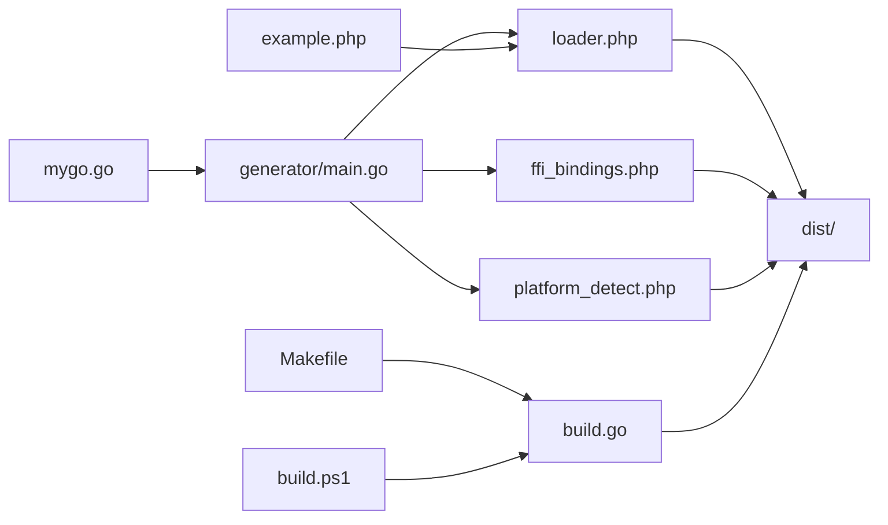

# Design Patterns

<cite>
**Referenced Files in This Document**
- [generator/main.go](file://generator/main.go)
- [build.go](file://build.go)
- [Makefile](file://Makefile)
- [build.ps1](file://build.ps1)
- [mygo.go](file://mygo.go)
- [example.php](file://example.php)
- [README.md](file://README.md)
- [QUICKSTART.md](file://QUICKSTART.md)
- [AGENTS.MD](file://AGENTS.MD)
</cite>

## Table of Contents
1. [Introduction](#introduction)
2. [Project Structure](#project-structure)
3. [Core Components](#core-components)
4. [Architecture Overview](#architecture-overview)
5. [Detailed Component Analysis](#detailed-component-analysis)
6. [Dependency Analysis](#dependency-analysis)
7. [Performance Considerations](#performance-considerations)
8. [Troubleshooting Guide](#troubleshooting-guide)
9. [Conclusion](#conclusion)

## Introduction
This document explains the design patterns implemented in serviceLib and how they collectively improve maintainability, reduce complexity, and enhance developer experience. It focuses on:
- Code Generation pattern in the Go generator that produces PHP FFI bindings automatically.
- Facade Pattern in the Go build orchestrator that simplifies cross-compilation.
- Template Method pattern in platform-specific build scripts that define a consistent build skeleton with platform-specific steps.
- Instance method pattern in generated PHP classes for better OOP design and testability.

## Project Structure
The repository is organized around a small set of cohesive files that implement a complete build pipeline for Go shared libraries consumed by PHP via FFI. The structure supports both automated generation and cross-platform builds, with platform-specific scripts for convenience.

**Diagram sources**
- [mygo.go](file://mygo.go#L1-L39)
- [generator/main.go](file://generator/main.go#L1-L705)
- [build.go](file://build.go#L1-L183)
- [Makefile](file://Makefile#L1-L54)
- [build.ps1](file://build.ps1#L1-L152)

**Section sources**
- [README.md](file://README.md#L1-L120)
- [QUICKSTART.md](file://QUICKSTART.md#L1-L80)
- [AGENTS.MD](file://AGENTS.MD#L1-L60)

## Core Components
- Code Generator (generator/main.go): Parses exported Go functions and generates three PHP files: platform detection, FFI bindings, and a loader. It uses type mapping to convert C/Go types to PHP types and writes instance methods for better OOP design.
- Build Orchestrator (build.go): Encapsulates cross-compilation logic behind a simple facade, setting environment variables, invoking the Go toolchain, verifying outputs, and copying generated PHP files to the distribution directory.
- Platform Scripts (Makefile and build.ps1): Provide a Template Method for build operations, with platform-specific implementations for building current and all platforms, generating bindings, and running tests.
- Example Usage (example.php): Demonstrates the resulting PHP API surface and runtime behavior.

**Section sources**
- [generator/main.go](file://generator/main.go#L1-L120)
- [build.go](file://build.go#L1-L105)
- [Makefile](file://Makefile#L1-L54)
- [build.ps1](file://build.ps1#L1-L152)
- [example.php](file://example.php#L1-L95)

## Architecture Overview
The system follows a layered approach:
- Source layer: Go library with exported functions.
- Generation layer: Code generator transforms exported functions into PHP FFI bindings.
- Build layer: Cross-compilation orchestrator and platform scripts produce platform-specific shared libraries and headers.
- Consumption layer: PHP application loads the appropriate library and invokes generated wrappers.

**Diagram sources**
- [mygo.go](file://mygo.go#L1-L39)
- [generator/main.go](file://generator/main.go#L1-L120)
- [build.go](file://build.go#L41-L105)
- [Makefile](file://Makefile#L1-L54)
- [build.ps1](file://build.ps1#L1-L152)
- [example.php](file://example.php#L1-L95)

## Detailed Component Analysis

### Code Generation Pattern (generator/main.go)
The generator implements a robust Code Generation pattern:
- Parses exported functions from Go source using regular expressions and comment scanning.
- Extracts function metadata (name, comment, signature, parameters, return type).
- Generates three PHP files:
  - platform_detect.php: PlatformDetector with instance methods for OS/arch detection and filename construction.
  - ffi_bindings.php: GoLibrary with an FFI instance and wrapper methods mirroring exported functions.
  - loader.php: loadGoLibrary() and get{BaseName}PlatformInfo() functions that orchestrate loading via PlatformDetector and GoLibrary.
- Applies type mapping from C/Go types to PHP types for PHPDoc and type hints.
- Writes instance methods for better OOP design and testability.

**Diagram sources**
- [generator/main.go](file://generator/main.go#L27-L75)
- [generator/main.go](file://generator/main.go#L77-L145)
- [generator/main.go](file://generator/main.go#L189-L339)
- [generator/main.go](file://generator/main.go#L341-L418)
- [generator/main.go](file://generator/main.go#L642-L705)

**Section sources**
- [generator/main.go](file://generator/main.go#L27-L75)
- [generator/main.go](file://generator/main.go#L77-L145)
- [generator/main.go](file://generator/main.go#L189-L339)
- [generator/main.go](file://generator/main.go#L341-L418)
- [generator/main.go](file://generator/main.go#L642-L705)
- [AGENTS.MD](file://AGENTS.MD#L43-L92)

### Facade Pattern in the Build System (build.go)
The build orchestrator implements a Facade Pattern:
- Encapsulates cross-compilation complexity behind a single entry point.
- Defines a Platform struct with GOOS, GOARCH, and Extension fields.
- Exposes getSupportedPlatforms() returning all target platforms.
- Provides buildPlatform(platform, distDir) that sets environment variables (GOOS, GOARCH, CGO_ENABLED), configures cross-compilers (CC), executes go build -buildmode=c-shared, verifies outputs, and returns errors with context.
- Copies generated PHP files to dist for distribution.
- The main() function orchestrates iteration over platforms, collects successes/failures, and prints a summary.

**Diagram sources**
- [build.go](file://build.go#L12-L39)
- [build.go](file://build.go#L41-L105)
- [build.go](file://build.go#L107-L164)
- [build.go](file://build.go#L166-L183)

**Section sources**
- [build.go](file://build.go#L12-L39)
- [build.go](file://build.go#L41-L105)
- [build.go](file://build.go#L107-L164)
- [build.go](file://build.go#L166-L183)
- [AGENTS.MD](file://AGENTS.MD#L95-L135)

### Template Method Pattern in Platform Scripts (Makefile and build.ps1)
Both scripts implement a Template Method:
- Define a consistent skeleton of operations: generate, build, build-current, test, clean, help.
- Platform-specific implementations:
  - Makefile: Uses shell conditionals to select the current OS and architecture, constructs output paths dynamically, and copies generated PHP files to dist.
  - build.ps1: Uses PowerShell switches to select OS and architecture, constructs output paths, and copies files to dist.
- Both scripts delegate to the generator and the Go build orchestrator, ensuring a uniform workflow across platforms.

**Diagram sources**
- [Makefile](file://Makefile#L1-L54)
- [build.ps1](file://build.ps1#L1-L152)

**Section sources**
- [Makefile](file://Makefile#L1-L54)
- [build.ps1](file://build.ps1#L1-L152)
- [AGENTS.MD](file://AGENTS.MD#L161-L186)

### Instance Method Pattern in Generated PHP Classes
The generator enforces an Instance Method Pattern in generated PHP classes:
- platform_detect.php: PlatformDetector exposes instance methods (detectOS, detectArch, getExtension, isSupported, getLibraryFilename, getHeaderFilename, getLibraryPath, getHeaderPath, getPlatformInfo).
- ffi_bindings.php: GoLibrary holds an FFI instance and exposes instance methods mirroring exported Go functions.
- loader.php: loadGoLibrary() returns a GoLibrary instance; get{BaseName}PlatformInfo() returns platform details via a PlatformDetector instance.
- Benefits:
  - Better OOP design and encapsulation.
  - Easier testing and mocking.
  - Avoids global state.
  - Aligns with modern PHP best practices.

**Diagram sources**
- [generator/main.go](file://generator/main.go#L189-L339)
- [generator/main.go](file://generator/main.go#L341-L418)
- [generator/main.go](file://generator/main.go#L642-L705)

**Section sources**
- [generator/main.go](file://generator/main.go#L189-L339)
- [generator/main.go](file://generator/main.go#L341-L418)
- [generator/main.go](file://generator/main.go#L642-L705)
- [AGENTS.MD](file://AGENTS.MD#L243-L273)

## Dependency Analysis
The build pipeline exhibits low coupling and high cohesion:
- generator/main.go depends on Go source files and writes PHP files.
- build.go depends on the Go toolchain and filesystem.
- Makefile and build.ps1 depend on generator/main.go and build.go.
- example.php depends on loader.php and the generated GoLibrary.

**Diagram sources**
- [mygo.go](file://mygo.go#L1-L39)
- [generator/main.go](file://generator/main.go#L1-L120)
- [build.go](file://build.go#L1-L105)
- [Makefile](file://Makefile#L1-L54)
- [build.ps1](file://build.ps1#L1-L152)
- [example.php](file://example.php#L1-L95)

**Section sources**
- [mygo.go](file://mygo.go#L1-L39)
- [generator/main.go](file://generator/main.go#L1-L120)
- [build.go](file://build.go#L1-L105)
- [Makefile](file://Makefile#L1-L54)
- [build.ps1](file://build.ps1#L1-L152)
- [example.php](file://example.php#L1-L95)

## Performance Considerations
- Library loading occurs once per PHP process; using persistent processes (PHP-FPM) improves performance.
- FFI overhead is minimal compared to native C extensions.
- String handling between PHP and C has overhead; batch operations when possible.
- Always free Go-allocated strings to prevent memory leaks.

**Section sources**
- [README.md](file://README.md#L296-L309)

## Troubleshooting Guide
Common issues and resolutions:
- PHP FFI not enabled: Enable extension and restart services.
- Library not found: Ensure go generate and build were executed and that dist contains the correct artifact.
- Platform not supported: Build for your platform or add support in build.go.
- CGO not enabled: Set CGO_ENABLED=1 and ensure a C compiler is installed.
- DLL loading errors on Windows: Match PHP architecture to the DLL and install required runtime libraries.

**Section sources**
- [README.md](file://README.md#L238-L295)
- [QUICKSTART.md](file://QUICKSTART.md#L110-L129)

## Conclusion
serviceLib’s design patterns deliver a cohesive, maintainable, and developer-friendly build system:
- The Code Generation pattern automates PHP FFI bindings, reducing manual effort and ensuring consistency.
- The Facade Pattern in build.go simplifies cross-compilation by encapsulating environment setup, compilation, and verification.
- The Template Method pattern in platform scripts provides a uniform workflow across platforms with platform-specific implementations.
- The Instance Method Pattern in generated PHP classes improves OOP design, testability, and maintainability.

These patterns collectively reduce complexity, improve developer experience, and make the system easier to extend and evolve.