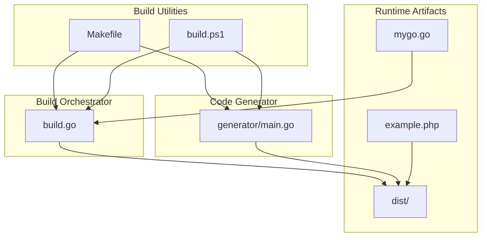
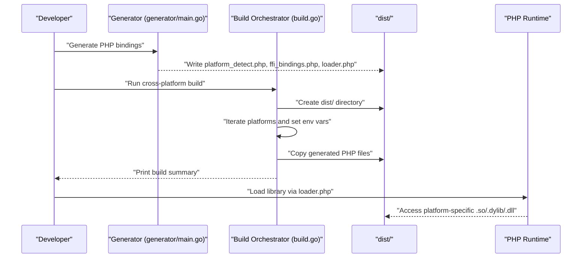
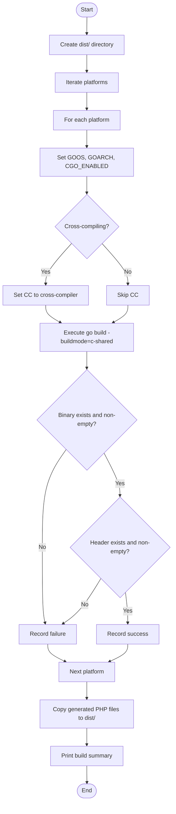
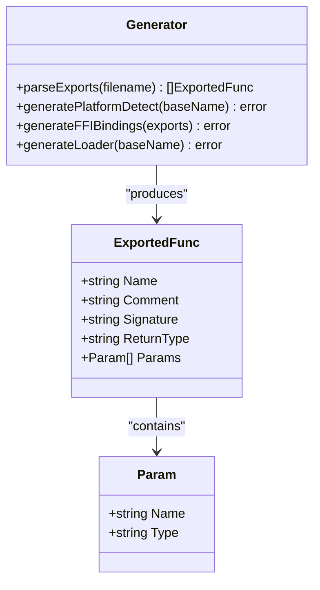
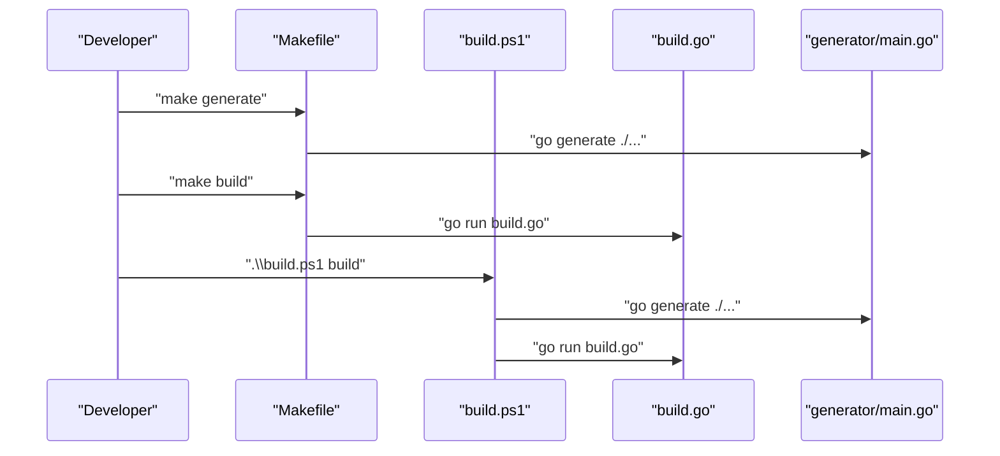
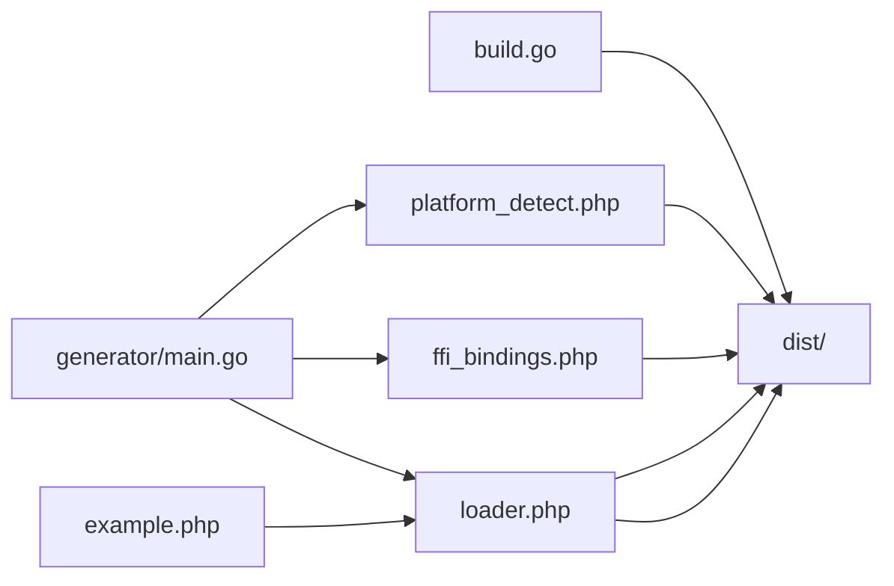
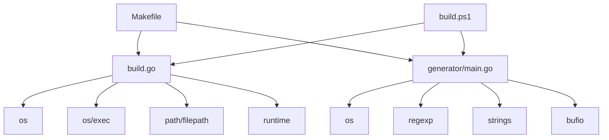

# Build System

<cite>
**Referenced Files in This Document**
- [build.go](file://build.go)
- [generator/main.go](file://generator/main.go)
- [Makefile](file://Makefile)
- [README.md](file://README.md)
- [example.php](file://example.php)
- [mygo.go](file://mygo.go)
- [build.ps1](file://build.ps1)
</cite>

## Table of Contents
1. [Introduction](#introduction)
2. [Project Structure](#project-structure)
3. [Core Components](#core-components)
4. [Architecture Overview](#architecture-overview)
5. [Detailed Component Analysis](#detailed-component-analysis)
6. [Dependency Analysis](#dependency-analysis)
7. [Performance Considerations](#performance-considerations)
8. [Troubleshooting Guide](#troubleshooting-guide)
9. [Conclusion](#conclusion)
10. [Appendices](#appendices)

## Introduction
This document describes the Build System component responsible for orchestrating cross-platform compilation of Go shared libraries for PHP FFI consumption. It explains how the system sets GOOS and GOARCH environment variables to target Linux, macOS, and Windows on AMD64 and ARM64 architectures, and how it manages file naming conventions (.so, .dylib, .dll). The build process includes creating the dist/ directory, iterating through platform configurations, enabling CGO, executing go build with -buildmode=c-shared, and validating output files. It also covers special handling for cross-compilation toolchains, tolerant failure handling for partial success, and copying generated PHP files into dist/ after builds. Finally, it outlines the relationship between build.go and the generated PHP bindings and how the final distribution package is assembled.

## Project Structure
The build system is composed of:
- A Go-based build orchestrator that compiles shared libraries for multiple platforms
- A code generator that produces PHP FFI binding files from exported Go functions
- A Makefile and PowerShell script that provide convenient workflows
- Example PHP code demonstrating usage of the generated bindings and loader
- The Go library source with exported functions for FFI exposure

**Diagram sources**
- [build.go](file://build.go#L1-L183)
- [generator/main.go](file://generator/main.go#L1-L705)
- [Makefile](file://Makefile#L1-L54)
- [build.ps1](file://build.ps1#L1-L152)
- [example.php](file://example.php#L1-L95)
- [mygo.go](file://mygo.go#L1-L39)

**Section sources**
- [build.go](file://build.go#L1-L183)
- [generator/main.go](file://generator/main.go#L1-L705)
- [Makefile](file://Makefile#L1-L54)
- [build.ps1](file://build.ps1#L1-L152)
- [example.php](file://example.php#L1-L95)
- [mygo.go](file://mygo.go#L1-L39)

## Core Components
- Platform model: Defines target platform configuration with GOOS, GOARCH, and expected file extension.
- Platform matrix: Six supported targets (Linux AMD64/ARM64, macOS AMD64/ARM64, Windows AMD64/ARM64) with corresponding extensions.
- Build orchestration: Iterates platforms, sets environment variables, executes go build -buildmode=c-shared, validates outputs, and aggregates results.
- Cross-compilation toolchain handling: Sets CC to appropriate cross-compilers for Linux ARM64 and Windows AMD64/ARM64.
- Distribution packaging: Creates dist/, copies generated PHP files, and prints a build summary.

Key responsibilities:
- Environment variable management: GOOS, GOARCH, CGO_ENABLED, and CC for cross-compilation.
- Output verification: Ensures .so/.dylib/.dll and corresponding .h files are created and non-empty.
- Tolerant failure handling: Continues building remaining platforms upon individual failures.
- Distribution assembly: Copies platform_detect.php, ffi_bindings.php, and loader.php into dist/.

**Section sources**
- [build.go](file://build.go#L12-L29)
- [build.go](file://build.go#L31-L39)
- [build.go](file://build.go#L41-L105)
- [build.go](file://build.go#L107-L164)
- [build.go](file://build.go#L166-L183)

## Architecture Overview
The build system integrates three primary flows:
- Code generation: Parses exported functions from mygo.go and generates PHP files (platform_detect.php, ffi_bindings.php, loader.php).
- Cross-platform build: Uses build.go to compile shared libraries for all supported platforms, copying generated PHP files into dist/.
- Distribution packaging: Assembles the final package in dist/ containing platform-specific binaries and PHP binding files.

**Diagram sources**
- [generator/main.go](file://generator/main.go#L27-L75)
- [build.go](file://build.go#L41-L105)
- [build.go](file://build.go#L107-L164)
- [example.php](file://example.php#L1-L20)

## Detailed Component Analysis

### Build Orchestrator (build.go)
Responsibilities:
- Define supported platforms and their file extensions.
- Create dist/ directory and iterate over platforms.
- For each platform, construct a go build command with -buildmode=c-shared and set environment variables (GOOS, GOARCH, CGO_ENABLED).
- Apply special CC settings for cross-compilation (aarch64-linux-gnu-gcc for Linux ARM64, x86_64-w64-mingw32-gcc for Windows AMD64, aarch64-w64-mingw32-gcc for Windows ARM64).
- Execute the build and validate outputs (binary and header files exist and are non-empty).
- Copy generated PHP files into dist/ and summarize successes/failures.

**Diagram sources**
- [build.go](file://build.go#L41-L105)
- [build.go](file://build.go#L107-L164)
- [build.go](file://build.go#L166-L183)

**Section sources**
- [build.go](file://build.go#L12-L29)
- [build.go](file://build.go#L31-L39)
- [build.go](file://build.go#L41-L105)
- [build.go](file://build.go#L107-L164)
- [build.go](file://build.go#L166-L183)

### Code Generator (generator/main.go)
Responsibilities:
- Parse exported functions from mygo.go using //export directives.
- Generate platform_detect.php (runtime platform detection and filename resolution).
- Generate ffi_bindings.php (FFI wrapper class with typed method signatures).
- Generate loader.php (entry point to load the correct library for the current platform).
- Provide helpful error messages and exit on failures.

**Diagram sources**
- [generator/main.go](file://generator/main.go#L12-L26)
- [generator/main.go](file://generator/main.go#L77-L145)
- [generator/main.go](file://generator/main.go#L190-L339)
- [generator/main.go](file://generator/main.go#L341-L418)
- [generator/main.go](file://generator/main.go#L642-L705)

**Section sources**
- [generator/main.go](file://generator/main.go#L12-L26)
- [generator/main.go](file://generator/main.go#L77-L145)
- [generator/main.go](file://generator/main.go#L190-L339)
- [generator/main.go](file://generator/main.go#L341-L418)
- [generator/main.go](file://generator/main.go#L642-L705)

### Build Utilities (Makefile and build.ps1)
- Makefile: Provides targets for generate, build (runs build.go), build-current (single-platform), test (build-current then run example.php), clean, and help.
- PowerShell script: Mirrors Makefile functionality with Windows-centric commands and file operations.

**Diagram sources**
- [Makefile](file://Makefile#L1-L54)
- [build.ps1](file://build.ps1#L1-L152)
- [generator/main.go](file://generator/main.go#L27-L75)
- [build.go](file://build.go#L41-L105)

**Section sources**
- [Makefile](file://Makefile#L1-L54)
- [build.ps1](file://build.ps1#L1-L152)

### Relationship Between build.go and Generated PHP Bindings
- build.go focuses on compiling shared libraries and copying generated PHP files into dist/.
- The generator creates platform_detect.php, ffi_bindings.php, and loader.php prior to building.
- At runtime, example.php loads loader.php, which uses platform_detect.php to locate the correct binary and ffi_bindings.php to expose typed wrappers.

**Diagram sources**
- [generator/main.go](file://generator/main.go#L190-L339)
- [generator/main.go](file://generator/main.go#L341-L418)
- [generator/main.go](file://generator/main.go#L642-L705)
- [build.go](file://build.go#L75-L84)
- [example.php](file://example.php#L1-L20)

**Section sources**
- [generator/main.go](file://generator/main.go#L190-L339)
- [generator/main.go](file://generator/main.go#L341-L418)
- [generator/main.go](file://generator/main.go#L642-L705)
- [build.go](file://build.go#L75-L84)
- [example.php](file://example.php#L1-L20)

## Dependency Analysis
- build.go depends on:
  - Standard library packages for environment manipulation, process execution, filesystem operations, and path handling.
  - The generated PHP files (platform_detect.php, ffi_bindings.php, loader.php) for distribution assembly.
- generator/main.go depends on:
  - Standard library packages for file I/O, regex parsing, and string manipulation.
  - The Go source file mygo.go for extracting exported functions.
- Makefile and build.ps1 depend on:
  - The presence of generator/main.go and build.go.
  - The dist/ directory and generated PHP files.

**Diagram sources**
- [build.go](file://build.go#L1-L12)
- [generator/main.go](file://generator/main.go#L1-L11)
- [Makefile](file://Makefile#L1-L54)
- [build.ps1](file://build.ps1#L1-L152)

**Section sources**
- [build.go](file://build.go#L1-L12)
- [generator/main.go](file://generator/main.go#L1-L11)
- [Makefile](file://Makefile#L1-L54)
- [build.ps1](file://build.ps1#L1-L152)

## Performance Considerations
- Cross-compilation can be slower due to external toolchains; ensure appropriate compilers are installed to avoid repeated failures.
- Building all six platforms increases total build time; use build-current for development iterations.
- FFI overhead is minimal compared to native C extensions; batch operations and reuse loaded instances where practical.
- Memory safety: Always free strings returned by Go functions to prevent leaks.

[No sources needed since this section provides general guidance]

## Troubleshooting Guide
Common issues and resolutions:
- PHP FFI not enabled: Enable the FFI extension and restart the service.
- Library not found: Ensure dist/ contains the correct .so/.dylib/.dll and that loader.php is included.
- Platform not supported: Build for your platform or extend the platform matrix.
- CGO disabled: Set CGO_ENABLED=1 and ensure a C compiler is available.
- DLL loading errors on Windows: Match PHP architecture to the compiled DLL and install required runtime libraries.

**Section sources**
- [README.md](file://README.md#L239-L309)

## Conclusion
The Build System component orchestrates reliable cross-platform compilation of Go shared libraries for PHP FFI by setting environment variables per target platform, applying special cross-compilation toolchain handling, validating outputs, and assembling a distribution package in dist/. The code generator complements this by producing platform detection, FFI bindings, and loader files. Together, these components enable developers to build, distribute, and consume Go libraries from PHP with minimal configuration.

[No sources needed since this section summarizes without analyzing specific files]

## Appendices

### Platform Matrix and File Extensions
- Linux AMD64: .so
- Linux ARM64: .so
- macOS AMD64: .dylib
- macOS ARM64: .dylib
- Windows AMD64: .dll
- Windows ARM64: .dll

**Section sources**
- [build.go](file://build.go#L20-L29)
- [README.md](file://README.md#L14-L24)

### Environment Variable Management Examples
- Setting GOOS and GOARCH for each platform target.
- Enabling CGO with CGO_ENABLED=1.
- Selectively setting CC for cross-compilation toolchains.

**Section sources**
- [build.go](file://build.go#L112-L137)

### Error Handling During Build
- Tolerant failure handling: Individual platform failures do not stop the entire build; a summary is printed at the end.
- Output verification: Ensures binary and header files exist and are non-empty.
- Clear error messages: Includes combined output for failed builds.

**Section sources**
- [build.go](file://build.go#L61-L74)
- [build.go](file://build.go#L140-L164)

### Final Distribution Package Assembly
- dist/ directory creation and population with platform binaries and headers.
- Copying generated PHP files (platform_detect.php, ffi_bindings.php, loader.php) into dist/.
- Example PHP demonstrates loading and using the library via loader.php.

**Section sources**
- [build.go](file://build.go#L46-L51)
- [build.go](file://build.go#L75-L84)
- [example.php](file://example.php#L1-L20)