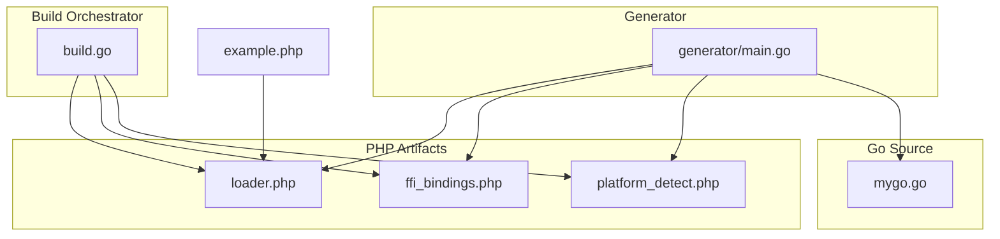
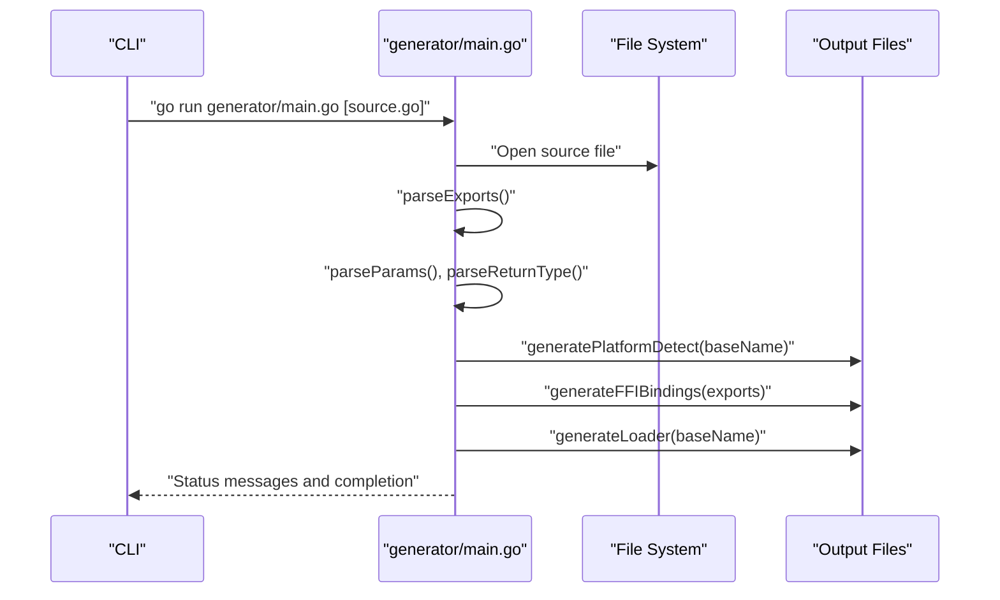
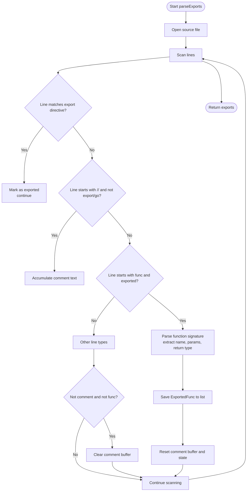
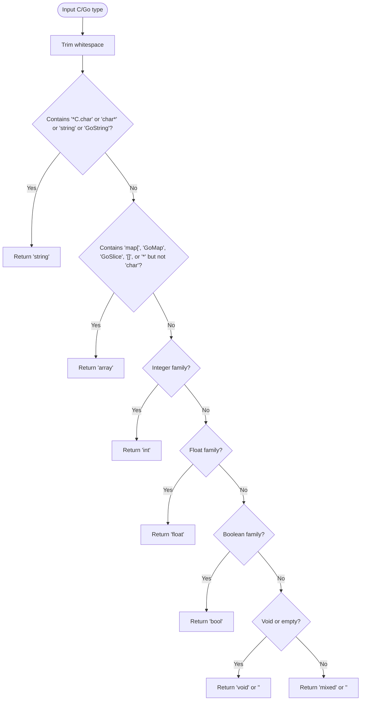
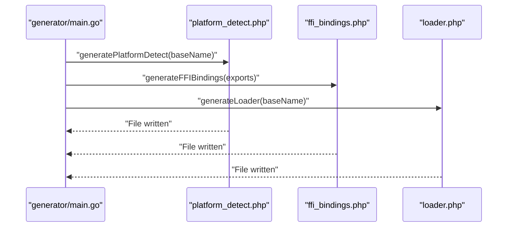
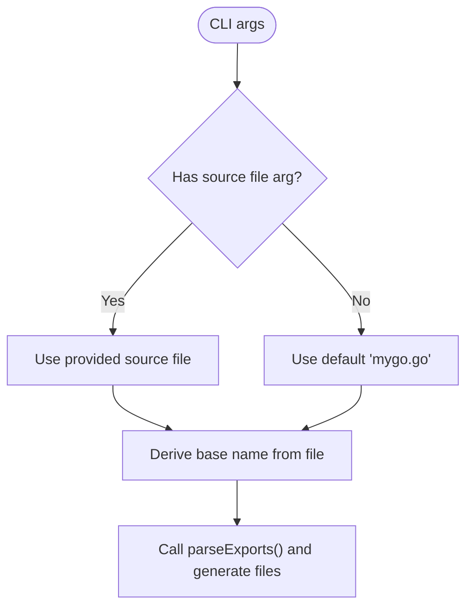
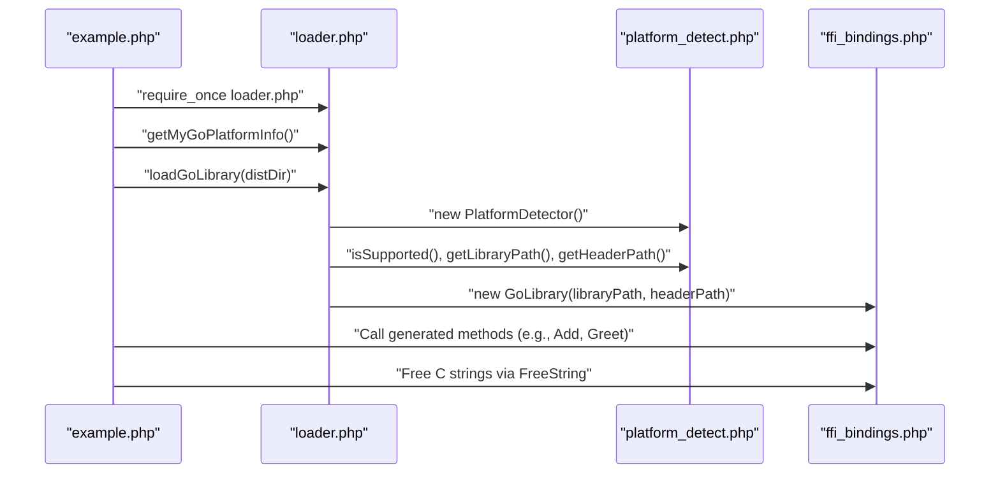
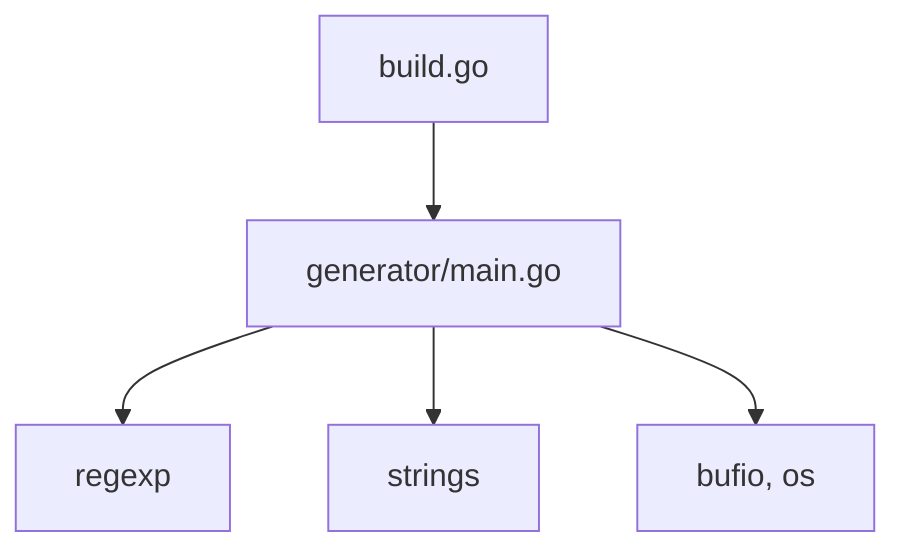

# Code Generator

<cite>
**Referenced Files in This Document**
- [generator/main.go](file://generator/main.go)
- [README.md](file://README.md)
- [mygo.go](file://mygo.go)
- [build.go](file://build.go)
- [example.php](file://example.php)
</cite>

## Table of Contents
1. [Introduction](#introduction)
2. [Project Structure](#project-structure)
3. [Core Components](#core-components)
4. [Architecture Overview](#architecture-overview)
5. [Detailed Component Analysis](#detailed-component-analysis)
6. [Dependency Analysis](#dependency-analysis)
7. [Performance Considerations](#performance-considerations)
8. [Troubleshooting Guide](#troubleshooting-guide)
9. [Conclusion](#conclusion)
10. [Appendices](#appendices)

## Introduction
This document describes the Code Generator component responsible for transforming Go source files annotated with export directives into three PHP files that enable PHP applications to consume Go shared libraries via PHP’s Foreign Function Interface (FFI). The generator:
- Parses Go source files to discover exported functions marked with export directives
- Generates a platform detection module for runtime OS/architecture selection
- Produces FFI bindings that wrap Go functions with PHPDoc type hints and safe method signatures
- Creates a loader module that orchestrates platform detection, library/header discovery, and FFI initialization

The generator also demonstrates how command-line arguments can customize the source file and how the base library name influences generated filenames and loader functions.

## Project Structure
The generator resides under generator/main.go and collaborates with:
- mygo.go: Example Go source containing exported functions
- build.go: Cross-platform build orchestrator that compiles shared libraries and copies generated PHP files into the distribution directory
- example.php: Example PHP application demonstrating usage of the generated loader and bindings

**Diagram sources**
- [generator/main.go](file://generator/main.go#L27-L75)
- [mygo.go](file://mygo.go#L1-L39)
- [build.go](file://build.go#L76-L84)
- [example.php](file://example.php#L1-L20)

**Section sources**
- [README.md](file://README.md#L25-L41)
- [generator/main.go](file://generator/main.go#L27-L75)
- [build.go](file://build.go#L76-L84)

## Core Components
- ExportedFunc and Param data structures capture function metadata extracted from Go source.
- parseExports scans the Go file, recognizes export directives, collects comments, and parses function signatures.
- Type conversion helpers translate Go/C types into PHPDoc-friendly types and documentation types.
- Generation functions produce platform_detect.php, ffi_bindings.php, and loader.php with proper namespaces and method wrappers.
- Command-line argument handling allows specifying the Go source file; the base name determines generated filenames and loader function naming.

Key responsibilities:
- Parsing: Regular expressions identify export directives and function declarations; comments are aggregated until a function is encountered.
- Metadata extraction: Parameters and return types are parsed from function signatures.
- Type mapping: Go/C types are mapped to PHPDoc types for method signatures and PHPDoc types for documentation.
- Code generation: Three PHP files are written with correct namespaces, classes, and methods.

**Section sources**
- [generator/main.go](file://generator/main.go#L12-L26)
- [generator/main.go](file://generator/main.go#L77-L145)
- [generator/main.go](file://generator/main.go#L147-L187)
- [generator/main.go](file://generator/main.go#L481-L555)
- [generator/main.go](file://generator/main.go#L557-L640)
- [generator/main.go](file://generator/main.go#L190-L339)
- [generator/main.go](file://generator/main.go#L341-L418)
- [generator/main.go](file://generator/main.go#L642-L705)

## Architecture Overview
The generator follows a straightforward pipeline:
- Input: A Go source file path (default mygo.go; customizable via CLI)
- Processing: Parse exports, extract function metadata, map types
- Output: Three PHP files in the app\lib namespace

**Diagram sources**
- [generator/main.go](file://generator/main.go#L27-L75)
- [generator/main.go](file://generator/main.go#L77-L145)
- [generator/main.go](file://generator/main.go#L190-L339)
- [generator/main.go](file://generator/main.go#L341-L418)
- [generator/main.go](file://generator/main.go#L642-L705)

## Detailed Component Analysis

### Parsing Logic and Export Discovery
The parser identifies exported functions by scanning lines and applying regular expressions:
- Export directive detection: Lines starting with the export directive prefix are recognized and trigger metadata collection for the subsequent function.
- Comment aggregation: Comments preceding a function (excluding export and go directives) are accumulated and attached to the function metadata.
- Function signature parsing: The function declaration line is matched against a pattern capturing the function name, parameters, and return type.
- Parameter parsing: Parameters are split by commas and whitespace; each parameter is tokenized to extract the parameter name and type.
- Return type normalization: Return types are trimmed and normalized; empty return types become void.

**Diagram sources**
- [generator/main.go](file://generator/main.go#L77-L145)
- [generator/main.go](file://generator/main.go#L147-L187)

**Section sources**
- [generator/main.go](file://generator/main.go#L77-L145)
- [generator/main.go](file://generator/main.go#L147-L187)

### Type Mapping System
The generator maps Go/C types to PHPDoc types for method signatures and documentation types for PHPDoc blocks. The mapping covers:
- Strings: char*, GoString, and pointer-to-char variants map to string
- Arrays/Slices/Maps: Go slice/map types and pointer types (excluding char*) map to array
- Integers: C integer types, Go integer types, and C integer wrappers map to int
- Floats: C float/double and Go float types map to float
- Booleans: bool, GoBool, and _Bool map to bool
- Void: void and empty return types map to void (no type hint)

**Diagram sources**
- [generator/main.go](file://generator/main.go#L481-L555)
- [generator/main.go](file://generator/main.go#L557-L640)

**Section sources**
- [generator/main.go](file://generator/main.go#L481-L555)
- [generator/main.go](file://generator/main.go#L557-L640)

### Code Generation Workflow
The generator produces three PHP files:

1) platform_detect.php
- Defines a PlatformDetector class in the app\lib namespace
- Implements OS/arch detection, extension resolution, and filename/path construction
- Uses the base library name to construct platform-specific filenames

2) ffi_bindings.php
- Defines a GoLibrary class in the app\lib namespace
- Loads the shared library and header via FFI
- Generates wrapper methods for each exported function with PHPDoc and type hints
- Throws exceptions for missing extensions, files, or load errors

3) loader.php
- Requires platform_detect.php and ffi_bindings.php
- Exposes a loadGoLibrary function that orchestrates platform detection, path resolution, and library instantiation
- Exposes a get<Library>PlatformInfo function returning platform details

**Diagram sources**
- [generator/main.go](file://generator/main.go#L190-L339)
- [generator/main.go](file://generator/main.go#L341-L418)
- [generator/main.go](file://generator/main.go#L642-L705)

**Section sources**
- [generator/main.go](file://generator/main.go#L190-L339)
- [generator/main.go](file://generator/main.go#L341-L418)
- [generator/main.go](file://generator/main.go#L642-L705)

### Command-Line Arguments and Base Name Handling
- Source file argument: The generator accepts a single command-line argument specifying the Go source file; defaults to mygo.go if omitted.
- Base name derivation: The base name is derived from the source file path by removing the .go extension; it is used to construct platform-specific filenames and loader function names.
- Build integration: The example Go file includes a go:generate directive pointing to the generator, enabling automated generation during development.

**Diagram sources**
- [generator/main.go](file://generator/main.go#L27-L41)
- [mygo.go](file://mygo.go#L11-L11)

**Section sources**
- [generator/main.go](file://generator/main.go#L27-L41)
- [mygo.go](file://mygo.go#L11-L11)

### Example Usage in PHP
The example PHP application demonstrates:
- Loading the generated loader
- Retrieving platform information
- Loading the Go library for the current platform
- Calling generated wrapper methods
- Handling returned C strings and freeing memory

**Diagram sources**
- [example.php](file://example.php#L1-L20)
- [example.php](file://example.php#L21-L95)
- [generator/main.go](file://generator/main.go#L642-L705)
- [generator/main.go](file://generator/main.go#L190-L339)
- [generator/main.go](file://generator/main.go#L341-L418)

**Section sources**
- [example.php](file://example.php#L1-L20)
- [example.php](file://example.php#L21-L95)
- [generator/main.go](file://generator/main.go#L642-L705)

## Dependency Analysis
The generator depends on standard Go packages for file I/O, regular expressions, and string manipulation. It writes three PHP files to the current working directory. The build orchestrator copies these files into the distribution directory after building shared libraries.

**Diagram sources**
- [generator/main.go](file://generator/main.go#L1-L10)
- [build.go](file://build.go#L76-L84)

**Section sources**
- [generator/main.go](file://generator/main.go#L1-L10)
- [build.go](file://build.go#L76-L84)

## Performance Considerations
- Parsing complexity: The parser performs a single pass over the source file with constant-time regex checks per line; overall linear in the number of lines.
- Type mapping: Lookup operations are simple string comparisons and substring checks; negligible overhead.
- File I/O: Writing three small PHP files is fast; ensure the working directory is writable.
- Practical tips: Keep the Go source concise and well-commented to minimize parsing ambiguity; avoid excessive comments that could increase memory usage during comment accumulation.

[No sources needed since this section provides general guidance]

## Troubleshooting Guide
Common issues and resolutions:
- Unsupported OS or architecture: The platform detector throws an exception when the current platform is not supported; ensure the build orchestrator has produced libraries for the detected platform.
- FFI extension disabled: The FFI bindings constructor checks for the FFI extension and throws an exception if missing; enable the extension in php.ini.
- Library or header not found: The loader validates existence of library and header files; verify the distribution directory contains the correct platform-specific files.
- Cross-compilation toolchain missing: The build orchestrator reports failures when cross-compilation toolchains are unavailable; install the required compilers or build for the current platform only.
- Export directive placement: Ensure export directives immediately precede function declarations; comments are collected until the next function.

**Section sources**
- [generator/main.go](file://generator/main.go#L341-L418)
- [generator/main.go](file://generator/main.go#L642-L705)
- [build.go](file://build.go#L107-L164)

## Conclusion
The Code Generator provides a robust, automated mechanism to bridge Go shared libraries and PHP applications using FFI. By parsing export directives, mapping types, and generating platform-aware PHP bindings, it simplifies cross-platform deployment and usage. The included loader and platform detection modules streamline runtime integration, while the build orchestrator ensures consistent distribution packaging.

[No sources needed since this section summarizes without analyzing specific files]

## Appendices

### How to Add a New Exported Function
- Add the function to the Go source with an export directive and a descriptive comment block
- Regenerate bindings and rebuild libraries
- Use the generated loader to load the library and call the new method

**Section sources**
- [README.md](file://README.md#L155-L194)
- [mygo.go](file://mygo.go#L13-L35)

### Example Go Exported Functions
- Example functions include arithmetic operations, string handling, and container operations
- These demonstrate how the generator maps Go types to PHPDoc types and generates wrappers

**Section sources**
- [mygo.go](file://mygo.go#L13-L35)