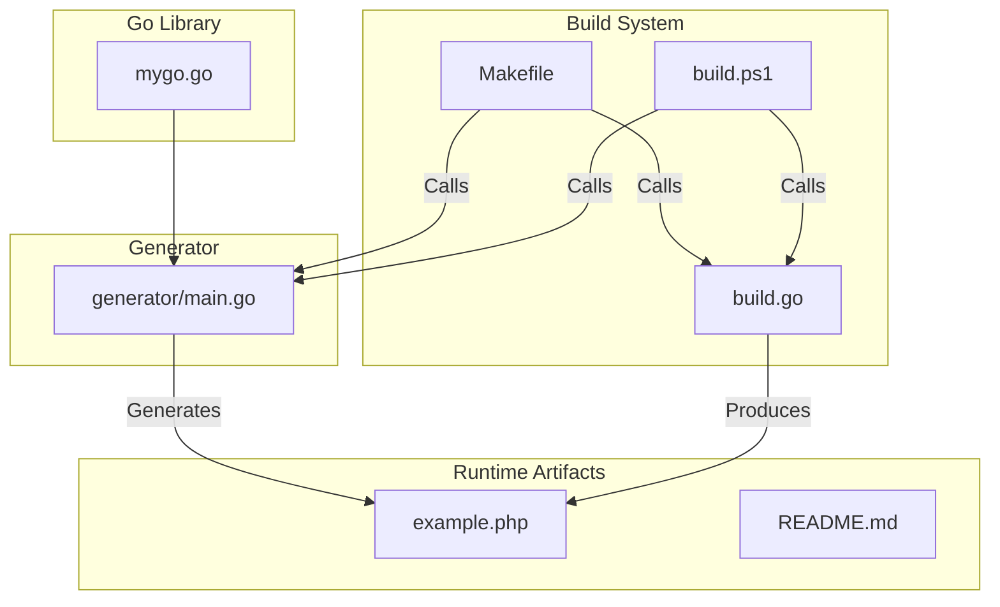
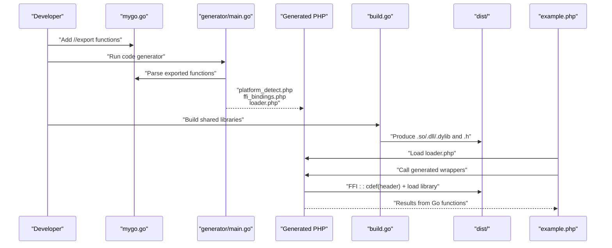
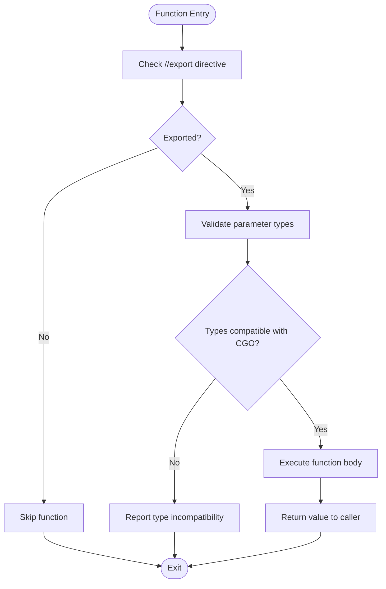
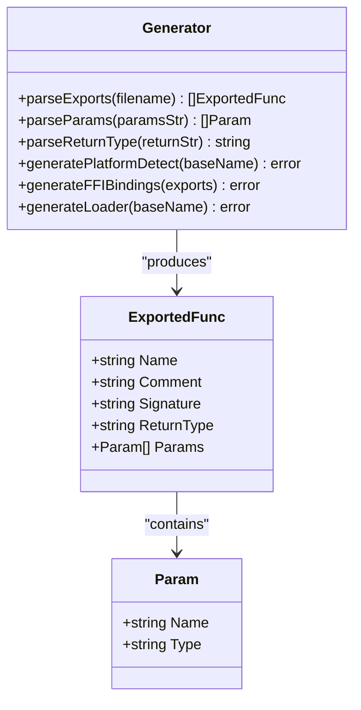
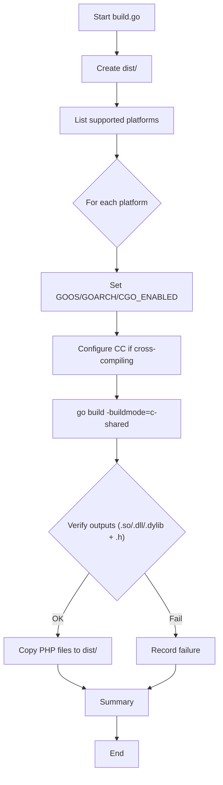
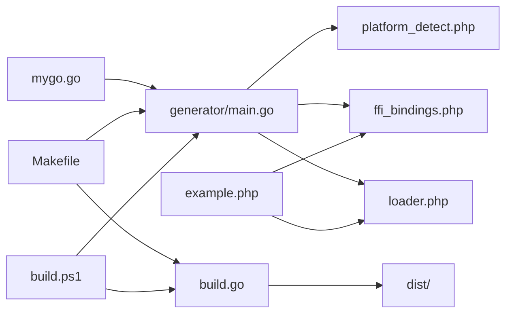

# Go Library

<cite>
**Referenced Files in This Document**
- [mygo.go](file://mygo.go)
- [generator/main.go](file://generator/main.go)
- [build.go](file://build.go)
- [Makefile](file://Makefile)
- [build.ps1](file://build.ps1)
- [example.php](file://example.php)
- [README.md](file://README.md)
- [go.mod](file://go.mod)
</cite>

## Table of Contents
1. [Introduction](#introduction)
2. [Project Structure](#project-structure)
3. [Core Components](#core-components)
4. [Architecture Overview](#architecture-overview)
5. [Detailed Component Analysis](#detailed-component-analysis)
6. [Dependency Analysis](#dependency-analysis)
7. [Performance Considerations](#performance-considerations)
8. [Troubleshooting Guide](#troubleshooting-guide)
9. [Conclusion](#conclusion)
10. [Appendices](#appendices)

## Introduction
This document explains the Go Library component that serves as the source of exported functions accessible from PHP via FFI. It covers the requirements for building a Go shared library, the export mechanism, CGO conventions, and the code generation pipeline that produces PHP FFI bindings. It also documents the current exported functions and how changes propagate automatically to PHP through the generator.

## Project Structure
The repository organizes the Go library, a code generator, build orchestration, and example usage:

- mygo.go: Defines the exported functions and the minimal CGO setup required for a shared library.
- generator/main.go: Parses exported functions and generates PHP platform detection, FFI bindings, and loader files.
- build.go: Orchestrates cross-platform builds and copies generated PHP files to dist/.
- Makefile and build.ps1: Convenience targets for generating bindings, building, testing, and cleaning.
- example.php: Demonstrates loading the library and invoking exported functions from PHP.
- README.md: High-level documentation, prerequisites, and usage guidance.
- go.mod: Module definition and Go version.

**Diagram sources**
- [mygo.go](file://mygo.go#L1-L39)
- [generator/main.go](file://generator/main.go#L1-L705)
- [build.go](file://build.go#L1-L183)
- [Makefile](file://Makefile#L1-L54)
- [build.ps1](file://build.ps1#L1-L152)
- [example.php](file://example.php#L1-L95)

**Section sources**
- [mygo.go](file://mygo.go#L1-L39)
- [generator/main.go](file://generator/main.go#L1-L705)
- [build.go](file://build.go#L1-L183)
- [Makefile](file://Makefile#L1-L54)
- [build.ps1](file://build.ps1#L1-L152)
- [README.md](file://README.md#L1-L384)

## Core Components
- Go Library (mygo.go): Declares exported functions with //export directives, includes CGO stub for stdlib headers, and defines an empty main() required by shared library builds.
- Code Generator (generator/main.go): Scans mygo.go for exported functions, parses comments/signatures, and generates platform_detect.php, ffi_bindings.php, and loader.php.
- Build Orchestrator (build.go): Builds c-shared libraries for multiple platforms, generates headers, and copies PHP files to dist/.
- Build Scripts (Makefile, build.ps1): Provide convenient targets for development and CI.
- Example (example.php): Demonstrates loading the library and calling exported functions.

Key exported functions in mygo.go:
- Add(a int, b int) int
- Echo(s string) string
- PrintArray(arr []int) void
- ShowArray() map[string]any

These functions illustrate handling of primitive types, strings, slices, and maps across the Go/C boundary.

**Section sources**
- [mygo.go](file://mygo.go#L1-L39)
- [generator/main.go](file://generator/main.go#L1-L705)
- [build.go](file://build.go#L1-L183)
- [Makefile](file://Makefile#L1-L54)
- [build.ps1](file://build.ps1#L1-L152)
- [example.php](file://example.php#L1-L95)

## Architecture Overview
The system bridges Go and PHP via a shared library and PHP FFI. The generator inspects exported functions and produces PHP wrappers that call into the Go library using FFI. The build system compiles c-shared libraries per platform and produces corresponding headers.

**Diagram sources**
- [mygo.go](file://mygo.go#L1-L39)
- [generator/main.go](file://generator/main.go#L1-L705)
- [build.go](file://build.go#L1-L183)
- [example.php](file://example.php#L1-L95)

## Detailed Component Analysis

### Go Library (mygo.go)
Responsibilities:
- Provide exported functions for FFI consumption.
- Include CGO stub to satisfy shared library requirements.
- Define an empty main() required by -buildmode=c-shared.

Exported functions and signatures:
- Add(a int, b int) int
- Echo(s string) string
- PrintArray(arr []int) void
- ShowArray() map[string]any

CGO and export patterns:
- Imports "C" and includes a minimal C header block for stdlib.
- Uses //export directives before each function to expose it to C/FFI.
- Declares an empty main() to satisfy the shared library entry point requirement.

**Diagram sources**
- [mygo.go](file://mygo.go#L1-L39)

**Section sources**
- [mygo.go](file://mygo.go#L1-L39)

### Code Generator (generator/main.go)
Responsibilities:
- Parse mygo.go for exported functions and associated comments.
- Generate platform detection logic for PHP.
- Generate FFI bindings that wrap Go functions.
- Generate a loader that orchestrates platform detection and library loading.

Key behaviors:
- Scans for //export lines and captures preceding comments.
- Parses function signatures to extract parameter names/types and return types.
- Converts types to PHPDoc hints and type hints for generated wrappers.
- Emits platform_detect.php, ffi_bindings.php, and loader.php.

**Diagram sources**
- [generator/main.go](file://generator/main.go#L1-L705)

**Section sources**
- [generator/main.go](file://generator/main.go#L1-L705)

### Build Orchestrator (build.go)
Responsibilities:
- Define supported platforms and their extensions.
- Build c-shared libraries for each platform using go build -buildmode=c-shared.
- Generate headers alongside libraries.
- Copy generated PHP files to dist/.

Cross-compilation:
- Sets GOOS, GOARCH, and CGO_ENABLED for each target.
- Configures CC for cross-compilers when needed.

**Diagram sources**
- [build.go](file://build.go#L1-L183)

**Section sources**
- [build.go](file://build.go#L1-L183)

### Build Scripts (Makefile, build.ps1)
Responsibilities:
- Provide convenience targets for generating bindings, building, testing, and cleaning.
- Delegate to generator and build orchestrator.

Example targets:
- generate: runs go generate ./...
- build: runs go run build.go
- build-current: builds for the current platform only
- test: builds current and runs example.php
- clean: removes generated artifacts

**Section sources**
- [Makefile](file://Makefile#L1-L54)
- [build.ps1](file://build.ps1#L1-L152)

### Example (example.php)
Responsibilities:
- Demonstrate platform detection and library loading.
- Show how to call generated wrappers for exported functions.
- Illustrate string handling and memory management considerations.

Highlights:
- Loads loader.php and calls platform detection helpers.
- Instantiates the FFI wrapper and invokes exported functions.
- Shows how to convert C strings to PHP strings and free them.

**Section sources**
- [example.php](file://example.php#L1-L95)

## Dependency Analysis
Relationships among components:

**Diagram sources**
- [mygo.go](file://mygo.go#L1-L39)
- [generator/main.go](file://generator/main.go#L1-L705)
- [build.go](file://build.go#L1-L183)
- [Makefile](file://Makefile#L1-L54)
- [build.ps1](file://build.ps1#L1-L152)
- [example.php](file://example.php#L1-L95)

**Section sources**
- [mygo.go](file://mygo.go#L1-L39)
- [generator/main.go](file://generator/main.go#L1-L705)
- [build.go](file://build.go#L1-L183)
- [Makefile](file://Makefile#L1-L54)
- [build.ps1](file://build.ps1#L1-L152)
- [example.php](file://example.php#L1-L95)

## Performance Considerations
- Library loading occurs once per process; using persistent processes (e.g., PHP-FPM) reduces overhead.
- FFI overhead is low compared to native C extensions.
- String conversions between Go and C incur overhead; batch operations when possible.
- Properly manage memory for strings allocated by Go to avoid leaks.

[No sources needed since this section provides general guidance]

## Troubleshooting Guide
Common issues and resolutions:
- PHP FFI not enabled: Ensure the FFI extension is enabled in php.ini.
- Library not found: Confirm the dist/ directory contains the correct platform-specific shared library and header.
- Platform not supported: Build for your platform or extend supported platforms.
- CGO disabled: Enable CGO and ensure a C compiler is available.
- DLL loading errors on Windows: Match PHP architecture with the compiled library and install required runtime dependencies.

**Section sources**
- [README.md](file://README.md#L238-L309)

## Conclusion
The Go Library component provides a minimal yet robust foundation for exposing Go functions to PHP via FFI. The generator and build system automate the creation of platform-specific shared libraries and PHP bindings, enabling seamless integration across platforms. By adhering to the export and CGO conventions shown here, developers can extend the library with new functions and rely on the generation pipeline to propagate changes to PHP automatically.

[No sources needed since this section summarizes without analyzing specific files]

## Appendices

### Requirements for a Go Shared Library
- Import "C" and include a minimal C header block to satisfy CGO requirements for shared libraries.
- Use //export directives before functions intended for FFI consumption.
- Provide an empty main() function; it is required by the shared library build process.
- Keep exported function signatures compatible with CGO/FFI constraints.

**Section sources**
- [mygo.go](file://mygo.go#L1-L39)

### How CGO Enables the Bridge Between Go and C Calling Conventions
- CGO allows Go code to interoperate with C, enabling the creation of a C-compatible ABI for exported functions.
- The //export directive exposes Go functions with C linkage, allowing PHP FFI to call them directly.
- The generator translates Go signatures into PHPDoc and type hints, simplifying usage while preserving type safety expectations.

**Section sources**
- [generator/main.go](file://generator/main.go#L1-L705)
- [mygo.go](file://mygo.go#L1-L39)

### //go:generate Directive and Its Role
- The //go:generate directive in mygo.go triggers the code generator to produce PHP files.
- Running go generate ./... scans mygo.go for exported functions and generates platform_detect.php, ffi_bindings.php, and loader.php.
- Changes to exported functions in mygo.go propagate to PHP automatically upon regeneration.

**Section sources**
- [mygo.go](file://mygo.go#L1-L12)
- [generator/main.go](file://generator/main.go#L1-L75)

### Example Paths to Referenced Patterns
- CGO include and main(): [mygo.go](file://mygo.go#L1-L12)
- Exported function patterns: [mygo.go](file://mygo.go#L13-L39)
- Code generation invocation: [mygo.go](file://mygo.go#L11-L12)
- Generated PHP files: [generator/main.go](file://generator/main.go#L61-L75)
- Cross-platform build orchestration: [build.go](file://build.go#L107-L164)
- Example usage in PHP: [example.php](file://example.php#L1-L95)