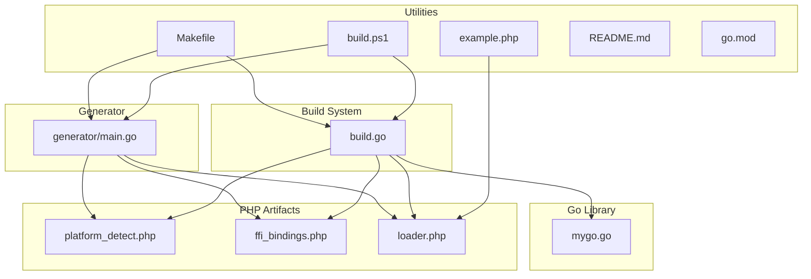
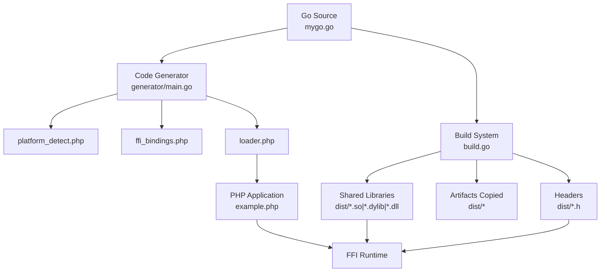
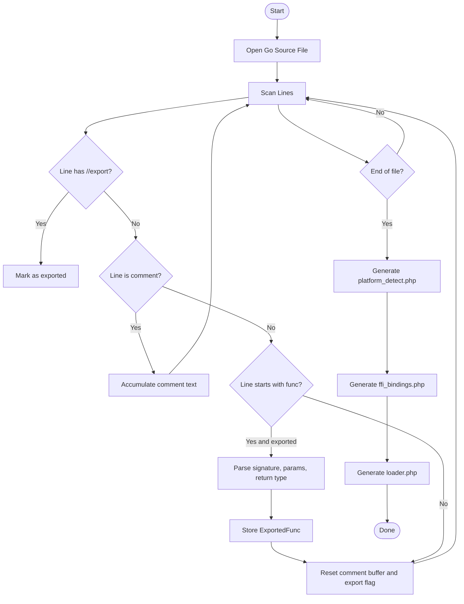
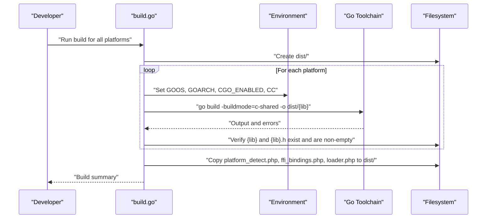
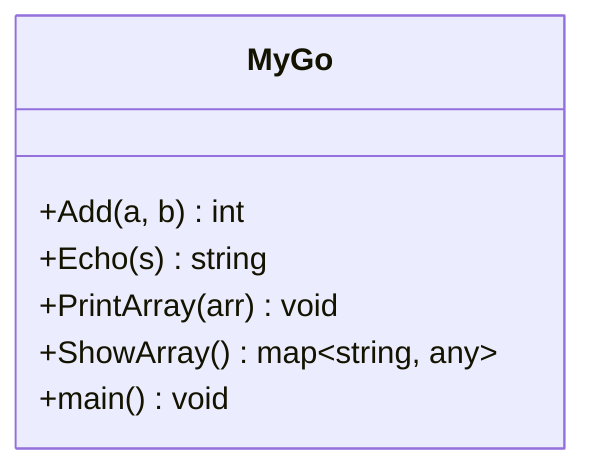
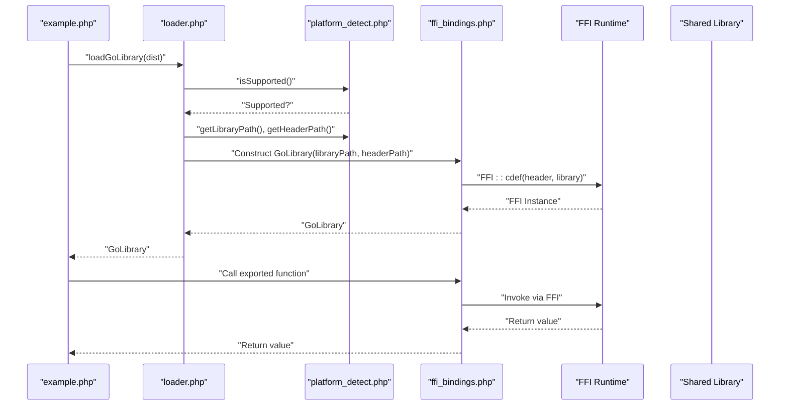
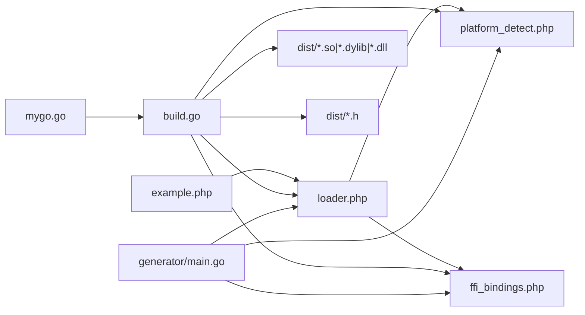
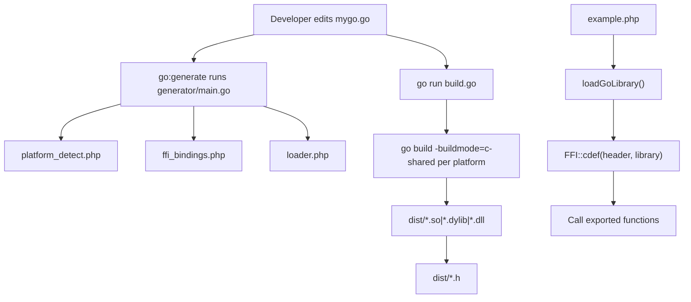

# System Components

<cite>
**Referenced Files in This Document**
- [generator/main.go](file://generator/main.go)
- [build.go](file://build.go)
- [mygo.go](file://mygo.go)
- [README.md](file://README.md)
- [example.php](file://example.php)
- [Makefile](file://Makefile)
- [build.ps1](file://build.ps1)
- [go.mod](file://go.mod)
</cite>

## Table of Contents
1. [Introduction](#introduction)
2. [Project Structure](#project-structure)
3. [Core Components](#core-components)
4. [Architecture Overview](#architecture-overview)
5. [Detailed Component Analysis](#detailed-component-analysis)
6. [Dependency Analysis](#dependency-analysis)
7. [Performance Considerations](#performance-considerations)
8. [Troubleshooting Guide](#troubleshooting-guide)
9. [Conclusion](#conclusion)
10. [Appendices](#appendices)

## Introduction
This document describes the serviceLib system architecture with a focus on three main components:
- Code Generator: Parses Go source files to extract exported functions and generates three PHP files under the app\lib namespace.
- Build System: Orchestrates cross-platform compilation by setting GOOS/GOARCH and invoking go build with -buildmode=c-shared.
- Go Library: Defines exported functions using //export directives and serves as the source for the generated bindings.

It explains how the pipeline integrates these components to produce shared libraries consumable by PHP via FFI, and how the generated PHP loader and bindings enable seamless integration.

## Project Structure
The repository organizes the system around a small set of focused files:
- generator/main.go: Code generator that scans Go source for exported functions and produces PHP files.
- build.go: Cross-platform build orchestrator that compiles shared libraries and copies PHP artifacts.
- mygo.go: Example Go library containing exported functions annotated with //export.
- example.php: PHP example demonstrating usage of the generated loader and bindings.
- Makefile and build.ps1: Convenience scripts for generating bindings, building, testing, and cleaning.
- README.md: High-level documentation and usage instructions.
- go.mod: Module definition and Go version.

**Diagram sources**
- [generator/main.go](file://generator/main.go#L1-L705)
- [build.go](file://build.go#L1-L183)
- [mygo.go](file://mygo.go#L1-L39)
- [example.php](file://example.php#L1-L95)
- [Makefile](file://Makefile#L1-L54)
- [build.ps1](file://build.ps1#L1-L152)
- [README.md](file://README.md#L1-L384)
- [go.mod](file://go.mod#L1-L4)

**Section sources**
- [README.md](file://README.md#L25-L41)
- [go.mod](file://go.mod#L1-L4)

## Core Components
- Code Generator (generator/main.go)
  - Scans Go source for exported functions marked with //export.
  - Generates three PHP files under the app\lib namespace:
    - platform_detect.php: Platform detection and filename helpers.
    - ffi_bindings.php: FFI wrapper class with typed wrappers for each exported function.
    - loader.php: Loader that detects platform, validates support, and constructs the FFI wrapper.
  - Uses Go’s scanner and regex to parse function signatures and comments.

- Build System (build.go)
  - Defines supported platforms and generates output/header filenames.
  - Invokes go build -buildmode=c-shared for each platform.
  - Sets GOOS, GOARCH, and CGO_ENABLED environment variables.
  - Applies platform-specific C compiler variables for cross-compilation.
  - Copies generated PHP files into the dist directory upon completion.

- Go Library (mygo.go)
  - Contains example exported functions annotated with //export.
  - Includes a minimal main() required for shared library builds.
  - Integrates with go:generate to trigger code generation automatically.

**Section sources**
- [generator/main.go](file://generator/main.go#L27-L75)
- [generator/main.go](file://generator/main.go#L190-L339)
- [generator/main.go](file://generator/main.go#L341-L418)
- [generator/main.go](file://generator/main.go#L642-L705)
- [build.go](file://build.go#L12-L29)
- [build.go](file://build.go#L107-L164)
- [mygo.go](file://mygo.go#L11-L11)
- [mygo.go](file://mygo.go#L13-L38)

## Architecture Overview
The system follows a pipeline:
- Go source → Code Generator → PHP bindings and loader
- Go source + build configuration → Go compiler → shared libraries (.so/.dylib/.dll)
- Shared libraries + PHP bindings → PHP application integration via FFI

**Diagram sources**
- [generator/main.go](file://generator/main.go#L27-L75)
- [generator/main.go](file://generator/main.go#L190-L339)
- [generator/main.go](file://generator/main.go#L341-L418)
- [generator/main.go](file://generator/main.go#L642-L705)
- [build.go](file://build.go#L41-L105)
- [build.go](file://build.go#L107-L164)
- [example.php](file://example.php#L1-L95)

## Detailed Component Analysis

### Code Generator (generator/main.go)
Responsibilities:
- Parse exported functions from Go source:
  - Detects //export directives and collects subsequent func declarations.
  - Extracts function signatures, parameter types, and return types.
  - Captures preceding comments to include in PHPDoc.
- Generate platform_detect.php:
  - Implements a PlatformDetector class with methods to detect OS, architecture, and derive filenames.
  - Provides isSupported(), getLibraryFilename(), getHeaderFilename(), and getPlatformInfo().
- Generate ffi_bindings.php:
  - Creates a GoLibrary class that loads the shared library via FFI using the provided header.
  - Generates wrapper methods for each exported function with PHPDoc and type hints.
- Generate loader.php:
  - Requires platform_detect.php and ffi_bindings.php.
  - Exposes loadGoLibrary() and getMyGoPlatformInfo() functions.
  - Validates platform support and constructs the FFI wrapper.

Key processing logic:
- parseExports: Scans source file, tracks //export markers, and captures function metadata.
- parseParams and parseReturnType: Parse parameter lists and return types.
- Type conversion helpers: cTypeToPHPType and cTypeToPHPDoc translate C/Go types to PHPDoc and type hints.

**Diagram sources**
- [generator/main.go](file://generator/main.go#L77-L145)
- [generator/main.go](file://generator/main.go#L147-L187)
- [generator/main.go](file://generator/main.go#L190-L339)
- [generator/main.go](file://generator/main.go#L341-L418)
- [generator/main.go](file://generator/main.go#L642-L705)

**Section sources**
- [generator/main.go](file://generator/main.go#L27-L75)
- [generator/main.go](file://generator/main.go#L77-L145)
- [generator/main.go](file://generator/main.go#L190-L339)
- [generator/main.go](file://generator/main.go#L341-L418)
- [generator/main.go](file://generator/main.go#L642-L705)

### Build System (build.go)
Responsibilities:
- Define supported platforms and compute output/header filenames.
- For each platform:
  - Set GOOS, GOARCH, CGO_ENABLED, and CC (when cross-compiling).
  - Execute go build -buildmode=c-shared with -o pointing to dist/.
  - Validate that both the shared library and header were produced and are non-empty.
- Copy generated PHP files (platform_detect.php, ffi_bindings.php, loader.php) into dist/.

Cross-compilation specifics:
- Uses CC environment variables for Linux-to-Windows and Linux-to-Arm64 scenarios.
- Ensures CGO_ENABLED=1 for cross-compilation builds.

**Diagram sources**
- [build.go](file://build.go#L41-L105)
- [build.go](file://build.go#L107-L164)

**Section sources**
- [build.go](file://build.go#L12-L29)
- [build.go](file://build.go#L107-L164)

### Go Library (mygo.go)
Responsibilities:
- Declares exported functions using //export.
- Provides a minimal main() required for shared library builds.
- Integrates with go:generate to automatically run the code generator.

Example exported functions:
- Add, Echo, PrintArray, ShowArray demonstrate integer, string, slice, and map handling.

**Diagram sources**
- [mygo.go](file://mygo.go#L13-L38)

**Section sources**
- [mygo.go](file://mygo.go#L11-L11)
- [mygo.go](file://mygo.go#L13-L38)

### PHP Integration (example.php)
Responsibilities:
- Demonstrates loading the library via loader.php and calling exported functions.
- Shows platform detection and FFI string handling, including freeing Go-allocated strings.

**Diagram sources**
- [example.php](file://example.php#L1-L95)
- [generator/main.go](file://generator/main.go#L341-L418)
- [generator/main.go](file://generator/main.go#L642-L705)

**Section sources**
- [example.php](file://example.php#L1-L95)

## Dependency Analysis
- generator/main.go depends on:
  - Standard library packages for file I/O, scanning, regex, and string manipulation.
  - It writes three PHP files to the repository root.
- build.go depends on:
  - Standard library packages for environment manipulation, process execution, filesystem operations.
  - It invokes the Go toolchain and writes artifacts to dist/.
- mygo.go depends on:
  - CGO for C interop and //export directives.
  - Integrates with go:generate to trigger generator/main.go.
- example.php depends on:
  - loader.php, which in turn depends on platform_detect.php and ffi_bindings.php.

**Diagram sources**
- [generator/main.go](file://generator/main.go#L190-L339)
- [generator/main.go](file://generator/main.go#L341-L418)
- [generator/main.go](file://generator/main.go#L642-L705)
- [build.go](file://build.go#L41-L105)
- [example.php](file://example.php#L1-L95)

**Section sources**
- [generator/main.go](file://generator/main.go#L1-L705)
- [build.go](file://build.go#L1-L183)
- [mygo.go](file://mygo.go#L1-L39)
- [example.php](file://example.php#L1-L95)

## Performance Considerations
- Library loading occurs once per PHP process; using persistent processes (PHP-FPM) reduces repeated overhead.
- FFI overhead is minimal compared to native C extensions.
- String conversions between PHP and C incur overhead; batch operations where possible.
- Always free Go-allocated strings to prevent memory leaks.

[No sources needed since this section provides general guidance]

## Troubleshooting Guide
Common issues and resolutions:
- PHP FFI not enabled:
  - Ensure the FFI extension is enabled in php.ini and restart the web server or PHP-FPM.
- Library not found:
  - Confirm that go generate was executed and that dist contains the appropriate shared library for the current platform.
- Platform not supported:
  - Build the library for your platform or extend build.go to include additional platforms.
- CGO not enabled:
  - Ensure CGO_ENABLED=1 and a C compiler is installed for your platform.
- DLL loading errors on Windows:
  - Verify architecture alignment (64-bit PHP with 64-bit DLL) and install required runtime libraries if needed.

**Section sources**
- [README.md](file://README.md#L239-L309)

## Conclusion
The serviceLib system cleanly separates concerns across three components:
- The code generator extracts exported functions and produces PHP bindings and loaders.
- The build system handles cross-platform compilation and artifact packaging.
- The Go library defines the exported functions and integrates with go:generate.

Together, they form a robust pipeline enabling PHP applications to consume Go shared libraries via FFI with minimal configuration.

[No sources needed since this section summarizes without analyzing specific files]

## Appendices

### Pipeline Architecture Flow

**Diagram sources**
- [mygo.go](file://mygo.go#L11-L11)
- [generator/main.go](file://generator/main.go#L27-L75)
- [build.go](file://build.go#L41-L105)
- [example.php](file://example.php#L1-L95)

### Component Responsibilities Summary
- generator/main.go
  - Parse exported functions and comments.
  - Generate platform_detect.php, ffi_bindings.php, loader.php.
- build.go
  - Manage cross-platform builds and environment variables.
  - Validate outputs and copy PHP artifacts.
- mygo.go
  - Provide exported functions with //export.
  - Integrate with go:generate.

**Section sources**
- [generator/main.go](file://generator/main.go#L27-L75)
- [generator/main.go](file://generator/main.go#L190-L339)
- [generator/main.go](file://generator/main.go#L341-L418)
- [generator/main.go](file://generator/main.go#L642-L705)
- [build.go](file://build.go#L12-L29)
- [build.go](file://build.go#L107-L164)
- [mygo.go](file://mygo.go#L11-L11)
- [mygo.go](file://mygo.go#L13-L38)