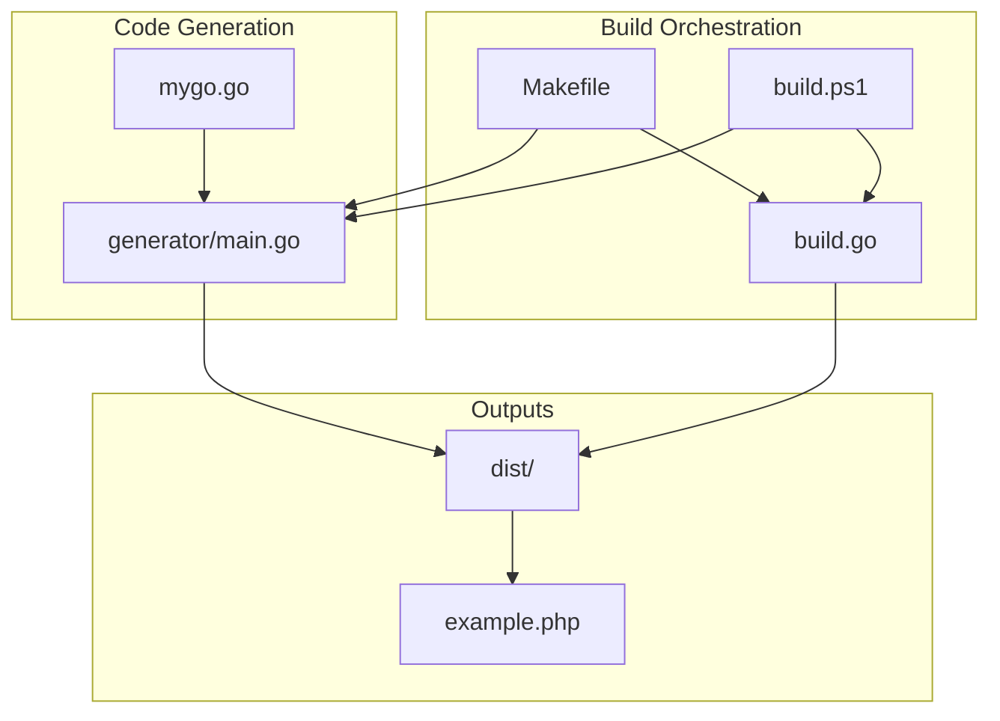
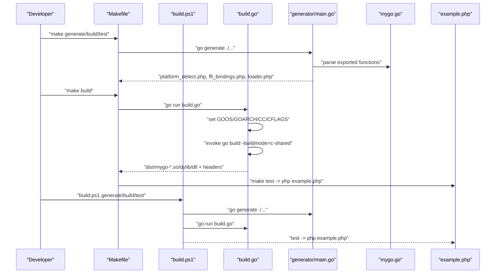
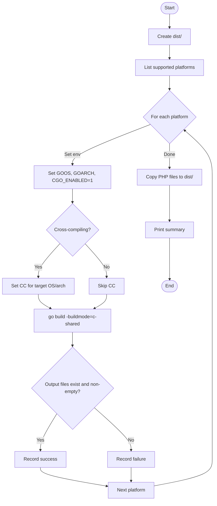
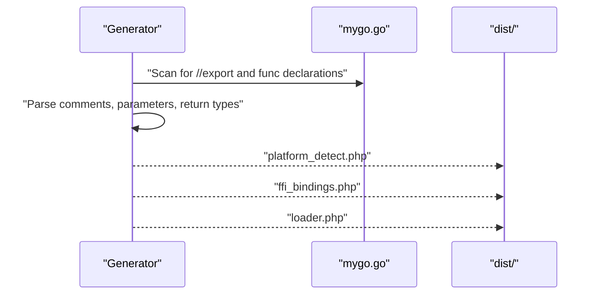
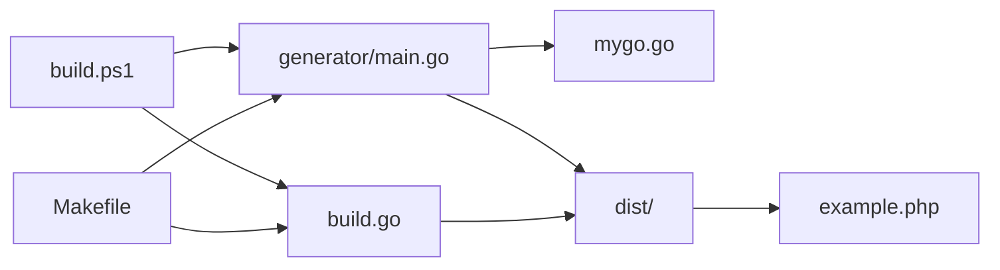

# Build Automation

<cite>
**Referenced Files in This Document**
- [Makefile](file://Makefile)
- [build.ps1](file://build.ps1)
- [build.go](file://build.go)
- [generator/main.go](file://generator/main.go)
- [mygo.go](file://mygo.go)
- [example.php](file://example.php)
- [go.mod](file://go.mod)
- [README.md](file://README.md)
</cite>

## Table of Contents
1. [Introduction](#introduction)
2. [Project Structure](#project-structure)
3. [Core Components](#core-components)
4. [Architecture Overview](#architecture-overview)
5. [Detailed Component Analysis](#detailed-component-analysis)
6. [Dependency Analysis](#dependency-analysis)
7. [Performance Considerations](#performance-considerations)
8. [Troubleshooting Guide](#troubleshooting-guide)
9. [Conclusion](#conclusion)
10. [Appendices](#appendices)

## Introduction
This document explains the build automation system for generating cross-platform shared libraries from Go and consuming them in PHP via FFI. It covers how the Makefile orchestrates builds on Unix-like systems, how build.ps1 provides equivalent functionality on Windows, and how build.go acts as the central orchestrator for cross-compilation. It also documents available build targets, execution flows, environment variables (GOOS, GOARCH), and integration with go generate. Finally, it provides troubleshooting guidance for common build failures.

## Project Structure
The build system centers around a small set of files:
- A generator that produces PHP FFI binding files from exported Go functions
- A Go program that performs cross-compilation for multiple platforms
- A Makefile for Unix-like systems
- A PowerShell script for Windows
- A minimal example PHP application demonstrating usage

**Diagram sources**
- [Makefile](file://Makefile#L1-L54)
- [build.ps1](file://build.ps1#L1-L152)
- [build.go](file://build.go#L1-L183)
- [generator/main.go](file://generator/main.go#L1-L705)
- [mygo.go](file://mygo.go#L1-L39)
- [example.php](file://example.php#L1-L95)

**Section sources**
- [Makefile](file://Makefile#L1-L54)
- [build.ps1](file://build.ps1#L1-L152)
- [build.go](file://build.go#L1-L183)
- [generator/main.go](file://generator/main.go#L1-L705)
- [mygo.go](file://mygo.go#L1-L39)
- [example.php](file://example.php#L1-L95)

## Core Components
- Makefile: Defines targets for generating bindings, building for all platforms, building for the current platform, running tests, cleaning artifacts, and printing help.
- build.ps1: Equivalent Windows PowerShell script that mirrors the Makefile targets and logic.
- build.go: Central orchestrator for cross-compilation. It defines supported platforms, sets environment variables for cross-compilation, invokes go build with c-shared mode, validates outputs, and copies generated PHP files to dist/.
- generator/main.go: Parses exported functions from mygo.go and generates platform_detect.php, ffi_bindings.php, and loader.php.
- mygo.go: Contains exported functions marked with //export and a go:generate directive to run the generator.
- example.php: Demonstrates loading and using the generated library via FFI.
- go.mod: Declares module and Go version.

Key roles:
- Makefile and build.ps1 provide a unified developer experience across platforms.
- build.go encapsulates cross-compilation logic and platform-specific environment configuration.
- generator/main.go integrates tightly with go generate to keep PHP bindings synchronized with exported Go functions.

**Section sources**
- [Makefile](file://Makefile#L1-L54)
- [build.ps1](file://build.ps1#L1-L152)
- [build.go](file://build.go#L1-L183)
- [generator/main.go](file://generator/main.go#L1-L705)
- [mygo.go](file://mygo.go#L1-L39)
- [example.php](file://example.php#L1-L95)
- [go.mod](file://go.mod#L1-L4)

## Architecture Overview
The build pipeline consists of three stages:
1. Code generation: go generate triggers generator/main.go to produce PHP files.
2. Compilation: build.go orchestrates cross-compilation for supported platforms; Makefile and build.ps1 delegate to build.go or invoke go build directly for the current platform.
3. Packaging and testing: build.go copies generated PHP files to dist/ and prints a summary; example.php exercises the resulting library.

**Diagram sources**
- [Makefile](file://Makefile#L1-L54)
- [build.ps1](file://build.ps1#L1-L152)
- [build.go](file://build.go#L1-L183)
- [generator/main.go](file://generator/main.go#L1-L705)
- [mygo.go](file://mygo.go#L1-L39)
- [example.php](file://example.php#L1-L95)

## Detailed Component Analysis

### Makefile Targets and Execution Flow
- all: Generates bindings and builds for all platforms.
- generate: Runs go generate to produce PHP files.
- build: Generates bindings, then runs build.go to compile for all supported platforms.
- build-current: Generates bindings and compiles a c-shared library for the current OS/arch, placing outputs in dist/ and copying PHP files.
- test: Builds current platform and runs example.php.
- clean: Removes dist/ and generated PHP files.
- help: Prints available targets.

Execution flow highlights:
- Both generate and build-current depend on go env GOOS/GOARCH to select the correct binary suffix.
- build-current uses shell conditionals to pick the OS and constructs the output path accordingly.
- test depends on build-current and executes the example PHP script.

**Section sources**
- [Makefile](file://Makefile#L1-L54)

### Windows PowerShell Script (build.ps1)
- Commands: generate, build, build-current, test, clean, help.
- generate: Invokes go generate and reports success/failure.
- build: Invokes generate, then runs build.go.
- build-current: Uses go env GOOS/GOARCH to determine platform, builds a c-shared library with the correct extension, and copies PHP files to dist/.
- test: Runs build-current then executes example.php.
- clean: Removes dist/ and generated PHP files.

Key differences from Makefile:
- Uses PowerShell switches and variables to mirror Makefile behavior.
- Explicitly checks LASTEXITCODE to report success/failure.

**Section sources**
- [build.ps1](file://build.ps1#L1-L152)

### Cross-Compilation Orchestrator (build.go)
Responsibilities:
- Defines supported platforms (GOOS, GOARCH, and expected extension).
- Creates dist/ and prints a summary of successes/failures.
- For each platform:
  - Prepares go build with -buildmode=c-shared and sets GOOS, GOARCH, CGO_ENABLED=1.
  - Sets CC appropriately for cross-compilation (e.g., aarch64-linux-gnu-gcc for Linux/arm64, x86_64-w64-mingw32-gcc for Windows/amd64, aarch64-w64-mingw32-gcc for Windows/arm64).
  - Validates that both the shared library and header files are produced and non-empty.
- Copies platform_detect.php, ffi_bindings.php, and loader.php to dist/.

Environment variables used:
- GOOS, GOARCH: Control target platform.
- CGO_ENABLED=1: Enables CGO for c-shared builds.
- CC: Selects the cross-compiler for non-native builds.

**Diagram sources**
- [build.go](file://build.go#L1-L183)

**Section sources**
- [build.go](file://build.go#L1-L183)

### Code Generator (generator/main.go)
Role:
- Parses mygo.go to extract exported functions annotated with //export.
- Generates:
  - platform_detect.php: Runtime platform detection and path resolution.
  - ffi_bindings.php: PHP FFI wrapper class with typed method signatures derived from C/Go types.
  - loader.php: High-level loader that uses platform_detect.php and ffi_bindings.php to load the correct library.

Integration with go generate:
- mygo.go contains //go:generate that invokes generator/main.go automatically during go generate ./...

**Diagram sources**
- [generator/main.go](file://generator/main.go#L1-L705)
- [mygo.go](file://mygo.go#L1-L39)

**Section sources**
- [generator/main.go](file://generator/main.go#L1-L705)
- [mygo.go](file://mygo.go#L1-L39)

### Example PHP Application (example.php)
Purpose:
- Demonstrates loading the library via loader.php, retrieving platform info, and invoking exported functions.
- Exercises typical workflows: integer arithmetic, string handling, and memory management for strings allocated by Go.

**Section sources**
- [example.php](file://example.php#L1-L95)

## Dependency Analysis
High-level dependencies:
- Makefile and build.ps1 depend on build.go and generator/main.go.
- build.go depends on the Go toolchain and external cross-compilers when targeting non-native platforms.
- generator/main.go depends on mygo.go’s exported function definitions.
- example.php depends on the generated PHP files in dist/.

**Diagram sources**
- [Makefile](file://Makefile#L1-L54)
- [build.ps1](file://build.ps1#L1-L152)
- [build.go](file://build.go#L1-L183)
- [generator/main.go](file://generator/main.go#L1-L705)
- [mygo.go](file://mygo.go#L1-L39)
- [example.php](file://example.php#L1-L95)

**Section sources**
- [Makefile](file://Makefile#L1-L54)
- [build.ps1](file://build.ps1#L1-L152)
- [build.go](file://build.go#L1-L183)
- [generator/main.go](file://generator/main.go#L1-L705)
- [mygo.go](file://mygo.go#L1-L39)
- [example.php](file://example.php#L1-L95)

## Performance Considerations
- Cross-compilation can be slow due to external toolchains. Consider limiting builds to the current platform for development iterations.
- FFI overhead is low compared to pure PHP, but repeated conversions between PHP and C strings incur cost. Batch operations when possible.
- Persist PHP processes (e.g., PHP-FPM) to avoid reloading the library multiple times.

[No sources needed since this section provides general guidance]

## Troubleshooting Guide
Common build failures and resolutions:
- PHP FFI not enabled:
  - Symptom: Error indicating FFI extension is not loaded.
  - Resolution: Enable FFI in php.ini and restart the web server or PHP-FPM.
- Library not found:
  - Symptom: Error stating the library file was not found.
  - Resolution: Ensure go generate and build were executed; verify dist/ contains the correct shared library for your platform; confirm the path passed to loadGoLibrary is correct.
- Platform not supported:
  - Symptom: Error indicating unsupported platform.
  - Resolution: Build for your platform or extend supported platforms in build.go.
- CGO not enabled:
  - Symptom: CGO_ENABLED=0 or not available.
  - Resolution: Enable CGO (export CGO_ENABLED=1 on Unix-like systems; set CGO_ENABLED=1 on Windows) and ensure a C compiler is installed.
- DLL loading error on Windows:
  - Symptom: “Not a valid Win32 application” or similar.
  - Causes: Architecture mismatch (PHP vs. DLL bitness), missing runtime dependencies, or antivirus interference.
  - Resolutions: Align PHP and DLL architectures, install required Visual C++ Redistributable, and adjust antivirus settings if necessary.

**Section sources**
- [README.md](file://README.md#L238-L309)

## Conclusion
The build system provides a consistent, cross-platform workflow for generating PHP FFI bindings from Go exports and compiling shared libraries for multiple platforms. Makefile and build.ps1 offer familiar entry points for developers on Unix-like and Windows systems, while build.go centralizes cross-compilation logic and environment configuration. The go generate integration ensures that PHP bindings stay synchronized with exported functions, and example.php demonstrates practical usage.

[No sources needed since this section summarizes without analyzing specific files]

## Appendices

### Available Build Targets and How to Run Them
- Unix-like systems:
  - make generate: Generate PHP bindings.
  - make build: Generate bindings and build for all supported platforms.
  - make build-current: Generate bindings and build for the current platform only.
  - make test: Build current platform and run example.php.
  - make clean: Remove dist/ and generated PHP files.
  - make help: Show available targets.
- Windows:
  - .\build.ps1 generate
  - .\build.ps1 build
  - .\build.ps1 build-current
  - .\build.ps1 test
  - .\build.ps1 clean
  - .\build.ps1 help

**Section sources**
- [Makefile](file://Makefile#L1-L54)
- [build.ps1](file://build.ps1#L1-L152)

### Running Builds for Different Platforms and Architectures
- Current platform only:
  - Unix-like: make build-current
  - Windows: .\build.ps1 build-current
- All supported platforms:
  - Unix-like: make build
  - Windows: .\build.ps1 build
- Manual cross-compilation examples:
  - Linux to Windows/amd64: set GOOS=windows GOARCH=amd64 CGO_ENABLED=1 CC=x86_64-w64-mingw32-gcc; go build -buildmode=c-shared -o dist/mygo-windows-amd64.dll mygo.go
  - Linux to macOS/arm64: set GOOS=darwin GOARCH=arm64 CGO_ENABLED=1; go build -buildmode=c-shared -o dist/mygo-darwin-arm64.dylib mygo.go
  - macOS to Linux/amd64: set GOOS=linux GOARCH=amd64 CGO_ENABLED=1; go build -buildmode=c-shared -o dist/mygo-linux-amd64.so mygo.go

Notes:
- Cross-compilation requires appropriate cross-compilers installed on the host system.
- build.go sets CC for specific combinations; manual builds should mirror these settings.

**Section sources**
- [build.go](file://build.go#L107-L164)
- [README.md](file://README.md#L210-L237)

### Environment Variables Used in the Build Process
- GOOS: Target operating system (linux, darwin, windows).
- GOARCH: Target architecture (amd64, arm64).
- CGO_ENABLED=1: Enables CGO for c-shared builds.
- CC: Specifies the cross-compiler for non-native builds (e.g., aarch64-linux-gnu-gcc, x86_64-w64-mingw32-gcc).

**Section sources**
- [build.go](file://build.go#L113-L139)
- [Makefile](file://Makefile#L18-L30)
- [build.ps1](file://build.ps1#L53-L82)

### Integration Between go generate and the Build Process
- mygo.go includes //go:generate that runs generator/main.go to produce platform_detect.php, ffi_bindings.php, and loader.php.
- Makefile and build.ps1 both call go generate before building.
- After successful generation, build.go copies the generated PHP files to dist/ alongside the compiled libraries.

**Section sources**
- [mygo.go](file://mygo.go#L1-L12)
- [generator/main.go](file://generator/main.go#L1-L75)
- [Makefile](file://Makefile#L7-L11)
- [build.ps1](file://build.ps1#L20-L30)
- [build.go](file://build.go#L75-L84)