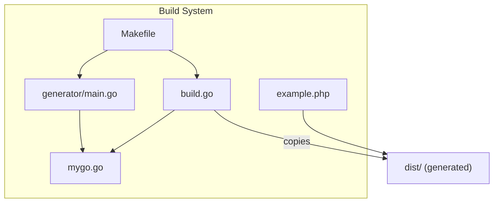
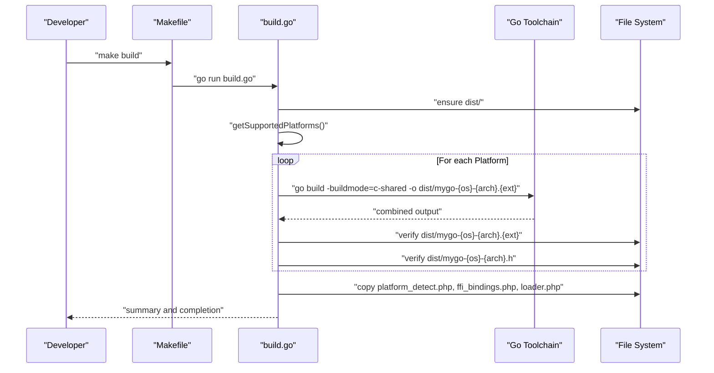
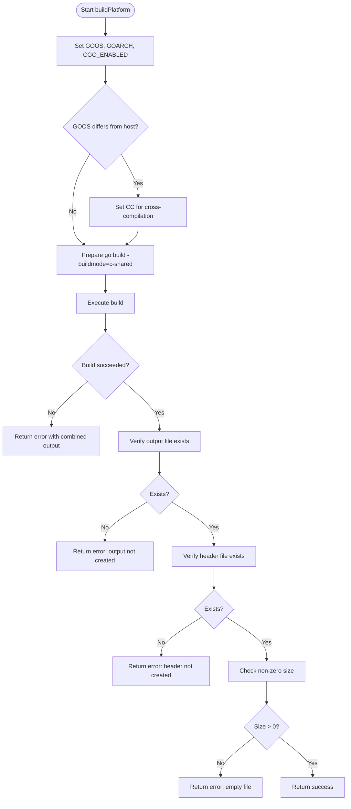
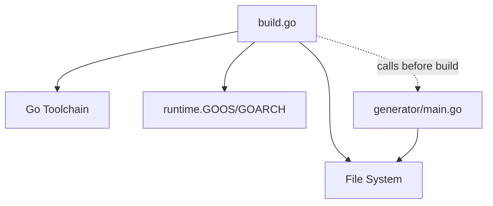

# Build Orchestrator (build.go)

<cite>
**Referenced Files in This Document**
- [build.go](file://build.go)
- [Makefile](file://Makefile)
- [README.md](file://README.md)
- [generator/main.go](file://generator/main.go)
- [example.php](file://example.php)
- [mygo.go](file://mygo.go)
</cite>

## Table of Contents
1. [Introduction](#introduction)
2. [Project Structure](#project-structure)
3. [Core Components](#core-components)
4. [Architecture Overview](#architecture-overview)
5. [Detailed Component Analysis](#detailed-component-analysis)
6. [Dependency Analysis](#dependency-analysis)
7. [Performance Considerations](#performance-considerations)
8. [Troubleshooting Guide](#troubleshooting-guide)
9. [Conclusion](#conclusion)
10. [Appendices](#appendices)

## Introduction
This document explains the build orchestrator implemented in build.go. It enables cross-platform compilation of Go shared libraries for multiple OS/architecture combinations (linux/amd64, linux/arm64, darwin/amd64/darwin/arm64, windows/amd64/windows/arm64) using Go’s c-shared build mode. The orchestrator:
- Defines a Platform struct with GOOS, GOARCH, and Extension fields
- Maintains a supported platforms list with standardized naming conventions
- Configures environment variables (GOOS, GOARCH, CGO_ENABLED, CC) for cross-compilation
- Verifies output integrity by checking file existence and non-zero size
- Copies generated PHP binding files to the dist/ directory
- Provides guidance for extending supported platforms and customizing build behavior
- Documents fallback strategies using build-current targets

## Project Structure
The build orchestrator integrates with the broader build system:
- build.go: Cross-platform build orchestrator
- Makefile: High-level targets for generate, build, build-current, test, clean, and help
- generator/main.go: Code generator that produces PHP binding files from Go exports
- example.php: Example PHP application consuming the generated bindings and libraries
- mygo.go: Example Go library with exported functions for FFI

**Diagram sources**
- [build.go](file://build.go#L1-L183)
- [Makefile](file://Makefile#L1-L54)
- [generator/main.go](file://generator/main.go#L1-L705)
- [example.php](file://example.php#L1-L95)
- [mygo.go](file://mygo.go#L1-L39)

**Section sources**
- [build.go](file://build.go#L1-L183)
- [Makefile](file://Makefile#L1-L54)
- [README.md](file://README.md#L1-L384)

## Core Components
- Platform struct: Encapsulates target platform configuration with GOOS, GOARCH, and Extension fields.
- Supported platforms list: Predefined set of platforms with their extensions.
- Output naming: Standardized naming convention for shared libraries and headers.
- Environment configuration: Sets GOOS, GOARCH, CGO_ENABLED, and CC for cross-compilation.
- Integrity checks: Ensures output and header files exist and are not empty.
- PHP binding copying: Copies platform_detect.php, ffi_bindings.php, and loader.php to dist/.
- Build workflow: Iterates supported platforms, builds each, validates outputs, and summarizes results.

Key implementation references:
- Platform definition and methods: [Platform struct and methods](file://build.go#L12-L39)
- Supported platforms list: [getSupportedPlatforms](file://build.go#L19-L29)
- Output/header naming: [getOutputFilename/getHeaderFilename](file://build.go#L31-L39)
- Build loop and summary: [main](file://build.go#L41-L105)
- Cross-compilation environment setup: [buildPlatform](file://build.go#L107-L164)
- Output verification: [buildPlatform](file://build.go#L145-L161)
- PHP file copying: [main](file://build.go#L75-L84)
- Utility copy function: [copyFile](file://build.go#L166-L182)

**Section sources**
- [build.go](file://build.go#L12-L182)

## Architecture Overview
The build orchestrator coordinates the following flow:
- Initialize dist directory
- Enumerate supported platforms
- For each platform:
  - Configure environment variables (GOOS, GOARCH, CGO_ENABLED, CC)
  - Invoke go build with -buildmode=c-shared
  - Validate output and header files exist and are non-empty
- Copy PHP binding files to dist/
- Print a build summary

**Diagram sources**
- [build.go](file://build.go#L41-L105)
- [Makefile](file://Makefile#L12-L16)

## Detailed Component Analysis

### Platform Struct and Supported Platforms
- Purpose: Define target platform configuration and derive output/header filenames.
- Fields:
  - GOOS: Target operating system
  - GOARCH: Target CPU architecture
  - Extension: File extension for the shared library
- Methods:
  - getOutputFilename: Produces the shared library filename using the naming convention
  - getHeaderFilename: Produces the corresponding C header filename

Supported platforms list:
- linux/amd64 -> .so
- linux/arm64 -> .so
- darwin/amd64 -> .dylib
- darwin/arm64 -> .dylib
- windows/amd64 -> .dll
- windows/arm64 -> .dll

These choices align with the README’s supported platforms and the Makefile’s build-current behavior.

**Section sources**
- [build.go](file://build.go#L12-L39)
- [README.md](file://README.md#L14-L24)
- [Makefile](file://Makefile#L18-L30)

### Build Workflow and Environment Configuration
- Directory preparation: Creates dist/ if absent.
- Platform iteration: Builds each platform in order.
- Environment variables:
  - GOOS and GOARCH set per platform
  - CGO_ENABLED=1 to enable C interop
  - CC configured for cross-compilation when GOOS differs from runtime.GOOS
- Cross-compiler selection:
  - Linux arm64: aarch64-linux-gnu-gcc
  - Windows amd64: x86_64-w64-mingw32-gcc
  - Windows arm64: aarch64-w64-mingw32-gcc
- Build invocation: Uses go build with -buildmode=c-shared and outputs to dist/.

Validation:
- Checks that the shared library file exists
- Checks that the header file exists
- Ensures both files are non-empty

**Diagram sources**
- [build.go](file://build.go#L107-L164)

**Section sources**
- [build.go](file://build.go#L41-L105)
- [build.go](file://build.go#L107-L164)

### Output Integrity Verification
- Existence checks: Ensures both the shared library and header files are created.
- Non-zero size checks: Prevents partial or failed builds from being considered successful.

This validation occurs immediately after the build completes and before returning success.

**Section sources**
- [build.go](file://build.go#L145-L161)

### PHP Binding File Copying
- Copies platform_detect.php, ffi_bindings.php, and loader.php to dist/ after building all platforms.
- Uses a simple copyFile utility that opens source, creates destination, and streams content.

This ensures the distribution bundle includes all necessary runtime files for PHP consumption.

**Section sources**
- [build.go](file://build.go#L75-L84)
- [build.go](file://build.go#L166-L182)

### Extending Supported Platforms and Customization
- Adding new platforms:
  - Extend getSupportedPlatforms with a new Platform entry containing GOOS, GOARCH, and Extension.
  - Ensure the corresponding cross-compiler is available when cross-compiling to that platform.
- Customizing naming:
  - Modify getOutputFilename and getHeaderFilename to change the naming convention.
- Customizing build flags:
  - Adjust the go build command inside buildPlatform to add flags or change output paths.
- Customizing environment variables:
  - Add or modify environment variables in buildPlatform for special toolchains or flags.

Example references:
- Supported platforms list: [getSupportedPlatforms](file://build.go#L19-L29)
- Output naming: [getOutputFilename/getHeaderFilename](file://build.go#L31-L39)
- Build command and environment: [buildPlatform](file://build.go#L107-L139)

**Section sources**
- [build.go](file://build.go#L19-L39)
- [build.go](file://build.go#L107-L139)

## Dependency Analysis
The build orchestrator depends on:
- Go toolchain for cross-compilation
- Host OS runtime for determining the current platform
- File system for creating dist/, writing outputs, and copying PHP files
- Generator for producing PHP binding files prior to building

**Diagram sources**
- [build.go](file://build.go#L41-L105)
- [generator/main.go](file://generator/main.go#L1-L705)

**Section sources**
- [build.go](file://build.go#L41-L105)
- [generator/main.go](file://generator/main.go#L1-L705)

## Performance Considerations
- Parallelization: The current implementation iterates platforms sequentially. For large sets of platforms, consider parallel builds with controlled concurrency to reduce total build time.
- Incremental builds: Only rebuild platforms that changed or are missing in dist/.
- Cross-compiler availability: Installing required cross-compilers once reduces repeated setup overhead.
- Distribution packaging: Keep dist/ minimal and include only necessary files to speed up distribution.

[No sources needed since this section provides general guidance]

## Troubleshooting Guide
Common cross-compilation failures and remedies:
- Missing C compilers or CGO toolchains:
  - Symptom: Build fails with toolchain errors during cross-compilation.
  - Action: Install the required cross-compiler for the target platform (e.g., aarch64-linux-gnu-gcc for Linux arm64, x86_64-w64-mingw32-gcc for Windows).
- Unsupported platform in build orchestrator:
  - Symptom: Build exits early or reports unsupported platform.
  - Action: Extend getSupportedPlatforms with the desired platform and ensure CC is set appropriately.
- Empty or missing outputs:
  - Symptom: Output files not created or zero size.
  - Action: Verify build succeeded, check CGO_ENABLED and CC settings, and confirm the source file compiles without errors.
- Fallback to current platform:
  - Use the Makefile target build-current to compile for the host platform only, bypassing cross-compilation needs.

Fallback strategy using build-current:
- The Makefile provides a build-current target that:
  - Determines the host OS and architecture
  - Invokes go build -buildmode=c-shared with the appropriate output filename
  - Copies platform_detect.php, ffi_bindings.php, and loader.php to dist/

Verification references:
- Cross-compilation notes and fallback guidance: [README.md](file://README.md#L238-L278)
- Build summary and failure messaging: [build.go](file://build.go#L87-L105)
- Build-current target: [Makefile](file://Makefile#L18-L30)

**Section sources**
- [README.md](file://README.md#L238-L278)
- [build.go](file://build.go#L87-L105)
- [Makefile](file://Makefile#L18-L30)

## Conclusion
The build orchestrator in build.go provides a robust, cross-platform pipeline for generating Go shared libraries and their PHP bindings. It enforces standardized naming, validates outputs, and offers a clear fallback path via build-current. Extending supported platforms is straightforward by updating the platforms list and ensuring toolchain availability.

[No sources needed since this section summarizes without analyzing specific files]

## Appendices

### Appendix A: Supported Platforms and Naming Convention
- Platforms: linux/amd64, linux/arm64, darwin/amd64, darwin/arm64, windows/amd64, windows/arm64
- Extensions: .so, .so, .dylib, .dylib, .dll, .dll
- Naming: mygo-{GOOS}-{GOARCH}.{ext}
- Header naming: mygo-{GOOS}-{GOARCH}.h

**Section sources**
- [README.md](file://README.md#L14-L24)
- [build.go](file://build.go#L19-L39)

### Appendix B: Example Usage and End-to-End Flow
- Generate bindings: go generate ./...
- Build all platforms: go run build.go
- Build current platform only: make build-current
- Test with example: make test

**Section sources**
- [README.md](file://README.md#L66-L109)
- [Makefile](file://Makefile#L1-L54)
- [example.php](file://example.php#L1-L95)