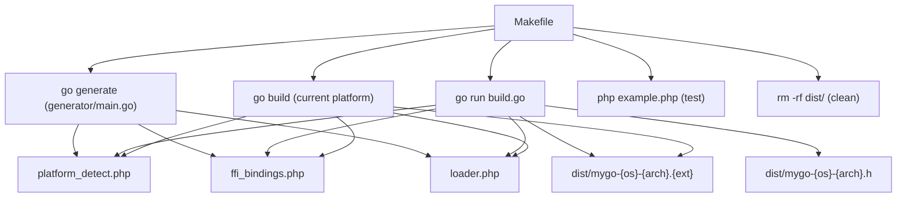
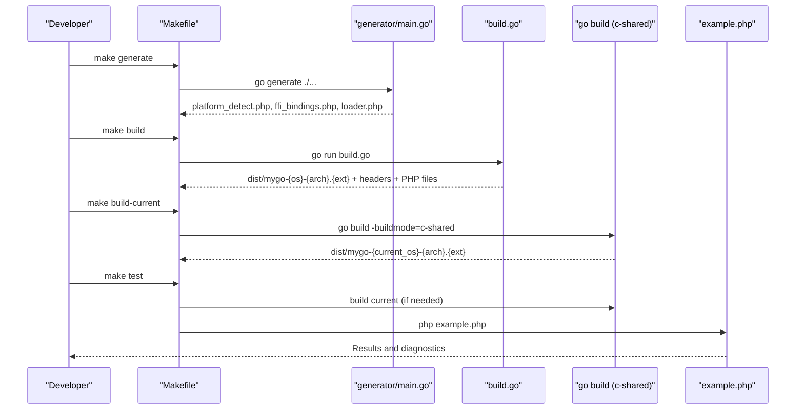
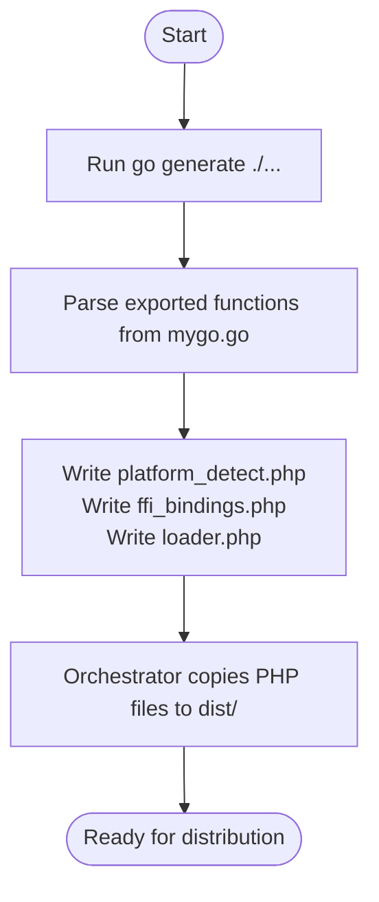
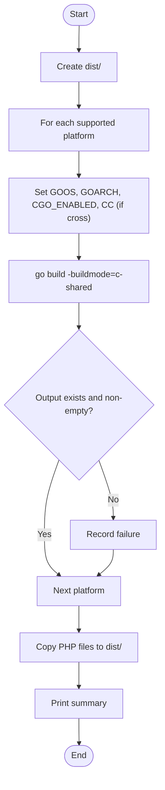
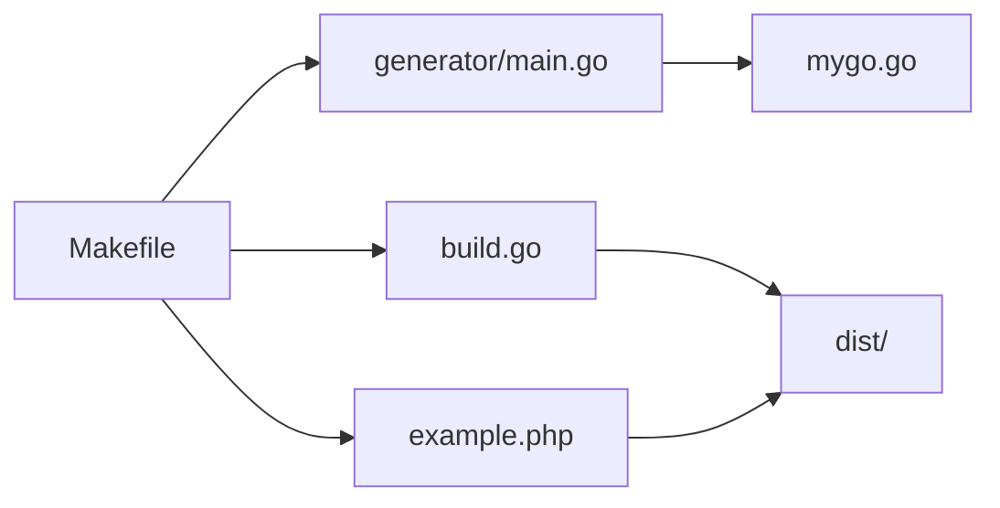

# Makefile Automation

<cite>
**Referenced Files in This Document**
- [Makefile](file://Makefile)
- [build.go](file://build.go)
- [generator/main.go](file://generator/main.go)
- [mygo.go](file://mygo.go)
- [example.php](file://example.php)
- [README.md](file://README.md)
</cite>

## Table of Contents
1. [Introduction](#introduction)
2. [Project Structure](#project-structure)
3. [Core Components](#core-components)
4. [Architecture Overview](#architecture-overview)
5. [Detailed Component Analysis](#detailed-component-analysis)
6. [Dependency Analysis](#dependency-analysis)
7. [Performance Considerations](#performance-considerations)
8. [Troubleshooting Guide](#troubleshooting-guide)
9. [Conclusion](#conclusion)

## Introduction
This document explains the Makefile automation system that orchestrates the build process on Unix-like systems for a cross-platform Go shared library intended for consumption by PHP via FFI. It covers how the Makefile defines targets for code generation, compilation, testing, and cleanup, and how it integrates go generate with the central build orchestrator. It also provides examples of executing targets, describes environment variable usage during compilation, and offers troubleshooting guidance for common issues.

## Project Structure
The build system centers around a Makefile that coordinates:
- Code generation via go generate and a dedicated generator program
- Cross-platform builds orchestrated by a Go program
- Platform-specific builds for the current host
- Automated testing using a PHP example script
- Cleanup of build artifacts

**Diagram sources**
- [Makefile](file://Makefile#L1-L54)
- [generator/main.go](file://generator/main.go#L1-L705)
- [build.go](file://build.go#L1-L183)
- [example.php](file://example.php#L1-L95)

**Section sources**
- [Makefile](file://Makefile#L1-L54)
- [README.md](file://README.md#L1-L120)

## Core Components
- Makefile targets:
  - all: Generates bindings and builds for all platforms
  - generate: Runs go generate to produce PHP binding files
  - build: Cross-platform build via the Go orchestrator
  - build-current: Host-specific build using c-shared mode
  - test: Builds current platform and runs the PHP example
  - clean: Removes generated artifacts
  - help: Prints available targets
- Central orchestrator: A Go program that iterates supported platforms, sets environment variables for cross-compilation, and copies generated PHP files to dist
- Code generator: A Go program that parses exported functions from the main Go library and generates platform detection, FFI bindings, and loader PHP files
- Example PHP application: Exercises the generated bindings and validates the build

**Section sources**
- [Makefile](file://Makefile#L1-L54)
- [build.go](file://build.go#L1-L183)
- [generator/main.go](file://generator/main.go#L1-L705)
- [example.php](file://example.php#L1-L95)

## Architecture Overview
The Makefile acts as a thin orchestration layer that:
- Ensures code generation precedes compilation
- Delegates cross-platform builds to a dedicated Go program
- Handles platform-specific builds locally
- Executes tests against the generated artifacts
- Cleans up artifacts when needed

**Diagram sources**
- [Makefile](file://Makefile#L1-L54)
- [generator/main.go](file://generator/main.go#L1-L705)
- [build.go](file://build.go#L1-L183)
- [example.php](file://example.php#L1-L95)

## Detailed Component Analysis

### Makefile Targets and Dependencies
- all
  - Purpose: Convenience target that runs generate followed by build
  - Dependencies: generate, build
- generate
  - Purpose: Invokes go generate to regenerate PHP binding files from exported functions
  - Behavior: Executes go generate ./... and prints status messages
- build
  - Purpose: Cross-platform build for all supported platforms
  - Dependencies: generate
  - Execution: Calls go run build.go to compile and package artifacts
- build-current
  - Purpose: Build for the current host platform only
  - Dependencies: generate
  - Execution: Uses go build with -buildmode=c-shared and sets output based on detected GOOS/GOARCH; copies PHP files to dist
- test
  - Purpose: Validate the build by running the PHP example
  - Dependencies: build-current
  - Execution: Runs php example.php
- clean
  - Purpose: Remove generated artifacts
  - Execution: Deletes dist/ and generated PHP files at repository root
- help
  - Purpose: Display available targets and brief descriptions

Environment variables used during compilation:
- GOOS and GOARCH: Set by the orchestrator for cross-compilation
- CGO_ENABLED: Set to 1 for cross-compilation scenarios
- CC: Set to appropriate C compiler for cross-compilation targets (e.g., aarch64-linux-gnu-gcc, x86_64-w64-mingw32-gcc)

**Section sources**
- [Makefile](file://Makefile#L1-L54)
- [build.go](file://build.go#L107-L164)

### Integration Between go generate and the Build Process
- The generator program parses exported functions from the main Go library and writes three PHP files:
  - platform_detect.php: Runtime platform detection and path resolution
  - ffi_bindings.php: FFI wrapper class exposing Go functions
  - loader.php: Entry point to load the library for the current platform
- The Makefile’s generate target ensures these files are produced before building, and the orchestrator copies them into dist after cross-platform builds.

**Diagram sources**
- [Makefile](file://Makefile#L1-L54)
- [generator/main.go](file://generator/main.go#L1-L705)
- [build.go](file://build.go#L76-L84)

**Section sources**
- [generator/main.go](file://generator/main.go#L1-L705)
- [Makefile](file://Makefile#L1-L54)
- [build.go](file://build.go#L76-L84)

### Cross-Platform Build Orchestrator (build.go)
- Defines supported platforms and constructs output/header filenames
- Creates dist directory and iterates platforms
- For each platform:
  - Sets GOOS, GOARCH, CGO_ENABLED=1, and CC when cross-compiling
  - Executes go build -buildmode=c-shared with environment variables
  - Verifies output and header files exist and are non-empty
- Copies generated PHP files to dist after builds
- Emits a summary of successes and failures

**Diagram sources**
- [build.go](file://build.go#L1-L183)

**Section sources**
- [build.go](file://build.go#L1-L183)

### Platform-Specific Build (build-current)
- Uses the current host’s GOOS/GOARCH to determine output naming
- Builds a c-shared library and copies platform detection, FFI bindings, and loader files to dist

**Section sources**
- [Makefile](file://Makefile#L18-L31)

### Testing Target (test)
- Depends on build-current
- Executes the PHP example script to exercise the generated bindings and validate functionality

**Section sources**
- [Makefile](file://Makefile#L32-L36)
- [example.php](file://example.php#L1-L95)

### Cleanup Target (clean)
- Removes dist/ and generated PHP files at repository root

**Section sources**
- [Makefile](file://Makefile#L37-L42)

### Help Target (help)
- Lists available targets and their purposes

**Section sources**
- [Makefile](file://Makefile#L45-L54)

## Dependency Analysis
- Makefile depends on:
  - generator/main.go for code generation
  - build.go for cross-platform builds
  - example.php for testing
- generator/main.go depends on:
  - mygo.go for exported function signatures
- build.go depends on:
  - Supported platform list and environment variables for cross-compilation
- example.php depends on:
  - loader.php, platform_detect.php, and ffi_bindings.php in dist/

**Diagram sources**
- [Makefile](file://Makefile#L1-L54)
- [generator/main.go](file://generator/main.go#L1-L705)
- [build.go](file://build.go#L1-L183)
- [example.php](file://example.php#L1-L95)
- [mygo.go](file://mygo.go#L1-L39)

**Section sources**
- [Makefile](file://Makefile#L1-L54)
- [generator/main.go](file://generator/main.go#L1-L705)
- [build.go](file://build.go#L1-L183)
- [example.php](file://example.php#L1-L95)
- [mygo.go](file://mygo.go#L1-L39)

## Performance Considerations
- Cross-compilation can be slow due to external toolchains; use build-current for rapid iteration on the host platform
- FFI overhead is minimal compared to native C extensions; prefer persistent processes (e.g., PHP-FPM) to amortize load costs
- Batch operations and careful string handling reduce overhead and improve reliability

[No sources needed since this section provides general guidance]

## Troubleshooting Guide
Common issues and resolutions:
- Missing Go toolchain or CGO disabled
  - Symptom: Build fails with CGO-related errors
  - Resolution: Enable CGO and install a C compiler appropriate for your platform
- PHP FFI extension not enabled
  - Symptom: Error indicating FFI extension is not loaded
  - Resolution: Enable FFI in php.ini and restart the service
- Platform not supported
  - Symptom: Unsupported platform error when loading the library
  - Resolution: Build libraries for your platform or extend supported platforms
- DLL loading errors on Windows
  - Symptom: Architecture mismatch or missing runtime dependencies
  - Resolution: Ensure PHP bitness matches the compiled DLL and install required runtime libraries

**Section sources**
- [README.md](file://README.md#L238-L309)

## Conclusion
The Makefile automation system provides a streamlined workflow for generating PHP bindings from Go exports, building cross-platform shared libraries, and validating the integration with PHP FFI. By encapsulating complex build commands into simple, repeatable targets, it simplifies development and distribution while leveraging environment variables for precise control over cross-compilation. The central orchestrator complements the Makefile by handling platform enumeration, environment setup, and artifact verification, ensuring reliable builds across diverse environments.