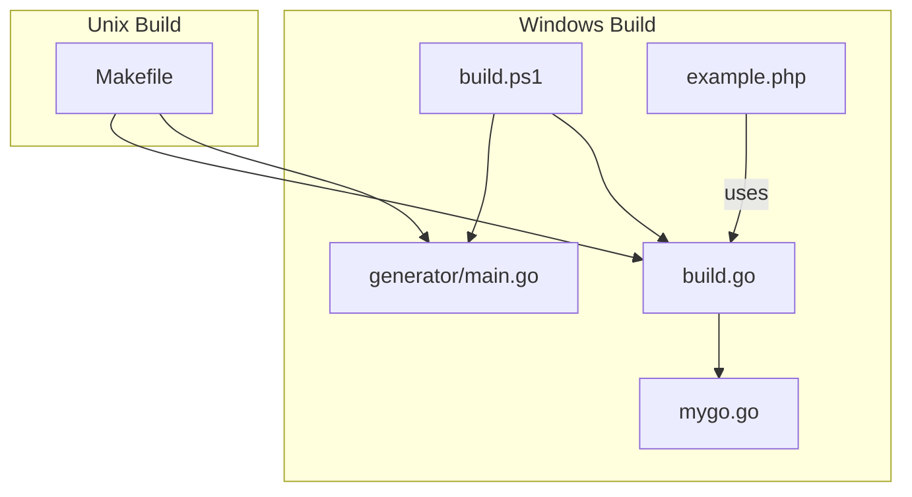
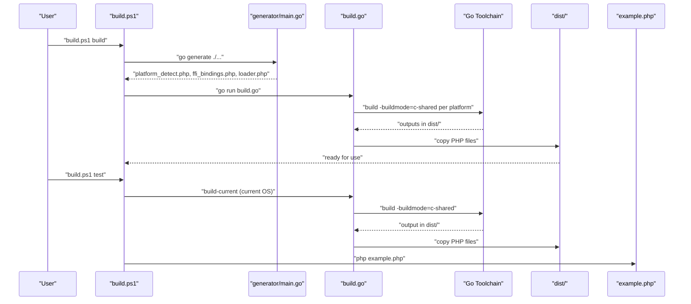
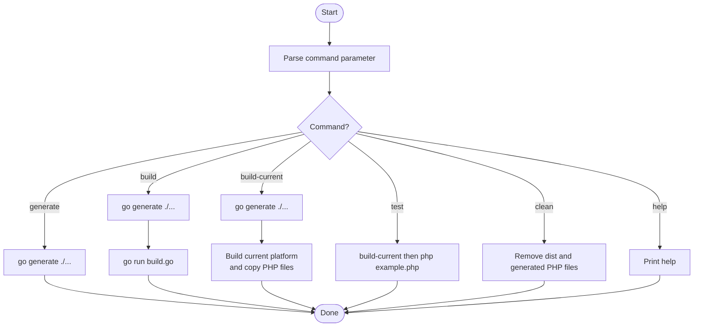
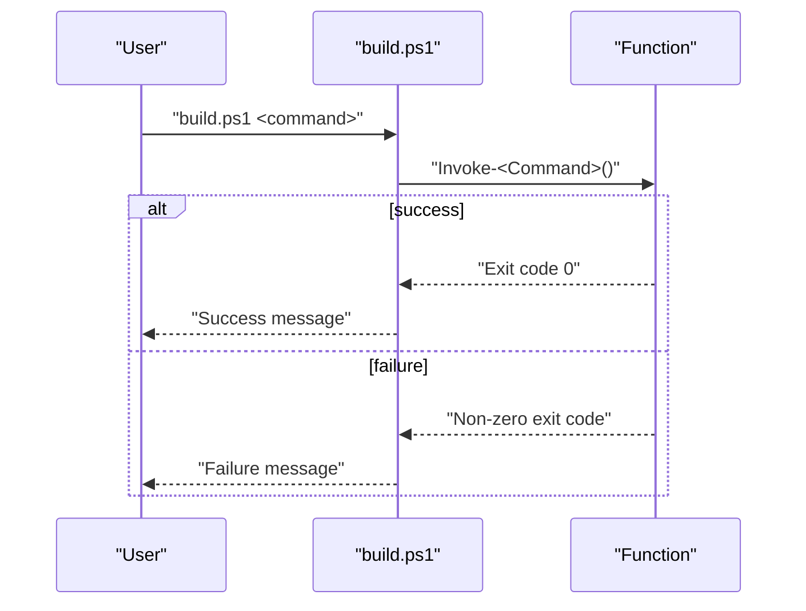
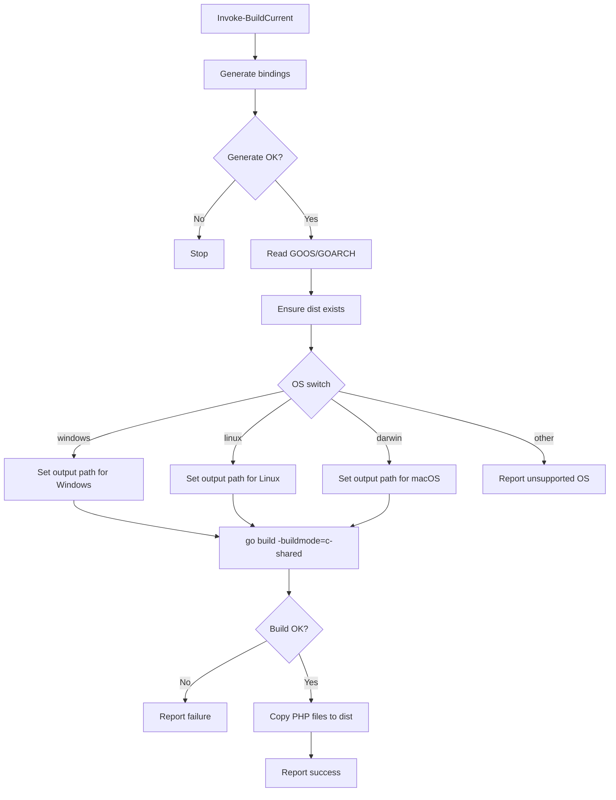
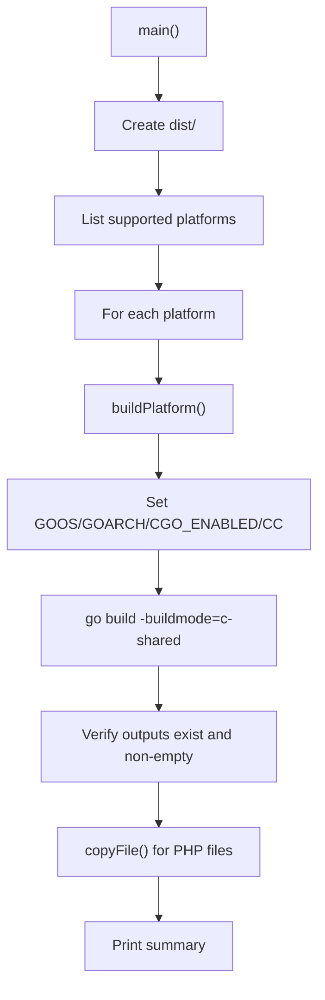
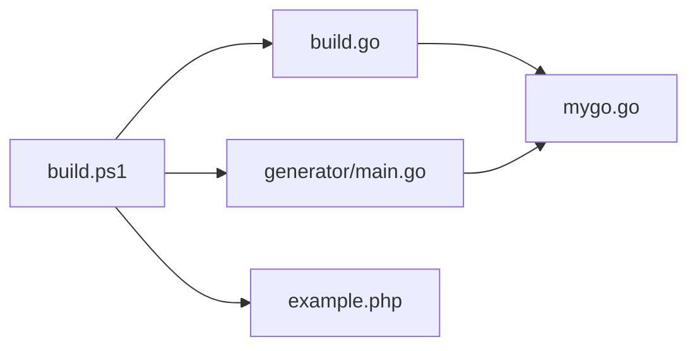

# PowerShell Build Script

<cite>
**Referenced Files in This Document**
- [build.ps1](file://build.ps1)
- [build.go](file://build.go)
- [Makefile](file://Makefile)
- [generator/main.go](file://generator/main.go)
- [example.php](file://example.php)
- [mygo.go](file://mygo.go)
- [README.md](file://README.md)
</cite>

## Table of Contents
1. [Introduction](#introduction)
2. [Project Structure](#project-structure)
3. [Core Components](#core-components)
4. [Architecture Overview](#architecture-overview)
5. [Detailed Component Analysis](#detailed-component-analysis)
6. [Dependency Analysis](#dependency-analysis)
7. [Performance Considerations](#performance-considerations)
8. [Troubleshooting Guide](#troubleshooting-guide)
9. [Conclusion](#conclusion)
10. [Appendices](#appendices)

## Introduction
This document explains the PowerShell build script (build.ps1) and how it provides equivalent functionality to the Makefile on Windows systems. It supports commands such as generate, build, build-current, test, clean, and help through a robust function-based architecture. The script:
- Handles parameters and routes commands via a switch statement
- Invokes go generate for binding generation
- Delegates cross-platform builds to build.go
- Manages platform-specific output paths and file copying
- Propagates errors and provides helpful feedback

## Project Structure
The build system consists of:
- A PowerShell script that orchestrates tasks on Windows
- A Go program that performs cross-platform builds and copies PHP files
- A Go generator that produces PHP binding files
- Example PHP code to demonstrate usage
- A Makefile that defines the same targets on Unix-like systems

**Diagram sources**
- [build.ps1](file://build.ps1#L1-L152)
- [build.go](file://build.go#L1-L183)
- [generator/main.go](file://generator/main.go#L1-L705)
- [Makefile](file://Makefile#L1-L54)
- [example.php](file://example.php#L1-L95)
- [mygo.go](file://mygo.go#L1-L39)

**Section sources**
- [build.ps1](file://build.ps1#L1-L152)
- [build.go](file://build.go#L1-L183)
- [Makefile](file://Makefile#L1-L54)
- [generator/main.go](file://generator/main.go#L1-L705)
- [example.php](file://example.php#L1-L95)
- [mygo.go](file://mygo.go#L1-L39)

## Core Components
- Parameter handling: The script accepts a positional command argument with a default of help.
- Command routing: A switch statement dispatches to dedicated functions for each command.
- Function-based architecture: Each command is encapsulated in a function for readability and reusability.
- Error propagation: Uses last exit code checks and writes colored status messages.
- Integration points:
  - go generate invocation for binding generation
  - go run build.go for cross-platform builds
  - Manual platform-specific builds for current OS
  - PHP example execution for testing

Key commands and responsibilities:
- generate: Runs go generate to produce PHP binding files.
- build: Generates bindings and then runs build.go to build for all supported platforms.
- build-current: Generates bindings and builds a shared library for the current OS/arch, then copies PHP files to dist.
- test: Builds current platform and runs the example PHP script.
- clean: Removes dist and generated PHP files.
- help: Prints usage information.

**Section sources**
- [build.ps1](file://build.ps1#L1-L152)

## Architecture Overview
The Windows build script mirrors the Makefile targets by delegating to the same underlying tools and logic. On Windows, build.ps1:
- Ensures bindings are generated
- Invokes build.go to compile for all platforms and copy PHP files
- Optionally builds for the current platform only and copies PHP files
- Cleans artifacts and prints help

**Diagram sources**
- [build.ps1](file://build.ps1#L1-L152)
- [build.go](file://build.go#L1-L183)
- [generator/main.go](file://generator/main.go#L1-L705)
- [example.php](file://example.php#L1-L95)

## Detailed Component Analysis

### PowerShell Build Script (build.ps1)
- Parameter handling: Defines a Position=0 string parameter with default help.
- Help function: Lists available commands with brief descriptions.
- Generate function: Executes go generate and reports success/failure.
- Build function: Calls generate, then runs build.go and reports outcome.
- Build-current function:
  - Calls generate
  - Reads GOOS/GOARCH from the Go environment
  - Creates dist if missing
  - Switches on OS to set platform-specific output path and builds a shared library
  - Copies platform_detect.php, ffi_bindings.php, and loader.php to dist
- Test function: Invokes build-current, then runs php example.php
- Clean function: Removes dist and generated PHP files
- Command routing: switch ($Command.ToLower()) dispatches to the appropriate function

Platform-specific output paths:
- Windows: dist/mygo-windows-{arch}.dll
- Linux: dist/mygo-linux-{arch}.so
- macOS: dist/mygo-darwin-{arch}.dylib

Error propagation:
- Uses $LASTEXITCODE to detect success/failure of external commands
- Writes colored console output for user feedback

**Section sources**
- [build.ps1](file://build.ps1#L1-L152)

### Cross-Platform Build Orchestrator (build.go)
- Defines a Platform struct with GOOS, GOARCH, and Extension fields
- getSupportedPlatforms returns the list of supported platforms and extensions
- getOutputFilename and getHeaderFilename compute filenames using the standardized naming convention
- main:
  - Creates dist directory
  - Iterates supported platforms, invoking buildPlatform for each
  - Copies platform_detect.php, ffi_bindings.php, and loader.php to dist
  - Prints a summary with counts and failure details
- buildPlatform:
  - Prepares a go build command with -buildmode=c-shared
  - Sets environment variables for cross-compilation (GOOS, GOARCH, CGO_ENABLED)
  - Applies special CC settings for cross-compilation scenarios
  - Validates that output and header files exist and are non-empty
- copyFile: Utility to copy files from source to destination

Cross-compilation specifics:
- Uses CC environment variables for specific toolchains (e.g., MinGW for Windows, aarch64-linux-gnu-gcc for Linux ARM64)
- Emits guidance when cross-compilation fails due to missing toolchains

**Section sources**
- [build.go](file://build.go#L1-L183)

### Code Generator (generator/main.go)
- Parses exported functions from mygo.go using //export directives
- Generates:
  - platform_detect.php: Platform detection logic
  - ffi_bindings.php: PHP FFI wrapper classes
  - loader.php: Main loader and platform info helpers
- Integrates with mygo.go via go:generate directive

**Section sources**
- [generator/main.go](file://generator/main.go#L1-L705)
- [mygo.go](file://mygo.go#L1-L39)

### Example PHP Usage (example.php)
- Demonstrates loading the library via loader.php
- Exercises exported functions and shows proper string handling and memory management
- Serves as a sanity check after building

**Section sources**
- [example.php](file://example.php#L1-L95)

### Makefile (Reference)
- Provides the same targets on Unix-like systems
- Mirrors the behavior of build.ps1 for generate, build, build-current, test, clean, and help

**Section sources**
- [Makefile](file://Makefile#L1-L54)

## Architecture Overview
The Windows build script aligns with the Makefile targets by:
- Using go generate to produce PHP binding files
- Using build.go to build for all platforms and copy PHP files
- Supporting a current-platform-only build path
- Cleaning artifacts and printing help

**Diagram sources**
- [build.ps1](file://build.ps1#L1-L152)
- [build.go](file://build.go#L1-L183)

## Detailed Component Analysis

### Command Routing and Execution Flow
- The script defines a parameter for the command and defaults to help
- A switch statement routes to:
  - Show-Help
  - Invoke-Generate
  - Invoke-Build
  - Invoke-BuildCurrent
  - Invoke-Test
  - Invoke-Clean
- Each function encapsulates a single responsibility and returns early on failure

**Diagram sources**
- [build.ps1](file://build.ps1#L1-L152)

### Build-Current Flow (Windows)
- Reads GOOS/GOARCH from the Go environment
- Creates dist directory if absent
- Switches on OS to set the output path and builds a shared library
- Copies PHP files to dist

**Diagram sources**
- [build.ps1](file://build.ps1#L46-L93)

### Cross-Platform Build Flow (build.go)
- Creates dist directory
- Iterates supported platforms
- For each platform, sets environment variables and builds
- Copies PHP files to dist and prints a summary

**Diagram sources**
- [build.go](file://build.go#L41-L183)

## Dependency Analysis
- build.ps1 depends on:
  - generator/main.go via go generate
  - build.go via go run
  - Go toolchain for building and cross-compilation
  - PHP runtime for testing
- build.go depends on:
  - Go toolchain for cross-compilation
  - mygo.go for the shared library source
  - Standard library for filesystem operations
- generator/main.go depends on:
  - mygo.go for parsing exported functions
  - Standard library for file I/O and regex parsing

**Diagram sources**
- [build.ps1](file://build.ps1#L1-L152)
- [build.go](file://build.go#L1-L183)
- [generator/main.go](file://generator/main.go#L1-L705)
- [example.php](file://example.php#L1-L95)
- [mygo.go](file://mygo.go#L1-L39)

**Section sources**
- [build.ps1](file://build.ps1#L1-L152)
- [build.go](file://build.go#L1-L183)
- [generator/main.go](file://generator/main.go#L1-L705)
- [example.php](file://example.php#L1-L95)
- [mygo.go](file://mygo.go#L1-L39)

## Performance Considerations
- Cross-compilation can be slow and resource-intensive. Prefer build-current during development and reserve build for distribution packaging.
- The generator parses exported functions from source; keep exported function signatures stable to minimize regeneration overhead.
- Building for all platforms creates multiple outputs; consider caching artifacts and only rebuilding changed platforms.

[No sources needed since this section provides general guidance]

## Troubleshooting Guide
Common Windows-specific issues and resolutions:
- Execution policy restrictions:
  - Symptom: Scripts blocked from running
  - Resolution: Adjust execution policy or sign scripts appropriately
- Missing Go in PATH:
  - Symptom: go command not found
  - Resolution: Install Go and ensure PATH includes the Go binary directory
- Missing PHP in PATH:
  - Symptom: php command not found
  - Resolution: Install PHP and add it to PATH
- Cross-compilation toolchain requirements:
  - Symptom: Cross-compilation fails due to missing compilers
  - Resolution: Install required cross-compilers (e.g., MinGW for Windows, aarch64-linux-gnu-gcc for Linux ARM64)
- CGO disabled:
  - Symptom: Build fails with CGO-related errors
  - Resolution: Ensure CGO_ENABLED=1 and have a C compiler installed
- Architecture mismatch:
  - Symptom: DLL loading errors indicating architecture mismatch
  - Resolution: Ensure PHP and the compiled DLL match (both 32-bit or both 64-bit)
- Missing runtime dependencies:
  - Symptom: DLL fails to load due to missing runtime libraries
  - Resolution: Install required Visual C++ Redistributable packages

**Section sources**
- [README.md](file://README.md#L238-L309)

## Conclusion
The PowerShell build script provides a Windows-native equivalent to the Makefile targets. It integrates seamlessly with the Go-based cross-platform builder and generator, enabling developers to generate bindings, build for current or all platforms, test with PHP, and clean artifacts. Its function-based design, robust error handling, and platform-aware output management make it a reliable foundation for the build pipeline on Windows systems.

[No sources needed since this section summarizes without analyzing specific files]

## Appendices

### Usage Examples
- Generate bindings: .\build.ps1 generate
- Build for all platforms: .\build.ps1 build
- Build for current platform: .\build.ps1 build-current
- Test with example: .\build.ps1 test
- Clean artifacts: .\build.ps1 clean
- Show help: .\build.ps1 help

**Section sources**
- [build.ps1](file://build.ps1#L1-L152)
- [Makefile](file://Makefile#L1-L54)