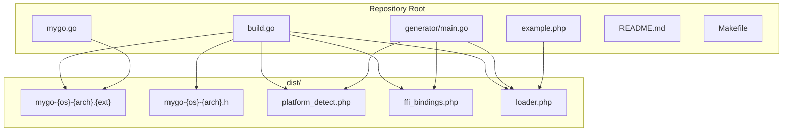
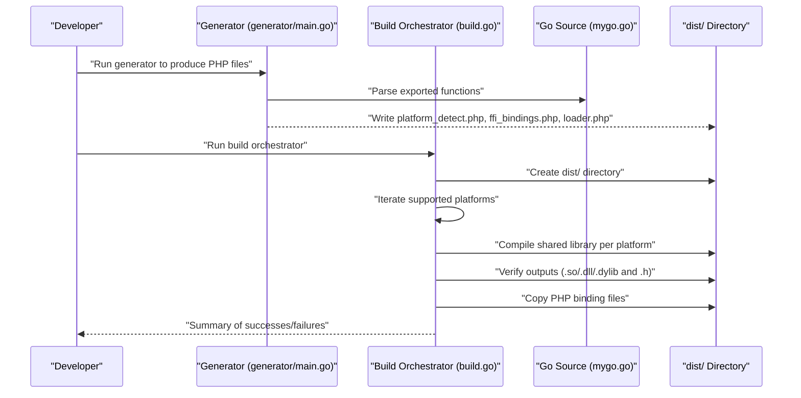
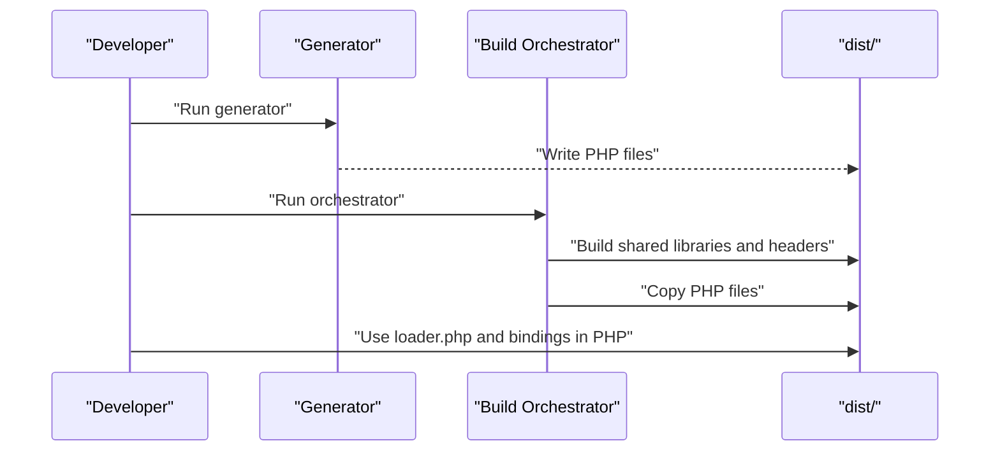
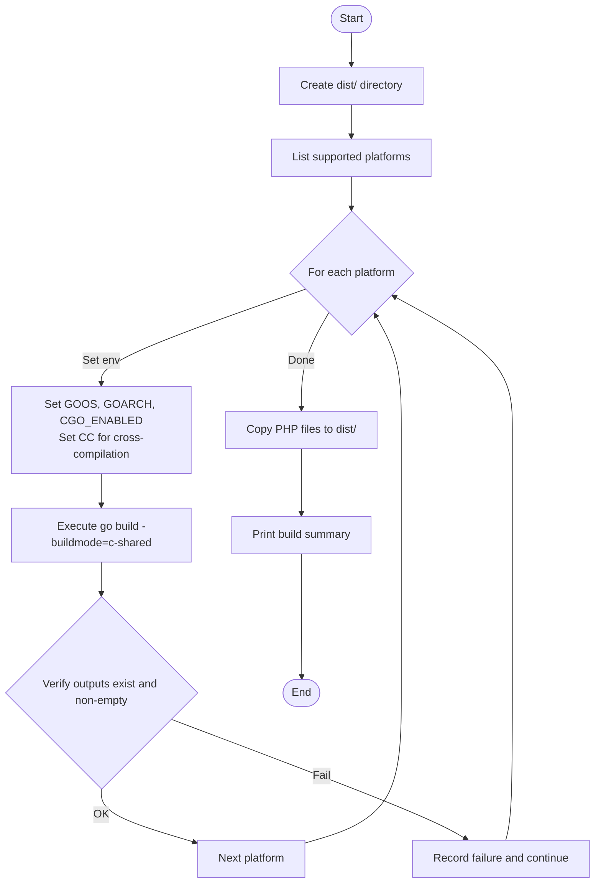
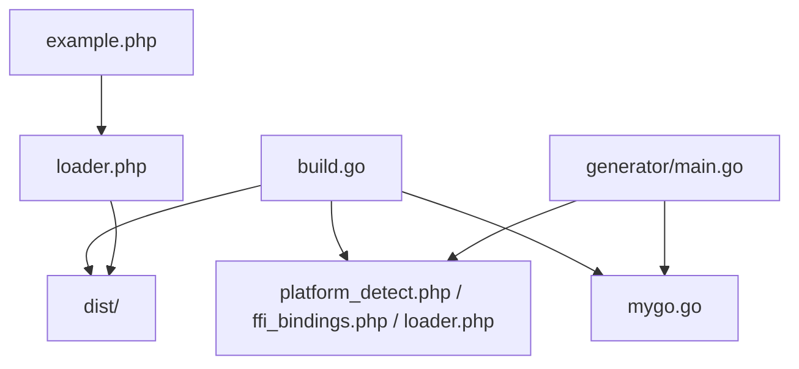

# Build Orchestrator

<cite>
**Referenced Files in This Document**
- [build.go](file://build.go)
- [generator/main.go](file://generator/main.go)
- [mygo.go](file://mygo.go)
- [example.php](file://example.php)
- [README.md](file://README.md)
- [Makefile](file://Makefile)
</cite>

## Table of Contents
1. [Introduction](#introduction)
2. [Project Structure](#project-structure)
3. [Core Components](#core-components)
4. [Architecture Overview](#architecture-overview)
5. [Detailed Component Analysis](#detailed-component-analysis)
6. [Dependency Analysis](#dependency-analysis)
7. [Performance Considerations](#performance-considerations)
8. [Troubleshooting Guide](#troubleshooting-guide)
9. [Conclusion](#conclusion)

## Introduction
This document provides a comprehensive analysis of the build orchestrator component responsible for cross-platform compilation of a Go shared library intended for consumption by PHP via FFI. It explains how the orchestrator sets environment variables for cross-compilation, iterates through supported platform targets, executes the build process, validates outputs, and copies generated PHP binding files into the distribution directory. It also clarifies the orchestrator’s relationship to the code generator and how the resulting shared libraries and headers are used by PHP.

## Project Structure
The build orchestrator resides in the repository alongside the code generator, example PHP application, and the Go library source. The orchestrator creates a dist/ directory containing compiled shared libraries, corresponding C headers, and PHP binding files produced by the generator.

**Diagram sources**
- [build.go](file://build.go#L41-L105)
- [generator/main.go](file://generator/main.go#L27-L75)
- [example.php](file://example.php#L1-L20)
- [README.md](file://README.md#L25-L41)

**Section sources**
- [build.go](file://build.go#L41-L105)
- [README.md](file://README.md#L25-L41)

## Core Components
- Build orchestrator (build.go): Defines supported platforms, constructs build commands with environment variables, executes builds, verifies outputs, and copies PHP binding files.
- Code generator (generator/main.go): Parses exported functions from Go source and generates PHP files for platform detection, FFI bindings, and loader.
- Go library source (mygo.go): Contains exported functions annotated with //export directives and a go:generate directive to invoke the generator.
- Example PHP application (example.php): Demonstrates loading the library and invoking exported functions.

Key responsibilities:
- Platform matrix definition and naming conventions
- Environment variable management for cross-compilation
- Build execution and output verification
- Distribution packaging of artifacts

**Section sources**
- [build.go](file://build.go#L12-L29)
- [generator/main.go](file://generator/main.go#L27-L75)
- [mygo.go](file://mygo.go#L11-L12)
- [example.php](file://example.php#L1-L20)

## Architecture Overview
The build orchestrator coordinates the end-to-end pipeline:
- The generator parses exported functions from the Go source and writes PHP files.
- The orchestrator compiles the Go code into shared libraries for each platform and generates corresponding C headers.
- The orchestrator copies the generated PHP files into dist/ so they can be consumed by PHP applications.

**Diagram sources**
- [generator/main.go](file://generator/main.go#L27-L75)
- [build.go](file://build.go#L41-L105)
- [mygo.go](file://mygo.go#L11-L12)

## Detailed Component Analysis

### Build Orchestrator Implementation
The orchestrator defines a Platform struct with GOOS, GOARCH, and Extension fields. It enumerates supported platforms and computes output/header filenames using a consistent naming scheme. The main loop iterates over platforms, invokes buildPlatform for each, and aggregates success/failure counts. After building, it copies the generated PHP files into dist/.

Key behaviors:
- Creates dist/ directory with appropriate permissions
- Iterates through six platform combinations (Linux/amd64, Linux/arm64, macOS/amd64/darwin/arm64, Windows/amd64/arm64)
- Sets environment variables for cross-compilation (GOOS, GOARCH, CGO_ENABLED=1)
- Uses a C compiler suitable for cross-compilation targets when applicable
- Executes go build with -buildmode=c-shared and verifies both the shared library and header files exist and are non-empty
- Copies platform_detect.php, ffi_bindings.php, and loader.php into dist/

Tolerant failure handling:
- On build failure, the orchestrator records the failure and continues with remaining platforms
- At the end, it prints a summary including the number of successful and failed builds and lists each failure

Relationship to other components:
- Consumes outputs of the generator (PHP files) and copies them into dist/
- Produces shared libraries and headers consumed by PHP FFI loader

**Section sources**
- [build.go](file://build.go#L12-L29)
- [build.go](file://build.go#L31-L39)
- [build.go](file://build.go#L41-L105)
- [build.go](file://build.go#L107-L164)
- [build.go](file://build.go#L166-L183)

#### Platform Configuration and Environment Variables
- Platform matrix: Linux/amd64, Linux/arm64, macOS/amd64, macOS/arm64, Windows/amd64, Windows/arm64
- Naming convention: mygo-{GOOS}-{GOARCH}.{ext}
- Environment variables set per platform:
  - GOOS and GOARCH for cross-compilation
  - CGO_ENABLED=1 to enable C interop
  - CC set to appropriate cross-compiler for Linux and Windows targets when cross-compiling

These settings ensure go build -buildmode=c-shared can produce platform-appropriate shared libraries and headers.

**Section sources**
- [build.go](file://build.go#L12-L29)
- [build.go](file://build.go#L107-L164)

#### Build Execution and Output Verification
- Build command: go build -buildmode=c-shared -o dist/mygo-{os}-{arch}.{ext} mygo.go
- Environment propagation: Inherits current environment and appends platform-specific variables
- Output verification:
  - Confirms the shared library file exists and is not empty
  - Confirms the corresponding header file exists and is not empty
- Failure reporting includes combined output from the build process

This ensures the distribution package contains valid artifacts.

**Section sources**
- [build.go](file://build.go#L107-L164)

#### Copying Generated PHP Bindings
- After building, the orchestrator copies platform_detect.php, ffi_bindings.php, and loader.php into dist/
- These files are generated by the code generator and enable PHP to detect the platform, load the correct library, and expose typed wrappers around exported functions

**Section sources**
- [build.go](file://build.go#L75-L85)
- [generator/main.go](file://generator/main.go#L27-L75)

### Relationship Between Orchestrator and Generator
- The generator parses exported functions from mygo.go and writes three PHP files:
  - platform_detect.php: platform detection and filename resolution
  - ffi_bindings.php: typed PHP wrappers around exported functions
  - loader.php: convenience loader that composes the above
- The orchestrator copies these files into dist/ so they are available alongside the compiled libraries
- The example PHP application loads loader.php and uses the generated bindings to call Go functions

**Diagram sources**
- [generator/main.go](file://generator/main.go#L27-L75)
- [build.go](file://build.go#L75-L85)
- [example.php](file://example.php#L1-L20)

**Section sources**
- [generator/main.go](file://generator/main.go#L27-L75)
- [build.go](file://build.go#L75-L85)
- [example.php](file://example.php#L1-L20)

### Build Process Flow

**Diagram sources**
- [build.go](file://build.go#L41-L105)
- [build.go](file://build.go#L107-L164)
- [build.go](file://build.go#L166-L183)

## Dependency Analysis
- build.go depends on:
  - Standard library packages for file system operations, process execution, and environment manipulation
  - The Go source file mygo.go for building the shared library
  - The generated PHP files (platform_detect.php, ffi_bindings.php, loader.php) for distribution
- generator/main.go depends on:
  - Parsing exported functions from mygo.go
  - Writing PHP files to the repository root and later copied to dist/
- example.php depends on loader.php and the generated bindings to call Go functions

**Diagram sources**
- [build.go](file://build.go#L41-L105)
- [generator/main.go](file://generator/main.go#L27-L75)
- [example.php](file://example.php#L1-L20)

**Section sources**
- [build.go](file://build.go#L41-L105)
- [generator/main.go](file://generator/main.go#L27-L75)
- [example.php](file://example.php#L1-L20)

## Performance Considerations
- Parallel builds: The current orchestrator iterates sequentially. Parallelizing platform builds could reduce total build time, but requires careful synchronization of output directories and environment isolation.
- Toolchain requirements: Cross-compilation requires appropriate compilers installed on the host system. Installing cross-compilers increases initial setup time but enables building all platforms from a single host.
- Distribution size: Including headers and PHP files in dist/ simplifies deployment but increases artifact size. Consider separating build artifacts from distribution assets if needed.
- Incremental builds: The orchestrator rebuilds all platforms each time. A mode to rebuild only changed platforms could improve iteration speed during development.

[No sources needed since this section provides general guidance]

## Troubleshooting Guide
Common issues and resolutions:
- Missing cross-compilers: Cross-compilation failures often stem from missing cross-compilers. The orchestrator’s summary notes that cross-compilation failures are usually due to missing toolchains and suggests alternatives.
- CGO configuration: Ensure CGO is enabled and a compatible C compiler is available. The orchestrator sets CGO_ENABLED=1 and CC appropriately for cross-compilation targets.
- Architecture mismatch (Windows): DLL loading errors can occur due to architecture mismatches between the PHP runtime and the compiled DLL. Verify PHP bitness and use matching binaries.
- Library not found in PHP: Confirm that the dist/ directory contains the correct shared library and header files and that loader.php is included in the distribution.
- Empty or missing outputs: The orchestrator verifies that both the shared library and header files exist and are non-empty. If either is missing or empty, inspect the build output and environment variables.

**Section sources**
- [build.go](file://build.go#L87-L105)
- [README.md](file://README.md#L239-L309)

## Conclusion
The build orchestrator provides a robust, cross-platform build pipeline for generating shared libraries and PHP bindings. It manages environment variables for cross-compilation, validates outputs, tolerantly handles failures across platforms, and packages all necessary artifacts for PHP consumption. Together with the code generator and example application, it forms a complete workflow for delivering Go-powered functionality to PHP applications via FFI.