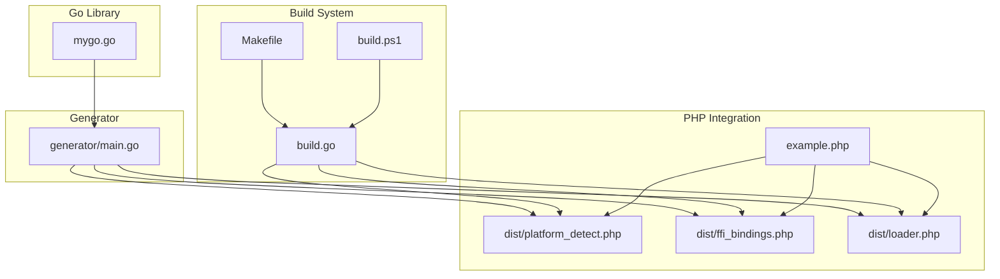
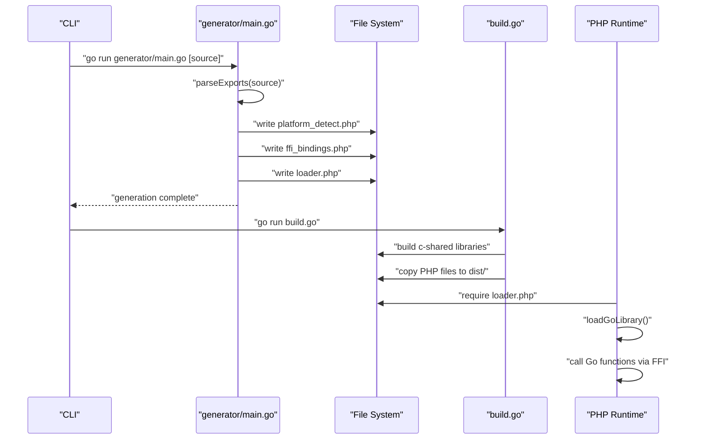
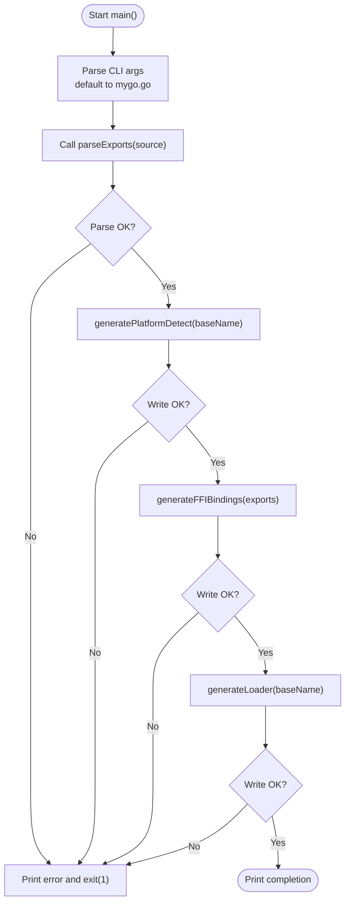
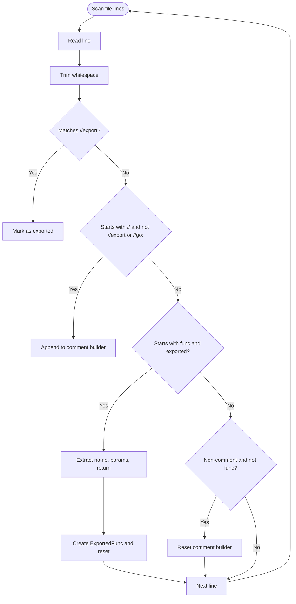
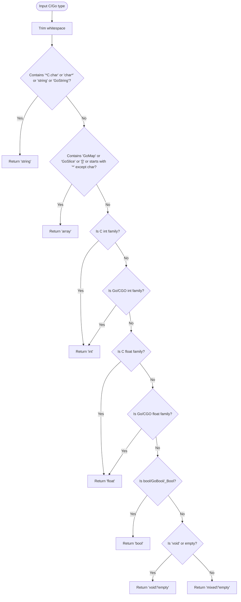
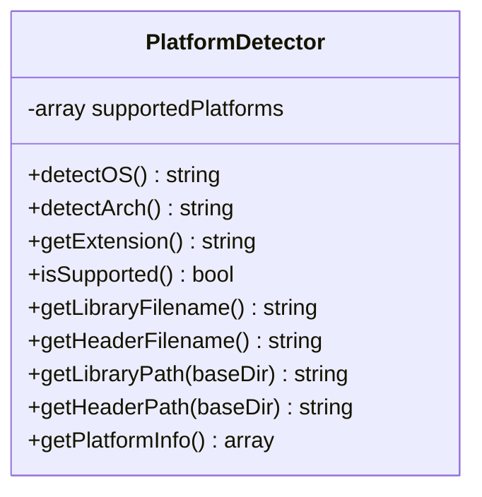
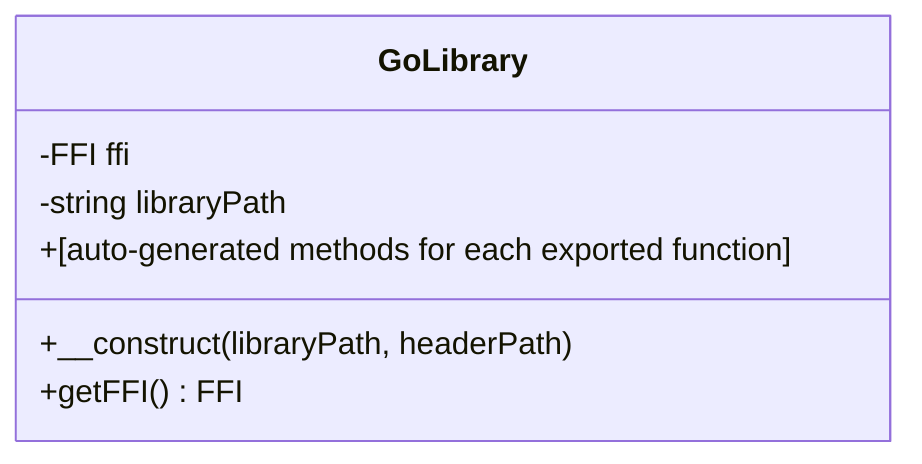
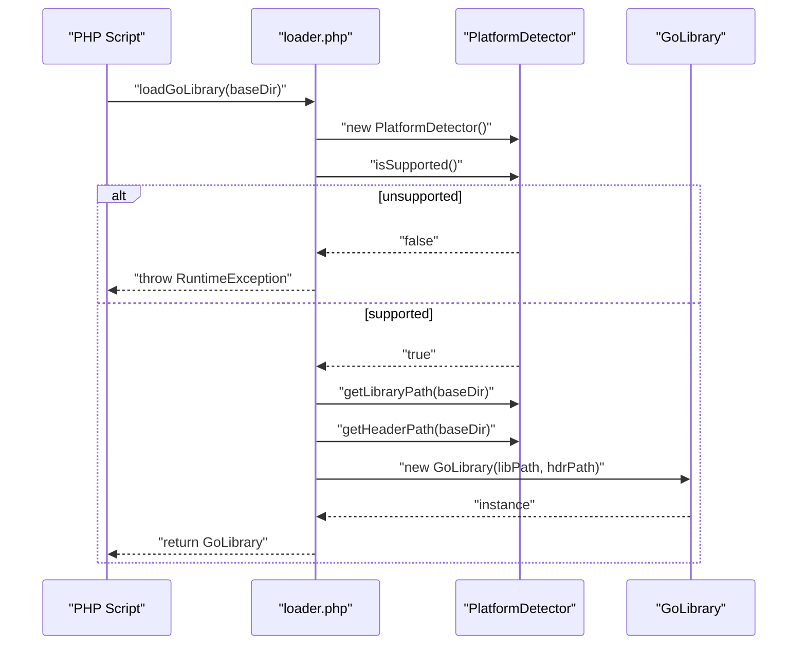
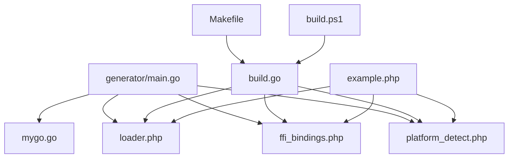
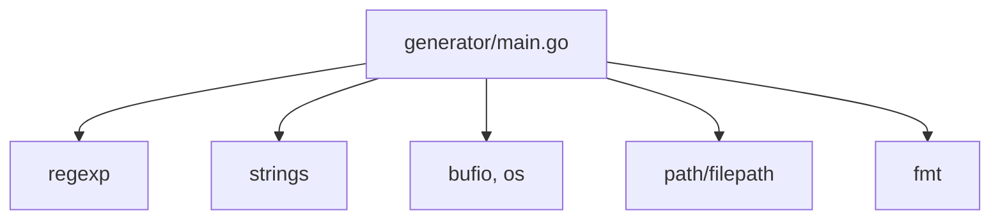

# Code Generator

<cite>
**Referenced Files in This Document**
- [generator/main.go](file://generator/main.go)
- [build.go](file://build.go)
- [mygo.go](file://mygo.go)
- [example.php](file://example.php)
- [README.md](file://README.md)
- [Makefile](file://Makefile)
- [build.ps1](file://build.ps1)
- [QUICKSTART.md](file://QUICKSTART.md)
</cite>

## Table of Contents
1. [Introduction](#introduction)
2. [Project Structure](#project-structure)
3. [Core Components](#core-components)
4. [Architecture Overview](#architecture-overview)
5. [Detailed Component Analysis](#detailed-component-analysis)
6. [Dependency Analysis](#dependency-analysis)
7. [Performance Considerations](#performance-considerations)
8. [Troubleshooting Guide](#troubleshooting-guide)
9. [Conclusion](#conclusion)
10. [Appendices](#appendices)

## Introduction
This document explains the code generator component responsible for generating PHP FFI bindings from Go source files. It covers how the generator identifies exported functions, parses signatures and types, and produces three PHP files:
- platform_detect.php: runtime platform detection and library/header path resolution
- ffi_bindings.php: a PHP FFI wrapper class exposing Go functions as PHP methods
- loader.php: a convenience function to load the correct shared library for the current platform

It also documents the main() workflow, type mapping logic, error handling strategies, and how the generator integrates with the build system and PHP integration.

## Project Structure
The generator lives under generator/main.go and works alongside the build orchestrator build.go, the example Go library mygo.go, and example usage in example.php. The README and quickstart guides describe how to use the generator and build system.

**Diagram sources**
- [generator/main.go](file://generator/main.go#L27-L75)
- [build.go](file://build.go#L41-L105)
- [Makefile](file://Makefile#L1-L54)
- [build.ps1](file://build.ps1#L1-L152)
- [mygo.go](file://mygo.go#L1-L39)
- [example.php](file://example.php#L1-L95)

**Section sources**
- [generator/main.go](file://generator/main.go#L27-L75)
- [README.md](file://README.md#L25-L41)
- [QUICKSTART.md](file://QUICKSTART.md#L57-L83)

## Core Components
- ExportedFunc and Param data structures capture parsed function metadata.
- parseExports reads the Go source file, recognizes //export directives, collects comments, and extracts function signatures and parameters.
- generatePlatformDetect writes platform detection logic to platform_detect.php.
- generateFFIBindings writes the FFI wrapper class with methods mirroring exported functions to ffi_bindings.php.
- generateLoader writes loader.php that composes platform detection and FFI loading.
- cTypeToPHPType and cTypeToPHPDoc convert C/Go types to PHPDoc-friendly hints and documentation types.

Key responsibilities:
- Parsing: scan Go file lines, match //export and func declarations, extract comments and signatures.
- Generation: emit PHP files with platform-aware paths and robust error handling.
- Type mapping: map C/Go types to PHP types for documentation and type hints.

**Section sources**
- [generator/main.go](file://generator/main.go#L12-L26)
- [generator/main.go](file://generator/main.go#L77-L145)
- [generator/main.go](file://generator/main.go#L189-L339)
- [generator/main.go](file://generator/main.go#L341-L418)
- [generator/main.go](file://generator/main.go#L481-L640)
- [generator/main.go](file://generator/main.go#L642-L705)

## Architecture Overview
The generator’s main() orchestrates:
1. Determine source file from CLI args or default to mygo.go
2. Parse exported functions
3. Generate platform_detect.php, ffi_bindings.php, and loader.php
4. Print completion and suggest running the build system

**Diagram sources**
- [generator/main.go](file://generator/main.go#L27-L75)
- [generator/main.go](file://generator/main.go#L189-L339)
- [generator/main.go](file://generator/main.go#L341-L418)
- [generator/main.go](file://generator/main.go#L642-L705)
- [build.go](file://build.go#L41-L105)
- [example.php](file://example.php#L1-L95)

## Detailed Component Analysis

### Main() Workflow
- Determines source file path from arguments or defaults to mygo.go.
- Prints base name and parses exports.
- Generates platform_detect.php, ffi_bindings.php, and loader.php.
- Exits on errors with descriptive messages.

**Diagram sources**
- [generator/main.go](file://generator/main.go#L27-L75)
- [generator/main.go](file://generator/main.go#L189-L339)
- [generator/main.go](file://generator/main.go#L341-L418)
- [generator/main.go](file://generator/main.go#L642-L705)

**Section sources**
- [generator/main.go](file://generator/main.go#L27-L75)

### Export Parsing Logic
- Uses regex to detect //export directives and function declarations.
- Collects preceding comments (ignoring //go: and //export lines).
- Builds ExportedFunc entries with name, comment, signature, return type, and parameters.
- Resets comment buffer when encountering non-comment, non-function lines.

**Diagram sources**
- [generator/main.go](file://generator/main.go#L77-L145)

**Section sources**
- [generator/main.go](file://generator/main.go#L77-L145)

### Type Mapping Logic
The generator maps C/Go types to PHP types for documentation and type hints:
- Strings: char*, *C.char, GoString, string -> string
- Arrays/Slices/Maps: []T, GoSlice, GoMap, map[K]V -> array
- Integers: int, intN, uint, uintN, C.int/C.long/C.char, GoInt/GoUint, char/short/long/long long, size_t/ssize_t -> int
- Floats: float, float32, float64, double, GoFloat32/GoFloat64, C.float/C.double -> float
- Booleans: bool, GoBool, _Bool -> bool
- Void: void, empty -> void (no type hint for void)
- Others: fallback to mixed (doc) or empty (type hint)

**Diagram sources**
- [generator/main.go](file://generator/main.go#L481-L640)

**Section sources**
- [generator/main.go](file://generator/main.go#L481-L640)

### Generated Files

#### platform_detect.php
- Provides a PlatformDetector class with methods to detect OS, architecture, supported platform, and derive library/header filenames and paths.
- Throws exceptions for unsupported OS/arch or missing platform support.
- Uses PHP_OS_FAMILY and php_uname('m') for detection.

**Diagram sources**
- [generator/main.go](file://generator/main.go#L189-L339)

**Section sources**
- [generator/main.go](file://generator/main.go#L189-L339)

#### ffi_bindings.php
- Defines a GoLibrary class wrapping FFI.
- Validates FFI extension availability and file existence.
- Loads the shared library using FFI::cdef with the header content.
- Exposes a getFFI() accessor and auto-generated wrapper methods for each exported function.
- Methods call the underlying FFI function and return values appropriately.

**Diagram sources**
- [generator/main.go](file://generator/main.go#L341-L418)

**Section sources**
- [generator/main.go](file://generator/main.go#L341-L418)

#### loader.php
- Requires platform_detect.php and ffi_bindings.php.
- Provides loadGoLibrary(baseDir) that:
  - Creates a PlatformDetector
  - Verifies platform support
  - Resolves library and header paths
  - Constructs and returns a GoLibrary instance
- Also exposes getMyGoPlatformInfo() returning platform details.

**Diagram sources**
- [generator/main.go](file://generator/main.go#L642-L705)

**Section sources**
- [generator/main.go](file://generator/main.go#L642-L705)

### Relationship to Other Components
- generator/main.go depends on mygo.go for exported function definitions and comments.
- build.go compiles c-shared libraries and copies the generated PHP files to dist/.
- example.php consumes loader.php to load the library and call exported functions.
- Makefile and build.ps1 wrap the generator and build steps for convenience.

**Diagram sources**
- [generator/main.go](file://generator/main.go#L27-L75)
- [build.go](file://build.go#L41-L105)
- [Makefile](file://Makefile#L1-L54)
- [build.ps1](file://build.ps1#L1-L152)
- [example.php](file://example.php#L1-L95)

**Section sources**
- [generator/main.go](file://generator/main.go#L27-L75)
- [build.go](file://build.go#L41-L105)
- [example.php](file://example.php#L1-L95)
- [Makefile](file://Makefile#L1-L54)
- [build.ps1](file://build.ps1#L1-L152)

## Dependency Analysis
- generator/main.go imports standard packages for file I/O, regex, and string manipulation.
- It defines internal types ExportedFunc and Param and uses them across parsing and generation functions.
- The generator is self-contained and does not depend on external libraries beyond Go stdlib.

**Diagram sources**
- [generator/main.go](file://generator/main.go#L1-L12)

**Section sources**
- [generator/main.go](file://generator/main.go#L1-L12)

## Performance Considerations
- Parsing complexity: linear in the number of lines of the Go source file.
- Generation complexity: linear in the number of exported functions and parameters.
- For large codebases, consider:
  - Limiting the number of exported functions to reduce generated PHP surface area.
  - Ensuring comments and signatures remain concise to minimize string processing.
  - Running the generator only when Go source changes to avoid unnecessary file writes.
  - Using persistent processes (PHP-FPM) to amortize FFI initialization costs.

[No sources needed since this section provides general guidance]

## Troubleshooting Guide
Common issues and resolutions:
- Incorrect type mapping
  - Cause: Unrecognized C/Go types fall back to mixed or empty hints.
  - Resolution: Ensure exported function signatures use supported types documented in the type mapping logic.
  - Reference: [generator/main.go](file://generator/main.go#L481-L640)

- Missing exports
  - Cause: //export directive not present or not immediately preceding a func declaration.
  - Resolution: Add //export directive before each function intended for binding.
  - Reference: [generator/main.go](file://generator/main.go#L77-L145), [mygo.go](file://mygo.go#L11-L39)

- Unsupported platform
  - Cause: PlatformDetector reports unsupported OS/arch.
  - Resolution: Build libraries for the current platform or extend supported platforms in build.go.
  - Reference: [generator/main.go](file://generator/main.go#L189-L339), [build.go](file://build.go#L19-L29)

- Library not found or header not found
  - Cause: FFI constructor checks file existence and throws if missing.
  - Resolution: Ensure dist/ contains the correct .so/.dll/.dylib and .h files; verify paths passed to loadGoLibrary().
  - Reference: [generator/main.go](file://generator/main.go#L341-L418)

- FFI extension disabled
  - Cause: FFI extension not loaded in PHP.
  - Resolution: Enable FFI in php.ini and restart the service.
  - Reference: [README.md](file://README.md#L240-L251)

- DLL loading errors on Windows
  - Cause: Architecture mismatch or missing runtime dependencies.
  - Resolution: Match PHP bitness with the compiled library and install required runtimes.
  - Reference: [README.md](file://README.md#L279-L295)

- Cross-compilation failures
  - Cause: Missing cross-compilers or toolchain configuration.
  - Resolution: Install required cross-compilers and configure CC environment variables.
  - Reference: [build.go](file://build.go#L108-L140), [README.md](file://README.md#L210-L237)

**Section sources**
- [generator/main.go](file://generator/main.go#L189-L339)
- [generator/main.go](file://generator/main.go#L341-L418)
- [generator/main.go](file://generator/main.go#L481-L640)
- [build.go](file://build.go#L108-L140)
- [README.md](file://README.md#L240-L295)

## Conclusion
The generator provides a streamlined way to produce PHP FFI bindings from Go exports. It parses function metadata, generates platform-aware PHP files, and integrates cleanly with the build system. By adhering to supported type mappings and ensuring proper exports, developers can reliably expose Go functions to PHP while maintaining cross-platform compatibility.

[No sources needed since this section summarizes without analyzing specific files]

## Appendices

### Example Usage from the Codebase
- The example PHP script demonstrates loading the library, retrieving platform info, and invoking exported functions.
- It also shows how to handle returned C strings and free memory via FreeString.

**Section sources**
- [example.php](file://example.php#L1-L95)

### Build System Integration
- Makefile and build.ps1 automate generation, building, copying, and testing.
- build.go compiles c-shared libraries for all supported platforms and copies generated PHP files to dist/.

**Section sources**
- [Makefile](file://Makefile#L1-L54)
- [build.ps1](file://build.ps1#L1-L152)
- [build.go](file://build.go#L41-L105)