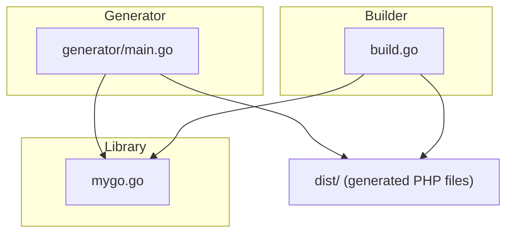
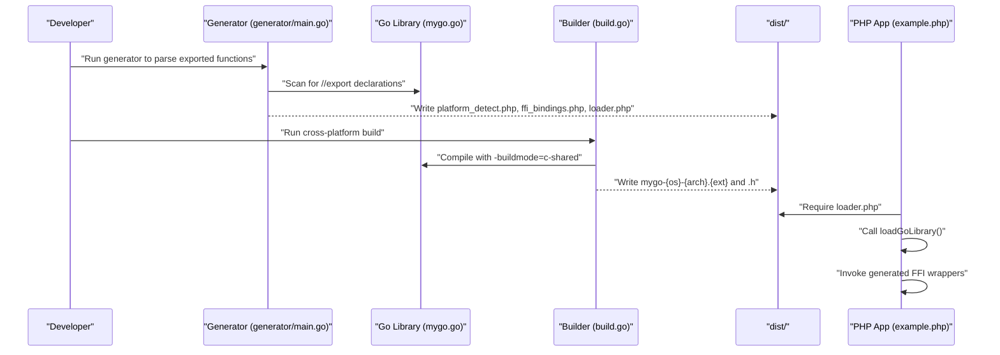
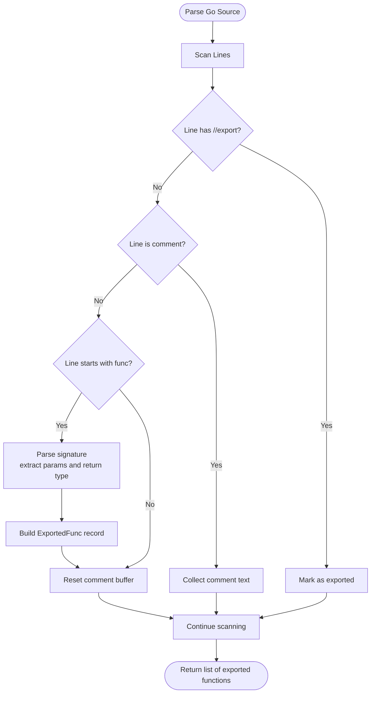
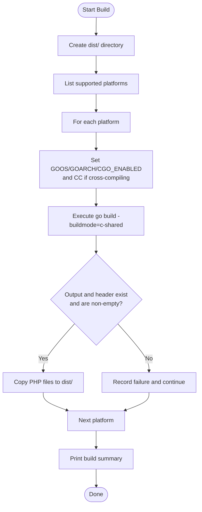
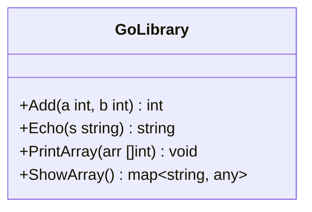
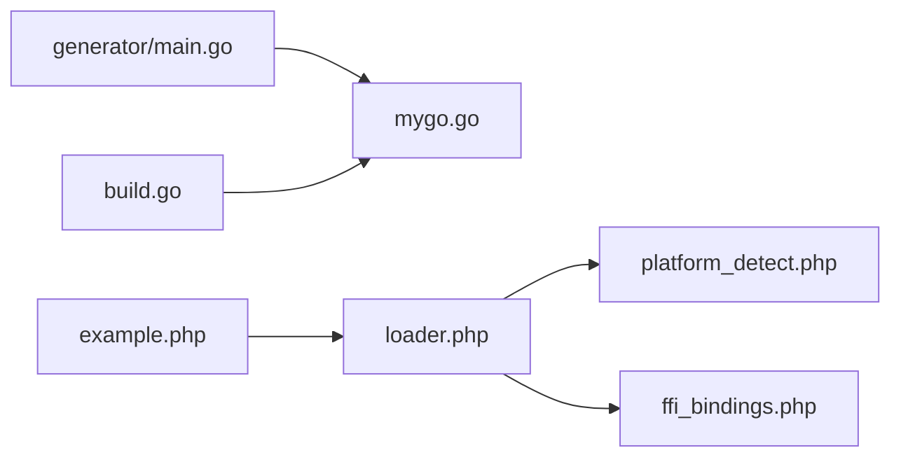

# Core Components

<cite>
**Referenced Files in This Document**
- [generator/main.go](file://generator/main.go)
- [build.go](file://build.go)
- [mygo.go](file://mygo.go)
- [README.md](file://README.md)
- [QUICKSTART.md](file://QUICKSTART.md)
- [example.php](file://example.php)
- [go.mod](file://go.mod)
</cite>

## Table of Contents
1. [Introduction](#introduction)
2. [Project Structure](#project-structure)
3. [Core Components](#core-components)
4. [Architecture Overview](#architecture-overview)
5. [Detailed Component Analysis](#detailed-component-analysis)
6. [Dependency Analysis](#dependency-analysis)
7. [Performance Considerations](#performance-considerations)
8. [Troubleshooting Guide](#troubleshooting-guide)
9. [Conclusion](#conclusion)
10. [Appendices](#appendices)

## Introduction
This document explains the core components of serviceLib: the code generator that parses Go source and generates PHP FFI bindings, the build orchestrator that compiles cross-platform shared libraries, and the Go library implementation that exposes functions for consumption by PHP. It also documents how these components interact in the development pipeline, including type mapping, library naming conventions, and error handling strategies.

## Project Structure
The repository organizes the build system around three primary components:
- generator/main.go: Parses exported Go functions and generates PHP platform detection, FFI bindings, and loader files.
- build.go: Orchestrates cross-platform compilation of shared libraries and copies generated PHP files into a distribution directory.
- mygo.go: Contains exported functions annotated with //export directives for FFI consumption.

**Diagram sources**
- [generator/main.go](file://generator/main.go#L1-L705)
- [build.go](file://build.go#L1-L183)
- [mygo.go](file://mygo.go#L1-L39)

**Section sources**
- [README.md](file://README.md#L25-L41)
- [QUICKSTART.md](file://QUICKSTART.md#L57-L67)

## Core Components
- Code generator (generator/main.go): Scans Go source for exported functions, extracts signatures and comments, and generates:
  - platform_detect.php: Runtime platform detection and file naming helpers.
  - ffi_bindings.php: PHP FFI wrapper class with typed method wrappers for each exported function.
  - loader.php: Entry point to load the platform-specific shared library and header.
- Build orchestrator (build.go): Defines supported platforms, builds shared libraries with c-shared mode, writes headers, and copies generated PHP files to dist/.
- Go library implementation (mygo.go): Exposes functions with //export directives for FFI consumption, includes minimal CGO and a placeholder main().

**Section sources**
- [generator/main.go](file://generator/main.go#L27-L75)
- [build.go](file://build.go#L12-L29)
- [mygo.go](file://mygo.go#L1-L39)

## Architecture Overview
The development pipeline integrates the generator and builder to produce platform-specific shared libraries and PHP binding files. The PHP application loads the appropriate library via the loader, which delegates to platform detection and FFI initialization.

**Diagram sources**
- [generator/main.go](file://generator/main.go#L27-L75)
- [build.go](file://build.go#L41-L105)
- [example.php](file://example.php#L1-L20)

## Detailed Component Analysis

### Code Generator (generator/main.go)
Purpose:
- Automate generation of PHP platform detection, FFI bindings, and loader files from exported Go functions.
- Provide consistent naming and type mapping for PHP consumers.

Internal logic:
- parseExports(filename): Reads the Go source file, identifies exported functions via //export comments, captures function signatures, parameters, and return types, and collects preceding comments.
- generatePlatformDetect(baseName): Emits a PHP class that detects OS family, architecture, and constructs platform-specific library/header filenames.
- generateFFIBindings(exports): Emits a PHP class that loads the shared library via FFI using the provided header and exposes typed wrapper methods mirroring the exported functions.
- generateLoader(baseName): Emits a PHP function that validates platform support, resolves library/header paths, and returns a configured FFI wrapper instance.
- Type mapping: Converts C/Go types to PHPDoc-friendly hints and documentation types for parameters and return values.

Usage patterns:
- Run the generator to update PHP bindings when exporting functions change.
- The generator writes three PHP files to the repository root; the builder copies them to dist/.

Implementation details:
- Parsing uses regular expressions to match //export directives and function declarations.
- Comments immediately preceding a function are captured and included in PHPDoc.
- Library naming follows the convention: mygo-{GOOS}-{GOARCH}.{ext}.
- Error handling prints errors to stderr and exits with non-zero status.

Examples (by path):
- Function exports in mygo.go: [Add, Echo, PrintArray, ShowArray](file://mygo.go#L13-L35)
- Generator main entrypoint and generation steps: [generator/main.go](file://generator/main.go#L27-L75)
- Platform detection logic: [generator/main.go](file://generator/main.go#L190-L339)
- FFI bindings generation: [generator/main.go](file://generator/main.go#L341-L418)
- Loader generation: [generator/main.go](file://generator/main.go#L642-L705)
- Type mapping helpers: [generator/main.go](file://generator/main.go#L481-L640)

**Diagram sources**
- [generator/main.go](file://generator/main.go#L77-L145)

**Section sources**
- [generator/main.go](file://generator/main.go#L27-L75)
- [generator/main.go](file://generator/main.go#L77-L145)
- [generator/main.go](file://generator/main.go#L190-L339)
- [generator/main.go](file://generator/main.go#L341-L418)
- [generator/main.go](file://generator/main.go#L481-L640)
- [generator/main.go](file://generator/main.go#L642-L705)

### Build Orchestrator (build.go)
Purpose:
- Compile shared libraries for multiple platforms and architectures.
- Generate corresponding C headers and copy PHP binding files to dist/.

Internal logic:
- Platform model: GOOS, GOARCH, and extension define supported targets.
- Filename generation: Outputs follow the naming convention mygo-{GOOS}-{GOARCH}.{ext} and mygo-{GOOS}-{GOARCH}.h.
- Cross-compilation: Sets environment variables (GOOS, GOARCH, CGO_ENABLED) and selects appropriate C compilers for cross-targets.
- Output verification: Confirms presence and non-empty size of output and header files.
- Distribution packaging: Copies generated PHP files to dist/.

Usage patterns:
- Build for all supported platforms: go run build.go
- Build for current platform only: go build -buildmode=c-shared ...

Implementation details:
- Supported platforms include Linux/amd64, Linux/arm64, Darwin/amd64/darwin/arm64, Windows/amd64/darwin/arm64.
- Special handling for cross-compilers (e.g., aarch64-linux-gnu-gcc, x86_64-w64-mingw32-gcc).
- Error handling reports failures and summarizes successes/failures.

Examples (by path):
- Platform definitions: [build.go](file://build.go#L12-L29)
- Output/header filename helpers: [build.go](file://build.go#L31-L39)
- Build loop and summary: [build.go](file://build.go#L41-L105)
- Cross-compilation environment setup: [build.go](file://build.go#L108-L144)
- File copying to dist: [build.go](file://build.go#L166-L183)

**Diagram sources**
- [build.go](file://build.go#L41-L105)
- [build.go](file://build.go#L108-L164)

**Section sources**
- [build.go](file://build.go#L12-L29)
- [build.go](file://build.go#L31-L39)
- [build.go](file://build.go#L41-L105)
- [build.go](file://build.go#L108-L164)
- [build.go](file://build.go#L166-L183)

### Go Library Implementation (mygo.go)
Purpose:
- Define exported functions that PHP will consume via FFI.
- Provide minimal CGO and a placeholder main() required for shared library builds.

Internal logic:
- Includes a C bridge for standard library usage.
- Declares exported functions with //export directives.
- Uses go:generate to invoke the code generator during development.

Usage patterns:
- Add new exported functions to mygo.go with //export.
- Regenerate bindings and rebuild libraries when adding/removing functions.

Implementation details:
- The example library exports functions like Add, Echo, PrintArray, and ShowArray.
- main() is required for shared library builds but is never executed at runtime.

Examples (by path):
- Exported functions: [Add, Echo, PrintArray, ShowArray](file://mygo.go#L13-L35)
- go:generate directive: [mygo.go](file://mygo.go#L11-L11)
- Placeholder main(): [mygo.go](file://mygo.go#L37-L39)

**Diagram sources**
- [mygo.go](file://mygo.go#L13-L35)

**Section sources**
- [mygo.go](file://mygo.go#L1-L39)

## Dependency Analysis
- generator/main.go depends on mygo.go for parsing exported functions and on the filesystem for writing PHP files.
- build.go depends on mygo.go for building the shared library and on the environment for cross-compilation toolchains.
- example.php depends on loader.php and the generated FFI bindings to call Go functions.

**Diagram sources**
- [generator/main.go](file://generator/main.go#L27-L75)
- [build.go](file://build.go#L41-L105)
- [example.php](file://example.php#L1-L20)

**Section sources**
- [generator/main.go](file://generator/main.go#L27-L75)
- [build.go](file://build.go#L41-L105)
- [example.php](file://example.php#L1-L20)

## Performance Considerations
- Library loading occurs once per PHP process; use persistent processes (e.g., PHP-FPM) to minimize repeated loads.
- FFI overhead is low compared to native C extensions; batch operations where possible to reduce overhead.
- String conversions between PHP and C incur overhead; free Go-allocated strings promptly to avoid leaks.

[No sources needed since this section provides general guidance]

## Troubleshooting Guide
Common issues and resolutions:
- PHP FFI not enabled: Ensure the FFI extension is enabled in php.ini.
- Library not found: Confirm that go generate was run and that the dist/ directory contains the appropriate shared library and header files.
- Platform not supported: Build for your platform or extend supported platforms in build.go.
- CGO disabled: Enable CGO and ensure a C compiler is installed.
- DLL loading errors on Windows: Match PHP architecture to the compiled DLL and install required runtime libraries if necessary.

**Section sources**
- [README.md](file://README.md#L239-L309)
- [QUICKSTART.md](file://QUICKSTART.md#L110-L134)

## Conclusion
serviceLib provides a cohesive build system for producing cross-platform Go shared libraries consumable by PHP via FFI. The generator automates binding creation, the builder handles cross-compilation and packaging, and the Go library exposes functions through //export directives. Together, they enable a streamlined development and distribution workflow.

[No sources needed since this section summarizes without analyzing specific files]

## Appendices

### Library Naming Conventions
- Output files: mygo-{GOOS}-{GOARCH}.{ext}
- Headers: mygo-{GOOS}-{GOARCH}.h
- Supported platforms include Linux/amd64, Linux/arm64, Darwin/amd64/darwin/arm64, Windows/amd64/darwin/arm64.

**Section sources**
- [README.md](file://README.md#L16-L24)
- [build.go](file://build.go#L12-L29)
- [build.go](file://build.go#L31-L39)

### Type Mapping Reference
- String types: char*, GoString, string map to PHP string.
- Arrays/slices/maps: GoMap, GoSlice, []T map to PHP array.
- Integers: C/Go integer types map to PHP int.
- Floats: float, float32, float64 map to PHP float.
- Booleans: bool, GoBool, _Bool map to PHP bool.
- Void: void maps to PHP void.

**Section sources**
- [generator/main.go](file://generator/main.go#L481-L640)

### Example Usage Patterns
- Load the library and call exported functions via the generated FFI wrappers.
- Retrieve and free C-allocated strings to prevent memory leaks.

**Section sources**
- [example.php](file://example.php#L1-L95)
- [README.md](file://README.md#L110-L149)