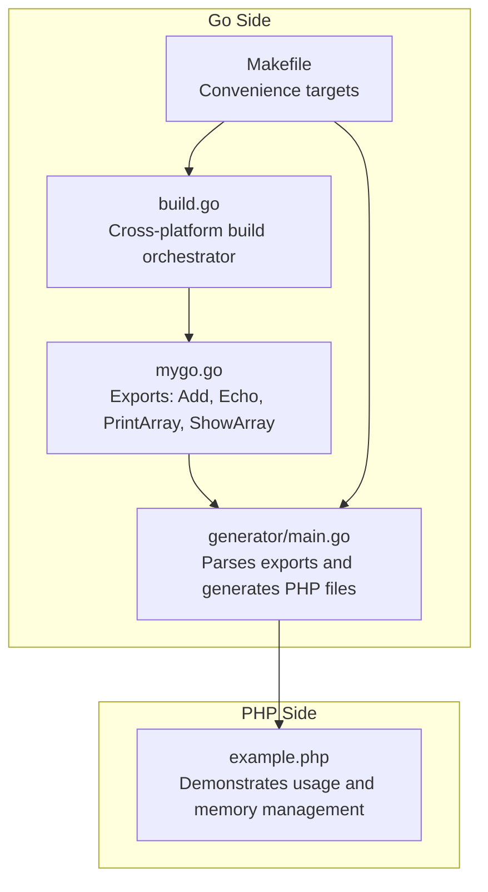
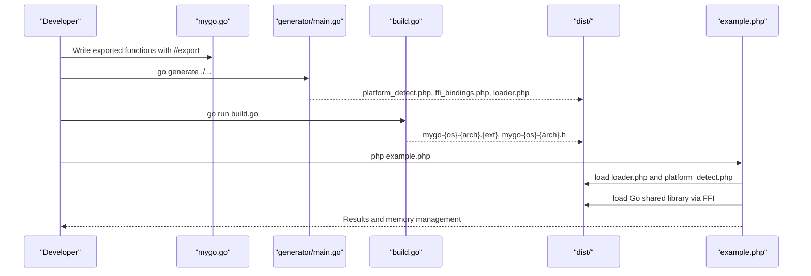
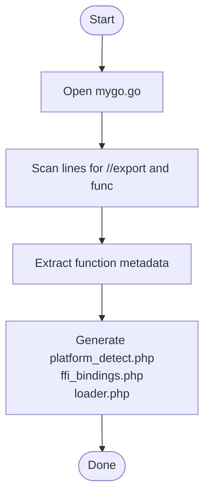
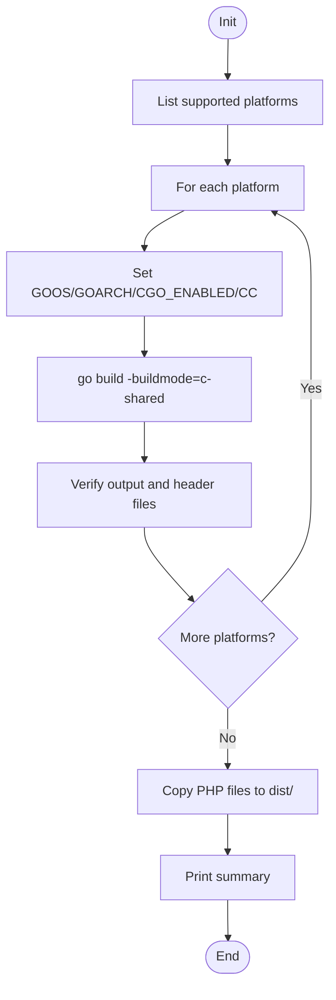
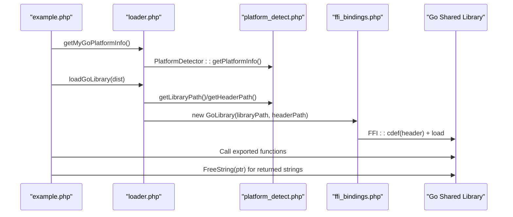
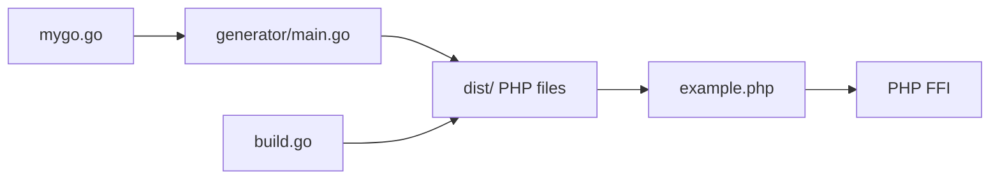

# Go Library

<cite>
**Referenced Files in This Document**
- [mygo.go](file://mygo.go)
- [generator/main.go](file://generator/main.go)
- [build.go](file://build.go)
- [example.php](file://example.php)
- [Makefile](file://Makefile)
- [README.md](file://README.md)
- [go.mod](file://go.mod)
</cite>

## Table of Contents
1. [Introduction](#introduction)
2. [Project Structure](#project-structure)
3. [Core Components](#core-components)
4. [Architecture Overview](#architecture-overview)
5. [Detailed Component Analysis](#detailed-component-analysis)
6. [Dependency Analysis](#dependency-analysis)
7. [Performance Considerations](#performance-considerations)
8. [Troubleshooting Guide](#troubleshooting-guide)
9. [Conclusion](#conclusion)
10. [Appendices](#appendices)

## Introduction
This document explains the Go library component (mygo.go) that serves as the foundation for a cross-platform shared library consumed by PHP via FFI. It covers the required CGO setup, the //go:generate directive, exported function declarations with //export comments, and the empty main() function required for shared library builds. It also documents the current exported functions (Add, Echo, PrintArray, ShowArray), their signatures and behavior, and describes how mygo.go integrates with the code generator and the build orchestrator. Finally, it addresses common issues such as CGO usage, memory management with strings, and best practices for type compatibility between Go/C and PHP.

## Project Structure
The Go library is the central piece of a build system that:
- Defines exported functions in mygo.go
- Generates PHP FFI bindings from mygo.go using a code generator
- Builds cross-platform shared libraries and corresponding headers using a Go-based orchestrator
- Provides a PHP example demonstrating usage and memory management

**Diagram sources**
- [mygo.go](file://mygo.go#L1-L39)
- [generator/main.go](file://generator/main.go#L1-L75)
- [build.go](file://build.go#L1-L183)
- [Makefile](file://Makefile#L1-L54)
- [example.php](file://example.php#L1-L95)

**Section sources**
- [mygo.go](file://mygo.go#L1-L39)
- [generator/main.go](file://generator/main.go#L1-L75)
- [build.go](file://build.go#L1-L183)
- [Makefile](file://Makefile#L1-L54)
- [README.md](file://README.md#L1-L120)

## Core Components
- mygo.go: Contains the CGO import with C stdlib, the //go:generate directive, exported functions with //export comments, and an empty main() required for shared library builds.
- generator/main.go: Parses mygo.go to extract exported functions and generates platform detection, FFI bindings, and loader PHP files.
- build.go: Orchestrates cross-platform builds for Linux, macOS, and Windows (amd64/arm64), producing shared libraries and headers, and copying generated PHP files to dist/.
- example.php: Demonstrates how to load the library and call exported functions, including proper string memory management.

**Section sources**
- [mygo.go](file://mygo.go#L1-L39)
- [generator/main.go](file://generator/main.go#L1-L120)
- [build.go](file://build.go#L1-L120)
- [example.php](file://example.php#L1-L95)

## Architecture Overview
The system follows a pipeline:
- Author functions in mygo.go with //export
- Run go generate to produce platform_detect.php, ffi_bindings.php, and loader.php
- Build shared libraries for target platforms using build.go or Makefile
- Use example.php to load the library and call functions

**Diagram sources**
- [mygo.go](file://mygo.go#L1-L39)
- [generator/main.go](file://generator/main.go#L1-L75)
- [build.go](file://build.go#L1-L183)
- [example.php](file://example.php#L1-L95)
- [Makefile](file://Makefile#L1-L54)

## Detailed Component Analysis

### mygo.go: Implementation Details
- CGO import with C stdlib: Declares C inclusion for standard library functions, enabling interop with C code when needed.
- //go:generate directive: Invokes the code generator to produce PHP binding files from mygo.go.
- Exported functions:
  - Add(a, b int) int: Adds two integers and returns the sum.
  - Echo(s string) string: Returns the input string unchanged.
  - PrintArray(arr []int): Iterates over an integer slice and prints index/value pairs.
  - ShowArray() map[string]any: Returns a heterogeneous map suitable for FFI consumption.
- Empty main(): Required for shared library builds; it is never called at runtime.

Behavioral notes:
- Add and Echo demonstrate basic scalar and string handling.
- PrintArray showcases iteration over slices and printing to stdout.
- ShowArray returns a Go map that the generator maps to PHP arrays.

Best practices observed:
- Use //export for functions intended for FFI.
- Keep exported functions pure and deterministic where possible.
- Avoid returning Go-managed pointers directly to PHP; prefer primitives, arrays/maps, or documented memory management patterns.

**Section sources**
- [mygo.go](file://mygo.go#L1-L39)

### Code Generator: How it Uses mygo.go
The generator parses mygo.go to:
- Extract exported functions marked with //export
- Capture function comments and signatures
- Generate platform_detect.php, ffi_bindings.php, and loader.php

Key behaviors:
- parseExports scans mygo.go and identifies exported functions and their comments/signatures.
- generateFFIBindings creates a PHP class that wraps FFI calls to the Go functions.
- generateLoader provides convenience functions to load the platform-specific library and header.

**Diagram sources**
- [generator/main.go](file://generator/main.go#L77-L145)
- [generator/main.go](file://generator/main.go#L341-L418)
- [generator/main.go](file://generator/main.go#L642-L705)

**Section sources**
- [generator/main.go](file://generator/main.go#L77-L145)
- [generator/main.go](file://generator/main.go#L341-L418)
- [generator/main.go](file://generator/main.go#L642-L705)

### Build Orchestrator: Cross-Platform Builds
The orchestrator:
- Defines supported platforms and their extensions.
- Builds shared libraries with -buildmode=c-shared for each platform.
- Sets environment variables for cross-compilation (GOOS, GOARCH, CGO_ENABLED, CC).
- Verifies output and header files are created and non-empty.
- Copies generated PHP files to dist/.

**Diagram sources**
- [build.go](file://build.go#L19-L29)
- [build.go](file://build.go#L107-L164)
- [build.go](file://build.go#L166-L183)

**Section sources**
- [build.go](file://build.go#L19-L29)
- [build.go](file://build.go#L107-L164)
- [build.go](file://build.go#L166-L183)

### PHP Example: Usage and Memory Management
The example demonstrates:
- Loading platform information and the Go library via loader.php
- Calling exported functions (e.g., Add)
- Handling strings returned from Go by converting with FFI::string and freeing with FreeString
- Error handling and status checks

**Diagram sources**
- [example.php](file://example.php#L1-L95)
- [generator/main.go](file://generator/main.go#L341-L418)
- [generator/main.go](file://generator/main.go#L642-L705)

**Section sources**
- [example.php](file://example.php#L1-L95)
- [generator/main.go](file://generator/main.go#L341-L418)
- [generator/main.go](file://generator/main.go#L642-L705)

## Dependency Analysis
- mygo.go depends on:
  - C stdlib via CGO for potential interop
  - //go:generate directive to invoke generator/main.go
  - Empty main() for shared library builds
- generator/main.go depends on:
  - mygo.go for parsing exported functions
  - Filesystem for writing generated PHP files
- build.go depends on:
  - Go toolchain and cross-compilers
  - Filesystem for output and verification
- example.php depends on:
  - Generated PHP files (platform_detect.php, ffi_bindings.php, loader.php)
  - FFI extension availability

**Diagram sources**
- [mygo.go](file://mygo.go#L1-L39)
- [generator/main.go](file://generator/main.go#L1-L75)
- [build.go](file://build.go#L1-L183)
- [example.php](file://example.php#L1-L95)

**Section sources**
- [mygo.go](file://mygo.go#L1-L39)
- [generator/main.go](file://generator/main.go#L1-L75)
- [build.go](file://build.go#L1-L183)
- [example.php](file://example.php#L1-L95)

## Performance Considerations
- Library loading occurs once per process; use persistent PHP processes (e.g., PHP-FPM) to minimize overhead.
- FFI overhead is minimal compared to native C extensions.
- String conversions between PHP and C incur overhead; batch operations when possible.
- Avoid unnecessary allocations in exported functions to reduce GC pressure.

[No sources needed since this section provides general guidance]

## Troubleshooting Guide
Common issues and resolutions:
- PHP FFI not enabled: Ensure the FFI extension is enabled in php.ini.
- Library not found: Confirm that go generate was run and that dist/ contains the correct shared library and header files.
- Platform not supported: Build for your platform or add support in build.go.
- CGO not enabled: Set CGO_ENABLED=1 and ensure a C compiler is installed.
- DLL loading errors on Windows: Match PHP architecture with the compiled library and install required runtime dependencies.
- Memory leaks with strings: Always free Go-allocated strings in PHP using the documented memory management pattern.

**Section sources**
- [README.md](file://README.md#L238-L309)
- [example.php](file://example.php#L54-L86)

## Conclusion
The Go library component (mygo.go) provides a minimal yet robust foundation for cross-platform shared libraries consumed by PHP via FFI. With proper use of //export, CGO, and the build pipeline, developers can quickly add new functions, regenerate bindings, and distribute libraries across platforms. Following the best practices outlined here—especially around memory management and type compatibility—will ensure reliable and efficient integration.

[No sources needed since this section summarizes without analyzing specific files]

## Appendices

### Exported Functions Reference
- Add(a, b int) int
  - Purpose: Adds two integers.
  - Behavior: Returns the arithmetic sum.
  - Example usage: Called from PHP via the generated FFI bindings.
- Echo(s string) string
  - Purpose: Returns the input string unchanged.
  - Behavior: Identity function for strings.
  - Example usage: Demonstrates string handling in FFI.
- PrintArray(arr []int)
  - Purpose: Prints each element of an integer slice with its index.
  - Behavior: Iterates and prints to stdout.
  - Example usage: Demonstrates slice handling in FFI.
- ShowArray() map[string]any
  - Purpose: Returns a heterogeneous map suitable for FFI consumption.
  - Behavior: Provides a structured data payload.
  - Example usage: Demonstrates map handling in FFI.

**Section sources**
- [mygo.go](file://mygo.go#L13-L35)
- [generator/main.go](file://generator/main.go#L420-L479)

### Build Targets and Commands
- make all: Generates bindings and builds for all platforms.
- make generate: Runs go generate to produce PHP files.
- make build: Executes go run build.go for cross-platform builds.
- make build-current: Builds for the current platform only.
- make test: Builds current platform and runs the PHP example.
- make clean: Removes generated artifacts.

**Section sources**
- [Makefile](file://Makefile#L1-L54)
- [README.md](file://README.md#L66-L109)

### Module and Toolchain Notes
- Module: serviceLib
- Go version: 1.25.1

**Section sources**
- [go.mod](file://go.mod#L1-L4)