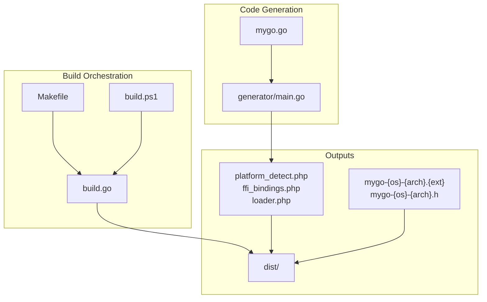
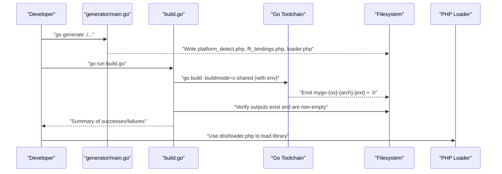
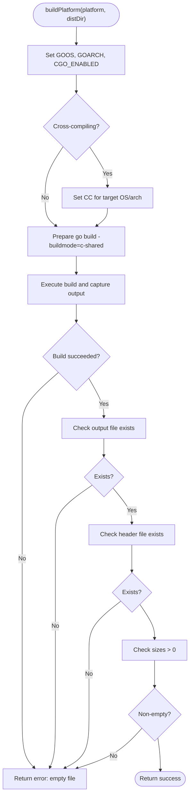
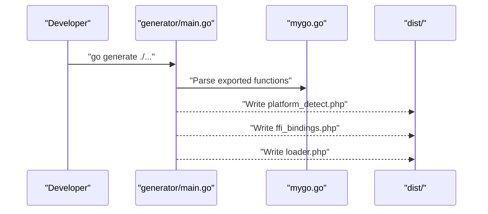
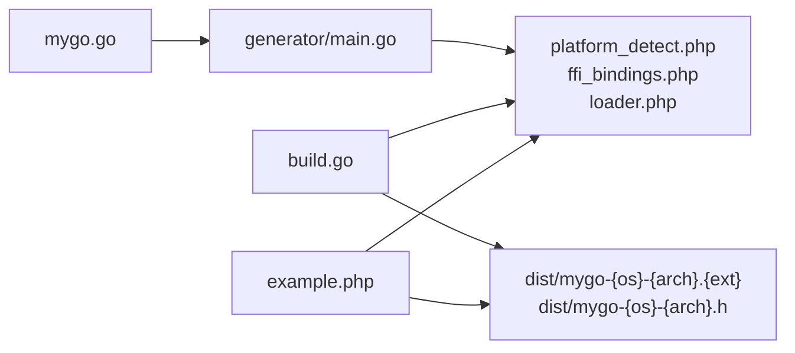

# Cross-Platform Compilation

<cite>
**Referenced Files in This Document**
- [build.go](file://build.go)
- [README.md](file://README.md)
- [QUICKSTART.md](file://QUICKSTART.md)
- [Makefile](file://Makefile)
- [build.ps1](file://build.ps1)
- [generator/main.go](file://generator/main.go)
- [mygo.go](file://mygo.go)
- [example.php](file://example.php)
</cite>

## Table of Contents
1. [Introduction](#introduction)
2. [Project Structure](#project-structure)
3. [Core Components](#core-components)
4. [Architecture Overview](#architecture-overview)
5. [Detailed Component Analysis](#detailed-component-analysis)
6. [Dependency Analysis](#dependency-analysis)
7. [Performance Considerations](#performance-considerations)
8. [Troubleshooting Guide](#troubleshooting-guide)
9. [Conclusion](#conclusion)
10. [Appendices](#appendices)

## Introduction
This document explains how the build system orchestrates cross-platform compilation of Go shared libraries using CGO and cross-compilation. It focuses on the build orchestration logic in build.go, the Platform struct that defines target operating systems (GOOS) and architectures (GOARCH), and the buildPlatform function’s environment variable setup and output verification. It also covers the standardized output naming convention, header file generation, and practical troubleshooting for common cross-compilation prerequisites and errors.

## Project Structure
The build system centers around a small set of files that coordinate code generation, cross-compilation, and packaging:

- build.go: Orchestrates cross-platform builds, sets environment variables, invokes the Go toolchain, and verifies outputs.
- generator/main.go: Parses exported functions from mygo.go and auto-generates PHP binding files (platform_detect.php, ffi_bindings.php, loader.php).
- mygo.go: Contains exported functions annotated with //export and a go:generate directive to trigger code generation.
- Makefile and build.ps1: Convenience wrappers for generating bindings, building current platform, building all platforms, testing, and cleaning.
- example.php: Demonstrates loading and using the compiled shared library via PHP FFI.

**Diagram sources**
- [build.go](file://build.go#L1-L183)
- [generator/main.go](file://generator/main.go#L1-L705)
- [mygo.go](file://mygo.go#L1-L39)
- [Makefile](file://Makefile#L1-L54)
- [build.ps1](file://build.ps1#L1-L152)

**Section sources**
- [build.go](file://build.go#L1-L183)
- [generator/main.go](file://generator/main.go#L1-L705)
- [mygo.go](file://mygo.go#L1-L39)
- [Makefile](file://Makefile#L1-L54)
- [build.ps1](file://build.ps1#L1-L152)

## Core Components
- Platform struct: Defines a target platform with GOOS, GOARCH, and the expected shared library extension (.so, .dylib, .dll).
- getSupportedPlatforms: Returns the list of supported platforms (linux/amd64, linux/arm64, darwin/amd64, darwin/arm64, windows/amd64, windows/arm64).
- buildPlatform: Executes cross-compilation for a given platform, sets environment variables (GOOS, GOARCH, CGO_ENABLED), selects a C compiler for cross-compilation, runs the build, and verifies outputs.
- Output naming: mygo-{GOOS}-{GOARCH}.{ext} for the shared library and mygo-{GOOS}-{GOARCH}.h for the header.
- Verification: Ensures both the shared library and header exist and are non-empty.

Key responsibilities:
- Cross-compilation orchestration and environment setup
- Output validation and error reporting
- Packaging of PHP binding files alongside binaries

**Section sources**
- [build.go](file://build.go#L12-L39)
- [build.go](file://build.go#L107-L164)
- [README.md](file://README.md#L1-L120)

## Architecture Overview
The build system integrates code generation and cross-compilation into a cohesive workflow:

**Diagram sources**
- [generator/main.go](file://generator/main.go#L1-L120)
- [build.go](file://build.go#L107-L164)
- [example.php](file://example.php#L1-L30)

## Detailed Component Analysis

### Platform Struct and Supported Platforms
The Platform struct encapsulates target platform metadata and naming helpers:
- Fields: GOOS, GOARCH, Extension
- Methods:
  - getOutputFilename: Produces the shared library filename using the standardized naming scheme.
  - getHeaderFilename: Produces the corresponding C header filename.

Supported platforms are defined centrally and include:
- Linux amd64 and arm64 (.so)
- macOS amd64 and arm64 (.dylib)
- Windows amd64 and arm64 (.dll)

These choices align with the README’s supported platforms and the build orchestration logic.

**Section sources**
- [build.go](file://build.go#L12-L39)
- [README.md](file://README.md#L14-L24)

### build.go Orchestration and buildPlatform Logic
The build orchestrator performs the following steps for each platform:

- Creates the dist directory if it does not exist.
- Iterates over supported platforms and calls buildPlatform for each.
- Copies generated PHP files to dist after building.
- Prints a summary of successes and failures.

buildPlatform performs the core cross-compilation logic:
- Sets up the build command with -buildmode=c-shared and the output path derived from getOutputFilename.
- Prepares environment variables:
  - GOOS and GOARCH from the target Platform
  - CGO_ENABLED=1 to enable CGO for cross-compilation
- Special compiler assignment for cross-compilation:
  - Linux arm64: CC=aarch64-linux-gnu-gcc
  - Windows amd64: CC=x86_64-w64-mingw32-gcc
  - Windows arm64: CC=aarch64-w64-mingw32-gcc
- Executes the build and captures combined output.
- Verifies:
  - Output file exists
  - Header file exists
  - Both files are non-empty

Success and failure handling:
- On failure, returns an error including the captured output for diagnostics.
- On success, returns nil and prints the resulting filename.

**Diagram sources**
- [build.go](file://build.go#L107-L164)

**Section sources**
- [build.go](file://build.go#L41-L106)
- [build.go](file://build.go#L107-L164)

### Output Naming Convention and Header Generation
- Standardized naming: mygo-{GOOS}-{GOARCH}.{ext}
  - Linux: .so
  - macOS: .dylib
  - Windows: .dll
- Header files: mygo-{GOOS}-{GOARCH}.h
- These filenames are derived from Platform methods and verified by buildPlatform.

Verification ensures both the binary and header are present and non-empty, preventing partial or failed builds from being considered successful.

**Section sources**
- [build.go](file://build.go#L31-L39)
- [build.go](file://build.go#L145-L163)
- [README.md](file://README.md#L1-L120)

### Code Generation and PHP Binding Files
The generator parses exported functions from mygo.go and produces:
- platform_detect.php: Platform detection and filename helpers
- ffi_bindings.php: PHP FFI wrapper class exposing Go functions
- loader.php: Main loader that detects the platform and loads the library

The mygo.go file includes a go:generate directive that triggers the generator during development.

**Diagram sources**
- [generator/main.go](file://generator/main.go#L1-L120)
- [mygo.go](file://mygo.go#L1-L13)

**Section sources**
- [generator/main.go](file://generator/main.go#L1-L120)
- [mygo.go](file://mygo.go#L1-L13)

### Build Scripts and Convenience Wrappers
- Makefile:
  - generate: Runs go generate
  - build: Runs go run build.go
  - build-current: Builds for the current platform only
  - test: Builds current platform and runs example.php
  - clean: Removes dist and generated PHP files
- build.ps1:
  - Provides equivalent commands for Windows PowerShell, including build, build-current, test, and clean

These scripts streamline the developer workflow and complement the cross-platform build orchestration.

**Section sources**
- [Makefile](file://Makefile#L1-L54)
- [build.ps1](file://build.ps1#L1-L152)

## Dependency Analysis
The build system exhibits clear separation of concerns:
- build.go depends on:
  - Platform struct and its methods for naming
  - Go toolchain for cross-compilation
  - Filesystem for output verification and copying
- generator/main.go depends on:
  - mygo.go for parsing exported functions
  - Filesystem for writing generated PHP files
- example.php depends on loader.php and the generated PHP files to demonstrate usage

**Diagram sources**
- [generator/main.go](file://generator/main.go#L1-L120)
- [build.go](file://build.go#L107-L164)
- [example.php](file://example.php#L1-L30)

**Section sources**
- [build.go](file://build.go#L107-L164)
- [generator/main.go](file://generator/main.go#L1-L120)
- [example.php](file://example.php#L1-L30)

## Performance Considerations
- Building for all platforms can be time-consuming due to cross-compilation and toolchain overhead. Consider building only the current platform for local development and reserving multi-platform builds for CI or release preparation.
- Packaging PHP files with binaries reduces runtime discovery complexity and improves reliability.

[No sources needed since this section provides general guidance]

## Troubleshooting Guide
Common cross-compilation prerequisites and fixes:

- CGO not enabled:
  - Ensure CGO_ENABLED=1 is set in the environment when cross-compiling.
  - Install a C compiler appropriate to the target platform (GCC/Clang).
- Missing cross-compilers:
  - Linux arm64: aarch64-linux-gnu-gcc
  - Windows amd64: x86_64-w64-mingw32-gcc
  - Windows arm64: aarch64-w64-mingw32-gcc
- PHP FFI not enabled:
  - Confirm the FFI extension is enabled in php.ini and restart the web server or PHP-FPM.
- Architecture mismatch (Windows):
  - Ensure PHP and the compiled DLL match bitness (both 64-bit or both 32-bit).
- Missing dependencies (Windows):
  - Install required runtime libraries (e.g., Visual C++ Redistributable) if the DLL fails to load.
- Antivirus interference:
  - Some antivirus software blocks DLL loading; add exceptions if necessary.

Build-time diagnostics:
- The build system captures and reports combined output on failure, aiding quick diagnosis.
- Verification checks ensure both the shared library and header are created and non-empty.

**Section sources**
- [build.go](file://build.go#L122-L137)
- [build.go](file://build.go#L140-L163)
- [README.md](file://README.md#L239-L309)

## Conclusion
The build system provides a robust, automated pipeline for generating PHP FFI bindings and compiling Go shared libraries across multiple platforms. The Platform struct and buildPlatform function centralize cross-compilation logic, environment setup, and output verification. By adhering to the standardized naming convention and verifying outputs, the system ensures reliable distribution and consumption of platform-specific binaries.

[No sources needed since this section summarizes without analyzing specific files]

## Appendices

### Supported Platforms Reference
- Linux: amd64 (.so), arm64 (.so)
- macOS: amd64 (.dylib), arm64 (.dylib)
- Windows: amd64 (.dll), arm64 (.dll)

**Section sources**
- [README.md](file://README.md#L14-L24)
- [build.go](file://build.go#L19-L29)

### Example Usage and Verification
- The example demonstrates loading the library via loader.php and invoking exported functions, validating the integration between generated PHP bindings and compiled shared libraries.

**Section sources**
- [example.php](file://example.php#L1-L30)