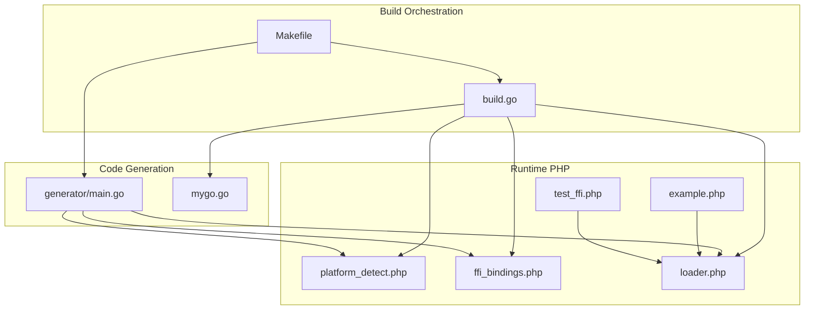
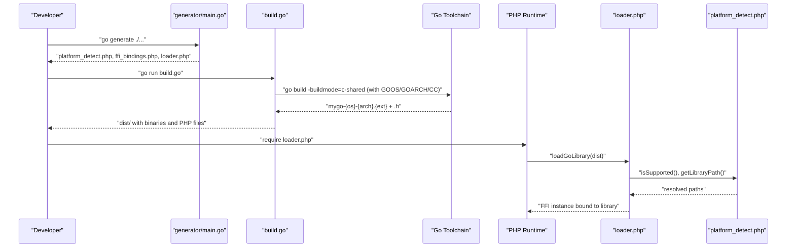
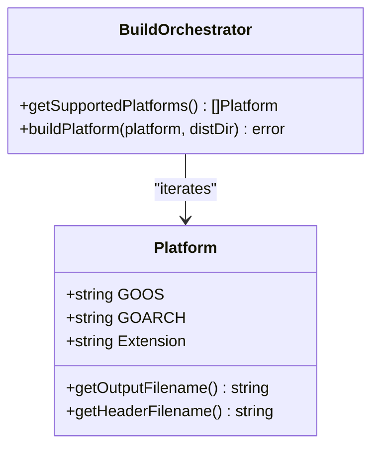
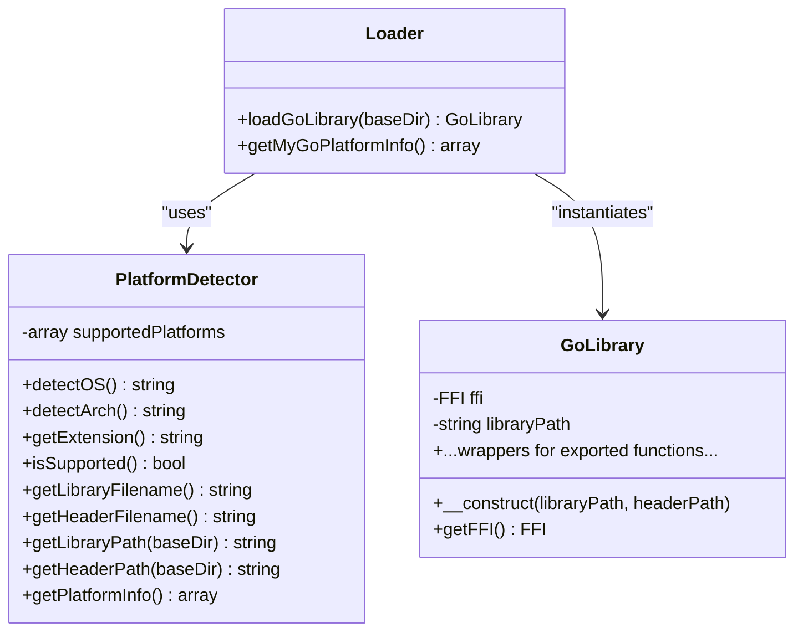
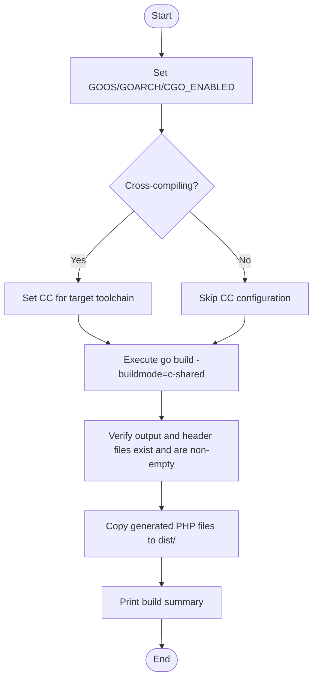
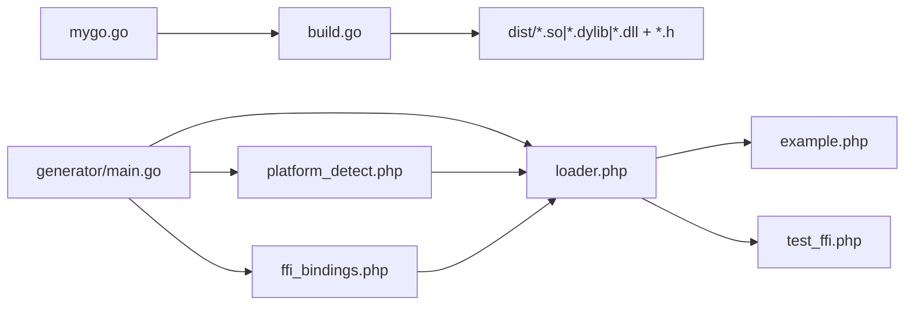

# Cross-Platform Support

<cite>
**Referenced Files in This Document**
- [build.go](file://build.go)
- [generator/main.go](file://generator/main.go)
- [mygo.go](file://mygo.go)
- [README.md](file://README.md)
- [AGENTS.MD](file://AGENTS.MD)
- [Makefile](file://Makefile)
- [example.php](file://example.php)
- [test_ffi.php](file://test_ffi.php)
</cite>

## Table of Contents
1. [Introduction](#introduction)
2. [Project Structure](#project-structure)
3. [Core Components](#core-components)
4. [Architecture Overview](#architecture-overview)
5. [Detailed Component Analysis](#detailed-component-analysis)
6. [Dependency Analysis](#dependency-analysis)
7. [Performance Considerations](#performance-considerations)
8. [Troubleshooting Guide](#troubleshooting-guide)
9. [Conclusion](#conclusion)
10. [Appendices](#appendices)

## Introduction
This document explains how the project achieves cross-platform capabilities for building Go shared libraries consumable by PHP via FFI. It focuses on:
- How build.go manages platform-specific compilation for GOOS and GOARCH combinations
- Supported platforms and their library naming conventions
- Platform detection and automatic library loading in generated PHP code
- Setup instructions for cross-compilation toolchains
- Guidelines for adding new platforms
- Handling platform-specific dependencies and binary compatibility

## Project Structure
The repository organizes cross-platform concerns across a small set of focused files:
- build.go: Orchestrates cross-compilation and emits platform-specific binaries and headers
- generator/main.go: Parses exported Go functions and generates PHP FFI bindings, platform detection, and loader
- mygo.go: Example Go library with exported functions for FFI consumption
- README.md and AGENTS.MD: Documentation covering supported platforms, build steps, and troubleshooting
- Makefile: Convenience targets for generating bindings and building across platforms
- example.php and test_ffi.php: Usage examples and diagnostics for FFI loading

**Diagram sources**
- [build.go](file://build.go#L1-L183)
- [generator/main.go](file://generator/main.go#L1-L705)
- [Makefile](file://Makefile#L1-L54)
- [example.php](file://example.php#L1-L95)
- [test_ffi.php](file://test_ffi.php#L1-L31)

**Section sources**
- [README.md](file://README.md#L1-L120)
- [AGENTS.MD](file://AGENTS.MD#L1-L120)

## Core Components
- Platform configuration and naming:
  - build.go defines supported platforms and computes output/header filenames using a standardized naming scheme.
  - generator/main.go mirrors supported platforms in its platform detection logic and generates platform-specific filenames.
- Cross-compilation orchestration:
  - build.go sets GOOS, GOARCH, CGO_ENABLED, and selects a C compiler when cross-compiling.
  - Makefile provides convenience targets for current-platform builds and multi-platform builds.
- Runtime platform detection and loader:
  - generator/main.go produces platform_detect.php that detects OS family, architecture, and constructs the correct library and header filenames.
  - loader.php uses platform_detect.php to locate and load the correct shared library via FFI.

**Section sources**
- [build.go](file://build.go#L12-L39)
- [generator/main.go](file://generator/main.go#L190-L339)
- [Makefile](file://Makefile#L1-L54)

## Architecture Overview
The cross-platform pipeline consists of:
- Code generation phase: generator parses exported functions and writes platform detection, FFI bindings, and loader PHP files.
- Build phase: build.go iterates supported platforms, sets environment variables, configures cross-compilers, builds c-shared libraries, and verifies outputs.
- Runtime phase: PHP code uses loader.php to detect the platform and load the correct library via FFI.

**Diagram sources**
- [generator/main.go](file://generator/main.go#L1-L120)
- [generator/main.go](file://generator/main.go#L642-L704)
- [build.go](file://build.go#L107-L164)
- [example.php](file://example.php#L1-L30)

## Detailed Component Analysis

### Platform Configuration and Naming in build.go
- Supported platforms:
  - Linux/amd64 and Linux/arm64 produce .so
  - Darwin/amd64 and Darwin/arm64 produce .dylib
  - Windows/amd64 and Windows/arm64 produce .dll
- Output naming:
  - Libraries: mygo-{GOOS}-{GOARCH}.{ext}
  - Headers: mygo-{GOOS}-{GOARCH}.h
- Cross-compilation environment:
  - GOOS, GOARCH, CGO_ENABLED are set per-platform
  - CC is configured for cross-compilers when needed (e.g., MinGW for Windows, aarch64-linux-gnu-gcc for Linux ARM64)
- Verification:
  - build.go checks that output and header files exist and are non-empty

**Diagram sources**
- [build.go](file://build.go#L12-L39)
- [build.go](file://build.go#L107-L164)

**Section sources**
- [build.go](file://build.go#L12-L39)
- [build.go](file://build.go#L107-L164)
- [README.md](file://README.md#L14-L24)

### Platform Detection and Loader in generator/main.go
- PlatformDetector:
  - Detects OS family and maps to lowercase identifiers
  - Detects architecture and maps to amd64/arm64
  - Determines file extension based on supported platforms
  - Computes library and header filenames using the base name and detected platform
- Loader:
  - loadGoLibrary validates platform support, resolves paths, and constructs a GoLibrary instance via FFI
  - Provides getMyGoPlatformInfo for diagnostics

**Diagram sources**
- [generator/main.go](file://generator/main.go#L190-L339)
- [generator/main.go](file://generator/main.go#L341-L418)
- [generator/main.go](file://generator/main.go#L642-L704)

**Section sources**
- [generator/main.go](file://generator/main.go#L190-L339)
- [generator/main.go](file://generator/main.go#L642-L704)

### Cross-Compilation Orchestration and Toolchains
- Environment variables:
  - GOOS, GOARCH, CGO_ENABLED are set per-platform
  - CC is set conditionally for cross-compilation scenarios
- Toolchain requirements:
  - Linux to Windows: mingw-w64 (x86_64-w64-mingw32-gcc or aarch64-w64-mingw32-gcc)
  - Linux to ARM64: aarch64-linux-gnu-gcc
  - macOS builds: clang (Xcode Command Line Tools)
- Makefile targets:
  - generate: runs code generation
  - build: runs build.go for all platforms
  - build-current: builds for the current host platform
  - test: builds current and runs example.php
  - clean: removes artifacts

**Diagram sources**
- [build.go](file://build.go#L107-L164)
- [Makefile](file://Makefile#L1-L54)

**Section sources**
- [build.go](file://build.go#L112-L137)
- [README.md](file://README.md#L210-L237)
- [AGENTS.MD](file://AGENTS.MD#L119-L128)
- [Makefile](file://Makefile#L1-L54)

### Runtime Usage and Diagnostics
- example.php demonstrates:
  - Retrieving platform information
  - Loading the library via loader.php
  - Calling exported functions and handling returned strings
- test_ffi.php provides low-level diagnostics:
  - Prints PHP architecture and OS family
  - Verifies presence and size of target DLL
  - Attempts FFI::cdef to load the DLL and call a function

**Section sources**
- [example.php](file://example.php#L1-L95)
- [test_ffi.php](file://test_ffi.php#L1-L31)

## Dependency Analysis
- build.go depends on:
  - mygo.go for exported functions
  - OS environment for cross-compilation toolchain selection
- generator/main.go depends on:
  - mygo.go for parsing exported functions
  - PHP runtime for platform detection and FFI loading
- example.php and test_ffi.php depend on:
  - loader.php and platform_detect.php for platform-aware loading

**Diagram sources**
- [build.go](file://build.go#L107-L164)
- [generator/main.go](file://generator/main.go#L1-L120)
- [example.php](file://example.php#L1-L30)
- [test_ffi.php](file://test_ffi.php#L1-L31)

**Section sources**
- [build.go](file://build.go#L107-L164)
- [generator/main.go](file://generator/main.go#L1-L120)

## Performance Considerations
- Library loading occurs once per process; using persistent PHP processes (e.g., PHP-FPM) reduces repeated overhead.
- FFI overhead is minimal compared to native C extensions.
- String conversion between PHP and C has overhead; batch operations where possible.
- Proper memory management: always free Go-allocated strings to prevent leaks.

[No sources needed since this section provides general guidance]

## Troubleshooting Guide
Common issues and resolutions:
- PHP FFI not enabled:
  - Ensure the FFI extension is enabled in php.ini and restart the service.
- Library not found:
  - Confirm that go generate and build were executed and that dist contains the correct .so/.dll/.dylib file.
- Unsupported platform:
  - Build for your platform or add support in build.go and update platform detection logic.
- CGO disabled:
  - Ensure CGO_ENABLED=1 and a C compiler is installed.
- DLL loading errors on Windows:
  - Verify architecture match (32-bit vs 64-bit) and install required runtime libraries if needed.

**Section sources**
- [README.md](file://README.md#L238-L309)

## Conclusion
The project provides a robust, automated cross-platform build and runtime system:
- build.go centralizes platform configuration and cross-compilation logic
- generator/main.go ensures PHP consumers can automatically detect and load the correct library
- Documentation and scripts streamline setup and troubleshooting

[No sources needed since this section summarizes without analyzing specific files]

## Appendices

### Supported Platforms and Naming Conventions
- Supported combinations:
  - Linux/amd64 (.so), Linux/arm64 (.so)
  - Darwin/amd64 (.dylib), Darwin/arm64 (.dylib)
  - Windows/amd64 (.dll), Windows/arm64 (.dll)
- Naming:
  - Libraries: mygo-{GOOS}-{GOARCH}.{ext}
  - Headers: mygo-{GOOS}-{GOARCH}.h

**Section sources**
- [build.go](file://build.go#L12-L39)
- [generator/main.go](file://generator/main.go#L282-L319)
- [README.md](file://README.md#L14-L24)

### Adding Support for New Platforms
Steps:
- Extend supported platforms in build.go
- Update platform detection logic in generator/main.go to include the new OS/arch combination
- Configure cross-compilers if needed
- Update documentation and verification scripts

**Section sources**
- [AGENTS.MD](file://AGENTS.MD#L541-L547)
- [build.go](file://build.go#L12-L39)
- [generator/main.go](file://generator/main.go#L190-L339)

### Cross-Compilation Toolchain Setup
- Linux to Windows:
  - Install mingw-w64 toolchain
  - Use CC=x86_64-w64-mingw32-gcc or aarch64-w64-mingw32-gcc for ARM64
- Linux to ARM64:
  - Install aarch64-linux-gnu-gcc
- macOS builds:
  - Use clang via Xcode Command Line Tools

**Section sources**
- [build.go](file://build.go#L112-L137)
- [README.md](file://README.md#L210-L237)
- [AGENTS.MD](file://AGENTS.MD#L119-L128)