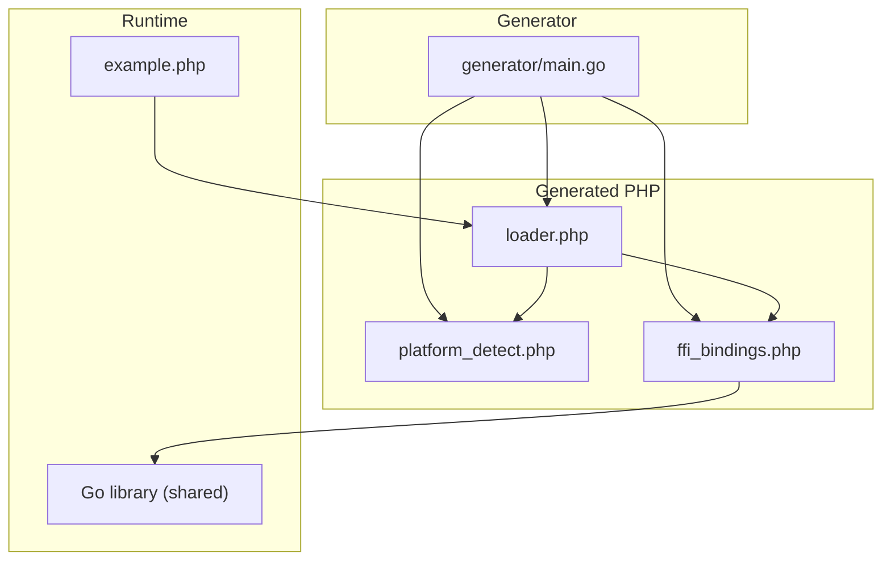
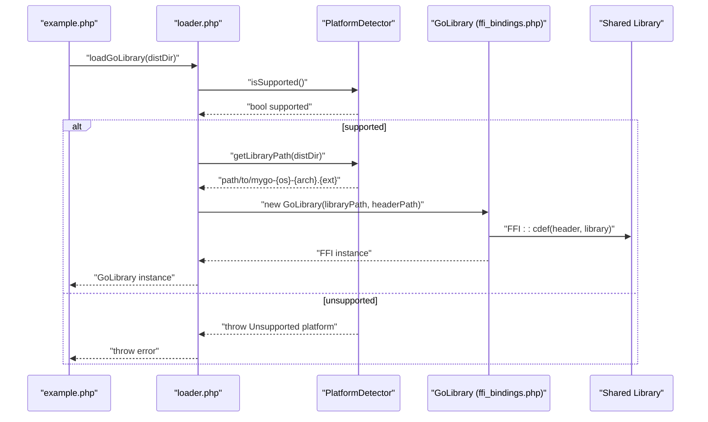
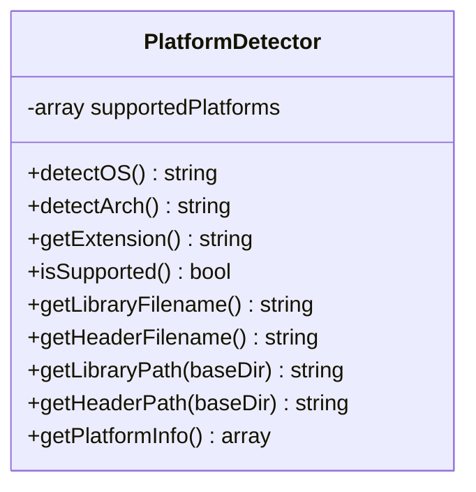
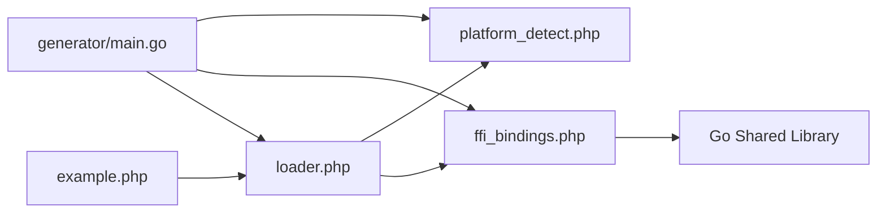

# Runtime Platform Detection

<cite>
**Referenced Files in This Document**
- [README.md](file://README.md)
- [generator/main.go](file://generator/main.go)
- [platform_detect.php](file://platform_detect.php)
- [loader.php](file://loader.php)
- [ffi_bindings.php](file://ffi_bindings.php)
- [example.php](file://example.php)
- [build.go](file://build.go)
- [mygo.go](file://mygo.go)
</cite>

## Table of Contents
1. [Introduction](#introduction)
2. [Project Structure](#project-structure)
3. [Core Components](#core-components)
4. [Architecture Overview](#architecture-overview)
5. [Detailed Component Analysis](#detailed-component-analysis)
6. [Dependency Analysis](#dependency-analysis)
7. [Performance Considerations](#performance-considerations)
8. [Troubleshooting Guide](#troubleshooting-guide)
9. [Conclusion](#conclusion)

## Introduction
This document explains how runtime platform detection works in the PHP side of the Go-PHP FFI integration. It focuses on how the code generator produces platform_detect.php, how the PlatformDetector class identifies the current OS and architecture, and how the loader integrates with the detector to select the correct shared library automatically. It also covers architecture normalization, supported platforms, and extension of the detector for additional platforms.

## Project Structure
The project is organized around a code generator that produces PHP files for platform detection, FFI bindings, and a loader. The distribution directory contains the generated files and compiled shared libraries.

**Diagram sources**
- [generator/main.go](file://generator/main.go#L190-L339)
- [platform_detect.php](file://platform_detect.php#L1-L146)
- [loader.php](file://loader.php#L1-L58)
- [ffi_bindings.php](file://ffi_bindings.php#L1-L89)
- [example.php](file://example.php#L1-L95)

**Section sources**
- [README.md](file://README.md#L25-L41)
- [generator/main.go](file://generator/main.go#L190-L339)

## Core Components
- PlatformDetector: Detects OS family, normalizes architecture, validates support, and constructs platform-specific filenames and paths.
- Loader: Uses PlatformDetector to locate and load the correct shared library and header for the current platform.
- FFI Bindings: Provides a typed PHP interface to the Go functions via FFI.
- Example: Demonstrates platform detection and library loading.

Key responsibilities:
- PlatformDetector.detectOS: Maps PHP_OS_FAMILY to normalized OS identifiers.
- PlatformDetector.detectArch: Normalizes machine names to amd64/arm64.
- PlatformDetector.isSupported/getPlatformInfo: Reports support and comprehensive platform details.
- Loader.loadGoLibrary: Integrates detection and loads the library.

**Section sources**
- [platform_detect.php](file://platform_detect.php#L1-L146)
- [loader.php](file://loader.php#L1-L58)
- [ffi_bindings.php](file://ffi_bindings.php#L1-L89)
- [example.php](file://example.php#L1-L95)

## Architecture Overview
The runtime platform detection pipeline is driven by the code generator and executed at runtime by the loader.

**Diagram sources**
- [loader.php](file://loader.php#L22-L47)
- [platform_detect.php](file://platform_detect.php#L74-L110)
- [ffi_bindings.php](file://ffi_bindings.php#L22-L46)

## Detailed Component Analysis

### PlatformDetector Class
The PlatformDetector encapsulates platform detection and path construction. It maintains a mapping of supported platforms and exposes methods to detect OS, normalize architecture, compute extensions, and produce filenames and paths.

- supportedPlatforms mapping:
  - Linux: amd64 → so, arm64 → so
  - Darwin: amd64 → dylib, arm64 → dylib
  - Windows: amd64 → dll, arm64 → dll

- detectOS uses PHP_OS_FAMILY to return normalized OS identifiers (linux/darwin/windows).

- detectArch uses php_uname('m') and normalizes:
  - x86_64/AMD64/amd64 → amd64
  - aarch64/arm64/ARM64 → arm64

- getExtension validates against supportedPlatforms and throws if unsupported.

- getLibraryFilename/getHeaderFilename assemble the standardized filenames using the base name and detected OS/arch.

- getLibraryPath/getHeaderPath resolve full paths under a given base directory.

- getPlatformInfo returns a comprehensive map including os, arch, extension, library, header, and supported.

Edge cases handled:
- Unsupported OS: detectOS throws an exception with the detected family.
- Unsupported architecture: detectArch throws an exception with the machine name.
- Unsupported platform combination: getExtension throws an exception when the OS/arch pair is not supported.

Examples from generated PHP code:
- getPlatformInfo returns an associative array with keys os, arch, extension, library, header, supported. See [getPlatformInfo](file://platform_detect.php#L131-L145).

Integration with loader:
- The loader checks isSupported and throws a descriptive error otherwise. See [loadGoLibrary](file://loader.php#L22-L47).

**Section sources**
- [platform_detect.php](file://platform_detect.php#L1-L146)
- [loader.php](file://loader.php#L22-L47)

### Code Generation of platform_detect.php
The generator writes platform_detect.php with:
- Namespace declaration and class definition.
- Supported platforms mapping.
- Methods for OS detection, architecture normalization, extension resolution, filename/path construction, and platform info.
- Base name substitution for library/header filenames.

The generator’s generatePlatformDetect function produces the content and writes it to platform_detect.php. See [generatePlatformDetect](file://generator/main.go#L190-L339).

**Section sources**
- [generator/main.go](file://generator/main.go#L190-L339)

### Loader Integration
The loader integrates PlatformDetector to:
- Instantiate PlatformDetector.
- Validate support via isSupported.
- Compute library and header paths via getLibraryPath/getHeaderPath.
- Construct GoLibrary with the computed paths.

It also exposes a convenience function to retrieve platform info.

References:
- [loadGoLibrary](file://loader.php#L22-L47)
- [getMygoPlatformInfo](file://loader.php#L49-L58)

**Section sources**
- [loader.php](file://loader.php#L1-L58)

### FFI Bindings and Example Usage
FFI Bindings wrap the Go library and expose typed methods. The example demonstrates:
- Retrieving platform info via getMygoPlatformInfo.
- Loading the library via loadGoLibrary.
- Calling Go functions and freeing strings.

References:
- [GoLibrary constructor and methods](file://ffi_bindings.php#L13-L88)
- [Example usage](file://example.php#L1-L95)

**Section sources**
- [ffi_bindings.php](file://ffi_bindings.php#L1-L89)
- [example.php](file://example.php#L1-L95)

## Dependency Analysis
The loader depends on platform_detect.php and ffi_bindings.php. The generator produces these files and embeds the base name into the platform detection logic.

**Diagram sources**
- [generator/main.go](file://generator/main.go#L190-L339)
- [platform_detect.php](file://platform_detect.php#L1-L146)
- [loader.php](file://loader.php#L1-L58)
- [ffi_bindings.php](file://ffi_bindings.php#L1-L89)
- [example.php](file://example.php#L1-L95)

**Section sources**
- [generator/main.go](file://generator/main.go#L190-L339)
- [loader.php](file://loader.php#L1-L58)

## Performance Considerations
- Platform detection runs once per process when loadGoLibrary is invoked. Reuse the returned GoLibrary instance to avoid repeated detection and FFI initialization.
- FFI overhead is minimal compared to native C extensions; batch operations when possible.
- Ensure the dist directory is on fast storage to reduce file I/O during path resolution.

[No sources needed since this section provides general guidance]

## Troubleshooting Guide
Common issues and resolutions:
- Unsupported OS: detectOS throws an exception for unknown families. Confirm PHP_OS_FAMILY is one of Linux/Darwin/Windows.
- Unsupported architecture: detectArch throws for unrecognized machine names. Ensure the environment reports x86_64 or aarch64 variants.
- Unsupported platform combination: getExtension throws if OS/arch is not mapped. Add support in supportedPlatforms or build the correct library.
- Library not found: The loader checks file existence; ensure the dist directory contains the correct .so/.dylib/.dll and .h files.
- FFI not enabled: The FFI bindings check for the extension and throw if missing.
- Cross-compilation failures: The builder prints reasons for failures; install required cross-compilers or build for the current platform only.

**Section sources**
- [platform_detect.php](file://platform_detect.php#L22-L57)
- [platform_detect.php](file://platform_detect.php#L63-L72)
- [ffi_bindings.php](file://ffi_bindings.php#L22-L46)
- [README.md](file://README.md#L239-L295)

## Extending the Detector for Additional Platforms
To add a new platform:
1. Update supportedPlatforms mapping in platform_detect.php to include the OS/arch and extension.
2. Ensure detectOS returns the normalized OS identifier used in the mapping.
3. Ensure detectArch recognizes the machine name and normalizes to amd64/arm64.
4. Build the corresponding shared library and header using the standardized naming convention.
5. Place the files in the dist directory and verify loader can find them.

The generator’s supportedPlatforms list and filename templates align with the standardized naming scheme. See:
- [getSupportedPlatforms](file://build.go#L19-L29)
- [getOutputFilename/getHeaderFilename](file://build.go#L31-L40)

**Section sources**
- [platform_detect.php](file://platform_detect.php#L12-L16)
- [build.go](file://build.go#L19-L40)

## Conclusion
The runtime platform detection system centers on PlatformDetector, which normalizes OS and architecture, validates support, and constructs platform-specific filenames and paths. The loader integrates detection to automatically select the correct library and header, while the example demonstrates practical usage. The code generator ensures consistent naming and path resolution across platforms, and the system is straightforward to extend for additional platforms.