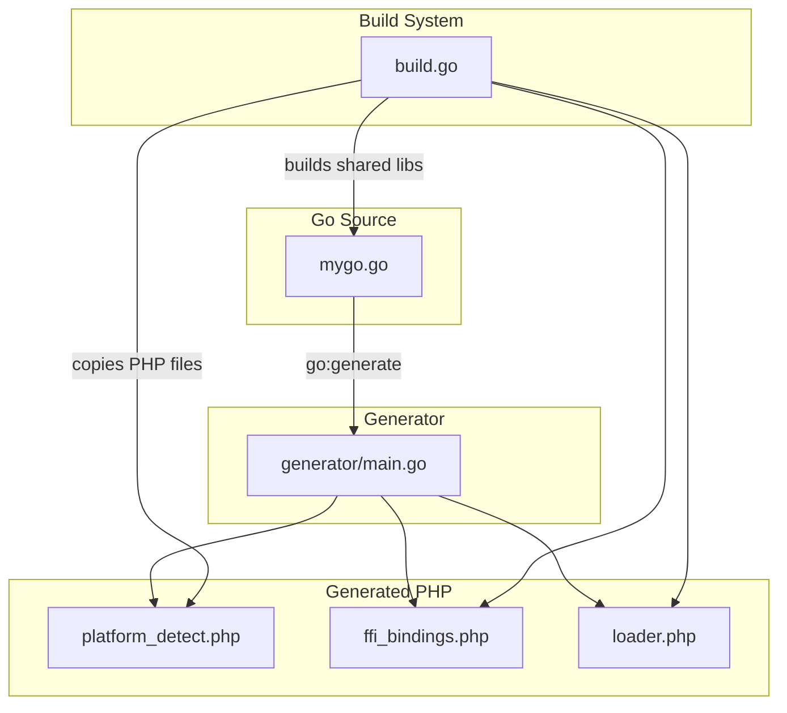
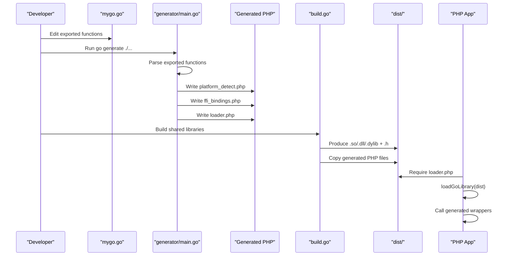
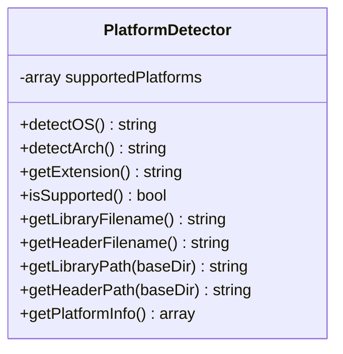
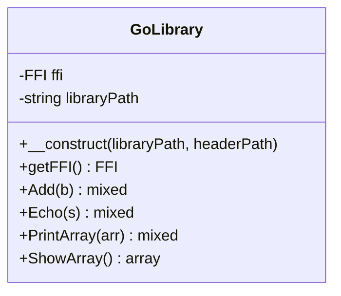
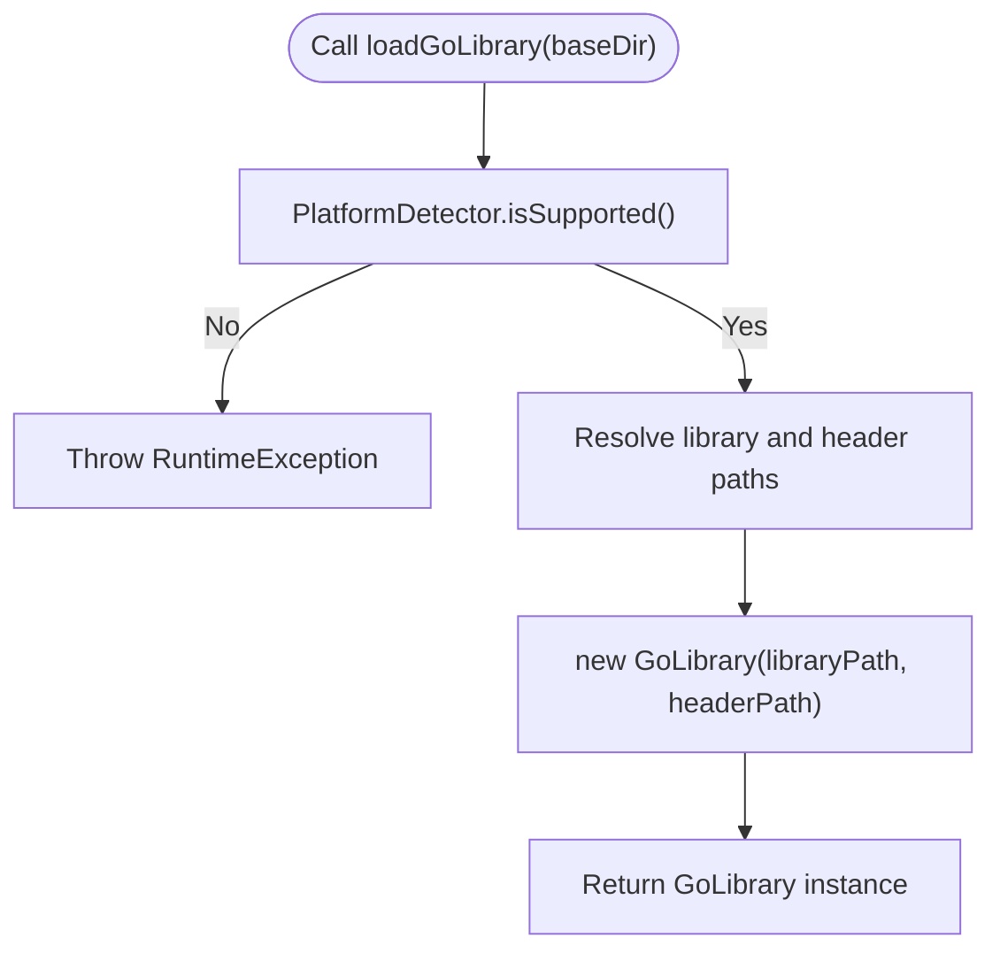
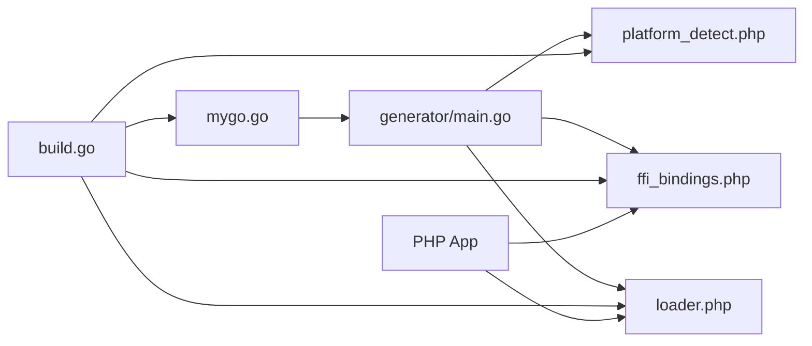

# Binding Regeneration

<cite>
**Referenced Files in This Document**
- [mygo.go](file://mygo.go)
- [generator/main.go](file://generator/main.go)
- [AGENTS.MD](file://AGENTS.MD)
- [README.md](file://README.md)
- [QUICKSTART.md](file://QUICKSTART.md)
- [build.go](file://build.go)
- [platform_detect.php](file://platform_detect.php)
- [ffi_bindings.php](file://ffi_bindings.php)
- [loader.php](file://loader.php)
- [example.php](file://example.php)
</cite>

## Table of Contents
1. [Introduction](#introduction)
2. [Project Structure](#project-structure)
3. [Core Components](#core-components)
4. [Architecture Overview](#architecture-overview)
5. [Detailed Component Analysis](#detailed-component-analysis)
6. [Dependency Analysis](#dependency-analysis)
7. [Performance Considerations](#performance-considerations)
8. [Troubleshooting Guide](#troubleshooting-guide)
9. [Conclusion](#conclusion)
10. [Appendices](#appendices)

## Introduction
This document explains how to regenerate PHP FFI bindings using the code generator and the go:generate directive. It covers the end-to-end workflow: editing exported functions in Go, invoking the generator via go generate, building shared libraries, and consuming the resulting PHP bindings in PHP applications. It also details the three generated files (platform_detect.php, ffi_bindings.php, loader.php), their structure and purpose, and the type mapping rules from Go/C to PHP types as implemented by the generator.

## Project Structure
The repository organizes the binding generation pipeline across a small set of focused files:
- A Go source file containing exported functions and a go:generate directive
- A code generator that parses exported functions and emits PHP files
- A build orchestrator that compiles shared libraries for multiple platforms
- Example and documentation files that describe usage and troubleshooting

**Diagram sources**
- [mygo.go](file://mygo.go#L1-L20)
- [generator/main.go](file://generator/main.go#L27-L75)
- [build.go](file://build.go#L41-L105)

**Section sources**
- [README.md](file://README.md#L25-L41)
- [AGENTS.MD](file://AGENTS.MD#L15-L36)

## Core Components
- Go source with exported functions and go:generate directive
- Code generator that parses exported functions and writes PHP files
- Build orchestrator that compiles shared libraries and copies generated PHP files
- Generated PHP modules: platform detection, FFI bindings, and loader

Key responsibilities:
- mygo.go: defines exported functions and triggers regeneration via go:generate
- generator/main.go: parses Go exports, generates platform_detect.php, ffi_bindings.php, and loader.php
- build.go: builds shared libraries for multiple platforms and copies generated PHP files into dist/
- Generated PHP: platform_detect.php (runtime platform detection), ffi_bindings.php (FFI wrappers), loader.php (entry point)

**Section sources**
- [mygo.go](file://mygo.go#L11-L18)
- [generator/main.go](file://generator/main.go#L27-L75)
- [build.go](file://build.go#L41-L105)
- [AGENTS.MD](file://AGENTS.MD#L41-L92)

## Architecture Overview
The binding regeneration architecture consists of:
- A developer action: edit exported functions in mygo.go
- A generator invocation: go generate ./... runs generator/main.go
- A build action: compile shared libraries for target platforms
- A consumption action: load the library in PHP via loader.php and call generated wrappers

**Diagram sources**
- [mygo.go](file://mygo.go#L11-L18)
- [generator/main.go](file://generator/main.go#L27-L75)
- [build.go](file://build.go#L41-L105)
- [loader.php](file://loader.php#L22-L47)

## Detailed Component Analysis

### go:generate Directive in mygo.go
- Purpose: Embed a directive that instructs the Go toolchain to run the generator automatically when invoking go generate ./...
- Invocation: The directive executes a command that runs the generator’s main program
- Effect: On execution, generator/main.go parses mygo.go, discovers exported functions, and writes three PHP files into the current directory

Operational flow:
- The directive is placed near the top of mygo.go alongside the CGO include
- When developers run go generate ./..., the generator parses the Go source file and generates platform_detect.php, ffi_bindings.php, and loader.php

**Section sources**
- [mygo.go](file://mygo.go#L11-L11)
- [generator/main.go](file://generator/main.go#L27-L75)

### Code Generator (generator/main.go)
The generator performs the following steps:
- Parse the Go source file to extract exported functions
- Generate platform_detect.php with a PlatformDetector class
- Generate ffi_bindings.php with a GoLibrary class that wraps FFI calls
- Generate loader.php with convenience functions to load the library and retrieve platform info

Key behaviors:
- Parses exported functions by scanning for //export directives and function declarations
- Builds a list of ExportedFunc entries with name, comment, signature, return type, and parameters
- Emits PHP files with consistent namespace app\lib and instance methods
- Uses type mapping functions to convert C/Go types to PHP types for documentation and type hints

Type mapping rules (as implemented in the generator):
- Integers: int, GoInt*, C.int*, uint*, char/short/long variants, size_t/ssize_t -> int
- Floats: float/double/GoFloat*, C.float/double -> float
- Strings: *C.char, char*, string, GoString -> string
- Booleans: bool, GoBool, _Bool -> bool
- Arrays/Collections: map[], GoMap, GoSlice, [], pointers (non-char) -> array
- Void: void -> void (no PHP type hint)
- Unknown types: mapped to mixed or no type hint depending on context

Generated files:
- platform_detect.php: PlatformDetector class with methods to detect OS/arch, compute extensions, and resolve library/header paths
- ffi_bindings.php: GoLibrary class with constructor that loads the shared library via FFI and wrapper methods mirroring exported functions
- loader.php: loadGoLibrary() function and get{BaseName}PlatformInfo() function that coordinate platform detection and library loading

**Section sources**
- [generator/main.go](file://generator/main.go#L77-L145)
- [generator/main.go](file://generator/main.go#L189-L339)
- [generator/main.go](file://generator/main.go#L341-L418)
- [generator/main.go](file://generator/main.go#L642-L705)
- [generator/main.go](file://generator/main.go#L481-L555)
- [generator/main.go](file://generator/main.go#L557-L640)
- [AGENTS.MD](file://AGENTS.MD#L53-L60)

### Three Generated Files

#### platform_detect.php
- Purpose: Runtime platform detection and path resolution
- Structure: A class with methods to detect OS family, CPU architecture, supported platform checks, and compute library/header filenames and paths
- Behavior: Throws exceptions for unsupported OS/arch; returns normalized identifiers and file names based on the base library name

**Diagram sources**
- [platform_detect.php](file://platform_detect.php#L11-L145)

**Section sources**
- [platform_detect.php](file://platform_detect.php#L1-L146)
- [AGENTS.MD](file://AGENTS.MD#L63-L77)

#### ffi_bindings.php
- Purpose: Provide a typed PHP interface to the Go shared library via FFI
- Structure: A class with a constructor that validates FFI availability and library/header presence, loads the library via FFI::cdef, and exposes wrapper methods for each exported function
- Behavior: Methods mirror the exported functions’ signatures and return types; returns values from FFI calls; uses type hints derived from the generator’s type mapping

**Diagram sources**
- [ffi_bindings.php](file://ffi_bindings.php#L13-L88)

**Section sources**
- [ffi_bindings.php](file://ffi_bindings.php#L1-L89)
- [AGENTS.MD](file://AGENTS.MD#L68-L76)

#### loader.php
- Purpose: Provide a convenient entry point to load the library for the current platform
- Structure: Requires platform_detect.php and ffi_bindings.php, defines loadGoLibrary() and get{BaseName}PlatformInfo()
- Behavior: Validates platform support, resolves library/header paths, constructs GoLibrary, and returns it; also exposes platform information

**Diagram sources**
- [loader.php](file://loader.php#L22-L47)
- [platform_detect.php](file://platform_detect.php#L78-L145)
- [ffi_bindings.php](file://ffi_bindings.php#L13-L46)

**Section sources**
- [loader.php](file://loader.php#L1-L58)
- [AGENTS.MD](file://AGENTS.MD#L73-L77)

### Type Mapping Rules from Go/C to PHP
The generator maps C/Go types to PHP types for documentation and type hints:
- Integers: int, GoInt*, C.int*, uint*, char/short/long variants, size_t/ssize_t -> int
- Floats: float/double/GoFloat*, C.float/double -> float
- Strings: *C.char, char*, string, GoString -> string
- Booleans: bool, GoBool, _Bool -> bool
- Arrays/Collections: map[], GoMap, GoSlice, [], pointers (non-char) -> array
- Void: void -> void (no type hint)
- Unknown types: mapped to mixed or no type hint depending on context

These rules are implemented in dedicated functions within the generator and applied consistently across generated PHPDoc and type hints.

**Section sources**
- [generator/main.go](file://generator/main.go#L481-L555)
- [generator/main.go](file://generator/main.go#L557-L640)
- [AGENTS.MD](file://AGENTS.MD#L298-L323)

## Dependency Analysis
The binding regeneration pipeline has clear dependencies:
- mygo.go depends on the generator to produce PHP files
- generator/main.go depends on the Go source file to parse exported functions
- build.go depends on mygo.go to build shared libraries and on the generator to produce PHP files
- PHP consumers depend on loader.php to load the library and on ffi_bindings.php for function wrappers

**Diagram sources**
- [mygo.go](file://mygo.go#L11-L18)
- [generator/main.go](file://generator/main.go#L27-L75)
- [build.go](file://build.go#L41-L105)

**Section sources**
- [build.go](file://build.go#L41-L105)
- [loader.php](file://loader.php#L22-L47)

## Performance Considerations
- Library loading occurs once per process; use persistent PHP processes (e.g., PHP-FPM) to minimize repeated loads
- FFI overhead is low compared to native C extensions
- String conversions between PHP and C incur overhead; batch operations when possible
- Always free Go-allocated strings to prevent memory leaks

[No sources needed since this section provides general guidance]

## Troubleshooting Guide
Common issues and resolutions:
- PHP FFI not enabled: Ensure the FFI extension is enabled in php.ini
- Library not found: Confirm that go generate was run and that the shared library exists in dist; verify the path passed to loadGoLibrary
- Unsupported platform: Build the library for your platform or add support in build.go; confirm platform detection returns supported
- CGO disabled: Ensure CGO is enabled and a C compiler is available
- Windows DLL loading errors: Verify architecture match (32-bit vs 64-bit) and install required runtime libraries if needed
- Generator errors: Validate that exported functions use the //export directive and that the generator can parse the Go source

**Section sources**
- [README.md](file://README.md#L239-L295)
- [AGENTS.MD](file://AGENTS.MD#L326-L384)

## Conclusion
The binding regeneration workflow integrates cleanly with Go’s go:generate mechanism. By adding or modifying exported functions in mygo.go, running go generate ./..., and rebuilding shared libraries, developers can quickly update PHP FFI bindings. The generator’s type mapping ensures predictable PHP signatures, while loader.php simplifies runtime loading and platform detection.

[No sources needed since this section summarizes without analyzing specific files]

## Appendices

### How to Regenerate Bindings and Update Libraries
- Add or modify exported functions in mygo.go with the //export directive
- Run go generate ./... to regenerate platform_detect.php, ffi_bindings.php, and loader.php
- Build shared libraries for your platform or all platforms using the build orchestrator
- Copy the generated PHP files into dist/ alongside the compiled libraries
- Use loader.php in your PHP application to load the library and call generated wrappers

**Section sources**
- [README.md](file://README.md#L66-L109)
- [QUICKSTART.md](file://QUICKSTART.md#L1-L21)
- [AGENTS.MD](file://AGENTS.MD#L190-L211)

### Example Usage in PHP
- Load the library via loadGoLibrary()
- Call generated wrappers that mirror exported functions
- Retrieve platform information via get{BaseName}PlatformInfo()

**Section sources**
- [example.php](file://example.php#L1-L95)
- [loader.php](file://loader.php#L22-L57)