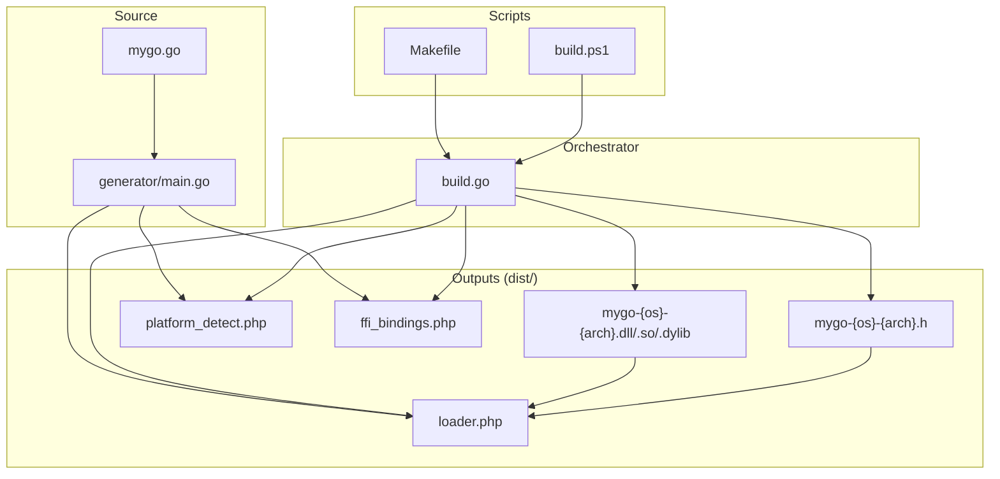
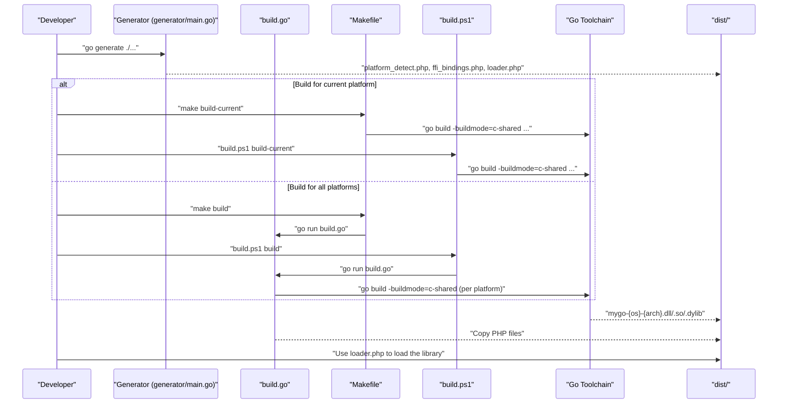
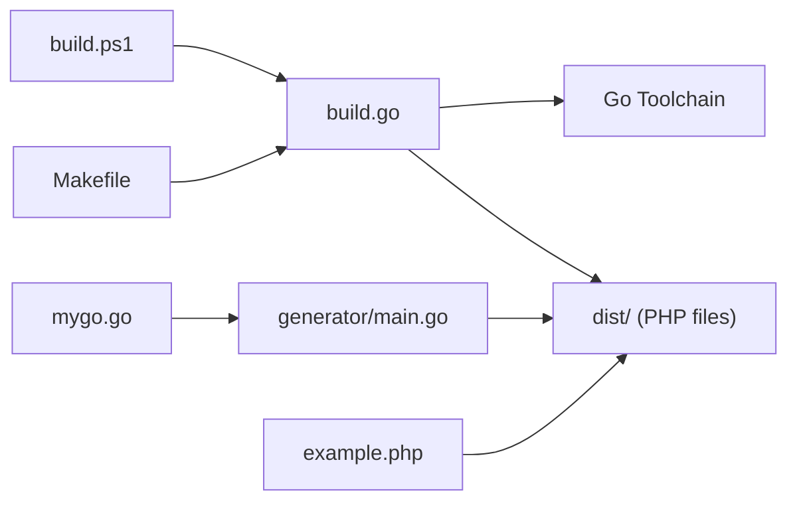

# Building Libraries

<cite>
**Referenced Files in This Document**
- [README.md](file://README.md)
- [QUICKSTART.md](file://QUICKSTART.md)
- [AGENTS.MD](file://AGENTS.MD)
- [build.go](file://build.go)
- [Makefile](file://Makefile)
- [build.ps1](file://build.ps1)
- [generator/main.go](file://generator/main.go)
- [mygo.go](file://mygo.go)
- [example.php](file://example.php)
- [go.mod](file://go.mod)
</cite>

## Table of Contents
1. [Introduction](#introduction)
2. [Project Structure](#project-structure)
3. [Core Components](#core-components)
4. [Architecture Overview](#architecture-overview)
5. [Detailed Component Analysis](#detailed-component-analysis)
6. [Dependency Analysis](#dependency-analysis)
7. [Performance Considerations](#performance-considerations)
8. [Troubleshooting Guide](#troubleshooting-guide)
9. [Conclusion](#conclusion)
10. [Appendices](#appendices)

## Introduction
This document explains how to build Go shared libraries for PHP FFI integration using two complementary approaches:
- Build for the current platform only using the standard Go toolchain.
- Build for all supported platforms using a cross-platform orchestrator that manages environment variables and cross-compilation toolchains.

It also covers the role of the code generator, platform-specific build scripts, file naming conventions, output structure, and common build issues.

## Project Structure
The repository organizes build-related assets around a small set of core files:
- A Go library with exported functions for FFI consumption.
- A code generator that produces PHP FFI bindings and loaders.
- Cross-platform build orchestration in Go.
- Platform-specific build scripts for Unix-like systems and Windows.
- Example PHP usage and documentation.

**Diagram sources**
- [mygo.go](file://mygo.go#L1-L39)
- [generator/main.go](file://generator/main.go#L1-L705)
- [build.go](file://build.go#L1-L183)
- [Makefile](file://Makefile#L1-L54)
- [build.ps1](file://build.ps1#L1-L152)

**Section sources**
- [README.md](file://README.md#L1-L120)
- [QUICKSTART.md](file://QUICKSTART.md#L1-L80)
- [AGENTS.MD](file://AGENTS.MD#L1-L60)

## Core Components
- Go library with exported functions: Defines the API exposed to PHP via FFI.
- Code generator: Parses exported functions and generates PHP FFI bindings, platform detection, and loader.
- Cross-platform orchestrator: Builds shared libraries for all supported platforms, sets environment variables, and copies generated PHP files to the distribution directory.
- Platform-specific scripts: Provide convenient targets to generate bindings, build for current platform, build for all platforms, test, and clean.

**Section sources**
- [mygo.go](file://mygo.go#L1-L39)
- [generator/main.go](file://generator/main.go#L1-L120)
- [build.go](file://build.go#L1-L120)
- [Makefile](file://Makefile#L1-L54)
- [build.ps1](file://build.ps1#L1-L152)

## Architecture Overview
The build pipeline integrates the following stages:
- Generate PHP bindings from Go exports.
- Build shared libraries for the current platform or for all platforms.
- Copy generated PHP files into the distribution directory.
- Provide a loader that detects the platform and loads the correct library.

**Diagram sources**
- [generator/main.go](file://generator/main.go#L1-L120)
- [build.go](file://build.go#L1-L120)
- [Makefile](file://Makefile#L1-L54)
- [build.ps1](file://build.ps1#L1-L152)

## Detailed Component Analysis

### Approach 1: Build for Current Platform
- Use the standard Go toolchain to produce a shared library for the host OS/architecture.
- The output follows the standardized naming convention and is placed under the distribution directory.
- On Unix-like systems, the Makefile target builds for the current platform and copies PHP files.
- On Windows, the PowerShell script builds for the current platform and copies PHP files.

Key behaviors:
- The Makefile’s build-current target determines the current OS and architecture and invokes the Go toolchain accordingly.
- The PowerShell script mirrors the same logic for Windows environments.
- Both scripts copy the generated PHP files into the distribution directory after building.

**Section sources**
- [README.md](file://README.md#L81-L110)
- [QUICKSTART.md](file://QUICKSTART.md#L9-L21)
- [Makefile](file://Makefile#L17-L31)
- [build.ps1](file://build.ps1#L46-L93)

### Approach 2: Build for All Platforms (Cross-Platform Orchestrator)
- The orchestrator builds shared libraries for all supported platform combinations.
- It sets environment variables for cross-compilation and selects appropriate C compilers when needed.
- It verifies that output and header files exist and are non-empty, then copies generated PHP files to the distribution directory.

Highlights:
- Supported platforms include Linux/amd64, Linux/arm64, macOS/amd64/darwin/arm64, and Windows/amd64/arm64.
- The orchestrator configures the correct C compiler for cross-compilation scenarios (for example, MinGW on Windows and aarch64-linux-gnu-gcc on Linux).
- It tolerates partial failures and reports a summary of successes and failures.

**Section sources**
- [build.go](file://build.go#L1-L120)
- [build.go](file://build.go#L120-L183)
- [README.md](file://README.md#L10-L40)

### Role of the Code Generator
- Parses exported functions from the Go library source file and generates:
  - Platform detection logic.
  - FFI bindings that wrap each exported function.
  - A loader that detects the current platform and loads the appropriate library.
- The generator is invoked via a directive in the Go source file and can also be run manually.

Key points:
- The generator reads exported functions and their signatures/comments to produce accurate PHPDoc and type hints.
- It writes three PHP files into the repository root, which are then copied into the distribution directory by the orchestrator or scripts.

**Section sources**
- [mygo.go](file://mygo.go#L1-L20)
- [generator/main.go](file://generator/main.go#L1-L120)
- [generator/main.go](file://generator/main.go#L120-L220)

### Platform-Specific Build Scripts
- Makefile (Unix-like systems):
  - Targets: generate, build, build-current, test, clean, help.
  - The build target runs the orchestrator; build-current builds for the current platform and copies PHP files.
- build.ps1 (Windows):
  - Commands: generate, build, build-current, test, clean, help.
  - Mirrors the Makefile behavior with PowerShell-native logic.

Both scripts coordinate the generation and copying of PHP files alongside the Go build process.

**Section sources**
- [Makefile](file://Makefile#L1-L54)
- [build.ps1](file://build.ps1#L1-L152)

### File Naming Convention and Output Structure
- Naming convention: mygo-{GOOS}-{GOARCH}.{ext}
- Output directory: dist/
- Outputs include:
  - The compiled shared library (.dll on Windows, .so on Linux, .dylib on macOS).
  - The corresponding C header file (.h).
  - Generated PHP files: platform_detect.php, ffi_bindings.php, loader.php.

The orchestrator and scripts ensure these files are placed in the distribution directory with correct names and extensions.

**Section sources**
- [README.md](file://README.md#L10-L40)
- [build.go](file://build.go#L31-L40)
- [Makefile](file://Makefile#L12-L31)
- [build.ps1](file://build.ps1#L46-L93)

### Example PHP Usage
- The example demonstrates platform detection, loading the library, and invoking exported functions.
- It also shows proper memory management for strings allocated by Go.

**Section sources**
- [example.php](file://example.php#L1-L95)

## Dependency Analysis
The build system exhibits a clear separation of concerns:
- The Go library defines the exported API.
- The generator depends on the Go library source to produce PHP bindings.
- The orchestrator depends on the Go toolchain and environment variables to compile for multiple platforms.
- The scripts depend on the orchestrator and the generator to automate the end-to-end workflow.

**Diagram sources**
- [mygo.go](file://mygo.go#L1-L39)
- [generator/main.go](file://generator/main.go#L1-L120)
- [build.go](file://build.go#L1-L120)
- [Makefile](file://Makefile#L1-L54)
- [build.ps1](file://build.ps1#L1-L152)
- [example.php](file://example.php#L1-L95)

**Section sources**
- [go.mod](file://go.mod#L1-L4)
- [AGENTS.MD](file://AGENTS.MD#L1-L60)

## Performance Considerations
- Library loading occurs once per PHP process; using persistent processes (for example, PHP-FPM) reduces repeated FFI initialization overhead.
- FFI has minimal overhead compared to native C extensions.
- String conversion between PHP and C incurs overhead; batch operations where possible.
- Always free strings allocated by Go to prevent memory leaks.

**Section sources**
- [README.md](file://README.md#L296-L310)

## Troubleshooting Guide
Common issues and resolutions:
- PHP FFI not enabled:
  - Ensure the FFI extension is enabled in php.ini.
- Library not found:
  - Confirm that bindings were generated and the library was built for the correct platform; verify the distribution directory contains the appropriate shared library and header file.
- Platform not supported:
  - Build the library for your platform or extend the orchestrator to include your platform.
- CGO not enabled or missing C compiler:
  - Enable CGO and install the appropriate C compiler for your platform.
- DLL loading errors on Windows:
  - Ensure architecture alignment (for example, 64-bit PHP with 64-bit DLL), install required runtime libraries, and check antivirus interference.

**Section sources**
- [README.md](file://README.md#L238-L310)
- [QUICKSTART.md](file://QUICKSTART.md#L109-L134)

## Conclusion
This build system provides a robust, cross-platform workflow for producing Go shared libraries consumable by PHP via FFI. It offers two complementary approaches—current-platform builds and orchestrated multi-platform builds—alongside automated code generation and platform detection. By following the documented steps and addressing common issues, developers can reliably distribute and integrate Go functions into PHP applications.

## Appendices

### Cross-Compilation Setup Examples
- Linux → Windows: Install the MinGW cross-compiler and configure the C compiler for cross-compilation.
- Linux → macOS: Requires osxcross; consult the referenced documentation.
- macOS → Linux: Install musl cross-compiler and build accordingly.

**Section sources**
- [README.md](file://README.md#L210-L238)

### Development Workflow
- Edit the Go library to add or modify exported functions.
- Generate bindings and rebuild the library for the current platform or for all platforms.
- Test with the example PHP application.
- Distribute the entire distribution directory to consumers.

**Section sources**
- [README.md](file://README.md#L310-L350)
- [QUICKSTART.md](file://QUICKSTART.md#L1-L21)