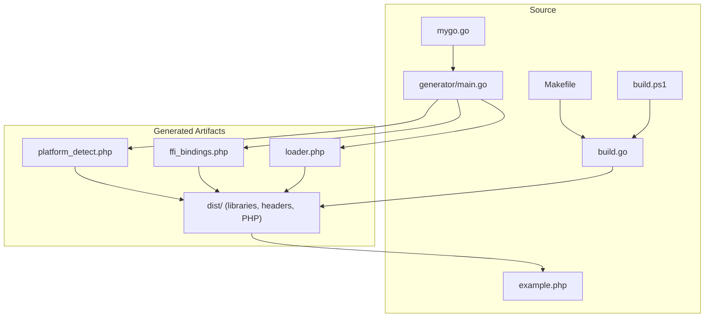
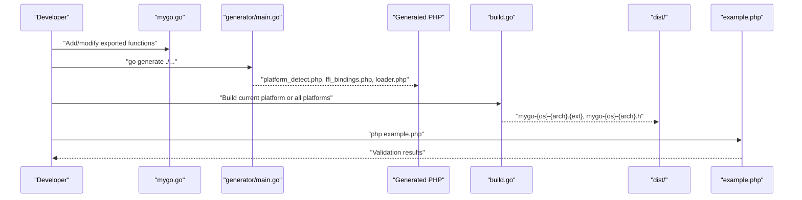
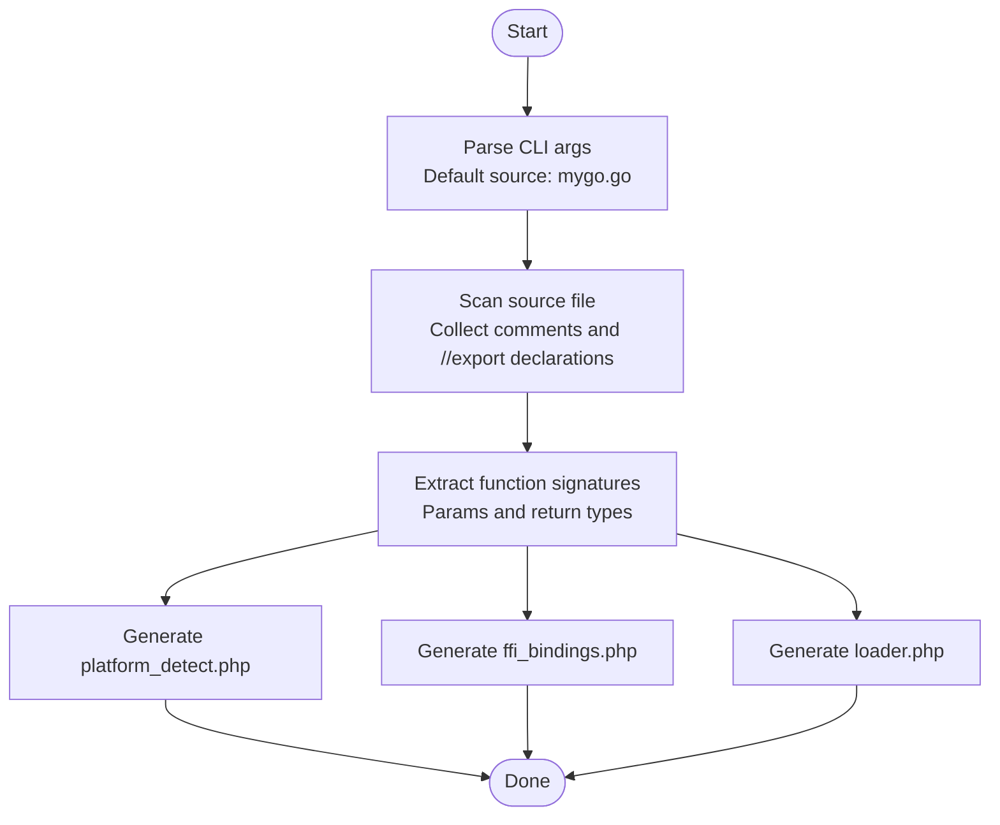
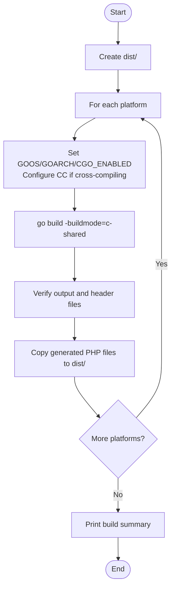
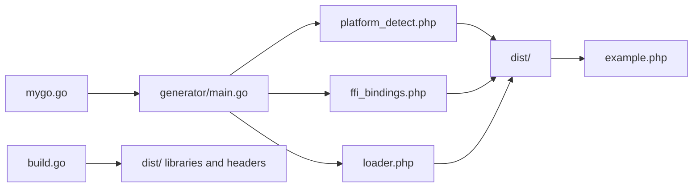

# Development Workflow

<cite>
**Referenced Files in This Document**
- [README.md](file://README.md)
- [AGENTS.MD](file://AGENTS.MD)
- [QUICKSTART.md](file://QUICKSTART.md)
- [mygo.go](file://mygo.go)
- [generator/main.go](file://generator/main.go)
- [build.go](file://build.go)
- [Makefile](file://Makefile)
- [build.ps1](file://build.ps1)
- [example.php](file://example.php)
- [.gitignore](file://.gitignore)
- [go.mod](file://go.mod)
</cite>

## Table of Contents
1. [Introduction](#introduction)
2. [Project Structure](#project-structure)
3. [Core Components](#core-components)
4. [Architecture Overview](#architecture-overview)
5. [Detailed Component Analysis](#detailed-component-analysis)
6. [Dependency Analysis](#dependency-analysis)
7. [Performance Considerations](#performance-considerations)
8. [Troubleshooting Guide](#troubleshooting-guide)
9. [Conclusion](#conclusion)
10. [Appendices](#appendices)

## Introduction
This document explains the complete development workflow for extending and maintaining serviceLib. It covers how to add new functions to the Go library, regenerate PHP bindings, rebuild libraries for all platforms, and validate changes using the example PHP application. It also provides debugging tips for both Go code and PHP integration issues, best practices for CGO-compatible function signatures, guidance on regenerating bindings when exporting new functions, and recommendations for versioning and distributing updated libraries.

## Project Structure
The repository is organized around a minimal yet robust build system that generates PHP FFI bindings from Go exported functions and produces cross-platform shared libraries. Key elements include:
- A Go library file that defines exported functions for FFI consumption
- A code generator that parses exported functions and emits PHP FFI wrappers and loaders
- A cross-platform builder that compiles shared libraries and headers
- Build scripts for Windows (PowerShell) and Unix-like systems (Make)
- An example PHP application to validate the integration
- Documentation and configuration files

**Diagram sources**
- [mygo.go](file://mygo.go#L1-L39)
- [generator/main.go](file://generator/main.go#L1-L705)
- [build.go](file://build.go#L1-L183)
- [Makefile](file://Makefile#L1-L54)
- [build.ps1](file://build.ps1#L1-L152)
- [example.php](file://example.php#L1-L95)

**Section sources**
- [README.md](file://README.md#L25-L41)
- [AGENTS.MD](file://AGENTS.MD#L15-L36)

## Core Components
- Go library (mygo.go): Defines exported functions with CGO support and a placeholder main for shared library builds.
- Code generator (generator/main.go): Parses exported functions and generates PHP platform detection, FFI bindings, and loader files.
- Cross-platform builder (build.go): Orchestrates building shared libraries and headers for all supported platforms and copies generated PHP files to dist/.
- Build scripts: Makefile (Unix-like) and build.ps1 (Windows) wrap generation, building, testing, and cleaning tasks.
- Example PHP application (example.php): Exercises platform detection, library loading, and function calls to validate the integration.

**Section sources**
- [mygo.go](file://mygo.go#L1-L39)
- [generator/main.go](file://generator/main.go#L1-L705)
- [build.go](file://build.go#L1-L183)
- [Makefile](file://Makefile#L1-L54)
- [build.ps1](file://build.ps1#L1-L152)
- [example.php](file://example.php#L1-L95)

## Architecture Overview
The development workflow centers on a deterministic pipeline:
1. Edit mygo.go to add or modify exported functions.
2. Run go generate to parse exported functions and regenerate PHP FFI bindings.
3. Build shared libraries for the current platform or all platforms.
4. Validate changes using the example PHP application.
5. Iterate until satisfied, then package and distribute the dist/ directory.

**Diagram sources**
- [README.md](file://README.md#L66-L109)
- [generator/main.go](file://generator/main.go#L27-L75)
- [build.go](file://build.go#L41-L105)
- [example.php](file://example.php#L1-L95)

## Detailed Component Analysis

### Adding New Functions to mygo.go
- Add a function with the //export directive before the function body.
- Include a C stdlib import for string operations if needed.
- Provide clear comments for the exported function.
- Keep signatures CGO-compatible (see Best Practices below).

After editing mygo.go:
- Regenerate bindings: go generate ./...
- Rebuild libraries: either build for current platform or run the cross-platform builder.
- Validate with example.php.

**Section sources**
- [mygo.go](file://mygo.go#L1-L39)
- [README.md](file://README.md#L155-L194)
- [AGENTS.MD](file://AGENTS.MD#L137-L158)

### Code Generator (generator/main.go)
The generator:
- Parses exported functions from the specified Go source file.
- Extracts function signatures, parameters, and return types.
- Generates three PHP files:
  - platform_detect.php: platform detection and filename helpers
  - ffi_bindings.php: FFI wrapper class with typed methods
  - loader.php: loader function and platform info helper
- Uses dynamic base name derived from the source file.

**Diagram sources**
- [generator/main.go](file://generator/main.go#L27-L75)
- [generator/main.go](file://generator/main.go#L77-L145)
- [generator/main.go](file://generator/main.go#L189-L339)
- [generator/main.go](file://generator/main.go#L341-L418)
- [generator/main.go](file://generator/main.go#L642-L705)

**Section sources**
- [generator/main.go](file://generator/main.go#L1-L705)

### Cross-Platform Builder (build.go)
The builder:
- Defines supported platforms and their extensions.
- Creates dist/ and iterates through platforms.
- Sets environment variables for cross-compilation (GOOS, GOARCH, CGO_ENABLED).
- Configures cross-compilers when needed.
- Verifies output and header files exist and are non-empty.
- Copies generated PHP files to dist/.

**Diagram sources**
- [build.go](file://build.go#L41-L105)
- [build.go](file://build.go#L107-L164)
- [build.go](file://build.go#L166-L183)

**Section sources**
- [build.go](file://build.go#L1-L183)

### Build Scripts (Makefile and build.ps1)
- Makefile targets:
  - generate: runs go generate
  - build: runs the cross-platform builder
  - build-current: builds for the current platform only
  - test: builds current platform and runs example.php
  - clean: removes dist/ and generated PHP files
- build.ps1 provides equivalent commands for Windows PowerShell.

These scripts streamline the development workflow and ensure consistent steps across platforms.

**Section sources**
- [Makefile](file://Makefile#L1-L54)
- [build.ps1](file://build.ps1#L1-L152)

### Example PHP Application (example.php)
The example:
- Loads the generated loader
- Displays platform information
- Exercises multiple exported functions
- Demonstrates proper string memory management
- Uses try/catch to surface errors

Use this to validate that your changes work end-to-end.

**Section sources**
- [example.php](file://example.php#L1-L95)

## Dependency Analysis
The primary dependencies are:
- generator/main.go depends on the Go source file to parse exported functions and emit PHP files.
- build.go depends on the Go toolchain and cross-compilers to produce shared libraries and headers.
- example.php depends on the generated loader and FFI bindings.

**Diagram sources**
- [generator/main.go](file://generator/main.go#L27-L75)
- [build.go](file://build.go#L41-L105)
- [example.php](file://example.php#L1-L95)

**Section sources**
- [generator/main.go](file://generator/main.go#L1-L705)
- [build.go](file://build.go#L1-L183)

## Performance Considerations
- Library loading occurs once per PHP process; use persistent processes (e.g., PHP-FPM) to minimize overhead.
- FFI overhead is low compared to native C extensions.
- Batch operations where possible to reduce repeated conversions between PHP and C.
- Always free strings returned by Go to prevent memory leaks.

**Section sources**
- [README.md](file://README.md#L296-L302)

## Troubleshooting Guide
Common issues and resolutions:
- PHP FFI not enabled: enable the extension and restart the web server or PHP-FPM.
- Library not found: ensure go generate and build were executed and that dist/ contains the appropriate shared library and header files.
- Platform not supported: build for your platform or add support in the builder.
- CGO disabled: set CGO_ENABLED=1 and ensure a C compiler is installed.
- Windows DLL loading errors: verify architecture match (64-bit PHP with 64-bit DLL), install required runtime libraries, and adjust antivirus settings if necessary.

**Section sources**
- [README.md](file://README.md#L238-L309)
- [AGENTS.MD](file://AGENTS.MD#L326-L384)

## Conclusion
The serviceLib project provides a streamlined workflow for developing Go functions consumable by PHP via FFI. By following the documented steps—editing mygo.go, regenerating bindings, building libraries, and validating with example.php—you can reliably extend and maintain the library across platforms. Use the provided scripts and builder to automate repetitive tasks, and adhere to the best practices outlined below to ensure robust, maintainable integrations.

## Appendices

### Best Practices for CGO-Compatible Function Signatures
- Use //export for all functions intended for FFI.
- Keep signatures simple and use basic types (int, float, bool, string, array, void).
- If returning strings allocated by Go, provide a corresponding FreeString-like function and free them in PHP.
- Include comments for exported functions to improve generated documentation.
- Avoid complex Go types (e.g., channels, goroutines) in exported functions.

**Section sources**
- [mygo.go](file://mygo.go#L1-L39)
- [generator/main.go](file://generator/main.go#L481-L640)
- [README.md](file://README.md#L195-L209)

### Regenerating Bindings When Modifying Exported Functions
- After adding or changing exported functions in mygo.go, run go generate ./... to regenerate PHP files.
- Confirm that platform_detect.php, ffi_bindings.php, and loader.php are updated.
- Rebuild libraries for the current platform or all platforms.
- Validate with example.php.

**Section sources**
- [README.md](file://README.md#L170-L194)
- [QUICKSTART.md](file://QUICKSTART.md#L84-L107)

### Versioning and Distributing Updated Libraries
- Commit source files (mygo.go, generator/main.go, build.go, scripts) and exclude generated artifacts from version control (.gitignore).
- Tag releases with semantic versioning.
- Distribute the entire dist/ directory, which contains the platform-specific libraries, headers, and generated PHP files.
- For multi-platform distribution, include all platform libraries; the loader will auto-detect the correct one.

**Section sources**
- [.gitignore](file://.gitignore#L1-L37)
- [AGENTS.MD](file://AGENTS.MD#L414-L442)
- [README.md](file://README.md#L310-L318)

### Development Workflow Reference
- Write Go code with exported functions in mygo.go
- Generate bindings: go generate ./...
- Build library: go build -buildmode=c-shared ... or go run build.go
- Test in PHP: php example.php
- Iterate and distribute the dist/ directory

**Section sources**
- [README.md](file://README.md#L310-L318)
- [AGENTS.MD](file://AGENTS.MD#L189-L211)