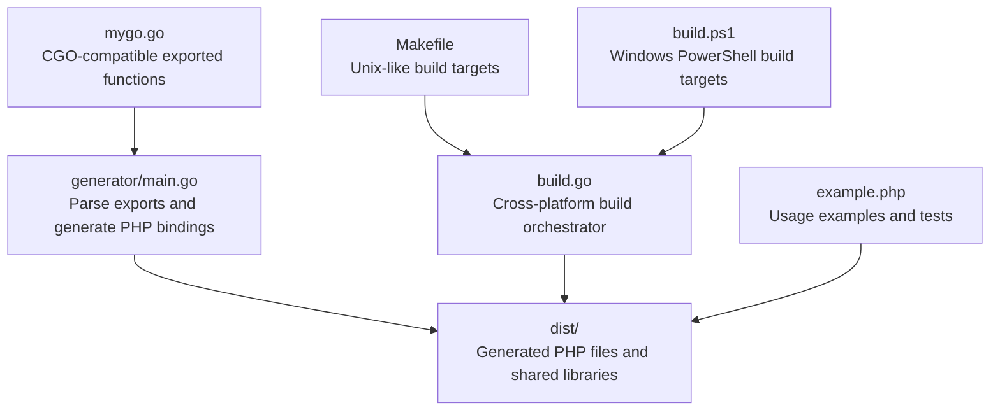
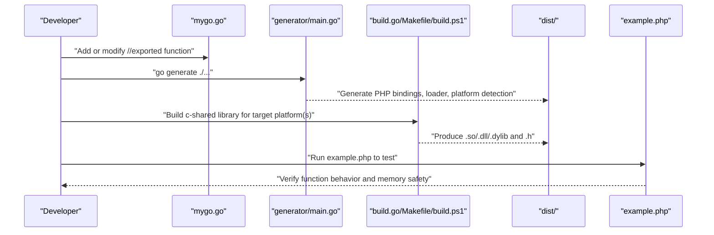
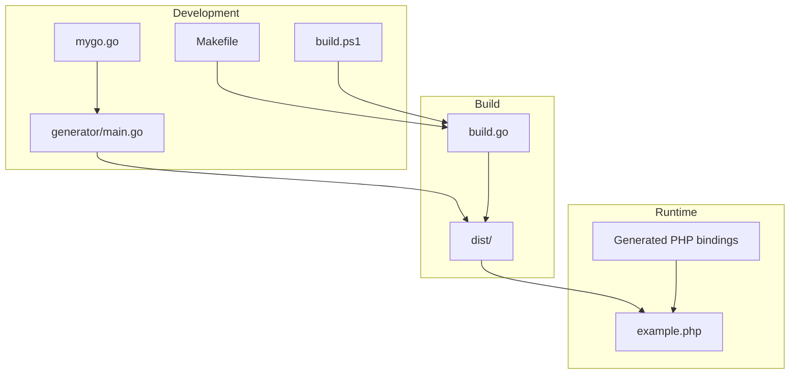

# Function Development

<cite>
**Referenced Files in This Document**
- [mygo.go](file://mygo.go)
- [README.md](file://README.md)
- [QUICKSTART.md](file://QUICKSTART.md)
- [generator/main.go](file://generator/main.go)
- [build.go](file://build.go)
- [Makefile](file://Makefile)
- [build.ps1](file://build.ps1)
- [example.php](file://example.php)
</cite>

## Table of Contents
1. [Introduction](#introduction)
2. [Project Structure](#project-structure)
3. [Core Components](#core-components)
4. [Architecture Overview](#architecture-overview)
5. [Detailed Component Analysis](#detailed-component-analysis)
6. [Dependency Analysis](#dependency-analysis)
7. [Performance Considerations](#performance-considerations)
8. [Troubleshooting Guide](#troubleshooting-guide)
9. [Conclusion](#conclusion)
10. [Appendices](#appendices)

## Introduction
This document explains how to add and modify CGO-compatible functions in mygo.go. It covers the requirements for exporting functions to PHP via FFI, including the //export directive, proper C stdlib inclusion, and the empty main() requirement. It also details supported parameter and return types, memory management considerations for strings and complex types, and best practices for documentation and backward compatibility. Practical examples are drawn from the existing Add, Echo, PrintArray, and ShowArray functions.

## Project Structure
The project is organized around a single Go source file containing exported functions, a code generator that produces PHP FFI bindings, and build orchestration scripts for cross-platform distribution.

**Diagram sources**
- [mygo.go](file://mygo.go#L1-L39)
- [generator/main.go](file://generator/main.go#L1-L705)
- [build.go](file://build.go#L1-L183)
- [Makefile](file://Makefile#L1-L54)
- [build.ps1](file://build.ps1#L1-L152)
- [example.php](file://example.php#L1-L95)

**Section sources**
- [mygo.go](file://mygo.go#L1-L39)
- [generator/main.go](file://generator/main.go#L1-L705)
- [build.go](file://build.go#L1-L183)
- [Makefile](file://Makefile#L1-L54)
- [build.ps1](file://build.ps1#L1-L152)
- [example.php](file://example.php#L1-L95)

## Core Components
- mygo.go: Defines the CGO-enabled package with exported functions for PHP consumption. It includes a C import for stdlib, uses //export directives, and provides an empty main() required for c-shared builds.
- generator/main.go: Parses exported functions from mygo.go and generates PHP FFI bindings, platform detection, and loader files.
- build.go: Orchestrates cross-platform builds for all supported platforms and copies generated PHP files to dist/.
- Makefile and build.ps1: Provide convenient targets for generating bindings, building, testing, and cleaning artifacts.
- example.php: Demonstrates how to load the library and call exported functions, including string handling and memory management.

Key requirements for CGO-compatible functions:
- Use //export directive before function declarations.
- Include C stdlib header via the cgo import block.
- Provide an empty main() function for c-shared builds.
- Limit exported function signatures to supported types (see Supported Types below).
- Manage memory for strings and complex types returned to PHP.

**Section sources**
- [mygo.go](file://mygo.go#L1-L39)
- [generator/main.go](file://generator/main.go#L1-L705)
- [build.go](file://build.go#L1-L183)
- [Makefile](file://Makefile#L1-L54)
- [build.ps1](file://build.ps1#L1-L152)
- [example.php](file://example.php#L1-L95)

## Architecture Overview
The end-to-end flow for adding/modifying functions involves editing mygo.go, regenerating PHP bindings, rebuilding shared libraries, and consuming them in PHP via FFI.

**Diagram sources**
- [mygo.go](file://mygo.go#L1-L39)
- [generator/main.go](file://generator/main.go#L1-L705)
- [build.go](file://build.go#L1-L183)
- [Makefile](file://Makefile#L1-L54)
- [build.ps1](file://build.ps1#L1-L152)
- [example.php](file://example.php#L1-L95)

## Detailed Component Analysis

### mygo.go: CGO-Compatible Function Requirements
- Package and import block: The file declares package main and includes a cgo block importing stdlib. This satisfies the requirement for C stdlib inclusion.
- Export directives: Functions are marked with //export so they are visible to the generated C header and callable from PHP via FFI.
- Empty main(): An empty main() is required for c-shared builds; it is never executed at runtime.
- Supported function signatures in this file:
  - Add: integer addition
  - Echo: string identity
  - PrintArray: prints array elements
  - ShowArray: returns a map with mixed types

Memory management considerations:
- Strings returned from Go to PHP must be freed by PHP after use to prevent memory leaks. The example demonstrates freeing strings returned by Go functions.

Best practices:
- Document exported functions with clear comments; the generator reads comments to annotate PHPDoc.
- Keep signatures simple and deterministic for FFI interoperability.
- Avoid returning Go-managed pointers or slices directly; prefer primitive types or marshaling to supported forms.

**Section sources**
- [mygo.go](file://mygo.go#L1-L39)

### generator/main.go: Parsing Exports and Generating PHP Bindings
- Parses exported functions from mygo.go using regex-based scanning for //export and func declarations.
- Extracts function comments, parameters, and return types.
- Generates:
  - platform_detect.php: Platform detection logic for OS/architecture mapping.
  - ffi_bindings.php: A PHP class that loads the shared library via FFI and exposes wrappers for each exported function.
  - loader.php: A convenience loader that selects the correct platform-specific library and header.

Type mapping:
- Converts C/Go types to PHPDoc hints and runtime types for parameter and return annotations.

**Section sources**
- [generator/main.go](file://generator/main.go#L1-L705)

### build.go: Cross-Platform Build Orchestration
- Defines supported platforms and generates output/header filenames.
- Builds c-shared libraries for each platform using go build with appropriate environment variables.
- Copies generated PHP files to dist/ after successful builds.
- Validates output and header files exist and are non-empty.

**Section sources**
- [build.go](file://build.go#L1-L183)

### Makefile and build.ps1: Convenience Targets
- Makefile:
  - generate: runs go generate to produce PHP files.
  - build: runs build.go to build for all platforms.
  - build-current: builds for the current platform only.
  - test: builds current and runs example.php.
  - clean: removes dist/ and generated PHP files.
- build.ps1:
  - Mirrors Makefile targets for Windows environments.

**Section sources**
- [Makefile](file://Makefile#L1-L54)
- [build.ps1](file://build.ps1#L1-L152)

### example.php: Usage Patterns and Memory Management
- Loads the library via the generated loader.
- Calls exported functions and demonstrates:
  - Passing primitives and receiving results.
  - Handling strings returned from Go and freeing them.
  - Iterating arrays and maps via PHP wrappers.

**Section sources**
- [example.php](file://example.php#L1-L95)

## Dependency Analysis
The following diagram shows how components depend on each other during the development and build lifecycle.

**Diagram sources**
- [mygo.go](file://mygo.go#L1-L39)
- [generator/main.go](file://generator/main.go#L1-L705)
- [build.go](file://build.go#L1-L183)
- [Makefile](file://Makefile#L1-L54)
- [build.ps1](file://build.ps1#L1-L152)
- [example.php](file://example.php#L1-L95)

**Section sources**
- [mygo.go](file://mygo.go#L1-L39)
- [generator/main.go](file://generator/main.go#L1-L705)
- [build.go](file://build.go#L1-L183)
- [Makefile](file://Makefile#L1-L54)
- [build.ps1](file://build.ps1#L1-L152)
- [example.php](file://example.php#L1-L95)

## Performance Considerations
- Library loading occurs once per PHP process; use persistent processes (PHP-FPM) to minimize repeated loads.
- FFI overhead is minimal compared to native C extensions.
- String conversions between PHP and C incur overhead; batch operations when possible.
- Avoid frequent allocations of large arrays/maps from Go to PHP; consider streaming or chunking.

[No sources needed since this section provides general guidance]

## Troubleshooting Guide
Common issues and resolutions:
- PHP FFI not enabled: Ensure the FFI extension is enabled in php.ini.
- Library not found: Confirm go generate was run, the library was built for the current platform, and the dist/ directory contains the correct .so/.dll/.dylib file.
- Platform not supported: Build for your platform or extend build.go to support additional combinations.
- CGO not enabled: Set CGO_ENABLED=1 and ensure a C compiler is installed.
- DLL loading errors on Windows: Match PHP architecture with the library (64-bit vs 32-bit), install required runtime libraries, and check antivirus interference.

**Section sources**
- [README.md](file://README.md#L238-L309)
- [QUICKSTART.md](file://QUICKSTART.md#L109-L134)

## Conclusion
Adding and modifying functions in mygo.go follows a straightforward pattern: define //exported functions with supported signatures, regenerate PHP bindings, rebuild shared libraries, and test in PHP. Pay close attention to memory management for strings and complex types, document functions clearly, and maintain backward compatibility by avoiding breaking changes to exported signatures.

[No sources needed since this section summarizes without analyzing specific files]

## Appendices

### Supported Types and Signatures
- Primitive types: integers, floats, booleans, and strings (char*).
- Arrays/slices: represented as arrays in PHPDoc; use []int or []float64 for numeric arrays.
- Maps: represented as arrays in PHPDoc; use map[string]any for heterogeneous maps.
- Return types: void, primitives, char*, and Go-managed maps/slices are supported.
- Notes:
  - Strings returned from Go must be freed in PHP to prevent leaks.
  - Complex types (e.g., Go structs) are not directly supported; marshal to supported forms.

**Section sources**
- [generator/main.go](file://generator/main.go#L481-L640)
- [example.php](file://example.php#L1-L95)

### Adding a New Function: Step-by-Step
1. Edit mygo.go:
   - Add the function with a //export directive.
   - Ensure the signature uses supported types.
   - Include the C stdlib import block and keep main() empty.
2. Generate bindings:
   - Run go generate ./... to update PHP files.
3. Rebuild:
   - Build for the current platform or all platforms.
4. Test:
   - Run example.php to verify behavior and memory safety.

**Section sources**
- [README.md](file://README.md#L155-L194)
- [QUICKSTART.md](file://QUICKSTART.md#L84-L108)
- [Makefile](file://Makefile#L1-L54)
- [build.ps1](file://build.ps1#L1-L152)

### Backward Compatibility Best Practices
- Do not change the names or signatures of existing exported functions.
- If deprecating a function, add a new function alongside it and document the migration path.
- Keep comments clear and concise; the generator uses them for PHPDoc.
- Avoid introducing new CGO dependencies unless absolutely necessary.

**Section sources**
- [README.md](file://README.md#L155-L194)
- [generator/main.go](file://generator/main.go#L1-L705)

### Example Functions from mygo.go
- Add: integer addition
- Echo: string identity
- PrintArray: prints array elements
- ShowArray: returns a map with mixed types

These functions demonstrate supported signatures and memory-safe usage patterns.

**Section sources**
- [mygo.go](file://mygo.go#L1-L39)