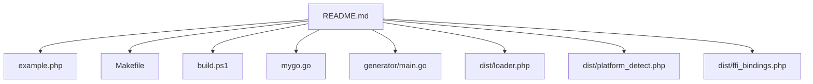
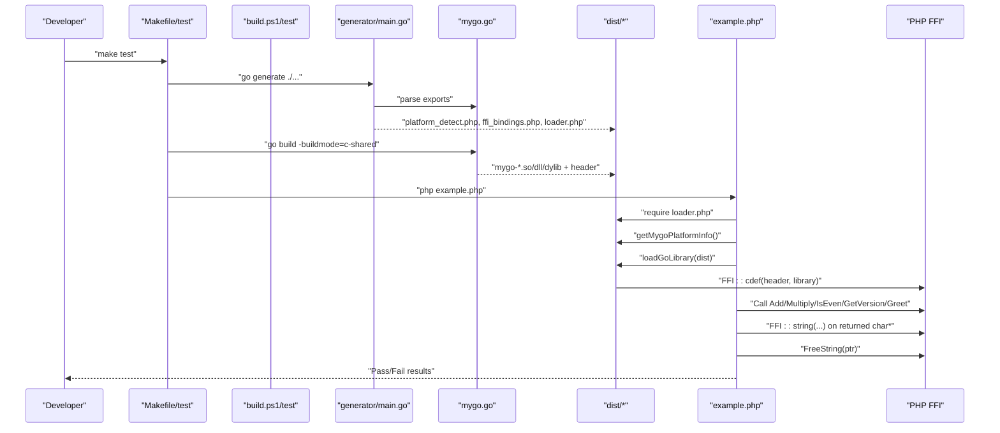
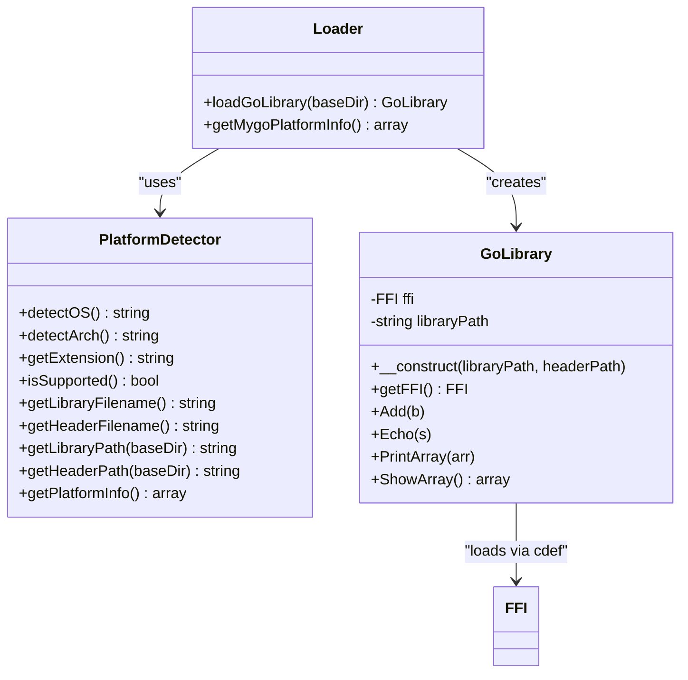
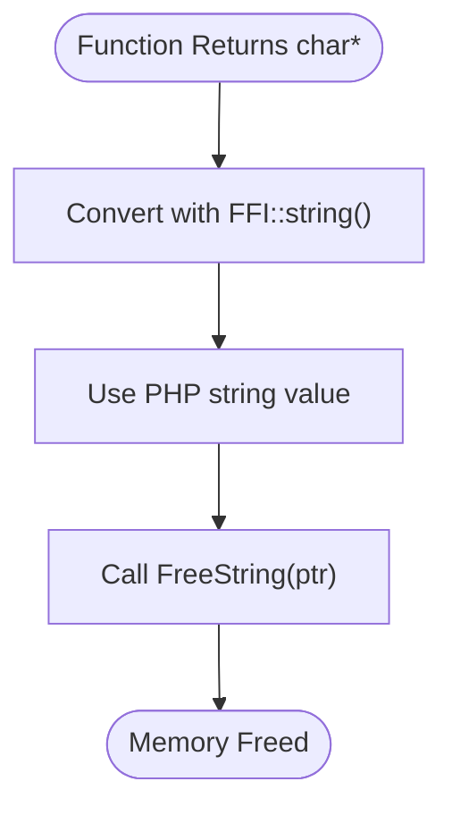
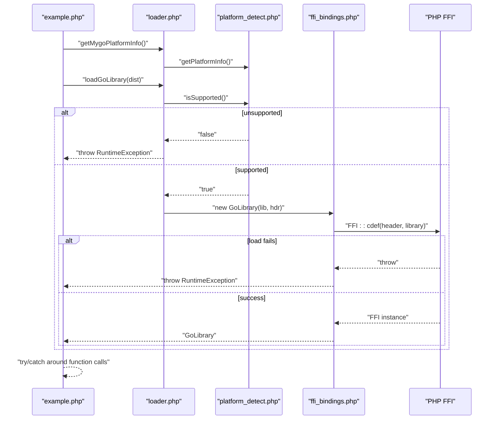
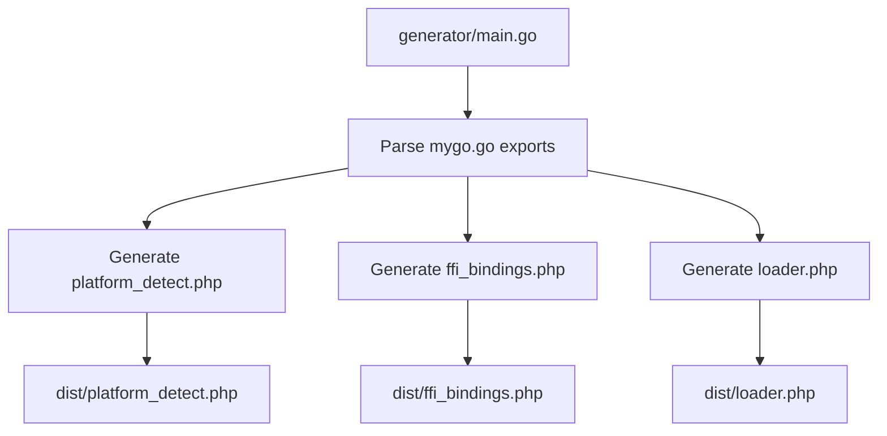
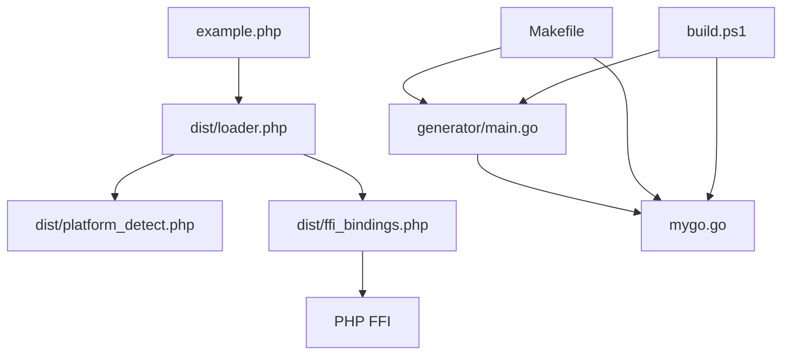

# Testing and Validation

<cite>
**Referenced Files in This Document**
- [README.md](file://README.md)
- [example.php](file://example.php)
- [Makefile](file://Makefile)
- [build.ps1](file://build.ps1)
- [mygo.go](file://mygo.go)
- [generator/main.go](file://generator/main.go)
- [dist/loader.php](file://dist/loader.php)
- [dist/platform_detect.php](file://dist/platform_detect.php)
- [dist/ffi_bindings.php](file://dist/ffi_bindings.php)
</cite>

## Table of Contents
1. [Introduction](#introduction)
2. [Project Structure](#project-structure)
3. [Core Components](#core-components)
4. [Architecture Overview](#architecture-overview)
5. [Detailed Component Analysis](#detailed-component-analysis)
6. [Dependency Analysis](#dependency-analysis)
7. [Performance Considerations](#performance-considerations)
8. [Troubleshooting Guide](#troubleshooting-guide)
9. [Conclusion](#conclusion)
10. [Appendices](#appendices)

## Introduction
This document explains how to test and validate changes in the development workflow for the cross-platform Go shared library build system intended for PHP FFI consumption. It focuses on using example.php as a test harness to validate both Go functions and PHP FFI integration. It also documents the complete testing cycle: running make test or ./build.ps1 test to build and execute tests, or manually running php example.php. The key aspects covered include platform detection, library loading, function calls with various parameter types, string handling with proper memory management (FFI::string and FreeString), and error handling. Guidance is included for debugging both Go code issues and PHP FFI integration problems, along with examples from README.md showing expected output and test scenarios for different function types.

## Project Structure
The repository organizes the build system around a small set of files that enable automated generation of PHP FFI bindings, platform detection, and a simple example application to exercise the integration.

**Diagram sources**
- [README.md](file://README.md#L25-L41)
- [example.php](file://example.php#L1-L20)
- [Makefile](file://Makefile#L1-L20)
- [build.ps1](file://build.ps1#L1-L20)
- [mygo.go](file://mygo.go#L1-L20)
- [generator/main.go](file://generator/main.go#L1-L30)
- [dist/loader.php](file://dist/loader.php#L1-L20)
- [dist/platform_detect.php](file://dist/platform_detect.php#L1-L20)
- [dist/ffi_bindings.php](file://dist/ffi_bindings.php#L1-L20)

**Section sources**
- [README.md](file://README.md#L25-L41)

## Core Components
- example.php: A comprehensive test harness that loads the platform detector, loads the Go library via FFI, exercises integer arithmetic, boolean checks, string-returning functions, and validates memory management for returned strings.
- Makefile: Provides targets to generate bindings, build for all platforms, build current platform, run the test harness, and clean artifacts.
- build.ps1: Windows PowerShell script mirroring the Makefile targets for convenience on Windows.
- generator/main.go: Parses exported Go functions and auto-generates platform detection, FFI bindings, and loader PHP files.
- dist/loader.php: Entry point to load the platform detector and FFI wrapper, returning a GoLibrary instance.
- dist/platform_detect.php: Platform detection logic mapping PHP’s OS family and machine architecture to the expected library naming scheme.
- dist/ffi_bindings.php: FFI wrapper class that loads the shared library using the header file and exposes typed PHP wrappers for exported functions.

Key testing aspects validated by example.php:
- Platform detection and library filename resolution
- Library loading via FFI with header file
- Function calls with integer and string parameters
- String handling with FFI::string and FreeString
- Error handling via try/catch and thrown exceptions

**Section sources**
- [example.php](file://example.php#L1-L20)
- [Makefile](file://Makefile#L1-L20)
- [build.ps1](file://build.ps1#L1-L20)
- [generator/main.go](file://generator/main.go#L1-L30)
- [dist/loader.php](file://dist/loader.php#L1-L20)
- [dist/platform_detect.php](file://dist/platform_detect.php#L1-L20)
- [dist/ffi_bindings.php](file://dist/ffi_bindings.php#L1-L20)

## Architecture Overview
The testing workflow integrates Go code generation, platform detection, and PHP FFI loading into a single validation flow.

**Diagram sources**
- [Makefile](file://Makefile#L32-L36)
- [build.ps1](file://build.ps1#L95-L102)
- [generator/main.go](file://generator/main.go#L27-L75)
- [mygo.go](file://mygo.go#L11-L13)
- [dist/loader.php](file://dist/loader.php#L15-L47)
- [dist/platform_detect.php](file://dist/platform_detect.php#L18-L45)
- [dist/ffi_bindings.php](file://dist/ffi_bindings.php#L22-L46)
- [example.php](file://example.php#L12-L26)

## Detailed Component Analysis

### Testing Cycle: Running make test or ./build.ps1 test
- make test: Generates PHP bindings, builds the current platform library, and runs php example.php.
- ./build.ps1 test: Mirrors the same flow on Windows.

Both flows rely on:
- go generate to produce platform_detect.php, ffi_bindings.php, and loader.php
- go build -buildmode=c-shared to produce the platform-specific shared library and header
- php example.php to exercise the integration

Expected outcomes:
- Successful generation and build
- Library loading via FFI
- Function calls returning expected values
- Proper string memory cleanup

**Section sources**
- [Makefile](file://Makefile#L32-L36)
- [build.ps1](file://build.ps1#L95-L102)
- [README.md](file://README.md#L310-L318)

### Manual Execution: php example.php
- Loads platform information via getMygoPlatformInfo()
- Loads the Go library via loadGoLibrary()
- Exercises Add, Multiply, IsEven, GetVersion, and Greet
- Validates string handling with FFI::string and FreeString
- Reports PASS/FAIL per test case

**Section sources**
- [example.php](file://example.php#L12-L26)
- [example.php](file://example.php#L27-L94)
- [dist/loader.php](file://dist/loader.php#L49-L58)

### Platform Detection and Library Loading
- PlatformDetector maps PHP_OS_FAMILY and machine architecture to supported library extensions (.so, .dll, .dylib).
- getMygoPlatformInfo() returns OS, arch, extension, library filename, header filename, and support status.
- loadGoLibrary() verifies platform support, resolves library/header paths, and constructs a GoLibrary instance using FFI::cdef.

**Diagram sources**
- [dist/platform_detect.php](file://dist/platform_detect.php#L18-L45)
- [dist/platform_detect.php](file://dist/platform_detect.php#L88-L145)
- [dist/ffi_bindings.php](file://dist/ffi_bindings.php#L13-L46)
- [dist/ffi_bindings.php](file://dist/ffi_bindings.php#L56-L88)
- [dist/loader.php](file://dist/loader.php#L15-L47)
- [dist/loader.php](file://dist/loader.php#L49-L58)

**Section sources**
- [dist/platform_detect.php](file://dist/platform_detect.php#L18-L45)
- [dist/platform_detect.php](file://dist/platform_detect.php#L88-L145)
- [dist/ffi_bindings.php](file://dist/ffi_bindings.php#L13-L46)
- [dist/ffi_bindings.php](file://dist/ffi_bindings.php#L56-L88)
- [dist/loader.php](file://dist/loader.php#L15-L47)
- [dist/loader.php](file://dist/loader.php#L49-L58)

### Function Calls and Parameter Types
example.php exercises:
- Integer arithmetic: Add and Multiply
- Boolean logic: IsEven returning 1/0 semantics
- String-returning functions: GetVersion and Greet
- Arrays/maps: Echo, PrintArray, ShowArray (as exposed by generated bindings)

These functions are parsed from mygo.go and wrapped in the generated FFI bindings.

**Section sources**
- [example.php](file://example.php#L27-L94)
- [generator/main.go](file://generator/main.go#L77-L145)
- [dist/ffi_bindings.php](file://dist/ffi_bindings.php#L56-L88)
- [mygo.go](file://mygo.go#L13-L35)

### String Handling and Memory Management
- Returned strings from Go are char* pointers. example.php converts them to PHP strings using FFI::string and frees them with FreeString.
- The generator writes a wrapper method for FreeString in the FFI bindings module.

**Diagram sources**
- [example.php](file://example.php#L54-L63)
- [example.php](file://example.php#L65-L85)
- [dist/ffi_bindings.php](file://dist/ffi_bindings.php#L56-L88)

**Section sources**
- [example.php](file://example.php#L54-L63)
- [example.php](file://example.php#L65-L85)
- [dist/ffi_bindings.php](file://dist/ffi_bindings.php#L56-L88)

### Error Handling
- PlatformDetector throws on unsupported OS/arch.
- loadGoLibrary throws on unsupported platform or missing files.
- FFI::cdef throws on load failures.
- example.php wraps the entire test in a try/catch and prints stack traces on failure.

**Diagram sources**
- [dist/loader.php](file://dist/loader.php#L22-L47)
- [dist/platform_detect.php](file://dist/platform_detect.php#L74-L86)
- [dist/ffi_bindings.php](file://dist/ffi_bindings.php#L22-L46)
- [example.php](file://example.php#L90-L94)

**Section sources**
- [dist/loader.php](file://dist/loader.php#L22-L47)
- [dist/platform_detect.php](file://dist/platform_detect.php#L74-L86)
- [dist/ffi_bindings.php](file://dist/ffi_bindings.php#L22-L46)
- [example.php](file://example.php#L90-L94)

### Go Function Export Parsing and Binding Generation
The generator parses exported functions from mygo.go and generates:
- platform_detect.php: Platform detection and filename resolution
- ffi_bindings.php: Typed PHP wrappers for exported functions
- loader.php: Loader and platform info helpers

**Diagram sources**
- [generator/main.go](file://generator/main.go#L27-L75)
- [generator/main.go](file://generator/main.go#L190-L339)
- [generator/main.go](file://generator/main.go#L341-L418)
- [generator/main.go](file://generator/main.go#L642-L705)
- [mygo.go](file://mygo.go#L11-L13)

**Section sources**
- [generator/main.go](file://generator/main.go#L27-L75)
- [generator/main.go](file://generator/main.go#L190-L339)
- [generator/main.go](file://generator/main.go#L341-L418)
- [generator/main.go](file://generator/main.go#L642-L705)
- [mygo.go](file://mygo.go#L11-L13)

## Dependency Analysis
- example.php depends on dist/loader.php for platform info and library loading.
- dist/loader.php depends on dist/platform_detect.php and dist/ffi_bindings.php.
- dist/ffi_bindings.php depends on PHP FFI extension and the generated header file.
- generator/main.go depends on mygo.go for parsing exported functions.
- Makefile/build.ps1 orchestrate generation and building of the shared library.

**Diagram sources**
- [example.php](file://example.php#L12-L26)
- [dist/loader.php](file://dist/loader.php#L15-L47)
- [dist/platform_detect.php](file://dist/platform_detect.php#L18-L45)
- [dist/ffi_bindings.php](file://dist/ffi_bindings.php#L22-L46)
- [generator/main.go](file://generator/main.go#L27-L75)
- [mygo.go](file://mygo.go#L11-L13)
- [Makefile](file://Makefile#L32-L36)
- [build.ps1](file://build.ps1#L95-L102)

**Section sources**
- [example.php](file://example.php#L12-L26)
- [dist/loader.php](file://dist/loader.php#L15-L47)
- [dist/platform_detect.php](file://dist/platform_detect.php#L18-L45)
- [dist/ffi_bindings.php](file://dist/ffi_bindings.php#L22-L46)
- [generator/main.go](file://generator/main.go#L27-L75)
- [mygo.go](file://mygo.go#L11-L13)
- [Makefile](file://Makefile#L32-L36)
- [build.ps1](file://build.ps1#L95-L102)

## Performance Considerations
- Library loading occurs once per PHP process; using persistent processes (e.g., PHP-FPM) improves performance.
- FFI overhead is minimal compared to native C extensions.
- String conversion between PHP and C has overhead; batch operations when possible.
- Always free Go-allocated strings to prevent memory leaks.

**Section sources**
- [README.md](file://README.md#L296-L302)

## Troubleshooting Guide
Common issues and resolutions:
- PHP FFI not enabled: Ensure the FFI extension is enabled in php.ini.
- Library not found: Confirm go generate and go build were executed and that the dist directory contains the appropriate shared library and header.
- Platform not supported: Build for your platform or add support in build.go/generator.
- CGO not enabled: Ensure CGO_ENABLED=1 and a C compiler is installed.
- DLL loading errors on Windows: Verify architecture match (64-bit PHP with 64-bit DLL), install required runtime libraries, and check antivirus interference.

Debugging tips:
- For Go code issues: Verify exported functions in mygo.go and regenerate bindings.
- For PHP FFI integration problems: Check loader.php and platform_detect.php for correct paths and supported platforms; wrap calls in try/catch to capture detailed error messages.

**Section sources**
- [README.md](file://README.md#L239-L295)
- [dist/loader.php](file://dist/loader.php#L22-L47)
- [dist/platform_detect.php](file://dist/platform_detect.php#L74-L86)
- [dist/ffi_bindings.php](file://dist/ffi_bindings.php#L22-L46)
- [example.php](file://example.php#L90-L94)

## Conclusion
The testing workflow centers on example.php as a comprehensive validation harness that exercises platform detection, library loading, function calls, and memory management for string-returning functions. The Makefile and build.ps1 scripts streamline the end-to-end cycle from generation to execution. By following the documented steps and using the troubleshooting guidance, developers can efficiently validate changes to both Go functions and PHP FFI integration.

## Appendices

### Test Scenarios from README.md
- Basic usage example shows loading the library, calling Add, and working with strings via FFI::string and FreeString.
- Platform information example demonstrates getMygoPlatformInfo() output structure.

**Section sources**
- [README.md](file://README.md#L110-L149)