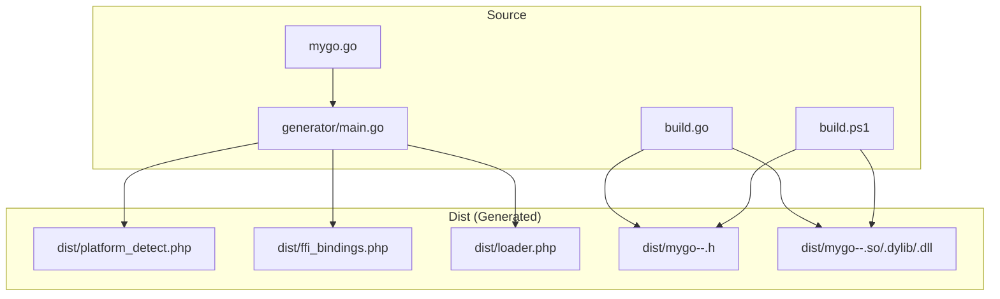
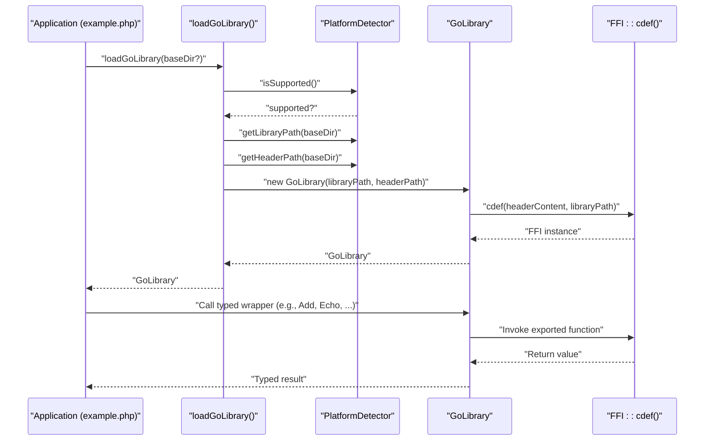
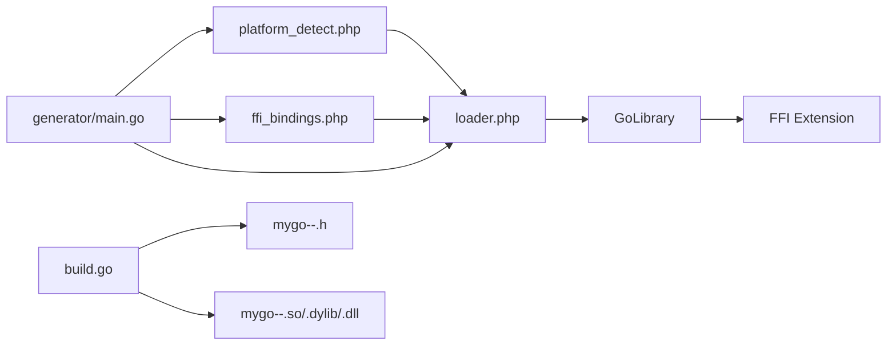
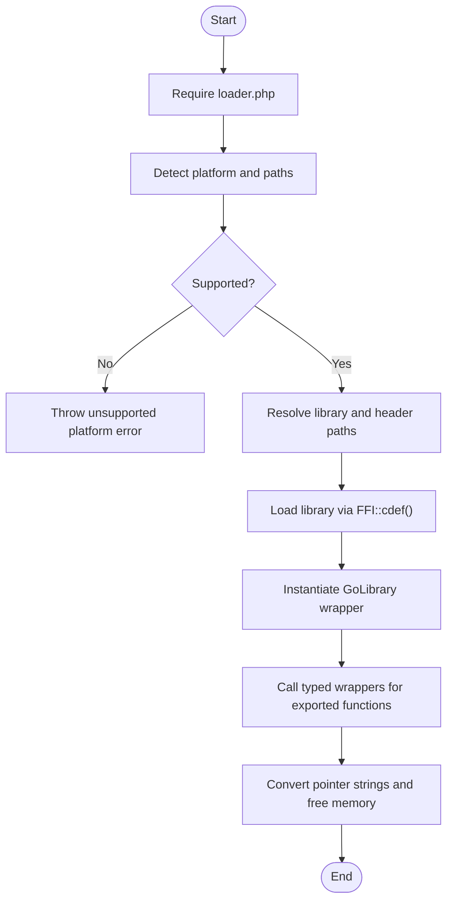

# PHP Binding Usage

<cite>
**Referenced Files in This Document**
- [README.md](file://README.md)
- [example.php](file://example.php)
- [mygo.go](file://mygo.go)
- [build.go](file://build.go)
- [build.ps1](file://build.ps1)
- [generator/main.go](file://generator/main.go)
- [dist/platform_detect.php](file://dist/platform_detect.php)
- [dist/ffi_bindings.php](file://dist/ffi_bindings.php)
- [dist/loader.php](file://dist/loader.php)
- [dist/mygo-windows-amd64.h](file://dist/mygo-windows-amd64.h)
- [test_ffi.php](file://test_ffi.php)
</cite>

## Table of Contents
1. [Introduction](#introduction)
2. [Project Structure](#project-structure)
3. [Core Components](#core-components)
4. [Architecture Overview](#architecture-overview)
5. [Detailed Component Analysis](#detailed-component-analysis)
6. [Dependency Analysis](#dependency-analysis)
7. [Performance Considerations](#performance-considerations)
8. [Troubleshooting Guide](#troubleshooting-guide)
9. [Conclusion](#conclusion)
10. [Appendices](#appendices)

## Introduction
This document explains how to use the generated PHP bindings to interact with a Go shared library through PHP’s Foreign Function Interface (FFI). It focuses on the three generated PHP files: platform_detect.php, ffi_bindings.php, and loader.php. It also demonstrates the complete workflow using example.php, documents the loadGoLibrary() function and its parameters, explains how the GoLibrary class wraps FFI functionality, and provides examples for each exported function from mygo.go. Error handling patterns for common issues are included, along with best practices for integrating these components into existing PHP applications.

## Project Structure
The project is organized around a minimal Go library with exported functions, a code generator that produces PHP FFI bindings, and a build system that compiles the shared library for multiple platforms. The distribution directory (dist/) contains the generated PHP files and platform-specific shared libraries and headers.

**Diagram sources**
- [mygo.go](file://mygo.go#L1-L39)
- [generator/main.go](file://generator/main.go#L1-L705)
- [build.go](file://build.go#L1-L183)
- [build.ps1](file://build.ps1#L1-L152)

**Section sources**
- [README.md](file://README.md#L25-L41)
- [README.md](file://README.md#L110-L131)

## Core Components
This section explains the purpose and structure of the three generated PHP files and how they work together.

- platform_detect.php: Provides platform detection and path resolution for the shared library and header files. It determines OS family, CPU architecture, and constructs the correct filenames and paths for the current platform.
- ffi_bindings.php: Defines the GoLibrary class that encapsulates FFI loading and exposes typed wrapper methods for each exported Go function. It validates the presence of the library and header files and loads them via FFI::cdef().
- loader.php: The main entry point for loading the library. It orchestrates platform detection, path resolution, and returns a configured GoLibrary instance. It also exposes a convenience function to retrieve platform information.

Key responsibilities:
- Platform detection and path construction
- FFI initialization and error handling
- Type-safe wrappers for exported functions
- Centralized loading and configuration

**Section sources**
- [dist/platform_detect.php](file://dist/platform_detect.php#L1-L146)
- [dist/ffi_bindings.php](file://dist/ffi_bindings.php#L1-L89)
- [dist/loader.php](file://dist/loader.php#L1-L58)

## Architecture Overview
The system follows a layered architecture:
- Application code (example.php) depends on the loader to obtain a GoLibrary instance.
- The loader delegates to PlatformDetector to resolve the correct library and header paths for the current platform.
- GoLibrary initializes FFI with the header and library paths, exposing typed wrapper methods for each exported function.
- The application invokes these wrappers, which call into the Go shared library.

**Diagram sources**
- [dist/loader.php](file://dist/loader.php#L22-L47)
- [dist/platform_detect.php](file://dist/platform_detect.php#L74-L129)
- [dist/ffi_bindings.php](file://dist/ffi_bindings.php#L13-L89)

## Detailed Component Analysis

### platform_detect.php
Purpose:
- Detects the current OS family and CPU architecture.
- Validates platform support against a predefined set of combinations.
- Constructs library and header filenames and resolves full paths.

Key methods and behaviors:
- detectOS(): Maps PHP_OS_FAMILY to normalized identifiers.
- detectArch(): Normalizes machine identifiers to amd64 or arm64.
- getExtension(): Returns the platform-specific file extension.
- isSupported(): Returns whether the current OS/arch combination is supported.
- getLibraryFilename()/getHeaderFilename(): Builds filenames using the base name and detected platform.
- getLibraryPath()/getHeaderPath(): Resolves absolute paths under a given base directory.
- getPlatformInfo(): Returns a structured array with OS, arch, extension, library/header filenames, and support status.

Error handling:
- Throws exceptions for unsupported OS, architecture, or platform combinations.

Best practices:
- Use the provided methods to ensure correct path resolution.
- Pass a writable base directory to loader.php so the library and header files are discoverable.

**Section sources**
- [dist/platform_detect.php](file://dist/platform_detect.php#L1-L146)

### ffi_bindings.php
Purpose:
- Wraps FFI functionality and exposes typed wrapper methods for each exported Go function.
- Validates the presence of the library and header files before loading.
- Provides a getFFI() accessor for advanced scenarios.

Key behaviors:
- Constructor validates FFI extension availability, library existence, and header existence.
- Loads the shared library via FFI::cdef() using the header content.
- Exposes typed wrapper methods mirroring the exported Go functions.
- Throws descriptive exceptions on missing files or FFI load failures.

Important note:
- The generator creates wrapper methods for each exported function. The example library includes several functions; the generator scans the Go source to produce corresponding PHP wrappers.

**Section sources**
- [dist/ffi_bindings.php](file://dist/ffi_bindings.php#L1-L89)
- [generator/main.go](file://generator/main.go#L436-L479)

### loader.php
Purpose:
- Provides a single entry point to load the Go library for the current platform.
- Handles platform validation and path resolution.
- Returns a configured GoLibrary instance ready for use.

Parameters:
- baseDir: Optional base directory where libraries and headers are located. Defaults to the directory containing loader.php.

Behavior:
- Validates platform support via PlatformDetector.
- Resolves library and header paths using PlatformDetector.
- Instantiates GoLibrary with the resolved paths.
- Exposes getMygoPlatformInfo() to retrieve platform details.

Custom base directories:
- Pass a custom base directory to loadGoLibrary() to load libraries from a non-default location (e.g., a packaged distribution folder).

**Section sources**
- [dist/loader.php](file://dist/loader.php#L1-L58)
- [README.md](file://README.md#L110-L131)

### Example Workflow: example.php
The example demonstrates the complete lifecycle:
- Require the loader.
- Optionally display platform information.
- Load the library with loadGoLibrary(baseDir).
- Call typed wrappers for exported functions.
- Handle string-returning functions by converting FFI pointers to PHP strings and freeing Go-allocated memory.

Highlights:
- Demonstrates Add, Multiply, IsEven, GetVersion, Greet, and FreeString usage.
- Shows proper error handling with try/catch and stack traces.

**Section sources**
- [example.php](file://example.php#L1-L95)
- [README.md](file://README.md#L110-L131)

### GoLibrary Class and FFI Wrapping
The GoLibrary class centralizes FFI usage:
- Validates prerequisites (FFI extension, files).
- Reads the header file and loads the library via FFI::cdef().
- Exposes typed wrapper methods for each exported function.
- Provides getFFI() for direct access to the underlying FFI instance.

Integration patterns:
- Instantiate via loader.php.
- Call wrapper methods directly on the GoLibrary instance.
- For pointer-returning functions, convert to PHP strings using FFI::string() and free memory using the provided FreeString wrapper.

**Section sources**
- [dist/ffi_bindings.php](file://dist/ffi_bindings.php#L13-L89)
- [example.php](file://example.php#L54-L86)

### loadGoLibrary() Function
Signature and parameters:
- loadGoLibrary(?string $baseDir = null): Returns a GoLibrary instance.
- baseDir: Optional directory containing the platform-specific library and header files. Defaults to the loader’s directory.

Behavior:
- Validates platform support.
- Resolves library and header paths.
- Creates and returns a GoLibrary instance.

Custom base directories:
- Supply a custom base directory to load libraries from a different location (e.g., a packaged distribution folder).

**Section sources**
- [dist/loader.php](file://dist/loader.php#L22-L47)

### Exported Functions from mygo.go
The example library exports several functions. The generator parses mygo.go to create corresponding PHP wrappers. The example application exercises these functions.

Functions and usage patterns:
- Add(a, b): Adds two integers. Call via $lib->Add(a, b).
- Echo(s): Returns the input string unchanged. Call via $lib->Echo(s).
- PrintArray(arr): Prints array elements to stdout. Call via $lib->PrintArray(arr).
- ShowArray(): Returns a map-like structure. Call via $lib->ShowArray() and handle as an associative array.
- Additional functions (e.g., Multiply, IsEven, GetVersion, Greet, FreeString) are demonstrated in example.php.

Notes:
- For functions returning pointers to strings, convert to PHP strings using FFI::string() and free memory using $lib->FreeString(ptr).
- Always validate inputs and handle errors appropriately.

**Section sources**
- [mygo.go](file://mygo.go#L1-L39)
- [example.php](file://example.php#L27-L86)
- [generator/main.go](file://generator/main.go#L77-L145)

## Dependency Analysis
The generated PHP components depend on each other and on external resources:
- loader.php depends on platform_detect.php and ffi_bindings.php.
- GoLibrary depends on the FFI extension and the presence of the correct library and header files.
- The generator depends on the Go source file to extract exported functions and generate PHP wrappers.
- The build system compiles the shared library and generates headers for each platform.

**Diagram sources**
- [dist/platform_detect.php](file://dist/platform_detect.php#L1-L146)
- [dist/ffi_bindings.php](file://dist/ffi_bindings.php#L1-L89)
- [dist/loader.php](file://dist/loader.php#L1-L58)
- [generator/main.go](file://generator/main.go#L1-L705)
- [build.go](file://build.go#L1-L183)

**Section sources**
- [dist/loader.php](file://dist/loader.php#L1-L58)
- [dist/ffi_bindings.php](file://dist/ffi_bindings.php#L1-L89)
- [dist/platform_detect.php](file://dist/platform_detect.php#L1-L146)
- [generator/main.go](file://generator/main.go#L1-L705)
- [build.go](file://build.go#L1-L183)

## Performance Considerations
- Library loading occurs once per process. Use persistent processes (e.g., PHP-FPM) to avoid repeated loads.
- FFI overhead is minimal compared to native C extensions.
- String conversions between PHP and C incur overhead; batch operations when possible.
- Always free Go-allocated strings to prevent memory leaks.

**Section sources**
- [README.md](file://README.md#L296-L302)

## Troubleshooting Guide
Common issues and resolutions:
- FFI extension disabled:
  - Enable the FFI extension in php.ini and restart the service.
- Library not found:
  - Ensure go generate was run and the dist/ directory contains the correct .so/.dll/.dylib file.
  - Verify the base directory passed to loadGoLibrary() is correct.
- Unsupported platform:
  - Build the library for your platform or add support in the build system.
- CGO disabled:
  - Enable CGO and ensure a C compiler is available for your platform.
- DLL loading errors on Windows:
  - Ensure architecture alignment (64-bit PHP with 64-bit DLL).
  - Install required runtime libraries if the DLL depends on them.
  - Temporarily disable antivirus to rule out interference.

Validation utilities:
- Use getMygoPlatformInfo() to inspect detected OS, architecture, and filenames.
- Use test_ffi.php to verify FFI loading and basic function calls.

**Section sources**
- [README.md](file://README.md#L239-L295)
- [dist/loader.php](file://dist/loader.php#L54-L58)
- [test_ffi.php](file://test_ffi.php#L1-L31)

## Conclusion
The generated PHP bindings provide a robust, cross-platform way to consume Go shared libraries from PHP via FFI. The loader.php orchestrates platform detection and library loading, platform_detect.php ensures correct path resolution, and ffi_bindings.php offers type-safe wrappers for exported functions. By following the workflow outlined here and adhering to the best practices and error-handling patterns described, you can reliably integrate Go functionality into your PHP applications.

## Appendices

### A. Complete Workflow Diagram

**Diagram sources**
- [dist/loader.php](file://dist/loader.php#L22-L47)
- [dist/platform_detect.php](file://dist/platform_detect.php#L74-L129)
- [dist/ffi_bindings.php](file://dist/ffi_bindings.php#L13-L89)
- [example.php](file://example.php#L21-L86)

### B. Example Usage References
- Loading the library and calling functions: [example.php](file://example.php#L21-L86)
- Platform information retrieval: [example.php](file://example.php#L12-L19), [dist/loader.php](file://dist/loader.php#L54-L58)
- String handling and memory management: [example.php](file://example.php#L54-L86)

### C. Build and Distribution Notes
- Generate bindings and build libraries for all platforms using the provided scripts and build system.
- The build system creates platform-specific shared libraries and headers, and copies PHP files to dist/.

**Section sources**
- [build.go](file://build.go#L1-L183)
- [build.ps1](file://build.ps1#L1-L152)
- [README.md](file://README.md#L67-L109)