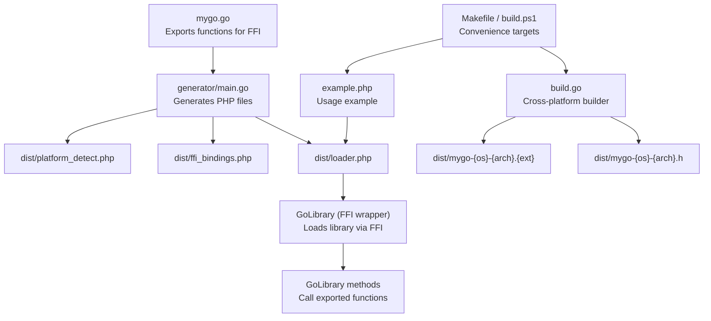
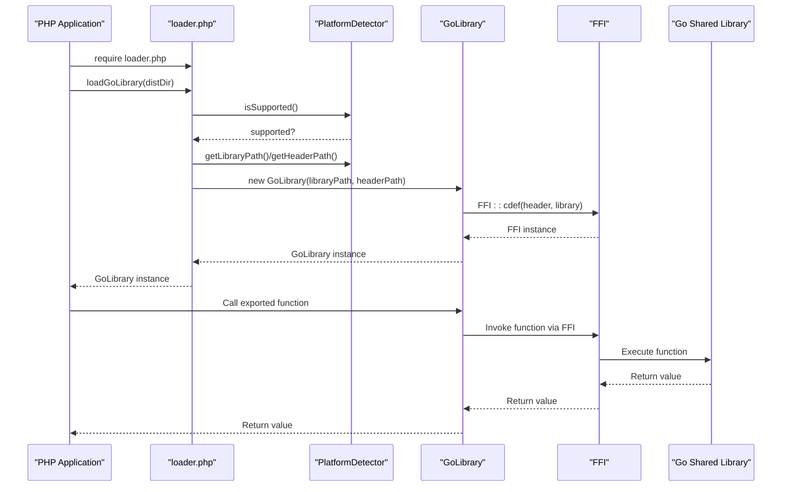
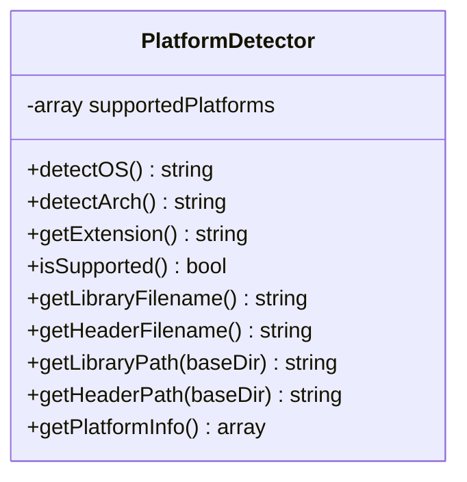
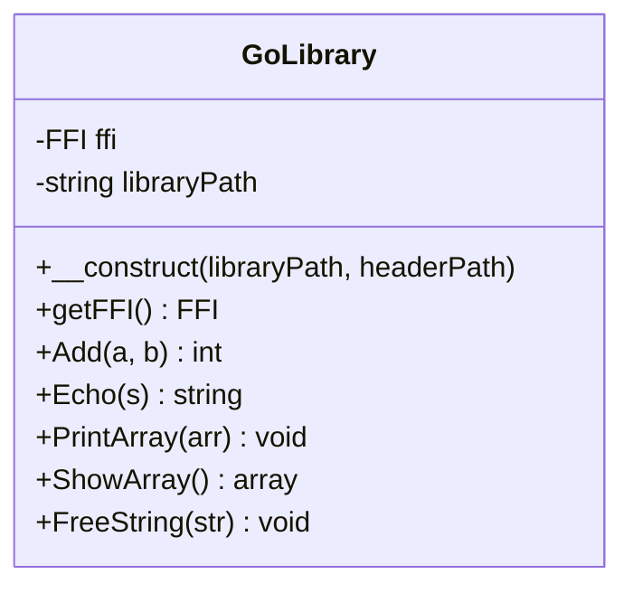
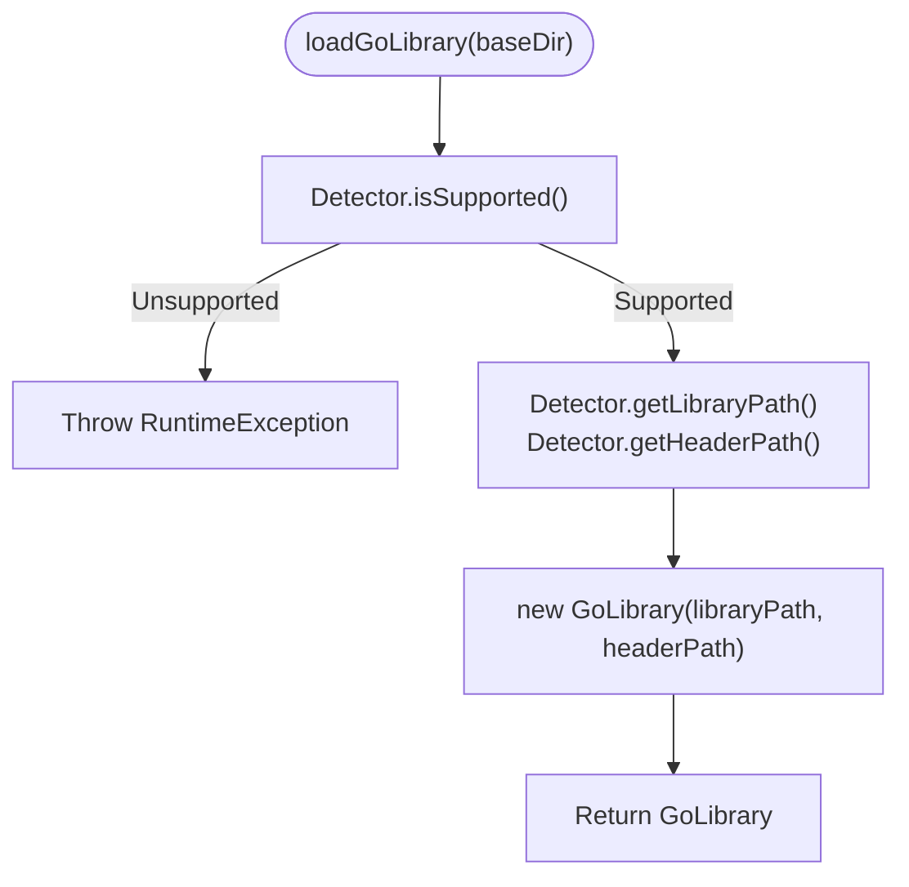
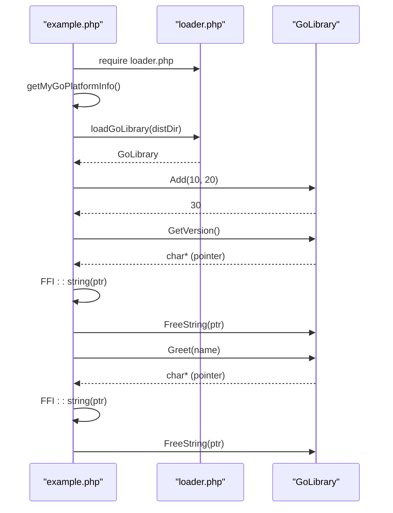
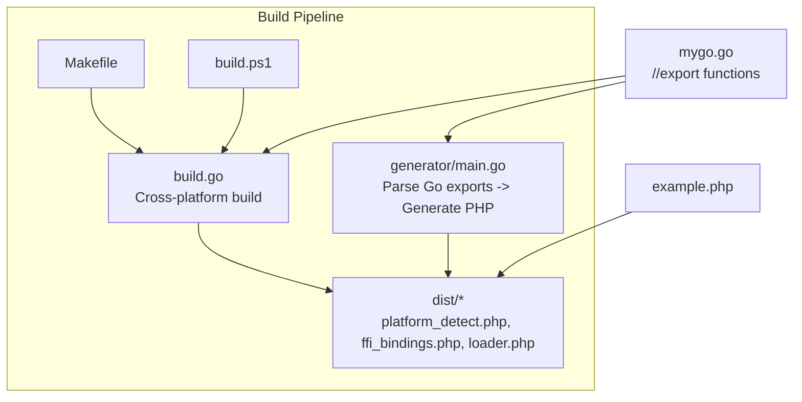

# PHP Integration

<cite>
**Referenced Files in This Document**
- [README.md](file://README.md)
- [QUICKSTART.md](file://QUICKSTART.md)
- [example.php](file://example.php)
- [mygo.go](file://mygo.go)
- [generator/main.go](file://generator/main.go)
- [build.go](file://build.go)
- [Makefile](file://Makefile)
- [build.ps1](file://build.ps1)
- [go.mod](file://go.mod)
</cite>

## Table of Contents
1. [Introduction](#introduction)
2. [Project Structure](#project-structure)
3. [Core Components](#core-components)
4. [Architecture Overview](#architecture-overview)
5. [Detailed Component Analysis](#detailed-component-analysis)
6. [Dependency Analysis](#dependency-analysis)
7. [Performance Considerations](#performance-considerations)
8. [Troubleshooting Guide](#troubleshooting-guide)
9. [Conclusion](#conclusion)
10. [Appendices](#appendices)

## Introduction
This document explains how to integrate Go libraries into PHP using FFI (Foreign Function Interface). It focuses on how the generated PHP bindings enable calling Go functions from PHP, the structure of the generated classes, platform detection, library loading, and function wrappers. It also covers type mapping between Go/C and PHP, memory management considerations, error handling strategies, and best practices for integrating the generated dist/ files into existing PHP projects.

## Project Structure
The repository provides a complete build system that:
- Parses exported Go functions from the Go source file
- Generates PHP FFI binding classes and loaders
- Builds cross-platform shared libraries using CGO
- Packages everything into a dist/ directory for consumption by PHP applications

Key elements:
- Go source with exported functions and a generator directive
- A Go-based generator that produces PHP files for platform detection, FFI bindings, and loader
- A cross-platform build orchestrator that compiles shared libraries and copies PHP files into dist/
- A Makefile and PowerShell script for convenient workflows
- An example PHP application demonstrating usage

**Diagram sources**
- [mygo.go](file://mygo.go#L1-L39)
- [generator/main.go](file://generator/main.go#L1-L705)
- [build.go](file://build.go#L1-L183)
- [Makefile](file://Makefile#L1-L54)
- [build.ps1](file://build.ps1#L1-L152)
- [example.php](file://example.php#L1-L95)

**Section sources**
- [README.md](file://README.md#L25-L41)
- [QUICKSTART.md](file://QUICKSTART.md#L57-L67)

## Core Components
This section describes the generated PHP components and how they enable FFI-based interoperability.

- PlatformDetector: Detects the current OS family and architecture, validates support, and computes platform-specific library and header filenames.
- GoLibrary: Loads the shared library via FFI using the generated header, exposes typed wrapper methods for each exported function, and throws descriptive errors when FFI is disabled or files are missing.
- Loader: Provides convenience functions to load the library for the current platform and to retrieve platform information.

These components collectively enable zero-configuration usage from PHP by:
- Automatically detecting the platform
- Locating the correct shared library and header
- Creating an FFI instance with the correct C signatures
- Exposing a simple PHP API that wraps each exported function

Practical usage is demonstrated in the example application.

**Section sources**
- [generator/main.go](file://generator/main.go#L190-L339)
- [generator/main.go](file://generator/main.go#L341-L418)
- [generator/main.go](file://generator/main.go#L642-L705)
- [example.php](file://example.php#L1-L95)

## Architecture Overview
The integration architecture consists of three layers:
- Go layer: Exposes functions with //export directives and builds a shared library.
- Generator layer: Scans Go source, parses exported functions, and generates PHP files for platform detection, FFI bindings, and loader.
- PHP layer: Uses the loader to initialize the FFI interface and call Go functions.

**Diagram sources**
- [generator/main.go](file://generator/main.go#L642-L705)
- [generator/main.go](file://generator/main.go#L341-L418)
- [example.php](file://example.php#L1-L95)

## Detailed Component Analysis

### PlatformDetector
Responsibilities:
- Detect OS family and architecture
- Validate support against a predefined matrix
- Compute library and header filenames and paths
- Provide platform information as an associative array

Key behaviors:
- Throws descriptive exceptions for unsupported OS or architecture
- Uses PHP constants and system functions to determine platform characteristics
- Returns a structured array with keys for OS, architecture, extension, library filename, header filename, and a boolean flag indicating support

**Diagram sources**
- [generator/main.go](file://generator/main.go#L190-L339)

**Section sources**
- [generator/main.go](file://generator/main.go#L190-L339)

### GoLibrary (FFI Wrapper)
Responsibilities:
- Validate FFI extension availability
- Validate presence of library and header files
- Load the shared library via FFI using the header’s C definitions
- Provide typed wrapper methods for each exported function
- Expose the raw FFI instance for advanced scenarios

Key behaviors:
- Throws descriptive exceptions when FFI is disabled, files are missing, or loading fails
- Methods delegate to the underlying FFI instance, preserving return types and parameter types as mapped by the generator

**Diagram sources**
- [generator/main.go](file://generator/main.go#L341-L418)

**Section sources**
- [generator/main.go](file://generator/main.go#L341-L418)

### Loader
Responsibilities:
- Provide a single entry point to load the library for the current platform
- Retrieve platform information for diagnostics and logging

Key behaviors:
- Validates platform support via PlatformDetector
- Computes library and header paths under the given base directory
- Constructs and returns a GoLibrary instance
- Exposes a function to retrieve platform information

**Diagram sources**
- [generator/main.go](file://generator/main.go#L642-L705)

**Section sources**
- [generator/main.go](file://generator/main.go#L642-L705)

### Example Usage Pattern (example.php)
The example demonstrates:
- Loading the library via the loader
- Calling exported functions
- Handling returned pointers to C strings and freeing them
- Error handling with try/catch

**Diagram sources**
- [example.php](file://example.php#L1-L95)
- [generator/main.go](file://generator/main.go#L341-L418)

**Section sources**
- [example.php](file://example.php#L1-L95)

## Dependency Analysis
The build pipeline ties together the generator, the cross-platform builder, and the convenience scripts.

**Diagram sources**
- [generator/main.go](file://generator/main.go#L1-L705)
- [build.go](file://build.go#L1-L183)
- [Makefile](file://Makefile#L1-L54)
- [build.ps1](file://build.ps1#L1-L152)
- [mygo.go](file://mygo.go#L1-L39)
- [example.php](file://example.php#L1-L95)

**Section sources**
- [Makefile](file://Makefile#L1-L54)
- [build.ps1](file://build.ps1#L1-L152)
- [build.go](file://build.go#L1-L183)
- [generator/main.go](file://generator/main.go#L1-L705)

## Performance Considerations
- Library loading occurs once per process; reuse the loaded instance across requests when using persistent PHP processes (e.g., PHP-FPM).
- FFI overhead is minimal compared to native C extensions.
- String conversions between PHP and C incur overhead; batch operations when possible.
- Avoid unnecessary repeated allocations and frees; manage memory carefully when passing pointers.

[No sources needed since this section provides general guidance]

## Troubleshooting Guide
Common issues and resolutions:
- FFI extension not enabled: Ensure the FFI extension is enabled in php.ini and restart the web server or PHP-FPM.
- Library not found: Confirm that the dist/ directory contains the appropriate shared library and header for the current platform; verify the path passed to the loader.
- Unsupported platform: Build the library for your platform or extend the platform matrix in the generator.
- CGO disabled: Ensure CGO is enabled and a compatible C compiler is installed for your platform.
- Windows DLL loading errors: Verify architecture alignment (64-bit PHP with 64-bit DLL), install required runtime libraries, and check antivirus interference.

**Section sources**
- [README.md](file://README.md#L239-L309)

## Conclusion
The repository provides a robust, cross-platform solution for integrating Go libraries into PHP via FFI. The generator automates the creation of platform detection, FFI bindings, and loader files, while the build orchestrator compiles shared libraries for multiple platforms. The example demonstrates practical usage patterns, including initialization, calling exported functions, and proper memory management for returned C strings.

[No sources needed since this section summarizes without analyzing specific files]

## Appendices

### Type Mapping Between Go/C and PHP
The generator maps C/Go types to PHP type hints for documentation and developer ergonomics. Typical mappings include:
- Integer types (C and Go) map to PHP integer
- Floating-point types (C and Go) map to PHP float
- Boolean types map to PHP boolean
- Pointer-to-char and string-like types map to PHP string
- Arrays, slices, and maps map to PHP arrays
- Void returns map to PHP void

These mappings are used to generate PHPDoc and method signatures in the FFI bindings.

**Section sources**
- [generator/main.go](file://generator/main.go#L481-L640)

### Memory Management Considerations
- When Go allocates memory for strings or buffers, the caller must free them to avoid leaks.
- The example shows freeing strings returned by Go functions after copying them into PHP strings.
- For arrays and buffers, ensure the Go-side code provides a corresponding free function or adopt a consistent ownership model.

**Section sources**
- [README.md](file://README.md#L195-L209)
- [example.php](file://example.php#L54-L86)

### Best Practices for Integrating dist/ Into PHP Projects
- Copy the entire dist/ directory into your project.
- Load the library using the provided loader and keep the instance in a reusable scope.
- Validate platform support and handle exceptions gracefully.
- Keep the shared libraries and headers aligned with the same platform/architecture.
- Version and distribute the dist/ directory as part of your application artifact.

**Section sources**
- [QUICKSTART.md](file://QUICKSTART.md#L68-L83)
- [README.md](file://README.md#L110-L154)