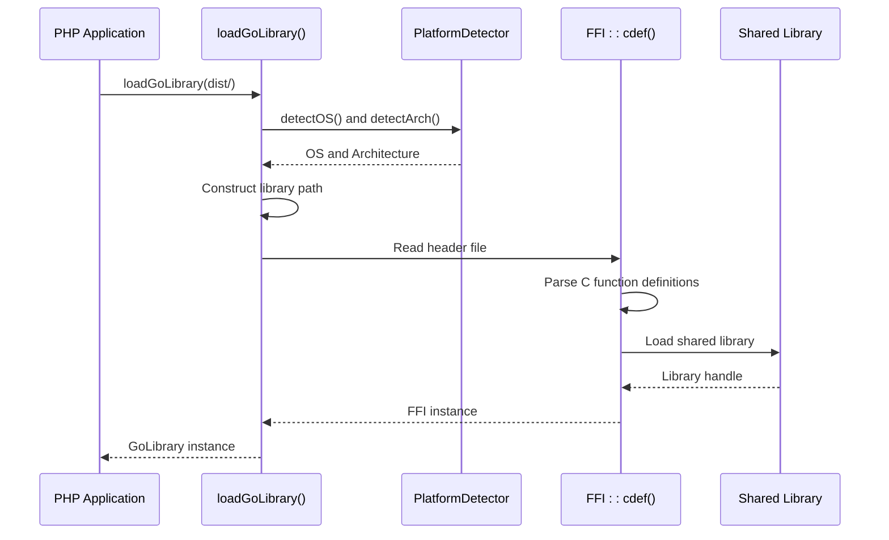
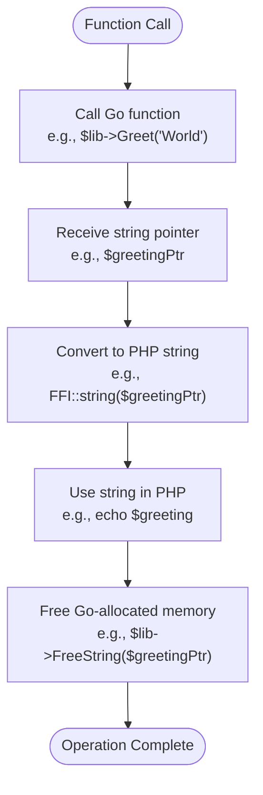

# Runtime Integration and Memory Management

<cite>
**Referenced Files in This Document**   
- [mygo.go](file://mygo.go)
- [build.go](file://build.go)
- [generator/main.go](file://generator/main.go)
- [example.php](file://example.php)
- [dist/ffi_bindings.php](file://dist/ffi_bindings.php)
- [dist/loader.php](file://dist/loader.php)
- [dist/platform_detect.php](file://dist/platform_detect.php)
- [dist/mygo-windows-amd64-v2.h](file://dist/mygo-windows-amd64-v2.h)
- [README.md](file://README.md)
</cite>

## Table of Contents
1. [Introduction](#introduction)
2. [FFI Lifecycle Management](#ffi-lifecycle-management)
3. [Memory Management and Resource Handling](#memory-management-and-resource-handling)
4. [String Handling Pattern](#string-handling-pattern)
5. [Error Handling in FFI Calls](#error-handling-in-ffi-calls)
6. [Platform-Specific Runtime Considerations](#platform-specific-runtime-considerations)
7. [Best Practices and Recommendations](#best-practices-and-recommendations)

## Introduction
This document provides comprehensive guidance on the runtime integration aspects of the Go-PHP FFI system, with a primary focus on memory management and resource handling. The system enables PHP applications to call functions in Go shared libraries through PHP's Foreign Function Interface (FFI), requiring careful attention to lifecycle management, memory allocation, and cross-platform compatibility. The documentation covers the complete workflow from library loading to proper resource cleanup, with emphasis on preventing memory leaks and ensuring stable operation across different operating systems.

## FFI Lifecycle Management
The Go-PHP FFI system manages the complete lifecycle of shared library integration, from initialization to cleanup. The process begins with automatic platform detection and library loading through the generated loader system. When a PHP application calls `loadGoLibrary()`, the system automatically detects the current operating system and architecture, then loads the appropriate shared library file (`.so` for Linux, `.dylib` for macOS, `.dll` for Windows) from the specified directory.

The initialization process involves several critical steps: first, the system verifies that the FFI extension is enabled in PHP; then it checks for the existence of both the shared library and its corresponding header file; finally, it uses FFI::cdef() to parse the C function definitions from the header file and bind them to the shared library. This approach ensures that the PHP application can call Go functions as if they were native PHP methods, with the FFI layer handling the cross-language communication.



**Diagram sources**
- [dist/loader.php](file://dist/loader.php#L22-L47)
- [dist/platform_detect.php](file://dist/platform_detect.php#L22-L97)
- [dist/ffi_bindings.php](file://dist/ffi_bindings.php#L22-L46)

**Section sources**
- [dist/loader.php](file://dist/loader.php#L22-L57)
- [dist/platform_detect.php](file://dist/platform_detect.php#L11-L145)
- [dist/ffi_bindings.php](file://dist/ffi_bindings.php#L13-L88)

## Memory Management and Resource Handling
Proper memory management is critical in the Go-PHP FFI system due to the cross-language nature of the integration. When Go functions return strings, they allocate memory in the Go runtime that must be explicitly freed by the PHP application to prevent memory leaks. The system addresses this through the `FreeString` function, which is exported from Go and available as a method on the GoLibrary instance.

Memory leaks occur when string pointers returned by Go functions are not properly freed, causing the allocated memory to remain in use even after the PHP application no longer needs it. Over time, this can lead to significant memory consumption and potential application crashes. Segmentation faults can occur when attempting to access freed memory or when there are mismatches between the expected and actual memory layout across different platforms.

The responsibility for memory management lies with the PHP application developer, who must ensure that every string returned by a Go function is properly freed using the `FreeString` method. This is particularly important in long-running processes or applications that make frequent calls to string-returning functions. The system does not automatically track or clean up these allocations, making explicit resource management essential for stable operation.

**Section sources**
- [mygo.go](file://mygo.go#L1-L39)
- [dist/mygo-windows-amd64-v2.h](file://dist/mygo-windows-amd64-v2.h#L104-L106)
- [README.md](file://README.md#L205-L208)

## String Handling Pattern
The correct pattern for handling strings returned from Go functions follows a specific sequence of operations that must be consistently applied. First, the Go function is called, which returns a pointer to a C-style string allocated in Go's memory space. Second, the FFI::string() method is used to convert this pointer into a PHP string by copying the content from the C memory space to PHP's memory space. Third, the application uses the resulting PHP string as needed. Finally, the FreeString method is called with the original pointer to release the memory allocated by Go.

This pattern is demonstrated in the example.php file, where the Greet and GetVersion functions return string pointers that are converted to PHP strings and then properly freed. The sequence ensures that the application can work with the string content in PHP while maintaining proper memory management of the underlying C allocation. Failure to follow this pattern—particularly omitting the FreeString call—results in memory leaks that accumulate over time.



**Diagram sources**
- [example.php](file://example.php#L66-L76)
- [dist/ffi_bindings.php](file://dist/ffi_bindings.php#L13-L88)
- [dist/mygo-windows-amd64-v2.h](file://dist/mygo-windows-amd64-v2.h#L100-L106)

**Section sources**
- [example.php](file://example.php#L55-L85)
- [README.md](file://README.md#L125-L130)

## Error Handling in FFI Calls
The Go-PHP FFI system implements comprehensive error handling to manage exceptions and failures during FFI calls. The loader and binding system use try-catch blocks to capture and handle various error conditions, including missing FFI extension, missing library files, and platform incompatibility issues. When an error occurs during library loading or function execution, the system throws a RuntimeException with a descriptive message that helps diagnose the issue.

The error handling strategy follows a defensive programming approach, validating prerequisites before attempting to load the library. This includes checking for the presence of the FFI extension, verifying the existence of both the shared library and header file, and confirming platform support before attempting to create the FFI instance. If any of these checks fail, a meaningful exception is thrown with context-specific information.

For application-level error handling, developers are encouraged to wrap FFI calls in try-catch blocks to gracefully handle any runtime exceptions. This is particularly important when the application runs in environments where the shared library might not be available or when platform-specific issues could arise. The example.php file demonstrates this pattern by wrapping all FFI operations in a try-catch block that displays detailed error information and stack traces when exceptions occur.

```mermaid
sequenceDiagram
participant Client as PHP Application
participant Loader as loadGoLibrary()
participant FFI as FFI System
participant Go as Go Library
Client->>Loader : loadGoLibrary()
alt FFI Extension Not Loaded
Loader-->>Client : RuntimeException<br/>"FFI extension is not loaded"
end
alt Library File Not Found
Loader-->>Client : RuntimeException<br/>"Library file not found"
end
alt Header File Not Found
Loader-->>Client : RuntimeException<br/>"Header file not found"
end
alt Platform Not Supported
Loader-->>Client : RuntimeException<br/>"Unsupported platform"
end
else Success
Loader->>FFI : FFI : : cdef(header, library)
alt FFI Load Failure
FFI-->>Loader : Throwable Exception
Loader-->>Client : RuntimeException<br/>"Failed to load library"
else Success
FFI-->>Loader : FFI Instance
Loader-->>Client : GoLibrary Instance
Client->>Go : Call exported function
Go-->>Client : Return value
end
end
```

**Diagram sources**
- [dist/ffi_bindings.php](file://dist/ffi_bindings.php#L23-L45)
- [dist/loader.php](file://dist/loader.php#L27-L39)
- [example.php](file://example.php#L21-L94)

**Section sources**
- [dist/ffi_bindings.php](file://dist/ffi_bindings.php#L22-L46)
- [example.php](file://example.php#L21-L94)

## Platform-Specific Runtime Considerations
The Go-PHP FFI system is designed to operate consistently across different operating systems, but several platform-specific considerations affect runtime behavior. The build system generates platform-specific shared libraries with appropriate file extensions (.so for Linux, .dylib for macOS, .dll for Windows) and ensures that the correct library is loaded based on the runtime environment.

Architecture compatibility is a critical consideration, particularly on Windows systems where mismatches between 32-bit and 64-bit components can cause loading failures. The system detects the architecture using php_uname('m') and maps common architecture names to standardized values (amd64 for x86_64, AMD64, and amd64; arm64 for aarch64, arm64, and ARM64). This ensures consistent behavior regardless of how the underlying system reports its architecture.

On Windows, additional considerations include the availability of the Microsoft Visual C++ Redistributable libraries, which may be required for the shared library to load properly. Antivirus software can also interfere with DLL loading, requiring exceptions to be configured in security software. The system's automatic platform detection and library loading mechanism abstracts these complexities, providing a consistent interface across all supported platforms while handling the underlying differences in file formats, calling conventions, and system libraries.

**Section sources**
- [dist/platform_detect.php](file://dist/platform_detect.php#L41-L57)
- [build.go](file://build.go#L13-L28)
- [README.md](file://README.md#L280-L295)

## Best Practices and Recommendations
To ensure reliable operation of the Go-PHP FFI system, several best practices should be followed. First, always wrap FFI operations in try-catch blocks to handle potential exceptions gracefully. Second, strictly adhere to the string handling pattern: call the function, retrieve the string via FFI::string(), use the result, and immediately free the allocated memory using FreeString. Third, verify that the FFI extension is enabled and properly configured in the PHP environment before attempting to load the library.

For production deployments, use persistent PHP processes (such as PHP-FPM) to minimize the overhead of library loading, as the library is loaded once per PHP process. When distributing applications, include the complete dist/ directory with all platform-specific libraries to ensure compatibility across different environments. Regularly test the application on all target platforms to catch platform-specific issues early in the development cycle.

Monitoring memory usage is crucial when using the FFI system, particularly in applications that make frequent calls to string-returning functions. Implement logging or monitoring to detect potential memory leaks, and consider using tools like Valgrind (on Linux) or similar memory analysis tools to identify and fix memory management issues. By following these best practices, developers can leverage the power of Go-PHP integration while maintaining application stability and performance.

**Section sources**
- [README.md](file://README.md#L296-L301)
- [example.php](file://example.php#L21-L94)
- [dist/ffi_bindings.php](file://dist/ffi_bindings.php#L22-L46)