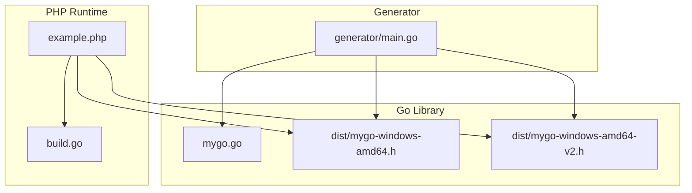
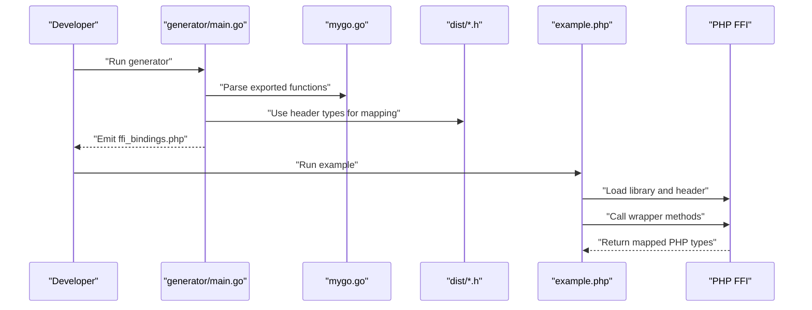
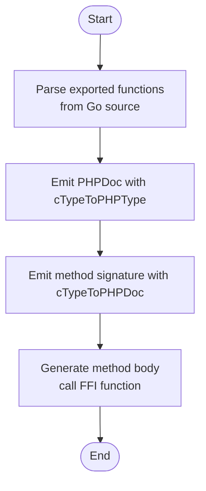
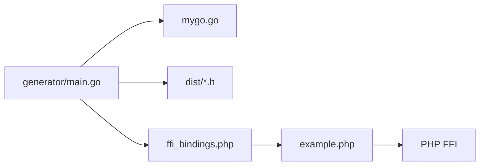

# Type Mapping Between Go and PHP

<cite>
**Referenced Files in This Document**
- [generator/main.go](file://generator/main.go)
- [mygo.go](file://mygo.go)
- [example.php](file://example.php)
- [README.md](file://README.md)
- [dist/mygo-windows-amd64.h](file://dist/mygo-windows-amd64.h)
- [dist/mygo-windows-amd64-v2.h](file://dist/mygo-windows-amd64-v2.h)
- [build.go](file://build.go)
</cite>

## Table of Contents
1. [Introduction](#introduction)
2. [Project Structure](#project-structure)
3. [Core Components](#core-components)
4. [Architecture Overview](#architecture-overview)
5. [Detailed Component Analysis](#detailed-component-analysis)
6. [Dependency Analysis](#dependency-analysis)
7. [Performance Considerations](#performance-considerations)
8. [Troubleshooting Guide](#troubleshooting-guide)
9. [Conclusion](#conclusion)
10. [Appendices](#appendices)

## Introduction
This document explains how the code generator in generator/main.go maps Go/C types to PHP types for FFI integration. It focuses on how cTypeToPHPType and cTypeToPHPDoc convert Go function signatures into appropriate PHP type hints and return types. It covers integer and floating-point types, booleans, strings, slices, maps, and pointers. It also documents the special handling of C strings and the importance of proper memory management with FreeString, and provides guidance for ensuring type compatibility between Go and PHP.

## Project Structure
The repository contains:
- A generator that parses exported Go functions and produces PHP FFI bindings
- A minimal Go library with exported functions
- Example PHP code demonstrating usage and memory management
- Build scripts and header files produced by CGO

**Diagram sources**
- [generator/main.go](file://generator/main.go#L1-L705)
- [mygo.go](file://mygo.go#L1-L39)
- [example.php](file://example.php#L1-L95)
- [build.go](file://build.go#L1-L183)
- [dist/mygo-windows-amd64.h](file://dist/mygo-windows-amd64.h#L1-L101)
- [dist/mygo-windows-amd64-v2.h](file://dist/mygo-windows-amd64-v2.h#L1-L119)

**Section sources**
- [generator/main.go](file://generator/main.go#L1-L705)
- [mygo.go](file://mygo.go#L1-L39)
- [example.php](file://example.php#L1-L95)
- [README.md](file://README.md#L1-L384)
- [dist/mygo-windows-amd64.h](file://dist/mygo-windows-amd64.h#L1-L101)
- [dist/mygo-windows-amd64-v2.h](file://dist/mygo-windows-amd64-v2.h#L1-L119)
- [build.go](file://build.go#L1-L183)

## Core Components
- Type conversion functions:
  - cTypeToPHPType: maps C/Go types to PHP types for PHPDoc comments
  - cTypeToPHPDoc: maps C/Go types to PHP type hints for method signatures
- Parser and generator:
  - parseExports: extracts exported functions and their signatures from Go source
  - generatePHPMethodSignatureDoc and generatePHPMethod: produce PHPDoc and wrapper methods
- Go library and headers:
  - mygo.go defines exported functions
  - CGO-generated headers define C-visible types and function declarations

Key responsibilities:
- cTypeToPHPType and cTypeToPHPDoc normalize Go/C types into PHP primitives (int, float, bool, string, array, mixed, void)
- The generator uses these functions to annotate PHPDoc and add type hints to wrapper methods
- The header files expose C-visible types and function signatures that the generator consumes

**Section sources**
- [generator/main.go](file://generator/main.go#L420-L640)
- [generator/main.go](file://generator/main.go#L341-L479)
- [generator/main.go](file://generator/main.go#L77-L145)
- [dist/mygo-windows-amd64.h](file://dist/mygo-windows-amd64.h#L40-L100)
- [dist/mygo-windows-amd64-v2.h](file://dist/mygo-windows-amd64-v2.h#L90-L118)

## Architecture Overview
The generator reads exported Go functions, derives their signatures, and emits PHP wrappers with PHPDoc and type hints. The emitted PHP code loads the shared library via FFI using the header file and calls the underlying Go functions.

**Diagram sources**
- [generator/main.go](file://generator/main.go#L27-L75)
- [generator/main.go](file://generator/main.go#L341-L479)
- [dist/mygo-windows-amd64.h](file://dist/mygo-windows-amd64.h#L90-L100)
- [dist/mygo-windows-amd64-v2.h](file://dist/mygo-windows-amd64-v2.h#L90-L118)
- [example.php](file://example.php#L1-L95)

## Detailed Component Analysis

### Type Mapping Functions: cTypeToPHPType and cTypeToPHPDoc
These functions convert C/Go types into PHP types for documentation and type hints. They handle:
- Strings: char*, C.char*, GoString, and string
- Arrays/Slices/Maps: GoSlice, GoMap, GoArray-like patterns, and C arrays
- Integers: C int/uint variants, GoInt/GoUint variants, and C.int/C.long/C.char
- Floats: float/float32/float64/double and GoFloat32/GoFloat64/C.float/C.double
- Booleans: bool, GoBool, _Bool
- Pointers: except char* (treated as string), other pointers are mapped to array
- Void: void and empty return types

Behavior differences:
- cTypeToPHPType: returns PHPDoc-friendly types (e.g., string, int, float, bool, array, mixed, void)
- cTypeToPHPDoc: returns PHP type hints for method signatures; returns empty string for void and unknown types

Examples from the codebase:
- Integer mapping includes C int/uint family and GoInt/GoUint family
- Float mapping includes float/float32/float64/double and GoFloat32/GoFloat64
- String mapping includes char*, C.char*, GoString, and string
- Pointer mapping treats char* as string; other pointers become array
- Slices/maps are treated as array

**Section sources**
- [generator/main.go](file://generator/main.go#L481-L555)
- [generator/main.go](file://generator/main.go#L557-L640)

### Go Function Signatures and Their PHP Mappings
The generator parses exported functions from Go source and emits PHP wrappers with PHPDoc and type hints. The header files define the C-visible types and function signatures that inform the mapping.

Representative mappings derived from the codebase:
- Integer functions:
  - Add(int, int) -> PHP method with int type hints and int return type
  - IsEven(int) -> PHP method with int type hint and int return type
- String functions:
  - Echo(string) -> PHP method with string type hint and string return type
  - Greet(char*) -> PHP method with string type hint and char* return type (mapped to string in PHPDoc)
- Array/slice functions:
  - PrintArray([]int) -> PHP method with array type hint (GoSlice/[] maps to array)
- Map functions:
  - ShowArray() -> PHP method with array return type (GoMap maps to array)

Notes:
- The header files define GoInt, GoUint, GoFloat32, GoFloat64, GoString, GoSlice, GoMap, and extern C functions with char* and GoString types.
- The generator uses these headers to drive type mapping and emit PHPDoc and type hints.

**Section sources**
- [generator/main.go](file://generator/main.go#L420-L479)
- [generator/main.go](file://generator/main.go#L77-L145)
- [dist/mygo-windows-amd64.h](file://dist/mygo-windows-amd64.h#L40-L100)
- [dist/mygo-windows-amd64-v2.h](file://dist/mygo-windows-amd64-v2.h#L90-L118)
- [mygo.go](file://mygo.go#L13-L35)

### String Handling and Memory Management
Special treatment:
- char* and C.char* are mapped to PHP string for both documentation and type hints
- The example demonstrates retrieving strings via FFI::string and freeing them with FreeString

Importance:
- Go allocates strings that are returned to PHP; PHP must free them to avoid leaks
- The example shows calling FreeString immediately after converting the pointer to a PHP string

Guidance:
- Always check if a function returns char* and wrap with FFI::string in PHP
- Always call FreeString on returned char* pointers
- Prefer GoString types in headers when possible to simplify mapping

**Section sources**
- [generator/main.go](file://generator/main.go#L481-L555)
- [generator/main.go](file://generator/main.go#L557-L640)
- [example.php](file://example.php#L54-L85)
- [dist/mygo-windows-amd64-v2.h](file://dist/mygo-windows-amd64-v2.h#L90-L118)

### Complex Types: Slices, Maps, and Pointers
- Slices and arrays:
  - GoSlice and GoArray-like patterns are mapped to PHP array
  - []T in Go becomes array in PHP
- Maps:
  - GoMap is mapped to PHP array
- Pointers:
  - char* is treated as string
  - Other pointers are mapped to array (as a generic representation)

Implications:
- PHP callers receive arrays for Go slices/maps
- Pointer semantics differ; treat non-char pointers as opaque arrays in PHP

**Section sources**
- [generator/main.go](file://generator/main.go#L481-L555)
- [generator/main.go](file://generator/main.go#L557-L640)
- [dist/mygo-windows-amd64.h](file://dist/mygo-windows-amd64.h#L74-L84)

### PHP Type Hints and Return Types Generation
- PHPDoc (@param/@return) uses cTypeToPHPType to determine types for documentation
- Method signatures use cTypeToPHPDoc to add type hints
- Void returns omit type hints

Example workflow:
- For a function with return type void, the generator emits a method without a return type hint
- For functions with primitive types, the generator emits int/float/bool/string/array with appropriate PHPDoc

**Section sources**
- [generator/main.go](file://generator/main.go#L420-L479)
- [generator/main.go](file://generator/main.go#L481-L555)
- [generator/main.go](file://generator/main.go#L557-L640)

### Class and Method Generation Flow

**Diagram sources**
- [generator/main.go](file://generator/main.go#L77-L145)
- [generator/main.go](file://generator/main.go#L420-L479)

## Dependency Analysis
- generator/main.go depends on:
  - Go source (mygo.go) for exported function definitions
  - CGO-generated headers (dist/*.h) for C-visible types and function signatures
- example.php depends on:
  - loader.php/platform_detect.php/ffi_bindings.php (generated by the generator)
  - FFI extension and the compiled shared library

**Diagram sources**
- [generator/main.go](file://generator/main.go#L27-L75)
- [generator/main.go](file://generator/main.go#L341-L479)
- [example.php](file://example.php#L1-L95)
- [dist/mygo-windows-amd64.h](file://dist/mygo-windows-amd64.h#L90-L100)
- [dist/mygo-windows-amd64-v2.h](file://dist/mygo-windows-amd64-v2.h#L90-L118)

**Section sources**
- [generator/main.go](file://generator/main.go#L27-L75)
- [example.php](file://example.php#L1-L95)
- [build.go](file://build.go#L1-L183)

## Performance Considerations
- FFI overhead is minimal compared to native C extensions
- String conversions between PHP and C incur overhead; batch operations when possible
- Proper memory management prevents leaks and improves long-running performance

[No sources needed since this section provides general guidance]

## Troubleshooting Guide
Common type-related issues and resolutions:
- Wrong PHPDoc/type hints:
  - Ensure Go function signatures are exported and parsed correctly
  - Verify header files define expected types (GoInt, GoUint, GoFloat32, GoFloat64, GoString, GoSlice, GoMap)
- String memory leaks:
  - Always free Go-allocated strings using FreeString after converting to PHP strings
- Unsupported platform or library loading errors:
  - Confirm platform detection and library/header paths
  - Ensure the correct architecture and extension (.so/.dll/.dylib) match the platform

**Section sources**
- [example.php](file://example.php#L54-L85)
- [README.md](file://README.md#L238-L309)
- [dist/mygo-windows-amd64.h](file://dist/mygo-windows-amd64.h#L40-L100)
- [dist/mygo-windows-amd64-v2.h](file://dist/mygo-windows-amd64-v2.h#L90-L118)

## Conclusion
The generator’s cTypeToPHPType and cTypeToPHPDoc functions provide a robust mapping from Go/C types to PHP types for FFI integration. By leveraging CGO-generated headers and the parser, the generator emits PHPDoc and type hints that reflect the underlying C-visible types. Correct handling of strings and pointers, especially freeing Go-allocated memory, ensures safe and efficient interop. Following the guidance here will help maintain type compatibility and reliability across language boundaries.

[No sources needed since this section summarizes without analyzing specific files]

## Appendices

### Appendix A: Representative Go-to-PHP Type Mappings
- Integers:
  - C int/uint family and GoInt/GoUint family map to PHP int
- Floats:
  - float/float32/float64/double and GoFloat32/GoFloat64 map to PHP float
- Booleans:
  - bool, GoBool, _Bool map to PHP bool
- Strings:
  - char*, C.char*, GoString, string map to PHP string
- Arrays/Slices/Maps:
  - GoSlice, GoMap, GoArray-like patterns, []T map to PHP array
- Pointers:
  - char* maps to string; other pointers map to array
- Void:
  - void and empty returns map to PHP void (no type hint)

**Section sources**
- [generator/main.go](file://generator/main.go#L481-L640)
- [dist/mygo-windows-amd64.h](file://dist/mygo-windows-amd64.h#L40-L100)
- [dist/mygo-windows-amd64-v2.h](file://dist/mygo-windows-amd64-v2.h#L90-L118)

### Appendix B: Example Function Signatures and PHP Representations
- Add(int, int) -> PHP method with int type hints and int return type
- Echo(string) -> PHP method with string type hint and string return type
- PrintArray([]int) -> PHP method with array type hint
- ShowArray() -> PHP method with array return type
- Greet(char*) -> PHP method with string type hint and char* return type (mapped to string in PHPDoc)

**Section sources**
- [generator/main.go](file://generator/main.go#L420-L479)
- [mygo.go](file://mygo.go#L13-L35)
- [dist/mygo-windows-amd64.h](file://dist/mygo-windows-amd64.h#L90-L100)
- [dist/mygo-windows-amd64-v2.h](file://dist/mygo-windows-amd64-v2.h#L90-L118)