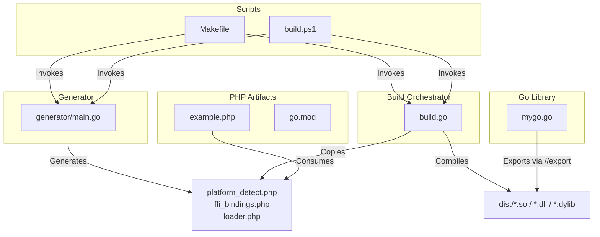
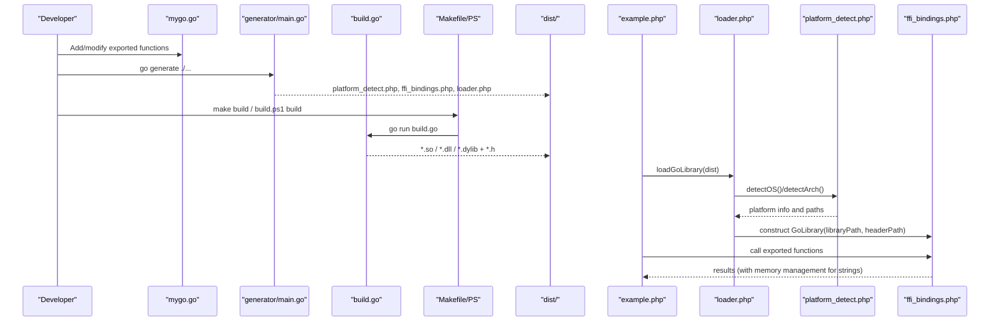
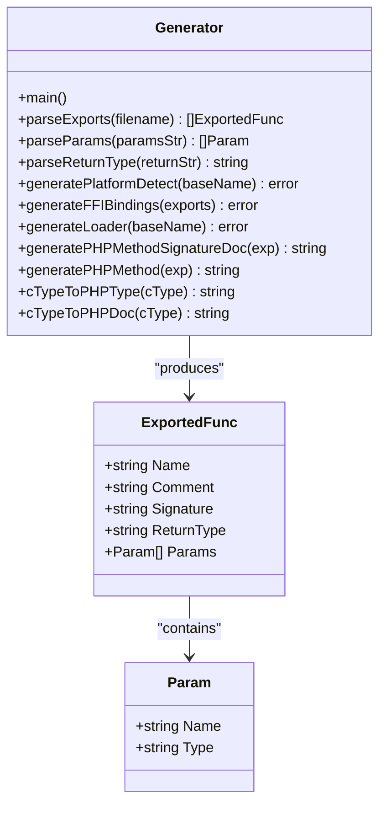
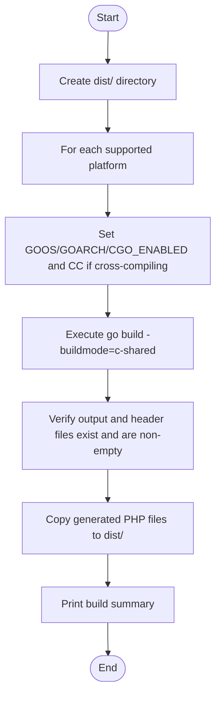
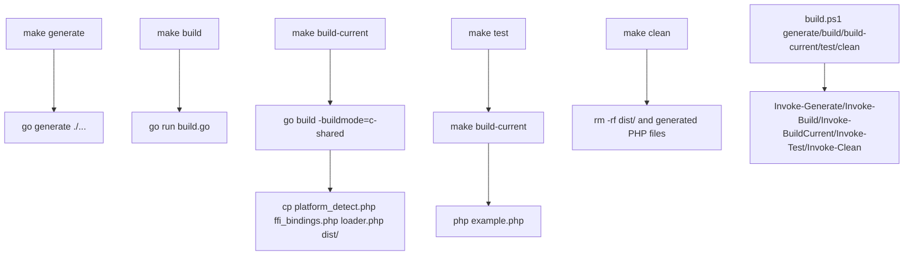
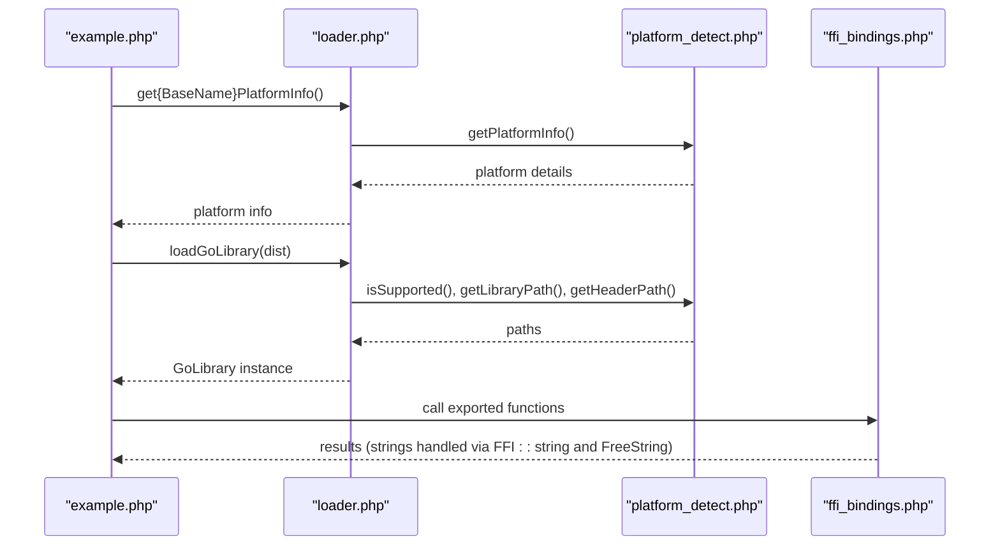
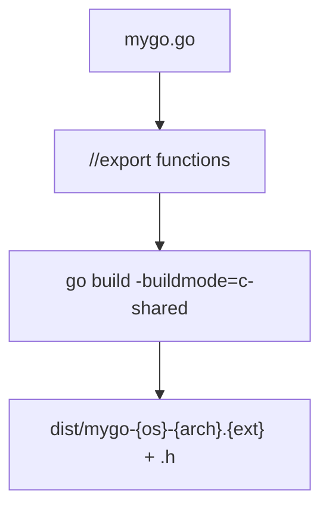
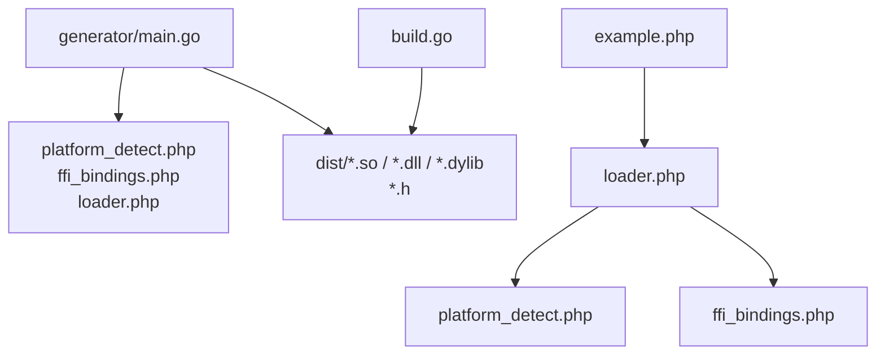

# Project Overview

<cite>
**Referenced Files in This Document**
- [README.md](file://README.md)
- [QUICKSTART.md](file://QUICKSTART.md)
- [AGENTS.MD](file://AGENTS.MD)
- [generator/main.go](file://generator/main.go)
- [build.go](file://build.go)
- [Makefile](file://Makefile)
- [build.ps1](file://build.ps1)
- [mygo.go](file://mygo.go)
- [example.php](file://example.php)
- [go.mod](file://go.mod)
</cite>

## Table of Contents
1. [Introduction](#introduction)
2. [Project Structure](#project-structure)
3. [Core Components](#core-components)
4. [Architecture Overview](#architecture-overview)
5. [Detailed Component Analysis](#detailed-component-analysis)
6. [Dependency Analysis](#dependency-analysis)
7. [Performance Considerations](#performance-considerations)
8. [Troubleshooting Guide](#troubleshooting-guide)
9. [Conclusion](#conclusion)
10. [Appendices](#appendices)

## Introduction
serviceLib is a backend framework that enables PHP applications to leverage Go performance via Foreign Function Interface (FFI) integration. It automates the generation of PHP FFI bindings from Go exported functions and orchestrates cross-platform compilation of Go shared libraries. The system supports Linux, macOS, and Windows on amd64 and arm64 architectures, with zero-configuration defaults and robust build automation for both development and distribution.

The project’s goal is to bridge Go’s speed and concurrency with PHP’s flexibility and ecosystem, providing a standardized, repeatable pipeline for building, distributing, and consuming Go-backed libraries from PHP. It emphasizes:
- Cross-platform shared library compilation
- Automatic PHP binding generation
- Runtime platform detection and seamless loader integration
- Practical developer workflows and CI/CD-friendly outputs

## Project Structure
The repository organizes code into cohesive modules:
- generator: A code generator that parses Go source and produces PHP FFI bindings, platform detection utilities, and a loader
- build orchestration: A Go program that compiles shared libraries for all supported platforms and copies generated PHP files into dist/
- build scripts: Makefile (Unix-like systems) and build.ps1 (Windows) for streamlined workflows
- mygo.go: The example Go library exposing functions via //export directives
- example.php: A PHP example demonstrating platform detection, library loading, and function calls
- go.mod: Go module metadata

**Diagram sources**
- [generator/main.go](file://generator/main.go#L1-L120)
- [build.go](file://build.go#L1-L120)
- [Makefile](file://Makefile#L1-L54)
- [build.ps1](file://build.ps1#L1-L152)
- [mygo.go](file://mygo.go#L1-L39)
- [example.php](file://example.php#L1-L95)
- [go.mod](file://go.mod#L1-L4)

**Section sources**
- [README.md](file://README.md#L25-L41)
- [QUICKSTART.md](file://QUICKSTART.md#L57-L86)
- [AGENTS.MD](file://AGENTS.MD#L15-L36)

## Core Components
- Code Generator (generator/main.go): Parses Go source files for //export directives, extracts function signatures and comments, and generates three PHP files:
  - platform_detect.php: PlatformDetector class for OS/arch detection and filename/path resolution
  - ffi_bindings.php: GoLibrary class wrapping FFI to call exported Go functions
  - loader.php: loadGoLibrary() function and get{BaseName}PlatformInfo() utility
- Build Orchestrator (build.go): Iterates supported platforms, sets environment variables for cross-compilation, executes go build -buildmode=c-shared, verifies outputs, and copies generated PHP files to dist/
- Build Scripts:
  - Makefile: Targets for generate, build, build-current, test, clean
  - build.ps1: PowerShell equivalents for Windows with similar commands
- Example Library (mygo.go): Demonstrates exported functions with //export and includes CGO for string operations
- Example PHP (example.php): Exercises platform detection, library loading, and function calls

Key design philosophy:
- Zero configuration for end users
- Dynamic library naming based on source filename
- Strict type mapping for PHP FFI compatibility
- Instance methods in generated PHP for better OOP design

**Section sources**
- [AGENTS.MD](file://AGENTS.MD#L41-L135)
- [generator/main.go](file://generator/main.go#L1-L120)
- [build.go](file://build.go#L1-L120)
- [Makefile](file://Makefile#L1-L54)
- [build.ps1](file://build.ps1#L1-L152)
- [mygo.go](file://mygo.go#L1-L39)
- [example.php](file://example.php#L1-L95)

## Architecture Overview
The system follows a deterministic pipeline:
1. Developer writes Go functions with //export directives in mygo.go
2. go generate runs generator/main.go to produce PHP binding files
3. build.go (or Makefile/build.ps1) compiles Go into shared libraries per platform and copies PHP files to dist/
4. PHP loads the library via loader.php, which uses platform_detect.php to select the correct binary and header, then invokes Go functions through ffi_bindings.php

**Diagram sources**
- [generator/main.go](file://generator/main.go#L1-L120)
- [build.go](file://build.go#L1-L120)
- [Makefile](file://Makefile#L1-L54)
- [build.ps1](file://build.ps1#L1-L152)
- [example.php](file://example.php#L1-L95)

## Detailed Component Analysis

### Code Generator (generator/main.go)
Responsibilities:
- Parse Go source for //export directives and function signatures
- Generate platform_detect.php with PlatformDetector methods for OS/arch detection and filename/path computation
- Generate ffi_bindings.php with GoLibrary class that constructs FFI from header and exposes wrappers for each exported function
- Generate loader.php with loadGoLibrary() and get{BaseName}PlatformInfo() helpers

Type mapping highlights:
- C/Go integer types map to PHP int
- C/Go float types map to PHP float
- C char* and Go string types map to PHP string
- Booleans map to PHP bool
- Arrays/slices/maps and pointers (non-char) map to PHP array
- void maps to PHP void (no return type hint)

Design decisions:
- All generated PHP methods are instance methods (not static) for better OOP design
- Namespace is fixed as app\lib for consistency
- Library base name is derived from the source filename and used in generated loader and detector

**Diagram sources**
- [generator/main.go](file://generator/main.go#L1-L120)
- [generator/main.go](file://generator/main.go#L341-L418)
- [generator/main.go](file://generator/main.go#L481-L640)
- [generator/main.go](file://generator/main.go#L642-L705)

**Section sources**
- [AGENTS.MD](file://AGENTS.MD#L41-L135)
- [generator/main.go](file://generator/main.go#L1-L120)
- [generator/main.go](file://generator/main.go#L341-L418)
- [generator/main.go](file://generator/main.go#L481-L640)
- [generator/main.go](file://generator/main.go#L642-L705)

### Build Orchestrator (build.go)
Responsibilities:
- Define supported platforms (GOOS/GOARCH/ext combos)
- Compute output/header filenames using a standardized naming scheme
- Execute go build -buildmode=c-shared per platform with appropriate environment variables
- Validate output existence and non-empty files
- Copy generated PHP files into dist/

Cross-compilation specifics:
- Sets GOOS, GOARCH, CGO_ENABLED
- Configures CC for cross-compilers when needed (e.g., MinGW for Windows, aarch64-linux-gnu-gcc for Linux ARM64)
- Tolerant failure handling: continues building other platforms if one fails and prints a summary

**Diagram sources**
- [build.go](file://build.go#L1-L120)
- [build.go](file://build.go#L107-L183)

**Section sources**
- [AGENTS.MD](file://AGENTS.MD#L95-L135)
- [build.go](file://build.go#L1-L120)
- [build.go](file://build.go#L107-L183)

### Build Scripts (Makefile and build.ps1)
- Makefile:
  - generate: runs go generate ./...
  - build: runs go run build.go after generating bindings
  - build-current: builds for the current platform only and copies PHP files to dist/
  - test: builds current platform and runs example.php
  - clean: removes dist/ and generated PHP files
- build.ps1:
  - Mirrors Makefile targets for Windows
  - Handles platform-specific output paths and copying of PHP files

**Diagram sources**
- [Makefile](file://Makefile#L1-L54)
- [build.ps1](file://build.ps1#L1-L152)

**Section sources**
- [QUICKSTART.md](file://QUICKSTART.md#L23-L55)
- [QUICKSTART.md](file://QUICKSTART.md#L57-L86)
- [Makefile](file://Makefile#L1-L54)
- [build.ps1](file://build.ps1#L1-L152)

### Example PHP Integration (example.php)
The example demonstrates:
- Retrieving platform information via get{BaseName}PlatformInfo()
- Loading the library via loadGoLibrary()
- Calling exported functions (e.g., Add, Multiply, IsEven)
- Handling strings returned from Go: converting via FFI::string() and freeing with FreeString()

**Diagram sources**
- [example.php](file://example.php#L1-L95)
- [generator/main.go](file://generator/main.go#L642-L705)
- [generator/main.go](file://generator/main.go#L341-L418)

**Section sources**
- [example.php](file://example.php#L1-L95)
- [README.md](file://README.md#L110-L154)

### Go Library (mygo.go)
- Imports CGO and includes C stdlib for string operations
- Uses //go:generate to run the generator
- Exports functions with //export directives
- Includes an empty main() to satisfy shared library requirements

**Diagram sources**
- [mygo.go](file://mygo.go#L1-L39)
- [build.go](file://build.go#L107-L183)

**Section sources**
- [mygo.go](file://mygo.go#L1-L39)
- [README.md](file://README.md#L155-L194)

## Dependency Analysis
- generator/main.go depends on:
  - Go parser logic to extract //export directives and function signatures
  - Type mapping functions to convert C/Go types to PHP types
  - File I/O to write generated PHP files
- build.go depends on:
  - Go toolchain for cross-compilation
  - Environment variables for platform selection
  - File system operations to create dist/ and copy files
- example.php depends on:
  - loader.php for initialization
  - platform_detect.php for platform detection
  - ffi_bindings.php for FFI-based function calls

**Diagram sources**
- [generator/main.go](file://generator/main.go#L1-L120)
- [build.go](file://build.go#L1-L120)
- [example.php](file://example.php#L1-L95)

**Section sources**
- [generator/main.go](file://generator/main.go#L1-L120)
- [build.go](file://build.go#L1-L120)
- [example.php](file://example.php#L1-L95)

## Performance Considerations
- Library loading occurs once per PHP process; use persistent processes (e.g., PHP-FPM) for optimal performance
- FFI overhead is minimal compared to native C extensions
- String conversion between PHP and C has overhead; batch operations when possible
- Always free Go-allocated C strings to prevent memory leaks

**Section sources**
- [README.md](file://README.md#L296-L302)

## Troubleshooting Guide
Common issues and resolutions:
- PHP FFI not enabled: enable extension and set ffi.enable=true in php.ini
- Library not found: ensure go generate and build were executed and that dist/ contains the correct binary
- Unsupported platform: build for your platform or extend build.go to support additional platforms
- CGO disabled: set CGO_ENABLED=1 and ensure a C compiler is installed
- DLL loading errors on Windows: verify architecture match (64-bit PHP with 64-bit DLL), install required runtime libraries, and check antivirus interference

**Section sources**
- [README.md](file://README.md#L238-L295)
- [QUICKSTART.md](file://QUICKSTART.md#L109-L129)

## Conclusion
serviceLib provides a complete, cross-platform solution for integrating Go performance into PHP applications through FFI. Its automated pipeline—code generation, cross-compilation, and runtime loader—enables rapid development, reliable distribution, and seamless consumption of Go-backed libraries from PHP. By adhering to strict type mapping and OOP design in generated PHP code, it balances developer productivity with runtime safety and clarity.

## Appendices

### Target Audience and Goals
- Target audience: PHP developers who need high-performance computations or specialized libraries written in Go
- Goals:
  - Enable zero-configuration usage for end users
  - Provide cross-platform support with standardized naming and build outputs
  - Automate generation of PHP FFI bindings from Go exports
  - Offer robust build automation and CI/CD-friendly artifacts

**Section sources**
- [README.md](file://README.md#L1-L24)
- [AGENTS.MD](file://AGENTS.MD#L1-L20)

### Design Philosophy
- Instance methods in generated PHP for better OOP design and testability
- Dynamic library naming to support multiple libraries in one project
- Fixed namespace app\lib to avoid conflicts and align with autoloading expectations
- Comprehensive type mapping to simplify PHP code and reduce runtime errors

**Section sources**
- [AGENTS.MD](file://AGENTS.MD#L444-L488)
- [generator/main.go](file://generator/main.go#L341-L418)
- [generator/main.go](file://generator/main.go#L642-L705)

### Practical Examples from Documentation
- Quick start: Generate bindings, build for current platform, copy PHP files, and run example
- Adding new functions: Add //export function in mygo.go, regenerate bindings, rebuild, and call from PHP
- Cross-compilation: Use environment variables and cross-compilers to build for other platforms

**Section sources**
- [QUICKSTART.md](file://QUICKSTART.md#L1-L22)
- [QUICKSTART.md](file://QUICKSTART.md#L84-L108)
- [README.md](file://README.md#L210-L237)