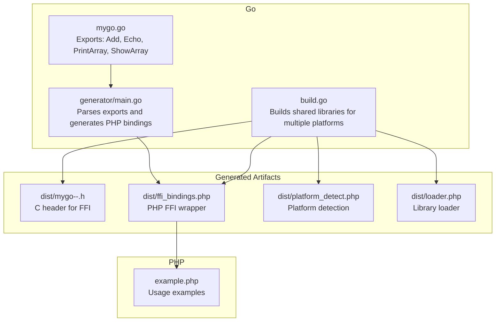
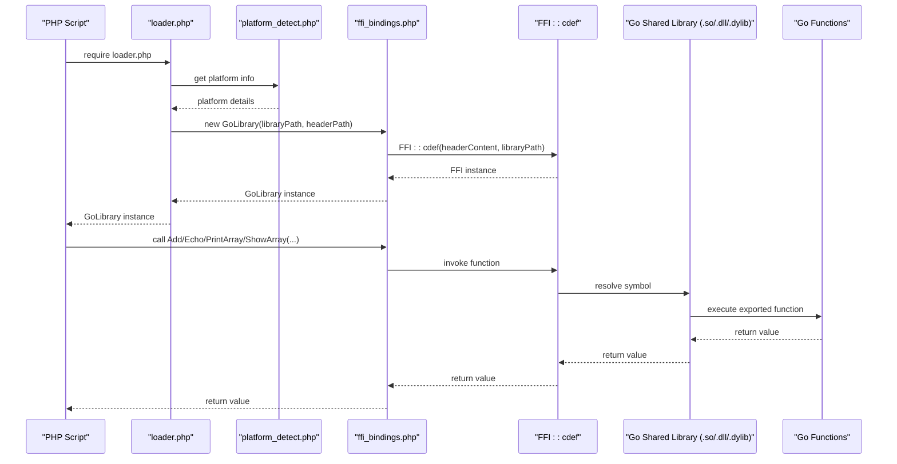
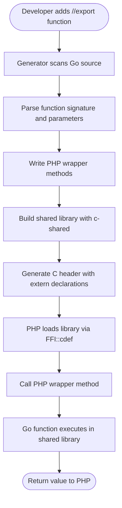
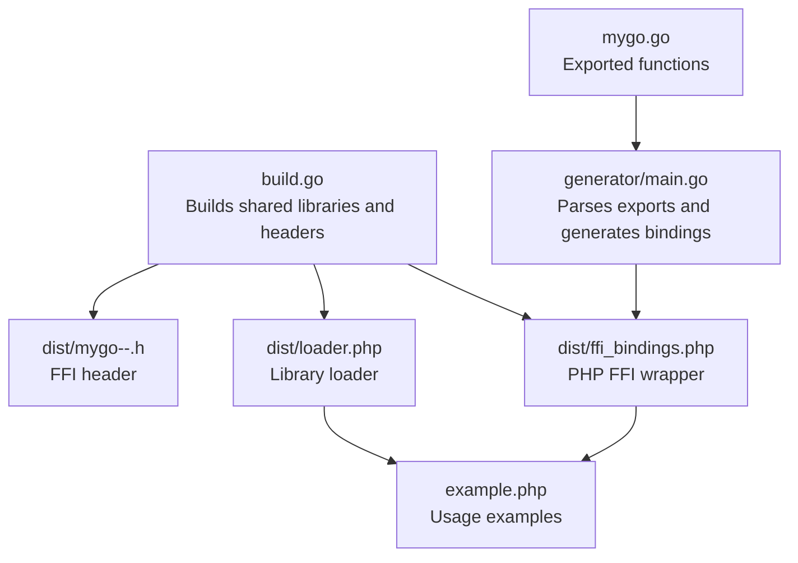

# API Reference

<cite>
**Referenced Files in This Document**
- [mygo.go](file://mygo.go)
- [generator/main.go](file://generator/main.go)
- [build.go](file://build.go)
- [dist/mygo-windows-amd64.h](file://dist/mygo-windows-amd64.h)
- [dist/ffi_bindings.php](file://dist/ffi_bindings.php)
- [example.php](file://example.php)
- [README.md](file://README.md)
</cite>

## Table of Contents
1. [Introduction](#introduction)
2. [Project Structure](#project-structure)
3. [Core Components](#core-components)
4. [Architecture Overview](#architecture-overview)
5. [Detailed Component Analysis](#detailed-component-analysis)
6. [Dependency Analysis](#dependency-analysis)
7. [Performance Considerations](#performance-considerations)
8. [Troubleshooting Guide](#troubleshooting-guide)
9. [Conclusion](#conclusion)

## Introduction
This document provides comprehensive API documentation for the Go functions exported to PHP via FFI. It focuses on the four exported functions from the Go code: Add, Echo, PrintArray, and ShowArray. It explains how these functions are declared with the //export directive, how they are exposed to PHP through auto-generated bindings, and how to call them safely from PHP with proper type handling and memory management.

The documentation also covers the type mapping between Go and PHP as implemented by the code generator, including how slices and maps are represented and handled.

## Project Structure
The project consists of:
- A Go module exporting functions for FFI consumption
- A code generator that parses exported functions and produces PHP FFI bindings
- A build orchestrator that compiles shared libraries for multiple platforms
- Example PHP code demonstrating usage patterns

**Diagram sources**
- [mygo.go](file://mygo.go#L1-L39)
- [generator/main.go](file://generator/main.go#L1-L705)
- [build.go](file://build.go#L1-L183)
- [dist/mygo-windows-amd64.h](file://dist/mygo-windows-amd64.h#L1-L101)
- [dist/ffi_bindings.php](file://dist/ffi_bindings.php#L1-L89)
- [example.php](file://example.php#L1-L95)

**Section sources**
- [README.md](file://README.md#L1-L120)
- [mygo.go](file://mygo.go#L1-L39)
- [generator/main.go](file://generator/main.go#L1-L120)
- [build.go](file://build.go#L1-L120)

## Core Components
- Go exported functions: Add, Echo, PrintArray, ShowArray
- Code generator: Parses exported functions and generates PHP FFI bindings
- Build orchestrator: Compiles shared libraries for multiple platforms and generates headers
- PHP bindings: Wrapper class exposing Go functions to PHP with type hints
- Example PHP application: Demonstrates usage patterns and memory management

Key responsibilities:
- mygo.go: Declares and implements exported functions with //export directives
- generator/main.go: Scans Go source for exported functions, parses signatures, and generates PHP wrappers
- build.go: Builds shared libraries with c-shared mode and generates corresponding headers
- dist/ffi_bindings.php: Provides PHP methods that call into the Go shared library via FFI
- example.php: Shows how to load the library, call functions, and handle strings and arrays

**Section sources**
- [mygo.go](file://mygo.go#L1-L39)
- [generator/main.go](file://generator/main.go#L1-L120)
- [build.go](file://build.go#L1-L120)
- [dist/ffi_bindings.php](file://dist/ffi_bindings.php#L1-L89)
- [example.php](file://example.php#L1-L95)

## Architecture Overview
The system exposes Go functions to PHP through a shared library compiled with c-shared mode. The header file defines the C-visible signatures, and the PHP FFI bindings call into the library using the generated C definitions.

**Diagram sources**
- [dist/ffi_bindings.php](file://dist/ffi_bindings.php#L1-L89)
- [dist/mygo-windows-amd64.h](file://dist/mygo-windows-amd64.h#L1-L101)
- [example.php](file://example.php#L1-L95)

## Detailed Component Analysis

### Add
- Purpose: Adds two integers and returns their sum.
- Go signature: Add(a, b int) int
- Generated C signature: extern __declspec(dllexport) GoInt Add(GoInt a, GoInt b)
- PHP wrapper signature: public function Add(int $a, int $b): int
- Parameters:
  - a: integer operand
  - b: integer operand
- Return type: integer sum
- Usage constraints:
  - Pass two integers to PHP wrapper
  - No special memory management required
- Example call (PHP):
  - $result = $lib->Add(10, 20); // returns 30

Notes:
- The //export directive ensures the function is exported from the shared library.
- The generator recognizes the function signature and creates a PHP wrapper with int type hints.

**Section sources**
- [mygo.go](file://mygo.go#L13-L18)
- [dist/mygo-windows-amd64.h](file://dist/mygo-windows-amd64.h#L90-L96)
- [dist/ffi_bindings.php](file://dist/ffi_bindings.php#L56-L63)
- [example.php](file://example.php#L27-L33)

### Echo
- Purpose: Returns the input string unchanged.
- Go signature: Echo(s string) string
- Generated C signature: extern __declspec(dllexport) GoString Echo(GoString s)
- PHP wrapper signature: public function Echo(string $s): string
- Parameters:
  - s: input string
- Return type: string
- Usage constraints:
  - Pass a string to PHP wrapper
  - No special memory management required for the parameter
- Example call (PHP):
  - $result = $lib->Echo("hello"); // returns "hello"

Notes:
- The generator maps Go string to PHP string for both parameter and return types.
- The underlying GoString is compatible with the FFI definition.

**Section sources**
- [mygo.go](file://mygo.go#L19-L23)
- [dist/mygo-windows-amd64.h](file://dist/mygo-windows-amd64.h#L90-L96)
- [dist/ffi_bindings.php](file://dist/ffi_bindings.php#L64-L71)
- [example.php](file://example.php#L27-L33)

### PrintArray
- Purpose: Iterates over an integer slice and prints each element with index and value.
- Go signature: PrintArray(arr []int)
- Generated C signature: extern __declspec(dllexport) void PrintArray(GoSlice arr)
- PHP wrapper signature: public function PrintArray(array $arr): void
- Parameters:
  - arr: PHP array representing an integer slice
- Return type: void
- Usage constraints:
  - Pass a PHP array of integers
  - No return value; side effects occur via printed output
- Example call (PHP):
  - $lib->PrintArray([1, 2, 3]); // prints indexed values

Notes:
- The generator maps Go slices to PHP arrays for parameters.
- The function does not allocate memory; it reads from the provided slice.

**Section sources**
- [mygo.go](file://mygo.go#L24-L30)
- [dist/mygo-windows-amd64.h](file://dist/mygo-windows-amd64.h#L90-L96)
- [dist/ffi_bindings.php](file://dist/ffi_bindings.php#L72-L79)
- [example.php](file://example.php#L27-L33)

### ShowArray
- Purpose: Returns a map containing heterogeneous values (string, integer, boolean, float, and integer slice).
- Go signature: ShowArray() map[string]any
- Generated C signature: extern __declspec(dllexport) GoMap ShowArray(void)
- PHP wrapper signature: public function ShowArray(): array
- Parameters: none
- Return type: PHP associative array
- Usage constraints:
  - No parameters required
  - Returned array contains mixed types
- Example call (PHP):
  - $map = $lib->ShowArray(); // returns associative array with keys and values

Notes:
- The generator maps Go maps to PHP arrays.
- The returned map is a Go map whose values are typed as GoInterface internally; the PHP wrapper receives it as an array.

**Section sources**
- [mygo.go](file://mygo.go#L31-L35)
- [dist/mygo-windows-amd64.h](file://dist/mygo-windows-amd64.h#L90-L96)
- [dist/ffi_bindings.php](file://dist/ffi_bindings.php#L80-L86)
- [example.php](file://example.php#L27-L33)

## Type Mapping Between Go and PHP
The code generator implements the following type mappings for FFI interoperability:

- Integers:
  - Go int/intX/uint/uintX -> PHP int
  - C integer types (int, long, short, char, etc.) -> PHP int
  - Go/CGO integer types (GoInt, GoIntX, GoUint, GoUintX) -> PHP int

- Floating-point:
  - Go float32/float64 -> PHP float
  - C float/double -> PHP float
  - Go/CGO float types (GoFloat32, GoFloat64) -> PHP float

- Booleans:
  - Go bool/_Bool -> PHP bool

- Strings:
  - Go string -> PHP string
  - C char* -> PHP string
  - GoString -> PHP string

- Arrays/Slices:
  - Go []T -> PHP array
  - Go GoSlice -> PHP array

- Maps:
  - Go map[K]V -> PHP array
  - Go GoMap -> PHP array

- Pointers (other than char*):
  - Go *T (non-char pointer) -> PHP array (wrapper representation)

- Void:
  - Go void -> PHP void (no return type hint)

These mappings are derived from the generator’s type conversion functions and the generated header definitions.

**Section sources**
- [generator/main.go](file://generator/main.go#L481-L640)
- [dist/mygo-windows-amd64.h](file://dist/mygo-windows-amd64.h#L40-L84)

## How Functions Are Exposed to PHP
- Export declarations: Each function is annotated with //export so it is included in the shared library.
- Header generation: go build with -buildmode=c-shared produces a header file with extern "C" declarations and type definitions for FFI.
- Binding generation: The generator scans the Go source for //export directives, parses function signatures, and writes PHP wrapper methods that call into the FFI instance.
- Runtime loading: The loader constructs a GoLibrary instance by passing the library path and header path to FFI::cdef, enabling PHP to call the generated wrapper methods.

**Diagram sources**
- [generator/main.go](file://generator/main.go#L77-L145)
- [build.go](file://build.go#L107-L164)
- [dist/mygo-windows-amd64.h](file://dist/mygo-windows-amd64.h#L90-L96)
- [dist/ffi_bindings.php](file://dist/ffi_bindings.php#L56-L86)

## Usage Examples in PHP
Below are examples of how to call each function from PHP. These examples reflect the generated PHP bindings and the underlying Go signatures.

- Add
  - Call: $lib->Add(10, 20)
  - Expected: integer result
  - Notes: Pass two integers; no special handling required

- Echo
  - Call: $lib->Echo("hello")
  - Expected: string result equal to input
  - Notes: Pass a string; no special handling required

- PrintArray
  - Call: $lib->PrintArray([1, 2, 3])
  - Expected: no return value; prints indexed elements
  - Notes: Pass a PHP array of integers

- ShowArray
  - Call: $lib->ShowArray()
  - Expected: associative array with mixed values
  - Notes: No parameters; returned array contains heterogeneous types

For additional usage patterns and error handling, refer to the example PHP application.

**Section sources**
- [dist/ffi_bindings.php](file://dist/ffi_bindings.php#L56-L86)
- [example.php](file://example.php#L27-L86)

## Memory Management and Data Conversion Considerations
- Strings:
  - When Go returns a C-owned string (e.g., via char*), PHP must convert it to a PHP string and free the C allocation to avoid leaks.
  - The example demonstrates converting a returned pointer to a PHP string and freeing it afterward.
- Slices and Maps:
  - Passed as PHP arrays; the generator maps Go slices and maps to PHP arrays.
  - No manual memory management is required for these types on the PHP side.
- Pointers:
  - Non-string pointers are represented as arrays in PHP wrappers; treat them as opaque handles.
- Return values:
  - Primitive types (int, float, bool) are passed directly.
  - Complex types (arrays/maps) are returned as PHP arrays.

**Section sources**
- [example.php](file://example.php#L54-L86)
- [generator/main.go](file://generator/main.go#L481-L640)

## Dependency Analysis
The following diagram shows how the components depend on each other to expose Go functions to PHP.

**Diagram sources**
- [mygo.go](file://mygo.go#L1-L39)
- [generator/main.go](file://generator/main.go#L1-L120)
- [build.go](file://build.go#L1-L120)
- [dist/mygo-windows-amd64.h](file://dist/mygo-windows-amd64.h#L1-L101)
- [dist/ffi_bindings.php](file://dist/ffi_bindings.php#L1-L89)
- [example.php](file://example.php#L1-L95)

**Section sources**
- [generator/main.go](file://generator/main.go#L1-L120)
- [build.go](file://build.go#L1-L120)
- [dist/ffi_bindings.php](file://dist/ffi_bindings.php#L1-L89)
- [example.php](file://example.php#L1-L95)

## Performance Considerations
- Library loading occurs once per process; reuse the GoLibrary instance for repeated calls.
- FFI overhead is minimal compared to native C extensions.
- String conversions incur overhead; batch operations when possible.
- Avoid unnecessary allocations in Go functions to reduce overhead.

[No sources needed since this section provides general guidance]

## Troubleshooting Guide
Common issues and resolutions:
- FFI extension not loaded:
  - Ensure the FFI extension is enabled in php.ini.
- Library not found:
  - Confirm the shared library and header files exist in the distribution directory.
- Platform not supported:
  - Build the library for your platform or add support in the build script.
- CGO disabled:
  - Ensure CGO is enabled and a C compiler is available.
- DLL loading errors on Windows:
  - Match PHP architecture with the compiled library and install required runtime libraries.

**Section sources**
- [README.md](file://README.md#L239-L309)

## Conclusion
The system provides a robust mechanism to expose Go functions to PHP via FFI. The generator automates binding creation, the build orchestrator compiles cross-platform libraries, and the PHP wrappers offer type-safe access to Go functions. By following the documented type mappings and usage patterns, developers can reliably integrate Go functionality into PHP applications while managing memory and data conversions appropriately.