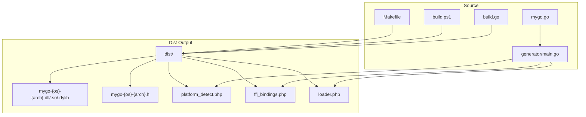
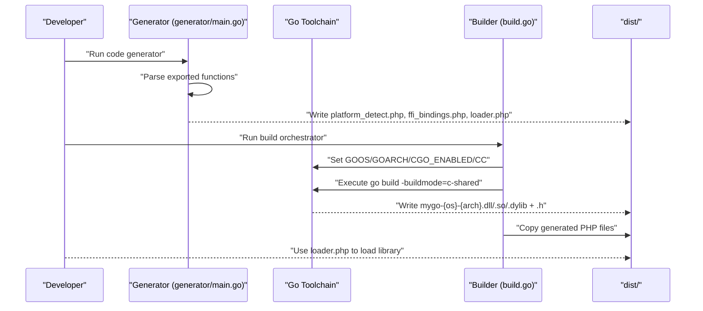
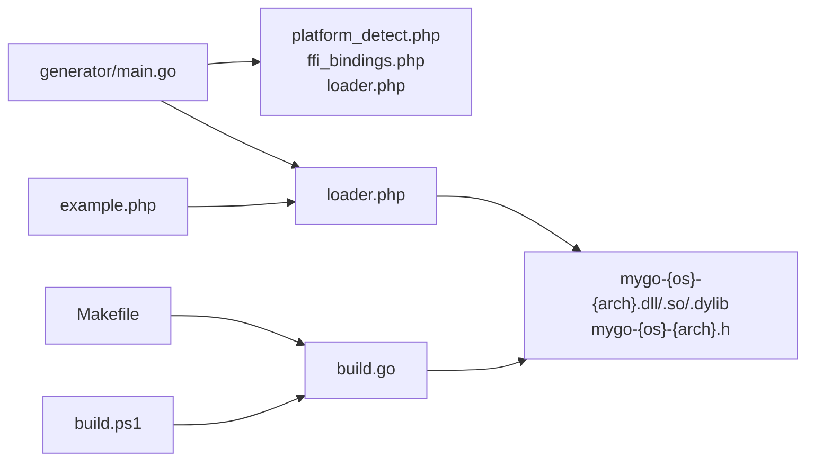

# Configuration Reference

<cite>
**Referenced Files in This Document**
- [build.go](file://build.go)
- [generator/main.go](file://generator/main.go)
- [README.md](file://README.md)
- [QUICKSTART.md](file://QUICKSTART.md)
- [AGENTS.MD](file://AGENTS.MD)
- [build.ps1](file://build.ps1)
- [Makefile](file://Makefile)
- [example.php](file://example.php)
- [mygo.go](file://mygo.go)
- [go.mod](file://go.mod)
</cite>

## Table of Contents
1. [Introduction](#introduction)
2. [Project Structure](#project-structure)
3. [Core Components](#core-components)
4. [Architecture Overview](#architecture-overview)
5. [Detailed Component Analysis](#detailed-component-analysis)
6. [Dependency Analysis](#dependency-analysis)
7. [Performance Considerations](#performance-considerations)
8. [Troubleshooting Guide](#troubleshooting-guide)
9. [Conclusion](#conclusion)
10. [Appendices](#appendices)

## Introduction
This document provides a comprehensive configuration reference for the build and code generation system. It covers:
- Supported platform configurations (GOOS, GOARCH, and file extension combinations)
- Environment variables used during cross-compilation
- Command-line arguments accepted by the code generator
- The build.go configuration model and output directory structure
- How to customize the build process and code generation for different use cases

## Project Structure
The project is organized around a Go-based build orchestrator, a code generator for PHP FFI bindings, and supporting scripts for Windows and Unix-like systems. The distribution output directory contains compiled shared libraries, C headers, and generated PHP files.

**Diagram sources**
- [build.go](file://build.go#L1-L183)
- [generator/main.go](file://generator/main.go#L1-L705)
- [build.ps1](file://build.ps1#L1-L152)
- [Makefile](file://Makefile#L1-L54)

**Section sources**
- [README.md](file://README.md#L25-L41)
- [QUICKSTART.md](file://QUICKSTART.md#L57-L67)

## Core Components
- Platform configuration model: Platform struct with fields GOOS, GOARCH, and Extension.
- Supported platforms enumeration: getSupportedPlatforms returns the set of platform configurations.
- Build orchestration: buildPlatform sets environment variables and executes go build with c-shared mode.
- Code generation: generator/main.go parses exported functions and generates PHP files.

**Section sources**
- [build.go](file://build.go#L12-L29)
- [build.go](file://build.go#L107-L164)
- [generator/main.go](file://generator/main.go#L1-L75)

## Architecture Overview
The build system integrates code generation and cross-platform compilation into a cohesive workflow. The generator produces PHP files that wrap the Go shared library via FFI. The build orchestrator compiles the shared library for multiple platforms and places outputs into dist/.

**Diagram sources**
- [generator/main.go](file://generator/main.go#L27-L75)
- [build.go](file://build.go#L107-L164)
- [README.md](file://README.md#L66-L109)

## Detailed Component Analysis

### Platform Configuration Model (build.go)
The Platform struct defines a single target platform configuration and provides helpers to compute output and header filenames. The supported platforms are enumerated centrally.

- Platform struct fields:
  - GOOS: Target operating system identifier
  - GOARCH: Target CPU architecture identifier
  - Extension: Target shared library file extension

- Supported platforms:
  - Linux amd64: Extension “so”
  - Linux arm64: Extension “so”
  - macOS amd64: Extension “dylib”
  - macOS arm64: Extension “dylib”
  - Windows amd64: Extension “dll”
  - Windows arm64: Extension “dll”

- Output naming:
  - Shared library: mygo-{GOOS}-{GOARCH}.{Extension}
  - Header: mygo-{GOOS}-{GOARCH}.h

- Cross-compilation environment variables:
  - GOOS, GOARCH: Set per-platform
  - CGO_ENABLED: Set to 1 for all platforms
  - CC: Set conditionally for cross-compilation toolchains

- Cross-compilation toolchain selection:
  - Linux arm64: CC=aarch64-linux-gnu-gcc
  - Windows amd64: CC=x86_64-w64-mingw32-gcc
  - Windows arm64: CC=aarch64-w64-mingw32-gcc

- Output verification:
  - Ensures both the shared library and header files exist and are non-empty

**Section sources**
- [build.go](file://build.go#L12-L39)
- [build.go](file://build.go#L20-L29)
- [build.go](file://build.go#L107-L164)

### Build Orchestration (build.go)
The main function coordinates:
- Creating the dist directory
- Iterating supported platforms
- Invoking buildPlatform for each platform
- Copying generated PHP files to dist
- Printing a summary of successes and failures

buildPlatform performs:
- Preparing the output and header paths
- Constructing the go build command with -buildmode=c-shared
- Setting environment variables (GOOS, GOARCH, CGO_ENABLED)
- Applying CC for cross-compilation when needed
- Executing the command and capturing combined output
- Verifying output existence and non-empty sizes
- Returning errors with captured output for diagnostics

**Section sources**
- [build.go](file://build.go#L41-L106)
- [build.go](file://build.go#L107-L164)

### Code Generator (generator/main.go)
The generator accepts a single command-line argument specifying the Go source file to parse. It:
- Defaults to mygo.go if no argument is provided
- Extracts exported functions using //export directives
- Builds a list of ExportedFunc entries with comments, signatures, return types, and parameters
- Generates three PHP files:
  - platform_detect.php: PlatformDetector class with methods to detect OS/arch and compute filenames
  - ffi_bindings.php: GoLibrary class exposing wrappers for each exported function
  - loader.php: loadGoLibrary() function and get{BaseName}PlatformInfo()

The generator dynamically derives the library basename from the source filename and writes files into the current working directory.

Command-line usage:
- Default: go run generator/main.go
- Custom source: go run generator/main.go custom.go

Type mapping:
- Converts C/Go types to PHP types for PHPDoc and type hints, with a conservative mapping to basic PHP types.

**Section sources**
- [generator/main.go](file://generator/main.go#L27-L75)
- [generator/main.go](file://generator/main.go#L77-L145)
- [generator/main.go](file://generator/main.go#L190-L339)
- [generator/main.go](file://generator/main.go#L341-L418)
- [generator/main.go](file://generator/main.go#L642-L705)

### Output Directory and Naming Conventions
After running the build and generator:
- dist/ contains:
  - mygo-{os}-{arch}.dll/.so/.dylib (shared libraries)
  - mygo-{os}-{arch}.h (C headers)
  - platform_detect.php
  - ffi_bindings.php
  - loader.php

The generator’s loader.php expects these files to be placed under the same base directory and loads them accordingly.

**Section sources**
- [README.md](file://README.md#L25-L41)
- [QUICKSTART.md](file://QUICKSTART.md#L57-L67)
- [generator/main.go](file://generator/main.go#L642-L705)

### Environment Variables for Cross-Compilation
The build orchestrator sets the following environment variables per-platform:
- GOOS: Target operating system
- GOARCH: Target CPU architecture
- CGO_ENABLED: Must be enabled (1) for building shared libraries
- CC: C compiler for cross-compilation toolchains (when required)

Cross-compiler mapping:
- Linux arm64: CC=aarch64-linux-gnu-gcc
- Windows amd64: CC=x86_64-w64-mingw32-gcc
- Windows arm64: CC=aarch64-w64-mingw32-gcc

Notes:
- Cross-compilation requires appropriate toolchains to be installed on the host system.
- The orchestrator tolerates failures for individual platforms and continues building others.

**Section sources**
- [build.go](file://build.go#L113-L137)
- [README.md](file://README.md#L210-L237)

### Command-Line Arguments for the Code Generator
- Source file parameter:
  - Positional argument specifying the Go source file to parse
  - Defaults to mygo.go if omitted

Usage patterns:
- Default: go run generator/main.go
- Custom: go run generator/main.go custom.go

Behavior:
- The generator writes platform_detect.php, ffi_bindings.php, and loader.php to the current working directory
- The loader.php function name is derived from the base name of the source file

**Section sources**
- [generator/main.go](file://generator/main.go#L27-L75)
- [generator/main.go](file://generator/main.go#L642-L705)

### Customizing the Build Process and Code Generation
- Adding new platforms:
  - Extend getSupportedPlatforms() with new Platform entries
  - Update platform detection logic in platform_detect.php (template)
  - Configure CC for any required cross-compilers
  - Update documentation and examples

- Changing output naming:
  - Modify getOutputFilename() and getHeaderFilename() to change the naming scheme
  - Update loader.php to match the new naming convention

- Customizing the generator:
  - Adjust type mapping functions to refine PHPDoc and type hints
  - Change namespace and class names in generated files if needed
  - Update the generator to write files to a different directory

- Single-platform builds:
  - Use build.ps1 build-current or Makefile build-current
  - These targets build only the current host platform and copy PHP files to dist/

- CI/CD integration:
  - Use Makefile or build.ps1 targets to automate generation and builds
  - Upload dist/ as build artifacts

**Section sources**
- [build.go](file://build.go#L12-L29)
- [build.go](file://build.go#L107-L164)
- [generator/main.go](file://generator/main.go#L190-L339)
- [generator/main.go](file://generator/main.go#L341-L418)
- [generator/main.go](file://generator/main.go#L642-L705)
- [build.ps1](file://build.ps1#L46-L93)
- [Makefile](file://Makefile#L18-L31)

## Dependency Analysis
The build system composes several components with clear responsibilities and minimal coupling:
- generator/main.go depends on the Go source file to parse and writes PHP files
- build.go orchestrates cross-compilation and depends on the Go toolchain and environment
- build.ps1 and Makefile provide convenience wrappers around the Go-based tools
- example.php consumes the generated loader.php and shared libraries

**Diagram sources**
- [generator/main.go](file://generator/main.go#L27-L75)
- [build.go](file://build.go#L107-L164)
- [build.ps1](file://build.ps1#L1-L152)
- [Makefile](file://Makefile#L1-L54)
- [example.php](file://example.php#L1-L95)

**Section sources**
- [build.go](file://build.go#L107-L164)
- [generator/main.go](file://generator/main.go#L27-L75)
- [build.ps1](file://build.ps1#L1-L152)
- [Makefile](file://Makefile#L1-L54)
- [example.php](file://example.php#L1-L95)

## Performance Considerations
- Library loading occurs once per PHP process; use persistent processes (PHP-FPM) for better performance.
- FFI overhead is minimal compared to native C extensions.
- String conversion between PHP and C has overhead; batch operations when possible.
- Always free Go-allocated strings to prevent memory leaks.

**Section sources**
- [README.md](file://README.md#L296-L302)

## Troubleshooting Guide
Common issues and resolutions:
- PHP FFI not enabled:
  - Enable extension=ffi and ffi.enable=true in php.ini
- Library not found:
  - Ensure go generate and build were executed
  - Verify dist/ contains the appropriate .dll/.so/.dylib file
  - Confirm the path passed to loadGoLibrary() is correct
- Platform not supported:
  - Build the library for your platform or add support in build.go
- CGO not enabled:
  - Set CGO_ENABLED=1 and ensure a C compiler (gcc/clang) is installed
- DLL loading error on Windows:
  - Ensure architecture alignment (64-bit PHP with 64-bit DLL)
  - Install required runtime libraries if needed
  - Check antivirus software blocking DLL loading

**Section sources**
- [README.md](file://README.md#L239-L295)

## Conclusion
This configuration reference documents the build and code generation system comprehensively. It outlines supported platforms, environment variables for cross-compilation, generator command-line usage, the Platform struct model, output directory structure, and customization strategies. By following the documented patterns and leveraging the provided scripts, developers can reliably produce platform-specific shared libraries and PHP FFI bindings.

## Appendices

### Supported Platforms Reference
- Linux amd64: Extension “so”
- Linux arm64: Extension “so”
- macOS amd64: Extension “dylib”
- macOS arm64: Extension “dylib”
- Windows amd64: Extension “dll”
- Windows arm64: Extension “dll”

**Section sources**
- [build.go](file://build.go#L20-L29)
- [README.md](file://README.md#L14-L24)

### Environment Variables Reference
- GOOS: Target operating system
- GOARCH: Target CPU architecture
- CGO_ENABLED: Must be enabled (1) for shared library builds
- CC: C compiler for cross-compilation toolchains (when required)

**Section sources**
- [build.go](file://build.go#L113-L137)
- [README.md](file://README.md#L210-L237)

### Code Generator Command-Line Reference
- Default: go run generator/main.go
- Custom source: go run generator/main.go <source_file.go>

**Section sources**
- [generator/main.go](file://generator/main.go#L27-L75)

### Build Orchestration Reference
- Build all platforms: go run build.go
- Build current platform only:
  - Windows: build.ps1 build-current
  - Linux/macOS: make build-current

**Section sources**
- [build.go](file://build.go#L41-L106)
- [build.ps1](file://build.ps1#L46-L93)
- [Makefile](file://Makefile#L18-L31)

### Output Directory Reference
- dist/ contains:
  - mygo-{os}-{arch}.dll/.so/.dylib
  - mygo-{os}-{arch}.h
  - platform_detect.php
  - ffi_bindings.php
  - loader.php

**Section sources**
- [README.md](file://README.md#L25-L41)
- [QUICKSTART.md](file://QUICKSTART.md#L57-L67)

### Example Usage Reference
- Load the library and call exported functions via loader.php and GoLibrary wrapper

**Section sources**
- [example.php](file://example.php#L1-L95)