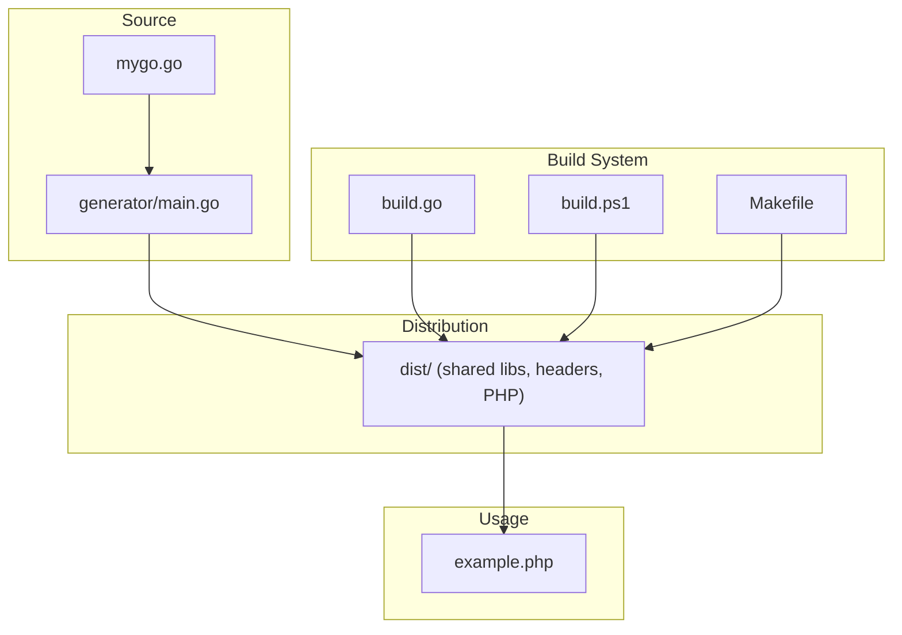
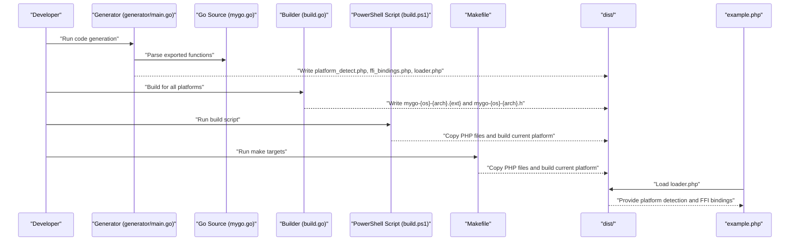
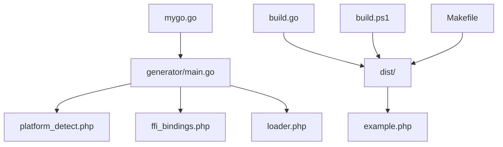

# File Structure Reference

<cite>
**Referenced Files in This Document**
- [README.md](file://README.md)
- [QUICKSTART.md](file://QUICKSTART.md)
- [mygo.go](file://mygo.go)
- [generator/main.go](file://generator/main.go)
- [build.go](file://build.go)
- [build.ps1](file://build.ps1)
- [Makefile](file://Makefile)
- [example.php](file://example.php)
- [go.mod](file://go.mod)
</cite>

## Table of Contents
1. [Introduction](#introduction)
2. [Project Structure](#project-structure)
3. [Core Components](#core-components)
4. [Architecture Overview](#architecture-overview)
5. [Detailed Component Analysis](#detailed-component-analysis)
6. [Dependency Analysis](#dependency-analysis)
7. [Performance Considerations](#performance-considerations)
8. [Troubleshooting Guide](#troubleshooting-guide)
9. [Conclusion](#conclusion)
10. [Appendices](#appendices)

## Introduction
This document provides a comprehensive reference for the file structure and naming conventions used in the project. It explains the standardized library naming format “mygo-{GOOS}-{GOARCH}.{ext}”, details the contents and roles of files in the dist/ directory, and describes how the build system organizes outputs for distribution. It also documents the source files that drive the build and code generation, including mygo.go for exported Go functions and generator/main.go for generating PHP FFI bindings.

## Project Structure
The repository follows a clear, layered structure:
- Source code: mygo.go defines exported functions intended for consumption by PHP via FFI.
- Code generator: generator/main.go parses exported functions and generates PHP files for platform detection, FFI bindings, and a loader.
- Build orchestrators: build.go performs cross-platform builds and copies generated PHP files into dist/.
- Convenience scripts: build.ps1 (Windows PowerShell) and Makefile (Unix-like systems) wrap generation and build tasks.
- Example usage: example.php demonstrates how to load and use the generated library.
- Documentation: README.md and QUICKSTART.md describe supported platforms, build steps, and usage.

**Diagram sources**
- [mygo.go](file://mygo.go#L1-L39)
- [generator/main.go](file://generator/main.go#L1-L705)
- [build.go](file://build.go#L1-L183)
- [build.ps1](file://build.ps1#L1-L152)
- [Makefile](file://Makefile#L1-L54)
- [example.php](file://example.php#L1-L95)

**Section sources**
- [README.md](file://README.md#L25-L41)
- [QUICKSTART.md](file://QUICKSTART.md#L57-L67)

## Core Components
- Standardized library naming: mygo-{GOOS}-{GOARCH}.{ext}
  - Base name: mygo
  - OS: linux, darwin, windows (lowercase)
  - Architecture: amd64, arm64
  - Extension: so (Linux), dylib (macOS), dll (Windows)
- dist/ directory contents:
  - Shared libraries: mygo-{os}-{arch}.{ext}
  - C header files: mygo-{os}-{arch}.h
  - Generated PHP files: platform_detect.php, ffi_bindings.php, loader.php
- Source files:
  - mygo.go: exported functions for FFI
  - generator/main.go: parses mygo.go and generates PHP files
  - build.go: cross-platform build orchestration and copying of PHP files
  - build.ps1 and Makefile: convenience wrappers around generation and build
  - example.php: usage example for the generated library

**Section sources**
- [README.md](file://README.md#L7-L13)
- [README.md](file://README.md#L16-L24)
- [README.md](file://README.md#L25-L41)
- [QUICKSTART.md](file://QUICKSTART.md#L57-L67)

## Architecture Overview
The build pipeline integrates code generation and cross-platform compilation to produce platform-specific shared libraries and corresponding PHP binding files. The loader.php file serves as the main entry point for PHP applications to load the correct platform-specific library.

**Diagram sources**
- [generator/main.go](file://generator/main.go#L27-L75)
- [generator/main.go](file://generator/main.go#L190-L339)
- [generator/main.go](file://generator/main.go#L341-L418)
- [generator/main.go](file://generator/main.go#L642-L705)
- [build.go](file://build.go#L41-L105)
- [build.go](file://build.go#L107-L164)
- [build.ps1](file://build.ps1#L20-L44)
- [build.ps1](file://build.ps1#L46-L93)
- [Makefile](file://Makefile#L12-L31)
- [example.php](file://example.php#L1-L20)

## Detailed Component Analysis

### Standard Library Naming Format
- Pattern: mygo-{GOOS}-{GOARCH}.{ext}
- Determinants:
  - Base name: derived from the Go source file name (without .go)
  - OS: lowercase OS identifiers (linux, darwin, windows)
  - Architecture: amd64 or arm64
  - Extension: so (Linux), dylib (macOS), dll (Windows)
- Purpose: Ensures deterministic, platform-specific filenames for easy discovery and loading by PHP.

**Section sources**
- [README.md](file://README.md#L7-L13)
- [README.md](file://README.md#L16-L24)
- [build.go](file://build.go#L31-L39)
- [generator/main.go](file://generator/main.go#L38-L41)

### dist/ Directory Structure and Contents
- Shared libraries (.so, .dylib, .dll):
  - Produced per platform via cross-compilation.
  - Named using the standardized pattern.
- Header files (.h):
  - Generated alongside shared libraries for FFI binding.
- Generated PHP files:
  - platform_detect.php: platform detection and path resolution.
  - ffi_bindings.php: FFI wrapper class exposing Go functions.
  - loader.php: main entry point to load the library for the current platform.

**Section sources**
- [README.md](file://README.md#L25-L41)
- [QUICKSTART.md](file://QUICKSTART.md#L57-L67)
- [build.go](file://build.go#L46-L85)

### Generated Files: platform_detect.php
- Role: Detects the current OS family, architecture, and determines the appropriate file extension and filenames.
- Content highlights:
  - Supported platforms mapping (OS to architectures and extensions).
  - Methods to detect OS and architecture.
  - Methods to compute filename and path for the library and header.
  - Utility to check platform support and return platform information.

**Section sources**
- [generator/main.go](file://generator/main.go#L190-L339)

### Generated Files: ffi_bindings.php
- Role: Provides a PHP FFI wrapper class that loads the shared library using the header file and exposes typed wrapper methods for each exported Go function.
- Content highlights:
  - Validates FFI extension availability and file existence.
  - Reads the header file and initializes FFI with cdef().
  - Generates PHPDoc and wrapper methods for each exported function, mapping C/Go types to PHP types.
  - Exposes a getFFI() accessor for advanced usage.

**Section sources**
- [generator/main.go](file://generator/main.go#L341-L418)
- [generator/main.go](file://generator/main.go#L420-L479)
- [generator/main.go](file://generator/main.go#L481-L640)

### Generated Files: loader.php
- Role: Main entry point for PHP applications. Loads the platform detector and FFI bindings, validates platform support, and constructs the library instance with correct paths.
- Content highlights:
  - Requires platform_detect.php and ffi_bindings.php.
  - loadGoLibrary(): resolves platform-specific paths and returns a configured GoLibrary instance.
  - getMyGoPlatformInfo(): returns platform details including OS, arch, extension, and filenames.

**Section sources**
- [generator/main.go](file://generator/main.go#L642-L705)

### Source Files: mygo.go
- Role: Defines exported functions intended for FFI consumption by PHP. Uses //export directives to expose functions to C/FFI.
- Key points:
  - Contains example exported functions (e.g., Add, Echo, PrintArray, ShowArray).
  - Includes a minimal main() to satisfy shared library build requirements.
  - Integrates with go:generate to trigger code generation.

**Section sources**
- [mygo.go](file://mygo.go#L11-L11)
- [mygo.go](file://mygo.go#L13-L39)

### Source Files: generator/main.go
- Role: Parses mygo.go to extract exported functions and generates the three PHP files.
- Key points:
  - parseExports(): scans the source file for //export directives and function signatures.
  - generatePlatformDetect(): creates platform detection logic.
  - generateFFIBindings(): creates FFI wrapper class and method wrappers.
  - generateLoader(): creates the loader entry point.

**Section sources**
- [generator/main.go](file://generator/main.go#L27-L75)
- [generator/main.go](file://generator/main.go#L77-L145)
- [generator/main.go](file://generator/main.go#L190-L339)
- [generator/main.go](file://generator/main.go#L341-L418)
- [generator/main.go](file://generator/main.go#L642-L705)

### Build Orchestrator: build.go
- Role: Cross-platform builder that:
  - Defines supported platforms and their extensions.
  - Builds shared libraries for each platform using go build -buildmode=c-shared.
  - Creates dist/ and writes both the shared library and header file.
  - Copies generated PHP files into dist/.
- Key points:
  - getSupportedPlatforms(): enumerates supported platform tuples.
  - buildPlatform(): sets GOOS/GOARCH, CGO_ENABLED, and CC for cross-compilation.
  - copyFile(): utility to copy generated PHP files to dist/.

**Section sources**
- [build.go](file://build.go#L19-L29)
- [build.go](file://build.go#L31-L39)
- [build.go](file://build.go#L107-L164)
- [build.go](file://build.go#L166-L183)

### Convenience Scripts: build.ps1 and Makefile
- build.ps1:
  - Provides commands: generate, build, build-current, test, clean, help.
  - Invokes go generate and go run build.go for multi-platform builds.
  - Builds current platform only and copies PHP files to dist/.
- Makefile:
  - Targets: all, generate, build, build-current, test, clean, help.
  - Builds current platform and copies PHP files to dist/.
  - Runs the example after building.

**Section sources**
- [build.ps1](file://build.ps1#L1-L152)
- [Makefile](file://Makefile#L1-L54)

### Example Usage: example.php
- Role: Demonstrates loading the library via loader.php, retrieving platform info, and invoking exported functions.
- Key points:
  - Loads loader.php and obtains platform info.
  - Creates a GoLibrary instance and calls exported functions.
  - Shows proper handling of returned C strings and freeing memory.

**Section sources**
- [example.php](file://example.php#L1-L95)

## Dependency Analysis
The following diagram shows how the components depend on each other during the build and runtime workflow.

**Diagram sources**
- [mygo.go](file://mygo.go#L11-L11)
- [generator/main.go](file://generator/main.go#L27-L75)
- [build.go](file://build.go#L46-L85)
- [build.ps1](file://build.ps1#L20-L44)
- [Makefile](file://Makefile#L12-L31)
- [example.php](file://example.php#L1-L20)

**Section sources**
- [README.md](file://README.md#L25-L41)
- [QUICKSTART.md](file://QUICKSTART.md#L57-L67)

## Performance Considerations
- Library loading occurs once per PHP process; using persistent processes (e.g., PHP-FPM) improves performance.
- FFI overhead is low compared to native C extensions.
- String conversions between PHP and C incur overhead; batch operations when possible.
- Proper memory management is essential; always free strings allocated by Go.

**Section sources**
- [README.md](file://README.md#L296-L302)

## Troubleshooting Guide
Common issues and resolutions:
- PHP FFI not enabled:
  - Ensure the FFI extension is enabled in php.ini.
- Library not found:
  - Confirm that go generate was run and the dist/ directory contains the correct shared library and header files.
- Platform not supported:
  - Build for your platform or extend supported platforms in build.go.
- CGO not enabled:
  - Ensure CGO is enabled and a compatible C compiler is installed.
- DLL loading errors on Windows:
  - Verify architecture alignment (64-bit PHP with 64-bit DLL) and install required runtime libraries if needed.

**Section sources**
- [README.md](file://README.md#L239-L295)

## Conclusion
The project establishes a robust, standardized approach to distributing Go shared libraries for PHP FFI integration. The naming convention ensures predictable, platform-specific artifacts, while the generator and build system automate the creation of PHP binding files and cross-platform binaries. The dist/ directory consolidates everything needed to consume the library in PHP, and the example demonstrates practical usage.

## Appendices

### Appendix A: Supported Platforms and Filenames
- Linux x64: mygo-linux-amd64.so
- Linux ARM64: mygo-linux-arm64.so
- macOS x64: mygo-darwin-amd64.dylib
- macOS ARM64: mygo-darwin-arm64.dylib
- Windows x64: mygo-windows-amd64.dll
- Windows ARM64: mygo-windows-arm64.dll

**Section sources**
- [README.md](file://README.md#L16-L24)

### Appendix B: Build Output Locations
- dist/ contains:
  - mygo-{os}-{arch}.{ext}: compiled shared libraries
  - mygo-{os}-{arch}.h: C header files
  - platform_detect.php, ffi_bindings.php, loader.php: generated PHP files

**Section sources**
- [README.md](file://README.md#L25-L41)
- [QUICKSTART.md](file://QUICKSTART.md#L57-L67)