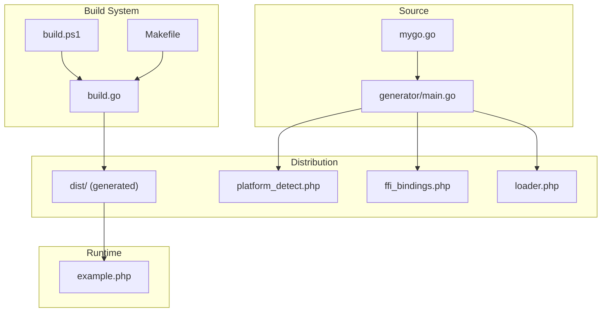
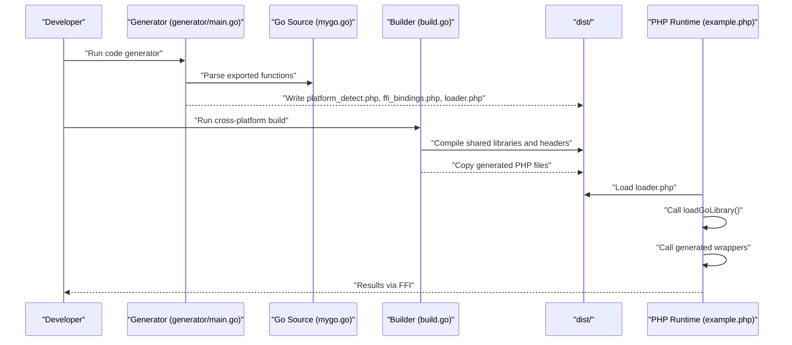
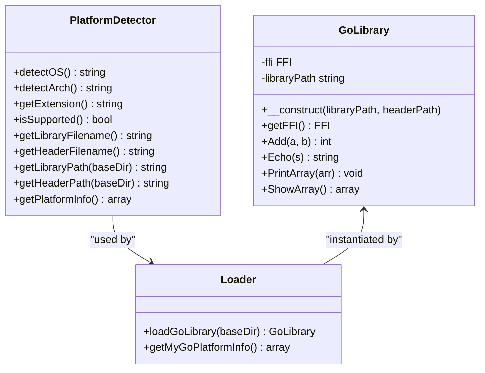
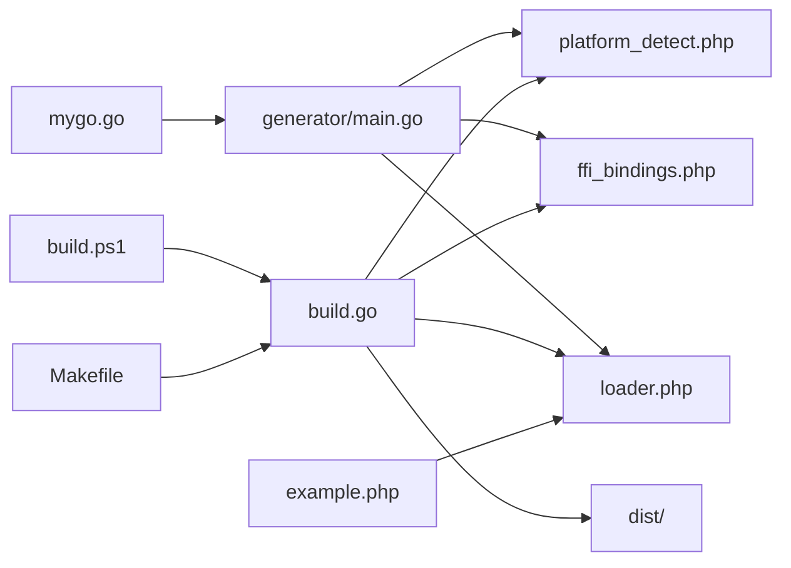
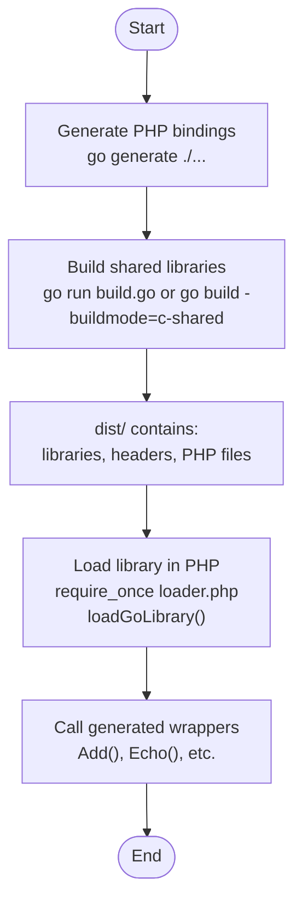

# Reference

<cite>
**Referenced Files in This Document**
- [mygo.go](file://mygo.go)
- [build.go](file://build.go)
- [generator/main.go](file://generator/main.go)
- [build.ps1](file://build.ps1)
- [Makefile](file://Makefile)
- [example.php](file://example.php)
- [README.md](file://README.md)
- [QUICKSTART.md](file://QUICKSTART.md)
- [AGENTS.MD](file://AGENTS.MD)
- [go.mod](file://go.mod)
</cite>

## Table of Contents
1. [Introduction](#introduction)
2. [Project Structure](#project-structure)
3. [Core Components](#core-components)
4. [Architecture Overview](#architecture-overview)
5. [Detailed Component Analysis](#detailed-component-analysis)
6. [Dependency Analysis](#dependency-analysis)
7. [Performance Considerations](#performance-considerations)
8. [Troubleshooting Guide](#troubleshooting-guide)
9. [Conclusion](#conclusion)
10. [Appendices](#appendices)

## Introduction
This document serves as a complete technical reference for the cross-platform Go shared library build system for PHP FFI. It covers:
- Public interfaces exposed by the Go code and generated PHP FFI bindings
- Build system configuration and command-line parameters
- Generated file formats and distribution packaging
- Library naming conventions and file structure
- Platform detection logic and usage constraints

The goal is to enable developers to integrate, extend, and distribute the library reliably across platforms.

## Project Structure
The repository organizes build orchestration, code generation, and distribution into focused modules:
- mygo.go: Exposes Go functions to PHP via FFI
- generator/main.go: Parses exported functions and generates PHP FFI bindings
- build.go: Cross-platform builder for shared libraries and distribution packaging
- build.ps1 and Makefile: Convenience scripts for Windows and Unix-like systems
- example.php: Demonstrates usage of the generated bindings
- Documentation files (README.md, QUICKSTART.md, AGENTS.MD) for user and developer guidance

**Diagram sources**
- [mygo.go](file://mygo.go#L1-L39)
- [generator/main.go](file://generator/main.go#L1-L705)
- [build.go](file://build.go#L1-L183)
- [build.ps1](file://build.ps1#L1-L152)
- [Makefile](file://Makefile#L1-L54)
- [example.php](file://example.php#L1-L95)

**Section sources**
- [README.md](file://README.md#L1-L120)
- [QUICKSTART.md](file://QUICKSTART.md#L1-L80)
- [AGENTS.MD](file://AGENTS.MD#L1-L120)

## Core Components
This section documents the public interfaces and generated artifacts.

- Go exported functions (public API surface)
  - Add(a int, b int) int
  - Echo(s string) string
  - PrintArray(arr []int) void
  - ShowArray() map[string]any

- Generated PHP FFI bindings
  - PlatformDetector class with instance methods for platform detection and path resolution
  - GoLibrary class with FFI instance and wrapper methods mirroring exported functions
  - loadGoLibrary(baseDir) function returning GoLibrary
  - get{BaseName}PlatformInfo() function returning platform details

- Build system entry points
  - build.go main orchestrates cross-platform builds and distribution packaging
  - build.ps1 and Makefile provide convenience commands for Windows and Unix-like systems

**Section sources**
- [mygo.go](file://mygo.go#L13-L39)
- [generator/main.go](file://generator/main.go#L190-L339)
- [generator/main.go](file://generator/main.go#L341-L418)
- [generator/main.go](file://generator/main.go#L642-L704)
- [build.go](file://build.go#L41-L105)
- [build.ps1](file://build.ps1#L1-L152)
- [Makefile](file://Makefile#L1-L54)

## Architecture Overview
The system follows a deterministic pipeline:
- Code generation parses exported functions from Go source and produces PHP FFI bindings
- Cross-platform build compiles shared libraries and headers, then packages them with generated PHP files
- Runtime loading uses platform detection to select the correct library and header

**Diagram sources**
- [generator/main.go](file://generator/main.go#L27-L75)
- [generator/main.go](file://generator/main.go#L190-L339)
- [generator/main.go](file://generator/main.go#L341-L418)
- [generator/main.go](file://generator/main.go#L642-L704)
- [build.go](file://build.go#L41-L105)
- [example.php](file://example.php#L1-L95)

## Detailed Component Analysis

### Go Public Interfaces (mygo.go)
- Purpose: Define the public API exposed to PHP via FFI
- Export mechanism: //export directives preceding function declarations
- Required boilerplate: import "C" with C stdlib include and empty main()

Public functions:
- Add(a int, b int) int
  - Parameters: a (int), b (int)
  - Return: int
  - Behavior: integer addition
  - Constraints: Operates on signed integers; ensure inputs are within int bounds
  - Usage: Called via generated wrapper in PHP

- Echo(s string) string
  - Parameters: s (string)
  - Return: string
  - Behavior: returns the input string unchanged
  - Constraints: Returned string is allocated by Go; caller must free via FreeString
  - Usage: Requires manual memory management in PHP

- PrintArray(arr []int) void
  - Parameters: arr ([]int)
  - Return: void
  - Behavior: iterates over array and prints index/value pairs
  - Constraints: Prints to stdout; no return value
  - Usage: For demonstration and diagnostics

- ShowArray() map[string]any
  - Parameters: none
  - Return: map[string]any
  - Behavior: returns a complex map containing mixed types
  - Constraints: Returned map is Go-managed; caller must handle conversion appropriately
  - Usage: Demonstrates FFI interoperability with complex types

Implementation notes:
- All exported functions must be declared with //export
- main() is required for shared library builds
- CGO is enabled via CGO_ENABLED=1 during builds

**Section sources**
- [mygo.go](file://mygo.go#L13-L39)

### Generated PHP FFI Bindings (generator/main.go)
The generator produces three PHP files under the app\lib namespace:

- platform_detect.php
  - Class: PlatformDetector
  - Responsibilities:
    - Detect OS family and architecture
    - Determine file extension per platform
    - Compute library and header filenames
    - Provide full paths for library/header
    - Report platform support status
  - Methods:
    - detectOS(): string
    - detectArch(): string
    - getExtension(): string
    - isSupported(): bool
    - getLibraryFilename(): string
    - getHeaderFilename(): string
    - getLibraryPath(baseDir): string
    - getHeaderPath(baseDir): string
    - getPlatformInfo(): array
  - Notes:
    - All methods are instance methods
    - Throws exceptions for unsupported platforms
    - Uses PHP_OS_FAMILY and php_uname('m')

- ffi_bindings.php
  - Class: GoLibrary
  - Responsibilities:
    - Initialize FFI with header and library
    - Provide wrapper methods for each exported function
    - Expose raw FFI instance for advanced usage
  - Constructor:
    - __construct(libraryPath: string, headerPath: string)
  - Methods:
    - getFFI(): FFI
    - Generated wrappers mirror exported functions (see below)
  - Error handling:
    - Validates FFI extension presence
    - Validates existence of library and header files
    - Wraps FFI loading errors with detailed messages

- loader.php
  - Functions:
    - loadGoLibrary(?string $baseDir = null): GoLibrary
    - get{BaseName}PlatformInfo(): array
  - Responsibilities:
    - Automatically detect platform and resolve paths
    - Instantiate GoLibrary with validated paths
    - Provide platform information for diagnostics

Generated wrapper methods (examples):
- Add(a int, b int): int
- Echo(s string): string
- PrintArray(arr array): void
- ShowArray(): array

Type mapping rules (C/Go to PHP):
- Integers: int, GoInt, C.int, uint*, char, short, long, long long, unsigned char/int/long, size_t/ssize_t -> int
- Floats: float, double, GoFloat*, C.float/double -> float
- Strings: *C.char, char*, string, GoString -> string
- Booleans: bool, GoBool, _Bool -> bool
- Arrays/Collections: map[], GoMap, GoSlice, [], pointers (non-char*) -> array
- Void: void -> void (no type hint)

Notes:
- Unknown types receive no PHP type hints
- All generated methods are instance methods
- Namespace is app\lib

**Section sources**
- [generator/main.go](file://generator/main.go#L190-L339)
- [generator/main.go](file://generator/main.go#L341-L418)
- [generator/main.go](file://generator/main.go#L481-L640)
- [generator/main.go](file://generator/main.go#L642-L704)

### Build System (build.go)
- Purpose: Cross-platform builder for shared libraries and distribution packaging
- Supported platforms:
  - linux/amd64 (.so)
  - linux/arm64 (.so)
  - darwin/amd64 (.dylib)
  - darwin/arm64 (.dylib)
  - windows/amd64 (.dll)
  - windows/arm64 (.dll)

- Library naming convention:
  - mygo-{GOOS}-{GOARCH}.{ext}
  - Headers named similarly: mygo-{GOOS}-{GOARCH}.h

- Build process:
  - Creates dist/ directory
  - Iterates supported platforms
  - Sets GOOS, GOARCH, CGO_ENABLED, and CC (when cross-compiling)
  - Executes go build -buildmode=c-shared
  - Verifies output and header files exist and are non-empty
  - Copies generated PHP files to dist/
  - Prints success/failure summary

- Cross-compilation requirements:
  - Linux → Windows: x86_64-w64-mingw32-gcc or aarch64-w64-mingw32-gcc
  - Linux → arm64: aarch64-linux-gnu-gcc
  - macOS builds: clang via Xcode Command Line Tools

- Error handling:
  - Non-fatal failures: continues building other platforms
  - Helpful messages for missing toolchains
  - Verifies file sizes to guard against empty outputs

**Section sources**
- [build.go](file://build.go#L12-L29)
- [build.go](file://build.go#L31-L39)
- [build.go](file://build.go#L107-L164)
- [build.go](file://build.go#L166-L183)

### Build Scripts (build.ps1, Makefile)
- Windows (PowerShell)
  - Commands:
    - generate: runs go generate ./...
    - build: runs go run build.go
    - build-current: builds for current platform only
    - test: build-current then runs php example.php
    - clean: removes dist/ and generated PHP files
    - help: prints usage
  - Behavior:
    - Determines GOOS/GOARCH dynamically
    - Creates dist/ if missing
    - Copies generated PHP files after successful build

- Unix/Linux (Makefile)
  - Targets:
    - generate: runs go generate ./...
    - build: runs go run build.go
    - build-current: builds for current platform only
    - test: build-current then runs php example.php
    - clean: removes dist/ and generated PHP files
    - help: prints usage
  - Behavior:
    - Uses go env GOOS/GOARCH to compute output paths
    - Copies generated PHP files after successful build

**Section sources**
- [build.ps1](file://build.ps1#L1-L152)
- [Makefile](file://Makefile#L1-L54)

### Example Usage (example.php)
- Demonstrates:
  - Loading platform info
  - Loading the library via loadGoLibrary()
  - Calling generated wrappers
  - Handling returned strings and freeing Go-allocated memory
  - Error handling with try/catch

**Section sources**
- [example.php](file://example.php#L1-L95)

## Architecture Overview
The system’s runtime architecture connects PHP to Go via FFI with platform-aware loading.

**Diagram sources**
- [generator/main.go](file://generator/main.go#L190-L339)
- [generator/main.go](file://generator/main.go#L341-L418)
- [generator/main.go](file://generator/main.go#L642-L704)

## Detailed Component Analysis

### API Reference: mygo.go
- Exported functions
  - Add(a int, b int) int
    - Parameters: a (int), b (int)
    - Return: int
    - Constraints: None beyond int range
  - Echo(s string) string
    - Parameters: s (string)
    - Return: string
    - Constraints: Caller must free returned string pointer
  - PrintArray(arr []int) void
    - Parameters: arr ([]int)
    - Return: void
    - Constraints: No return value; prints to stdout
  - ShowArray() map[string]any
    - Parameters: none
    - Return: map[string]any
    - Constraints: Complex type; handle carefully in PHP

- Usage constraints
  - All exported functions must be declared with //export
  - main() is required for shared library builds
  - CGO must be enabled (CGO_ENABLED=1) during builds

**Section sources**
- [mygo.go](file://mygo.go#L13-L39)

### Generated PHP API Reference
- PlatformDetector
  - detectOS(): string -> "linux", "darwin", or "windows"
  - detectArch(): string -> "amd64" or "arm64"
  - getExtension(): string -> "so", "dylib", or "dll"
  - isSupported(): bool -> true if platform combination is supported
  - getLibraryFilename(): string -> "{basename}-{os}-{arch}.{ext}"
  - getHeaderFilename(): string -> "{basename}-{os}-{arch}.h"
  - getLibraryPath(baseDir): string -> full path to library
  - getHeaderPath(baseDir): string -> full path to header
  - getPlatformInfo(): array -> includes os, arch, extension, library, header, supported

- GoLibrary
  - __construct(libraryPath: string, headerPath: string)
  - getFFI(): FFI
  - Generated wrappers:
    - Add(a int, b int): int
    - Echo(s string): string
    - PrintArray(arr array): void
    - ShowArray(): array

- loader.php
  - loadGoLibrary(?string $baseDir = null): GoLibrary
  - getMyGoPlatformInfo(): array

- Type mapping
  - Integers, floats, booleans, strings, arrays, and void mapped consistently
  - Unknown types receive no PHP type hints

**Section sources**
- [generator/main.go](file://generator/main.go#L190-L339)
- [generator/main.go](file://generator/main.go#L341-L418)
- [generator/main.go](file://generator/main.go#L481-L640)
- [generator/main.go](file://generator/main.go#L642-L704)

### Build System Reference
- Supported platforms and extensions
  - linux/amd64 -> .so
  - linux/arm64 -> .so
  - darwin/amd64 -> .dylib
  - darwin/arm64 -> .dylib
  - windows/amd64 -> .dll
  - windows/arm64 -> .dll

- Naming convention
  - mygo-{GOOS}-{GOARCH}.{ext}
  - mygo-{GOOS}-{GOARCH}.h

- Environment variables and cross-compilation
  - GOOS, GOARCH, CGO_ENABLED set per platform
  - CC configured for cross-compilers when needed

- Output verification
  - Ensures output and header files exist and are non-empty

- Distribution packaging
  - Copies generated PHP files to dist/

**Section sources**
- [build.go](file://build.go#L12-L29)
- [build.go](file://build.go#L31-L39)
- [build.go](file://build.go#L107-L164)
- [build.go](file://build.go#L166-L183)

### Command-Line Parameters and Options
- go generate
  - Invokes generator/main.go to produce PHP files
  - Accepts optional source file argument (default mygo.go)

- go run build.go
  - Builds for all supported platforms
  - Requires cross-compilers for non-native platforms

- go build -buildmode=c-shared
  - Builds shared library for current platform
  - Outputs to dist/ with standardized naming

- PowerShell build.ps1
  - generate, build, build-current, test, clean, help

- Makefile
  - generate, build, build-current, test, clean, help

**Section sources**
- [generator/main.go](file://generator/main.go#L27-L75)
- [build.go](file://build.go#L107-L164)
- [build.ps1](file://build.ps1#L1-L152)
- [Makefile](file://Makefile#L1-L54)

### Generated Files and Distribution Packaging
- dist/ directory contents
  - mygo-{os}-{arch}.{ext}: compiled shared library
  - mygo-{os}-{arch}.h: C header file
  - platform_detect.php: platform detection logic
  - ffi_bindings.php: FFI wrapper classes
  - loader.php: main loader and platform info function

- File structure
  - Entire dist/ can be copied into a PHP project
  - loader.php handles platform detection and library loading

**Section sources**
- [README.md](file://README.md#L25-L41)
- [QUICKSTART.md](file://QUICKSTART.md#L57-L67)
- [AGENTS.MD](file://AGENTS.MD#L414-L442)

## Dependency Analysis
The build system and generator form a tight loop:
- generator/main.go depends on mygo.go for parsing exported functions
- build.go orchestrates cross-platform compilation and distribution
- build.ps1 and Makefile wrap build.go and provide convenience commands
- example.php consumes the generated loader and bindings

**Diagram sources**
- [generator/main.go](file://generator/main.go#L27-L75)
- [generator/main.go](file://generator/main.go#L190-L339)
- [generator/main.go](file://generator/main.go#L341-L418)
- [generator/main.go](file://generator/main.go#L642-L704)
- [build.go](file://build.go#L41-L105)
- [build.ps1](file://build.ps1#L1-L152)
- [Makefile](file://Makefile#L1-L54)
- [example.php](file://example.php#L1-L95)

**Section sources**
- [generator/main.go](file://generator/main.go#L27-L75)
- [build.go](file://build.go#L41-L105)

## Performance Considerations
- Library loading occurs once per PHP process; use persistent processes (e.g., PHP-FPM) for optimal performance
- FFI overhead is minimal compared to native C extensions
- String conversion between PHP and C has overhead; batch operations when possible
- Always free Go-allocated strings to prevent memory leaks

**Section sources**
- [README.md](file://README.md#L296-L302)

## Troubleshooting Guide
Common issues and resolutions:
- PHP FFI not enabled
  - Ensure extension=ffi and ffi.enable=true in php.ini
  - Restart web server or PHP-FPM

- Library not found
  - Ensure go generate was run and libraries were built
  - Verify dist/ contains the appropriate .so/.dll/.dylib file
  - Confirm correct path passed to loadGoLibrary()

- Platform not supported
  - Build for your platform or add support in build.go
  - Use getMyGoPlatformInfo() to diagnose

- CGO not enabled
  - Set CGO_ENABLED=1
  - Ensure a C compiler (gcc/clang) is installed

- DLL loading errors on Windows
  - Architecture mismatch: ensure PHP bitness matches library
  - Missing dependencies: install Visual C++ Redistributable if needed
  - Antivirus interference: add exception to antivirus software

- Cross-compilation failures
  - Install required cross-compilers
  - Modified build.go tolerates failures and continues

**Section sources**
- [README.md](file://README.md#L238-L295)
- [AGENTS.MD](file://AGENTS.MD#L326-L371)

## Conclusion
This reference provides a complete specification for the Go-to-PHP FFI integration system. It documents the public Go API, generated PHP bindings, build system configuration, and distribution packaging. By following the naming conventions, platform detection logic, and usage constraints outlined here, developers can reliably integrate, extend, and distribute the library across platforms.

## Appendices

### Appendix A: Go Module and Toolchain
- Module: serviceLib
- Minimum Go version: 1.16
- Minimum PHP version: 7.4 (8.0+ recommended)

**Section sources**
- [go.mod](file://go.mod#L1-L4)
- [AGENTS.MD](file://AGENTS.MD#L555-L560)

### Appendix B: Example Usage Flow

**Diagram sources**
- [generator/main.go](file://generator/main.go#L27-L75)
- [build.go](file://build.go#L107-L164)
- [example.php](file://example.php#L1-L95)