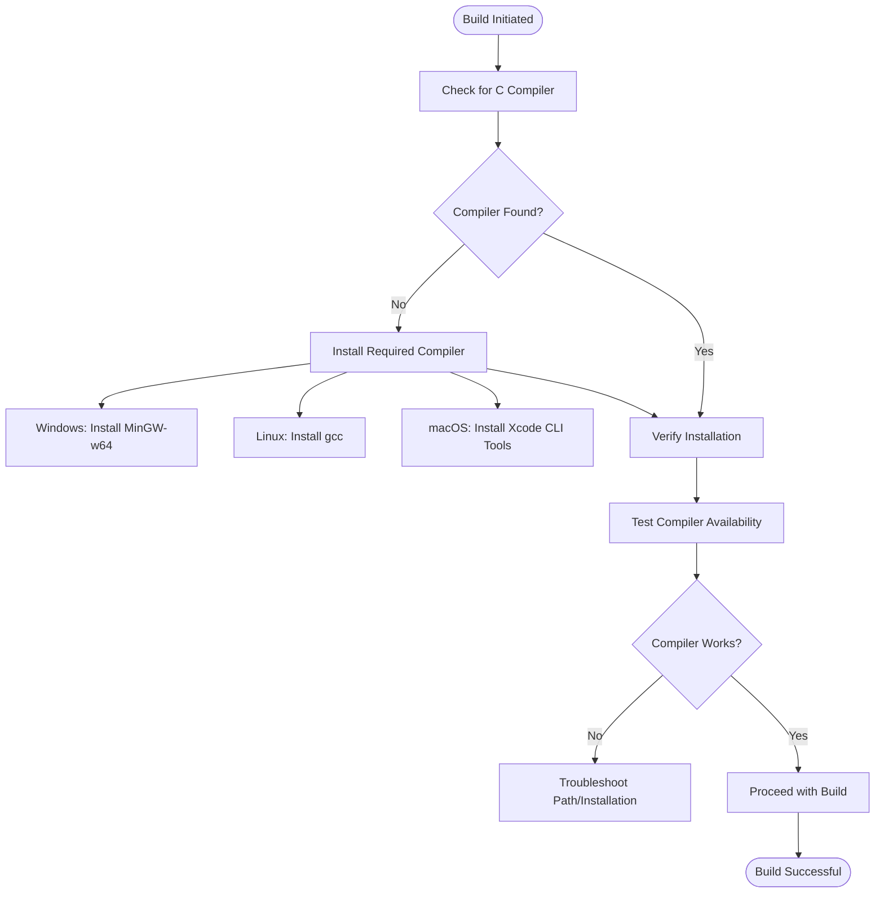
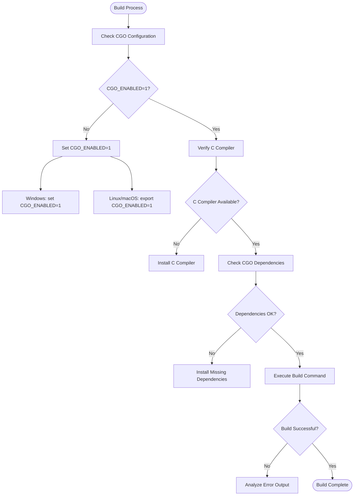
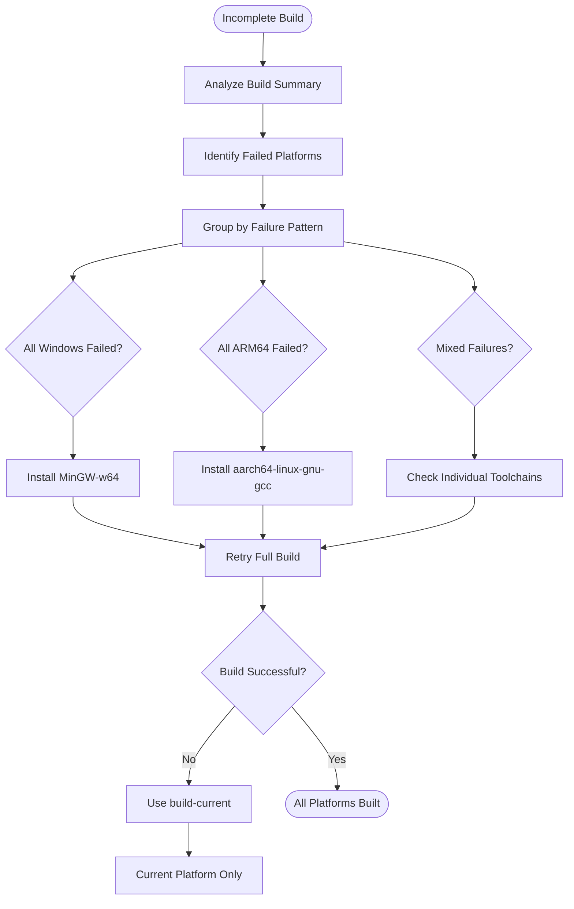

# Build Issues

<cite>
**Referenced Files in This Document**   
- [README.md](file://README.md)
- [build.go](file://build.go)
- [Makefile](file://Makefile)
- [build.ps1](file://build.ps1)
- [mygo.go](file://mygo.go)
</cite>

## Table of Contents
1. [Introduction](#introduction)
2. [Common Build Failures](#common-build-failures)
3. [Missing C Compiler Issues](#missing-c-compiler-issues)
4. [Cross-Compilation Toolchain Problems](#cross-compilation-toolchain-problems)
5. [CGO Configuration Errors](#cgo-configuration-errors)
6. [Platform-Specific Build Issues](#platform-specific-build-issues)
7. [Diagnosing Failed Cross-Compilation](#diagnosing-failed-cross-compilation)
8. [Troubleshooting Incomplete Builds](#troubleshooting-incomplete-builds)
9. [Build Command Examples](#build-command-examples)
10. [Conclusion](#conclusion)

## Introduction
This guide addresses common build failures encountered when working with serviceLib, a cross-platform Go shared library build system for PHP FFI (Foreign Function Interface). The system enables Go code to be compiled into shared libraries that can be consumed by PHP applications. Common issues include missing C compilers (GCC/Clang), cross-compilation toolchain problems (mingw-w64, aarch64-linux-gnu-gcc), and CGO configuration errors. This document provides comprehensive solutions for build failures across Windows, Linux, and macOS platforms, including architecture mismatches and environment variable misconfigurations. The analysis is based on the repository's build system implementation in build.go, Makefile, and build.ps1, along with configuration details from README.md.

**Section sources**
- [README.md](file://README.md#L1-L384)
- [build.go](file://build.go#L1-L183)

## Common Build Failures
The serviceLib build system frequently encounters several categories of build failures that prevent successful compilation of Go shared libraries for PHP FFI integration. The most prevalent issues include missing C compilers, cross-compilation toolchain problems, and CGO configuration errors. These failures typically manifest when attempting to build shared libraries using the `go build -buildmode=c-shared` command, which requires CGO to be enabled and a compatible C compiler to be available in the system path. The build.go orchestrator script attempts to compile libraries for six target platforms (Linux, macOS, and Windows on both amd64 and arm64 architectures), making it particularly susceptible to toolchain availability issues. When builds fail, the system provides detailed error output that can be used to diagnose the specific cause, whether it's a missing compiler, incorrect environment variables, or platform-specific toolchain requirements. Understanding these common failure modes is essential for developers working with the serviceLib system across different operating environments.

**Section sources**
- [build.go](file://build.go#L41-L105)
- [README.md](file://README.md#L238-L295)

## Missing C Compiler Issues
Missing C compiler issues are among the most frequent build failures in the serviceLib system, as the compilation of Go shared libraries requires CGO to interface with C code. The build process depends on having either GCC or Clang installed and accessible in the system path. On Windows, developers must install MinGW-w64 or TDM-GCC to provide the necessary C compilation capabilities. Linux systems typically have GCC pre-installed, but it may need to be explicitly installed via package managers like apt-get. macOS users require Xcode Command Line Tools, which can be installed with `xcode-select --install`. When a C compiler is missing, the build fails with errors indicating that CGO cannot find the required compilation tools. The build.go script specifically sets environment variables for cross-compilation, including CC=x86_64-w64-mingw32-gcc for Windows targets and CC=aarch64-linux-gnu-gcc for Linux ARM64 targets, making the presence of these specific compilers critical for successful cross-platform builds.

**Diagram sources**
- [README.md](file://README.md#L50-L53)
- [build.go](file://build.go#L125-L135)

**Section sources**
- [README.md](file://README.md#L50-L53)
- [build.go](file://build.go#L125-L135)

## Cross-Compilation Toolchain Problems
Cross-compilation toolchain problems occur when attempting to build shared libraries for platforms different from the host system, particularly when the required cross-compilers are not properly installed or configured. The serviceLib build system supports cross-compilation to six different platform-architecture combinations, requiring specific toolchains for each target. For Linux to Windows cross-compilation, the mingw-w64 toolchain must be installed with the x86_64-w64-mingw32-gcc compiler for AMD64 targets and aarch64-w64-mingw32-gcc for ARM64 targets. When building Linux ARM64 libraries from other platforms, the aarch64-linux-gnu-gcc compiler is required. These toolchain requirements are explicitly set in the build.go script through environment variables that specify the CC (C compiler) for each target platform. Failure to have these cross-compilers installed results in build failures for the affected platforms, while builds for the host platform may still succeed. The Makefile and build.ps1 scripts provide alternative build options that can help isolate and diagnose toolchain-specific issues.

**Section sources**
- [build.go](file://build.go#L125-L135)
- [Makefile](file://Makefile#L18-L26)
- [build.ps1](file://build.ps1#L50-L82)

## CGO Configuration Errors
CGO configuration errors occur when the CGO_ENABLED environment variable is not properly set or when CGO dependencies are misconfigured, preventing the successful compilation of C-shared libraries. The serviceLib build system requires CGO to be enabled (CGO_ENABLED=1) for all shared library builds, as indicated by the explicit setting of this environment variable in the build.go script. When CGO is disabled or unavailable, the build fails with explicit error messages. The build.go script sets CGO_ENABLED=1 for all platform builds, but this setting can be overridden by system configurations or conflicting environment variables. On Windows systems, additional configuration may be required to ensure that the MinGW-w64 environment is properly integrated with Go's build system. Developers must ensure that CGO is not only enabled but also has access to the necessary C compilation tools, as enabling CGO without a functioning C compiler will result in compilation failures rather than CGO-specific errors.

**Diagram sources**
- [build.go](file://build.go#L119-L120)
- [README.md](file://README.md#L273-L277)

**Section sources**
- [build.go](file://build.go#L119-L120)
- [README.md](file://README.md#L273-L277)

## Platform-Specific Build Issues
Platform-specific build issues arise from differences in toolchain availability, architecture requirements, and operating system constraints across Windows, Linux, and macOS environments. On Windows, common issues include architecture mismatches between PHP and the compiled DLL, where a 64-bit PHP installation cannot load a 32-bit DLL or vice versa. The build.ps1 PowerShell script provides Windows-specific build logic that accounts for these platform differences. Linux systems may encounter issues with missing development packages or incorrect permissions when creating the dist directory. macOS presents unique challenges for cross-compilation, particularly when targeting Linux from macOS, which requires specialized toolchains like musl-cross. Each platform has specific compiler requirements: Windows needs MinGW-w64, Linux typically has GCC pre-installed, and macOS requires Xcode Command Line Tools. The build system must account for these differences in file paths, command syntax, and environment variable handling, as demonstrated in the platform-specific logic within build.go and the separate build scripts for Unix (Makefile) and Windows (build.ps1).

**Section sources**
- [build.ps1](file://build.ps1#L50-L82)
- [Makefile](file://Makefile#L18-L26)
- [build.go](file://build.go#L123-L137)

## Diagnosing Failed Cross-Compilation
Diagnosing failed cross-compilation attempts requires analyzing the error messages from the Go compiler and understanding the specific requirements for each target platform. The build.go script provides a comprehensive diagnostic framework by capturing and reporting detailed error output for each failed build, including the specific GOOS, GOARCH, and error message. When cross-compilation fails, the most common causes are missing cross-compilers or incorrect CC environment variable settings. Developers should first verify that the required cross-compilation tools are installed and accessible in the system path. For Windows targets, check for x86_64-w64-mingw32-gcc or aarch64-w64-mingw32-gcc. For Linux ARM64 targets, verify the presence of aarch64-linux-gnu-gcc. The build summary output from build.go clearly indicates which platforms succeeded and which failed, allowing developers to focus their troubleshooting efforts on specific toolchain issues rather than general build problems. The error messages typically include the command that failed and its output, providing crucial information for diagnosing the root cause.

**Section sources**
- [build.go](file://build.go#L65-L72)
- [build.go](file://build.go#L92-L98)

## Troubleshooting Incomplete Builds
Troubleshooting incomplete builds, where some platforms succeed but others fail, requires a systematic approach to identify and resolve toolchain-specific issues. The build.go script is designed to continue building all platforms even when some fail, providing a detailed summary of successes and failures. When faced with incomplete builds, developers should first examine the failure messages to identify which specific platforms and architectures failed. Common patterns include all Windows builds failing (indicating a missing MinGW-w64 installation) or all ARM64 builds failing (suggesting missing aarch64 toolchains). The solution is often to install the missing cross-compilation tools and retry the build. Alternatively, developers can use the build-current target in the Makefile or build.ps1 script to build only for the current platform, bypassing cross-compilation requirements entirely. This approach allows for immediate development and testing while longer-term solutions for cross-platform builds are implemented. The build system's modular design supports this incremental approach to resolving build issues.

**Diagram sources**
- [build.go](file://build.go#L88-L98)
- [Makefile](file://Makefile#L18-L26)
- [build.ps1](file://build.ps1#L46-L93)

**Section sources**
- [build.go](file://build.go#L88-L98)
- [Makefile](file://Makefile#L18-L26)
- [build.ps1](file://build.ps1#L46-L93)

## Build Command Examples
The serviceLib system provides multiple build command options for different use cases, as documented in the README.md, Makefile, and build.ps1 files. For building shared libraries for all supported platforms, the primary command is `go run build.go`, which orchestrates cross-compilation for six platform-architecture combinations. When only the current platform's library is needed, developers can use `go build -buildmode=c-shared` with platform-specific output paths: `go build -buildmode=c-shared -o dist/mygo-windows-amd64.dll mygo.go` for Windows, `go build -buildmode=c-shared -o dist/mygo-linux-amd64.so mygo.go` for Linux, and `go build -buildmode=c-shared -o dist/mygo-darwin-amd64.dylib mygo.go` for macOS. The Makefile provides convenient targets including `make build` for all platforms, `make build-current` for the current platform only, and `make generate` for generating PHP bindings. Windows users can utilize the PowerShell script with commands like `.\build.ps1 build` or `.\build.ps1 build-current`. These examples demonstrate the flexibility of the build system and provide alternatives when cross-compilation toolchains are not fully configured.

**Section sources**
- [README.md](file://README.md#L101-L102)
- [Makefile](file://Makefile#L13-L26)
- [build.ps1](file://build.ps1#L32-L93)

## Conclusion
The serviceLib build system provides a comprehensive framework for generating cross-platform Go shared libraries for PHP FFI integration, but its reliance on CGO and cross-compilation introduces several potential failure points. The most common issues stem from missing C compilers, incomplete cross-compilation toolchains, and CGO configuration errors. By understanding the specific requirements for each target platform and leveraging the diagnostic capabilities of the build.go script, developers can effectively troubleshoot and resolve build failures. The system's design allows for both comprehensive multi-platform builds and targeted single-platform compilation, providing flexibility based on available toolchains and development needs. When faced with incomplete builds, the recommended approach is to first ensure successful compilation for the current platform before addressing cross-compilation requirements. The combination of detailed error reporting, multiple build scripts, and clear documentation in README.md provides a robust foundation for maintaining a reliable build process across diverse development environments.