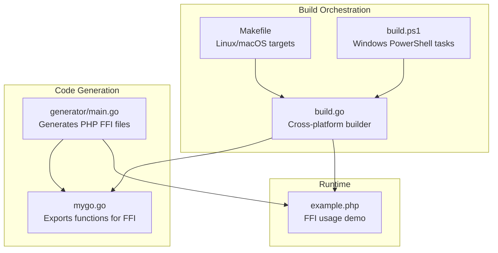
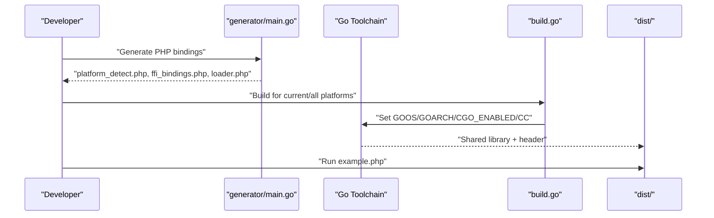
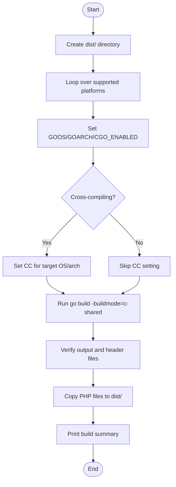
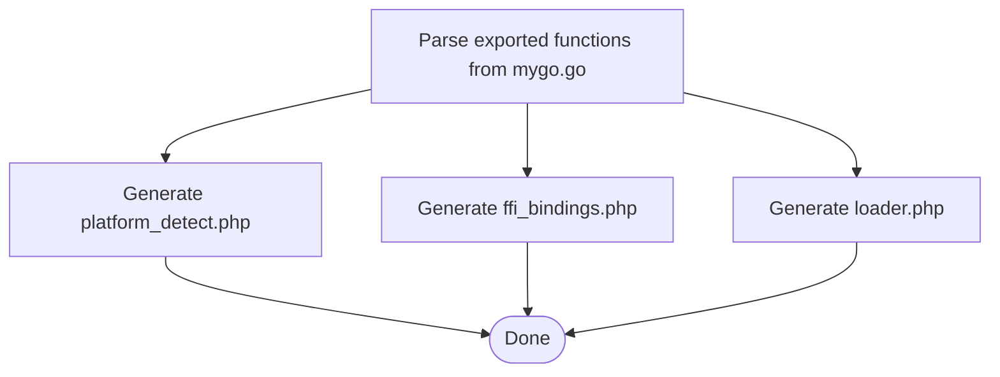
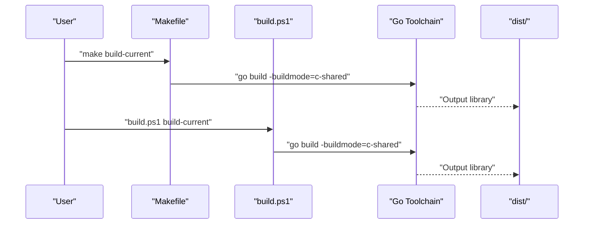
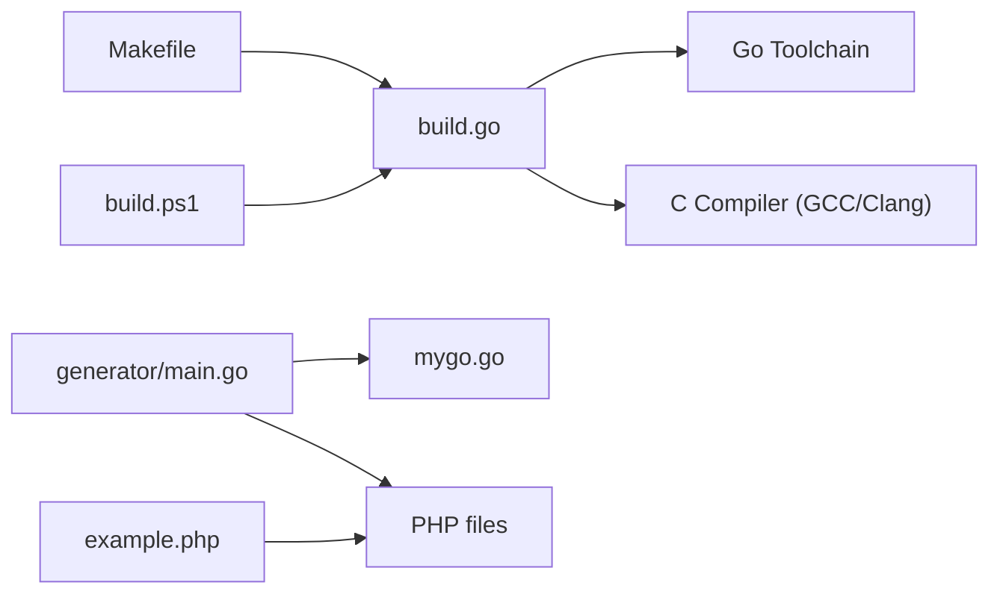

# Compiler Issues

<cite>
**Referenced Files in This Document**
- [README.md](file://README.md)
- [QUICKSTART.md](file://QUICKSTART.md)
- [build.go](file://build.go)
- [Makefile](file://Makefile)
- [build.ps1](file://build.ps1)
- [generator/main.go](file://generator/main.go)
- [mygo.go](file://mygo.go)
- [example.php](file://example.php)
- [go.mod](file://go.mod)
</cite>

## Table of Contents
1. [Introduction](#introduction)
2. [Project Structure](#project-structure)
3. [Core Components](#core-components)
4. [Architecture Overview](#architecture-overview)
5. [Detailed Component Analysis](#detailed-component-analysis)
6. [Dependency Analysis](#dependency-analysis)
7. [Performance Considerations](#performance-considerations)
8. [Troubleshooting Guide](#troubleshooting-guide)
9. [Conclusion](#conclusion)
10. [Appendices](#appendices)

## Introduction
This guide focuses on resolving common compiler-related failures in serviceLib builds. It covers prerequisites for C compilers (GCC/Clang), platform-specific installations (MinGW-w64 on Windows, Xcode Command Line Tools on macOS), and verification steps for successful compilation. It also explains the role of the CGO_ENABLED environment variable and provides actionable troubleshooting steps for “executable file not found” errors during Go builds.

## Project Structure
The build system relies on:
- A Go module that requires CGO-enabled builds for shared libraries
- A generator that produces PHP FFI binding files from exported Go functions
- A cross-platform builder that compiles shared libraries for multiple platforms
- Platform-specific scripts for Windows PowerShell and Linux/macOS Make targets
- An example PHP application demonstrating FFI usage

**Diagram sources**
- [build.go](file://build.go#L1-L183)
- [Makefile](file://Makefile#L1-L54)
- [build.ps1](file://build.ps1#L1-L152)
- [generator/main.go](file://generator/main.go#L1-L705)
- [mygo.go](file://mygo.go#L1-L39)
- [example.php](file://example.php#L1-L95)

**Section sources**
- [README.md](file://README.md#L43-L109)
- [QUICKSTART.md](file://QUICKSTART.md#L1-L55)
- [build.go](file://build.go#L1-L183)
- [Makefile](file://Makefile#L1-L54)
- [build.ps1](file://build.ps1#L1-L152)
- [generator/main.go](file://generator/main.go#L1-L705)
- [mygo.go](file://mygo.go#L1-L39)
- [example.php](file://example.php#L1-L95)

## Core Components
- Cross-platform builder: Orchestrates builds for six platforms and sets environment variables for cross-compilation, including CGO_ENABLED and CC.
- Generator: Parses exported functions from Go source and generates PHP files for platform detection, FFI bindings, and loader.
- Build scripts: Provide platform-specific commands to generate bindings, build libraries, and run tests.

Key responsibilities:
- Ensure CGO is enabled and a compatible C compiler is available
- Configure CC for cross-compilation scenarios
- Validate output artifacts and copy PHP files to distribution

**Section sources**
- [build.go](file://build.go#L1-L183)
- [generator/main.go](file://generator/main.go#L1-L705)
- [Makefile](file://Makefile#L1-L54)
- [build.ps1](file://build.ps1#L1-L152)

## Architecture Overview
The build pipeline integrates code generation and compilation across platforms. The builder sets environment variables for each target and invokes the Go toolchain to produce shared libraries and headers. The generator ensures PHP-side bindings align with exported Go functions.

**Diagram sources**
- [generator/main.go](file://generator/main.go#L1-L705)
- [build.go](file://build.go#L107-L164)
- [example.php](file://example.php#L1-L95)

## Detailed Component Analysis

### Cross-Platform Builder (build.go)
- Sets GOOS, GOARCH, and CGO_ENABLED=1 for each target
- Configures CC for cross-compilation (e.g., MinGW-w64 on Windows, GCC variants on Linux)
- Validates output existence and non-empty files
- Copies generated PHP files to dist/

**Diagram sources**
- [build.go](file://build.go#L41-L164)

**Section sources**
- [build.go](file://build.go#L1-L183)

### Code Generator (generator/main.go)
- Parses exported functions from Go source
- Generates platform detection, FFI bindings, and loader PHP files
- Ensures PHP-side wrappers match exported signatures

**Diagram sources**
- [generator/main.go](file://generator/main.go#L1-L705)

**Section sources**
- [generator/main.go](file://generator/main.go#L1-L705)

### Build Scripts (Makefile and build.ps1)
- Makefile: Targets for generate, build, build-current, test, clean
- build.ps1: Windows-specific commands mirroring Makefile targets

**Diagram sources**
- [Makefile](file://Makefile#L18-L30)
- [build.ps1](file://build.ps1#L46-L93)

**Section sources**
- [Makefile](file://Makefile#L1-L54)
- [build.ps1](file://build.ps1#L1-L152)

## Dependency Analysis
- build.go depends on the Go toolchain and external C compilers for cross-compilation
- generator/main.go depends on mygo.go exports and writes PHP files consumed by example.php
- Makefile and build.ps1 depend on build.go and mygo.go for platform-specific builds

**Diagram sources**
- [build.go](file://build.go#L107-L164)
- [generator/main.go](file://generator/main.go#L1-L705)
- [example.php](file://example.php#L1-L95)
- [Makefile](file://Makefile#L1-L54)
- [build.ps1](file://build.ps1#L1-L152)

**Section sources**
- [build.go](file://build.go#L1-L183)
- [generator/main.go](file://generator/main.go#L1-L705)
- [Makefile](file://Makefile#L1-L54)
- [build.ps1](file://build.ps1#L1-L152)

## Performance Considerations
- Prefer persistent processes (e.g., PHP-FPM) to minimize repeated library loading overhead
- Batch operations in PHP to reduce FFI overhead
- Ensure correct architecture alignment between PHP runtime and compiled library to avoid runtime errors

[No sources needed since this section provides general guidance]

## Troubleshooting Guide

### Missing C Compilers (GCC/Clang)
Symptoms:
- Build fails with errors indicating the C compiler cannot be found
- Cross-compilation attempts fail due to missing toolchains

Solutions:
- Install GCC/Clang appropriate to your platform
- On Linux, ensure gcc is installed
- On macOS, install Xcode Command Line Tools
- On Windows, install MinGW-w64 or TDM-GCC

Verification steps:
- Confirm compiler availability in PATH
- Test basic compilation with a minimal C program

**Section sources**
- [README.md](file://README.md#L47-L56)
- [QUICKSTART.md](file://QUICKSTART.md#L118-L128)

### MinGW-w64 Installation on Windows
Symptoms:
- Build fails with “executable file not found” for the Windows C compiler
- Cross-compilation to Windows fails

Solutions:
- Install MinGW-w64 or TDM-GCC
- Ensure CC is set appropriately for cross-compilation (e.g., x86_64-w64-mingw32-gcc)

Verification steps:
- Confirm CC environment variable points to the correct compiler
- Test with a simple Windows build command

**Section sources**
- [README.md](file://README.md#L51-L53)
- [build.go](file://build.go#L123-L136)

### Xcode Command Line Tools on macOS
Symptoms:
- Build fails due to missing Clang or SDK
- Cross-compilation to macOS fails

Solutions:
- Install Xcode Command Line Tools
- Ensure the latest command-line tools are selected

Verification steps:
- Confirm clang is available in PATH
- Test with a simple macOS build command

**Section sources**
- [README.md](file://README.md#L51-L53)
- [build.go](file://build.go#L123-L136)

### Verifying Compiler Installation and Testing Basic Compilation
Steps:
- Use the platform’s package manager to install the required compiler
- Open a new terminal session to refresh PATH
- Run a simple compile command to confirm availability
- For cross-compilation, set CC to the appropriate cross-compiler

Examples from repository:
- Cross-compilation to Windows from Linux using MinGW-w64
- Cross-compilation to Linux from macOS using musl-cross
- Building for current platform with go build -buildmode=c-shared

**Section sources**
- [README.md](file://README.md#L212-L236)
- [QUICKSTART.md](file://QUICKSTART.md#L1-L21)

### CGO_ENABLED Environment Variable
Impact:
- CGO must be enabled for building shared libraries
- Without CGO, the build will fail because shared library mode requires a C compiler

Solutions:
- Set CGO_ENABLED=1 for Linux/macOS
- Set CGO_ENABLED=1 for Windows

Validation:
- Confirm CGO is enabled before building
- Use the provided build commands that set CGO_ENABLED=1

**Section sources**
- [README.md](file://README.md#L267-L278)
- [build.go](file://build.go#L115-L120)

### Troubleshooting “exec: 'gcc': executable file not found”
Common causes:
- GCC not installed or not in PATH
- Incorrect CC environment variable for cross-compilation
- CGO disabled

Resolution steps:
- Install GCC/Clang for your platform
- Ensure CC points to the correct compiler for cross-compilation
- Set CGO_ENABLED=1
- Re-run the build command

Platform-specific commands:
- Linux: Install gcc via your distribution’s package manager
- macOS: Install Xcode Command Line Tools
- Windows: Install MinGW-w64 or TDM-GCC and set CC accordingly

**Section sources**
- [README.md](file://README.md#L267-L278)
- [build.go](file://build.go#L115-L136)

### Additional Build Validation
- Use the provided Makefile or build.ps1 targets to generate bindings and build libraries
- Run the example PHP script to validate FFI integration
- Confirm dist/ contains the expected shared library and header files

**Section sources**
- [Makefile](file://Makefile#L1-L54)
- [build.ps1](file://build.ps1#L1-L152)
- [example.php](file://example.php#L1-L95)

## Conclusion
Compiler-related build failures in serviceLib are primarily caused by missing or misconfigured C compilers and disabled CGO. By installing the correct toolchain for your platform, configuring CC for cross-compilation, enabling CGO, and validating with the provided scripts, you can reliably build shared libraries and integrate them with PHP via FFI.

[No sources needed since this section summarizes without analyzing specific files]

## Appendices

### Platform-Specific Installation References
- Linux prerequisites and cross-compilation to Windows using MinGW-w64
- macOS prerequisites and cross-compilation to Linux using musl-cross
- Windows prerequisites and MinGW-w64/TDM-GCC installation

**Section sources**
- [README.md](file://README.md#L51-L53)
- [README.md](file://README.md#L212-L236)

### Build Commands and Environment Variables
- Build current platform with go build -buildmode=c-shared
- Cross-compile with GOOS, GOARCH, CGO_ENABLED, and CC
- Generate bindings with go generate ./...

**Section sources**
- [README.md](file://README.md#L67-L109)
- [build.go](file://build.go#L115-L136)
- [generator/main.go](file://generator/main.go#L1-L705)