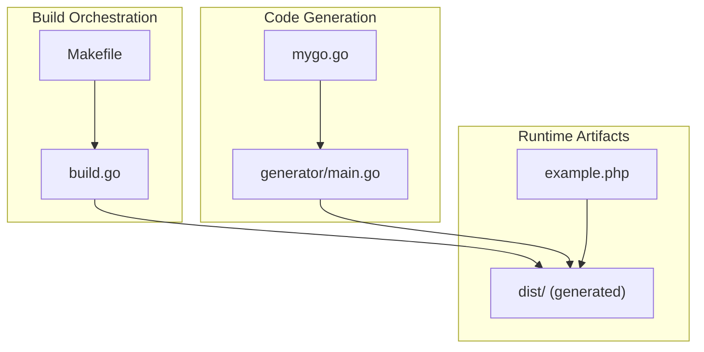
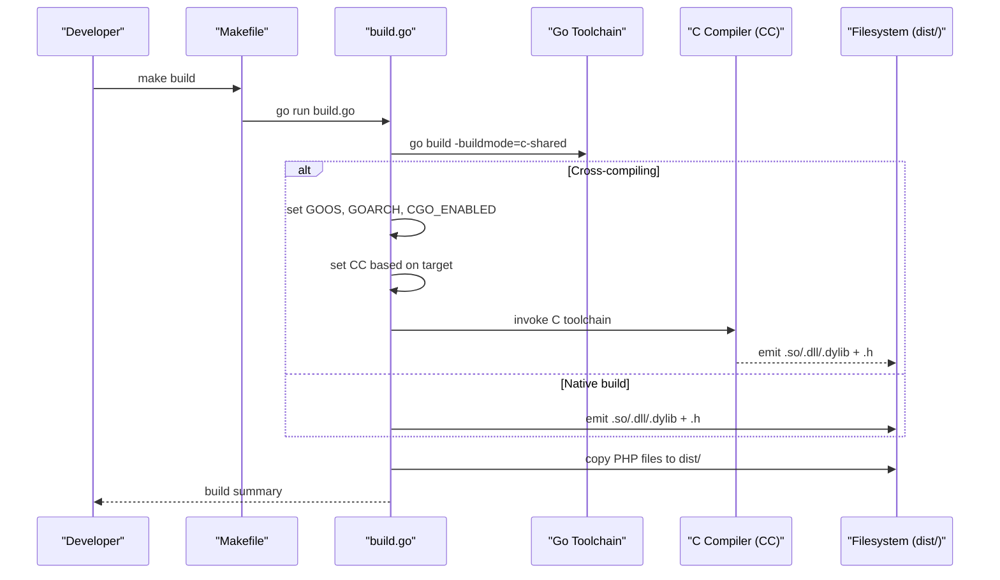
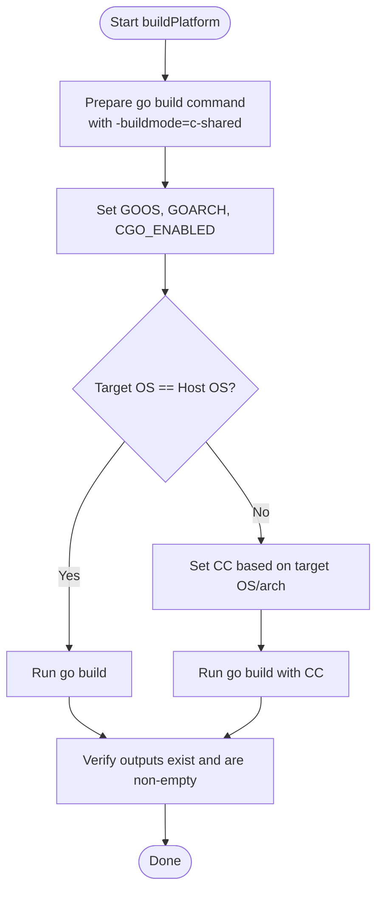
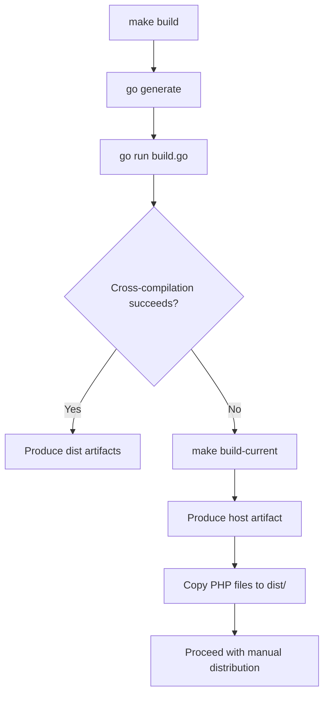
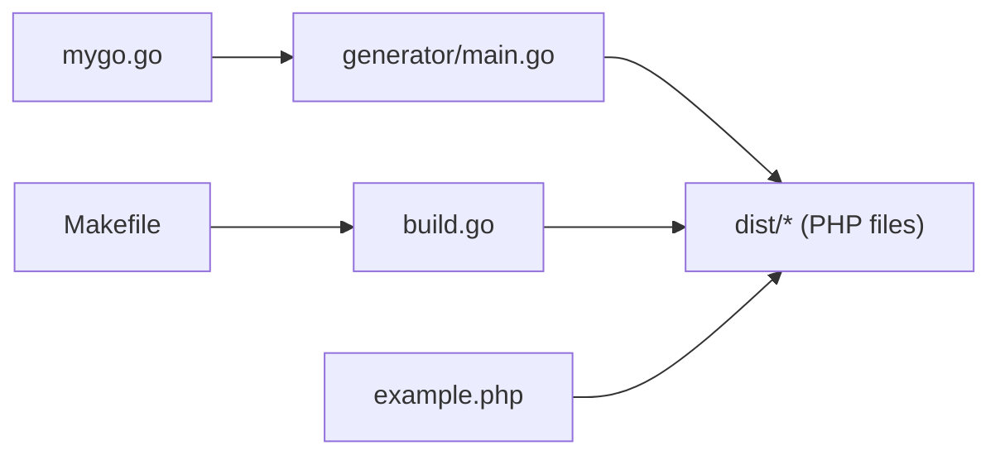

# Cross-Compilation Setup

<cite>
**Referenced Files in This Document**
- [build.go](file://build.go)
- [Makefile](file://Makefile)
- [README.md](file://README.md)
- [QUICKSTART.md](file://QUICKSTART.md)
- [generator/main.go](file://generator/main.go)
- [example.php](file://example.php)
- [mygo.go](file://mygo.go)
</cite>

## Table of Contents
1. [Introduction](#introduction)
2. [Project Structure](#project-structure)
3. [Core Components](#core-components)
4. [Architecture Overview](#architecture-overview)
5. [Detailed Component Analysis](#detailed-component-analysis)
6. [Dependency Analysis](#dependency-analysis)
7. [Performance Considerations](#performance-considerations)
8. [Troubleshooting Guide](#troubleshooting-guide)
9. [Conclusion](#conclusion)
10. [Appendices](#appendices)

## Introduction
This document explains how to set up and use a cross-compilation toolchain to produce shared libraries for multiple host-target platform combinations. It focuses on:
- The specific cross-compilers needed for each target (mingw-w64 for Windows, aarch64-linux-gnu-gcc for Linux ARM64)
- Installation instructions for various operating systems using package managers (apt, brew)
- How the build system automatically sets the CC environment variable in build.go based on target platform
- Troubleshooting steps for “cc command not found” errors during cross-compilation
- Fallback strategies using the build-current target

## Project Structure
The build system is organized around a small Go program that orchestrates cross-compilation, a generator that produces PHP FFI bindings, and a Makefile that provides convenient targets for local development.

**Diagram sources**
- [build.go](file://build.go#L1-L183)
- [Makefile](file://Makefile#L1-L54)
- [generator/main.go](file://generator/main.go#L1-L705)
- [mygo.go](file://mygo.go#L1-L39)
- [example.php](file://example.php#L1-L95)

**Section sources**
- [build.go](file://build.go#L1-L183)
- [Makefile](file://Makefile#L1-L54)
- [generator/main.go](file://generator/main.go#L1-L705)
- [mygo.go](file://mygo.go#L1-L39)
- [example.php](file://example.php#L1-L95)

## Core Components
- Cross-compilation orchestration: build.go defines supported platforms and sets environment variables (including CC) for cross-compilation.
- Code generation: generator/main.go parses exported functions from mygo.go and generates PHP files consumed by the runtime.
- Build scripts: Makefile provides targets to generate bindings, build for the current platform, build for all platforms, and run tests.

Key responsibilities:
- build.go: Builds shared libraries for all supported platforms, sets GOOS, GOARCH, CGO_ENABLED, and CC when cross-compiling.
- generator/main.go: Parses exported functions and generates platform_detect.php, ffi_bindings.php, and loader.php.
- Makefile: Wraps the Go build commands and provides convenience targets for developers.

**Section sources**
- [build.go](file://build.go#L1-L183)
- [generator/main.go](file://generator/main.go#L1-L705)
- [Makefile](file://Makefile#L1-L54)

## Architecture Overview
The cross-compilation pipeline integrates Go’s CGO-enabled build mode with platform-specific C compilers. The build orchestrator sets environment variables per target and validates outputs.

**Diagram sources**
- [Makefile](file://Makefile#L12-L16)
- [build.go](file://build.go#L107-L164)

## Detailed Component Analysis

### Cross-Compilation Orchestration in build.go
The build orchestrator:
- Defines supported platforms and computes output/header filenames.
- Sets GOOS, GOARCH, and CGO_ENABLED for cross-compilation.
- Automatically sets CC for Windows and Linux ARM64 targets.
- Validates that output files exist and are non-empty.

Platform-specific CC assignments:
- Linux ARM64: aarch64-linux-gnu-gcc
- Windows AMD64: x86_64-w64-mingw32-gcc
- Windows ARM64: aarch64-w64-mingw32-gcc

Environment variable handling:
- The orchestrator checks if the target OS differs from the host OS and sets CC accordingly.
- It also ensures CGO is enabled for cross-compilation builds.

Validation:
- After invoking the build command, the orchestrator verifies that the expected shared library and header files were produced and are not empty.

**Diagram sources**
- [build.go](file://build.go#L107-L164)

**Section sources**
- [build.go](file://build.go#L107-L164)

### Platform-Specific Handling and Environment Variables
The platform-specific handling occurs in build.go lines 123–136. The orchestrator:
- Detects cross-compilation by comparing target GOOS with runtime.GOOS.
- Sets CC for:
  - Linux ARM64: aarch64-linux-gnu-gcc
  - Windows AMD64: x86_64-w64-mingw32-gcc
  - Windows ARM64: aarch64-w64-mingw32-gcc
- Ensures CGO_ENABLED=1 for cross-compilation.

These environment variables are appended to the command environment before executing the build.

**Section sources**
- [build.go](file://build.go#L123-L136)

### Build Targets and Fallback Strategies
The Makefile provides:
- build: Generates bindings and runs the cross-compilation orchestrator.
- build-current: Builds for the current host platform only, using the host’s native compiler.
- test: Runs build-current and executes the example PHP script.

Fallback strategy:
- If cross-compilation fails due to missing toolchains, use build-current to build for the host platform and then manually copy the generated PHP files to dist/.

**Diagram sources**
- [Makefile](file://Makefile#L12-L31)

**Section sources**
- [Makefile](file://Makefile#L12-L31)

### Code Generation and Runtime Artifacts
The generator parses exported functions from mygo.go and creates:
- platform_detect.php: Platform detection logic
- ffi_bindings.php: FFI wrapper classes
- loader.php: Main loader that loads the correct library for the current platform

The example PHP script demonstrates how to load the library and call exported functions.

**Section sources**
- [generator/main.go](file://generator/main.go#L1-L705)
- [mygo.go](file://mygo.go#L1-L39)
- [example.php](file://example.php#L1-L95)

## Dependency Analysis
The build system composes several dependencies:
- build.go depends on the Go toolchain and the availability of C compilers for cross-targets.
- generator/main.go depends on mygo.go and writes PHP files consumed by the runtime.
- Makefile wraps build.go and provides a fallback build-current target.

**Diagram sources**
- [generator/main.go](file://generator/main.go#L1-L705)
- [build.go](file://build.go#L1-L183)
- [Makefile](file://Makefile#L1-L54)
- [example.php](file://example.php#L1-L95)

**Section sources**
- [generator/main.go](file://generator/main.go#L1-L705)
- [build.go](file://build.go#L1-L183)
- [Makefile](file://Makefile#L1-L54)
- [example.php](file://example.php#L1-L95)

## Performance Considerations
- Prefer build-current for iterative development on the host platform to reduce toolchain setup overhead.
- Use persistent PHP processes (e.g., PHP-FPM) to minimize repeated library loading costs.
- Keep the number of exported functions minimal to reduce binding generation complexity.

[No sources needed since this section provides general guidance]

## Troubleshooting Guide

Common cross-compilation issues and resolutions:
- “cc command not found”
  - Cause: The CC environment variable points to a compiler that is not installed or not on PATH.
  - Resolution:
    - Install the required cross-compiler for the target platform.
    - Ensure the compiler executable name matches the CC setting used by the orchestrator.
  - References:
    - Platform-specific CC assignments and environment variable handling:
      - [build.go](file://build.go#L123-L136)
    - Cross-compilation prerequisites and examples:
      - [README.md](file://README.md#L210-L236)

- Cross-compilation failures are common when toolchains are missing
  - Resolution: Install the appropriate cross-compiler or use build-current to build for the host platform.
  - References:
    - Failure messaging and guidance:
      - [build.go](file://build.go#L92-L100)
    - Makefile fallback target:
      - [Makefile](file://Makefile#L18-L31)

- “CGO_ENABLED=0 or not available”
  - Cause: CGO is disabled or the host lacks a C compiler.
  - Resolution: Enable CGO and install a C compiler for your platform.
  - References:
    - CGO requirement for cross-compilation:
      - [build.go](file://build.go#L115-L120)
    - Troubleshooting CGO-related issues:
      - [README.md](file://README.md#L267-L278)

- Windows DLL loading errors
  - Causes: Architecture mismatch, missing runtime dependencies, or antivirus interference.
  - Resolution: Match PHP and DLL architectures, install required runtime libraries, and adjust antivirus settings if necessary.
  - References:
    - Windows-specific troubleshooting:
      - [README.md](file://README.md#L279-L295)

- Library not found or unsupported platform
  - Resolution: Ensure bindings are generated, libraries are built for the correct platform, and the loader is invoked with the correct dist path.
  - References:
    - Platform detection and loader:
      - [generator/main.go](file://generator/main.go#L190-L339)
      - [generator/main.go](file://generator/main.go#L642-L705)
    - Example usage:
      - [example.php](file://example.php#L1-L95)

**Section sources**
- [build.go](file://build.go#L92-L100)
- [build.go](file://build.go#L115-L136)
- [README.md](file://README.md#L210-L236)
- [README.md](file://README.md#L267-L278)
- [README.md](file://README.md#L279-L295)
- [generator/main.go](file://generator/main.go#L190-L339)
- [generator/main.go](file://generator/main.go#L642-L705)
- [example.php](file://example.php#L1-L95)

## Conclusion
The build system automates cross-compilation by setting platform-specific environment variables and validating outputs. For missing toolchains, use the build-current target to build locally and then distribute the artifacts. Installing the correct cross-compilers and enabling CGO are essential for reliable cross-platform builds.

[No sources needed since this section summarizes without analyzing specific files]

## Appendices

### Cross-Compiler Installation Guides

- Windows (MinGW-w64)
  - Install the mingw-w64 package using your distribution’s package manager.
  - References:
    - [README.md](file://README.md#L210-L221)

- Linux ARM64 (aarch64-linux-gnu-gcc)
  - Install the cross-compiler toolchain for aarch64-linux-gnu.
  - References:
    - [build.go](file://build.go#L127-L129)

- macOS to Linux cross-compilation
  - Use musl-cross via Homebrew to enable Linux cross-compilation.
  - References:
    - [README.md](file://README.md#L229-L236)

- macOS to Windows cross-compilation
  - Requires osxcross; consult the referenced documentation.
  - References:
    - [README.md](file://README.md#L223-L226)

### Supported Platforms and Naming Convention
- The system supports Linux, macOS, and Windows for amd64 and arm64 architectures.
- Outputs follow the naming convention: mygo-{GOOS}-{GOARCH}.{ext}
- References:
  - [README.md](file://README.md#L14-L24)

### Build Commands and Targets
- Generate bindings:
  - [README.md](file://README.md#L70-L80)
- Build for current platform:
  - [README.md](file://README.md#L81-L94)
  - [Makefile](file://Makefile#L18-L31)
- Build for all platforms:
  - [README.md](file://README.md#L96-L109)
  - [Makefile](file://Makefile#L12-L16)
- Run example:
  - [QUICKSTART.md](file://QUICKSTART.md#L24-L55)
  - [Makefile](file://Makefile#L32-L36)

**Section sources**
- [README.md](file://README.md#L14-L24)
- [README.md](file://README.md#L70-L109)
- [README.md](file://README.md#L210-L236)
- [Makefile](file://Makefile#L12-L36)
- [QUICKSTART.md](file://QUICKSTART.md#L24-L55)