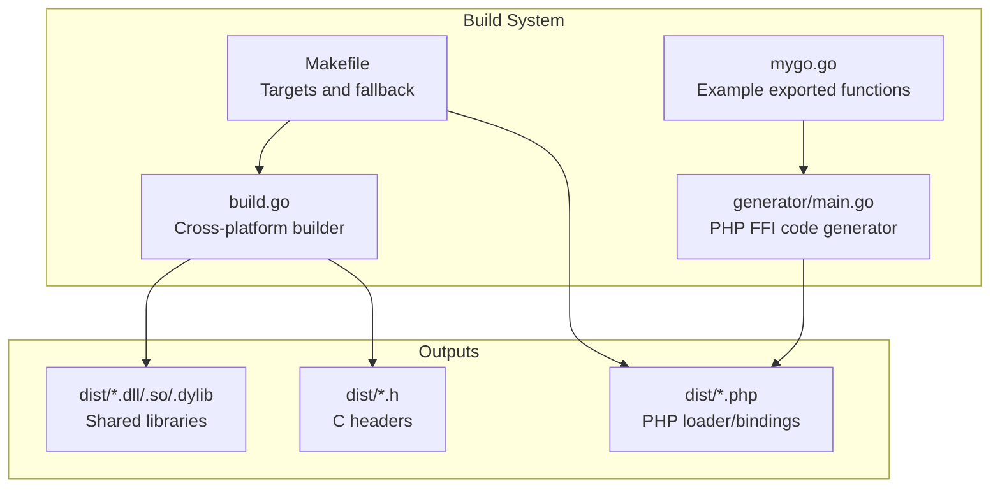
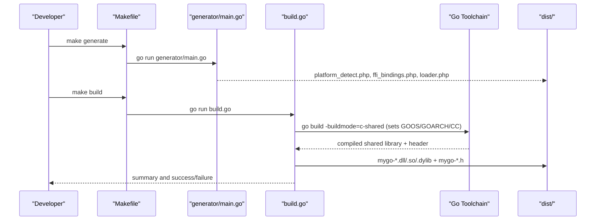
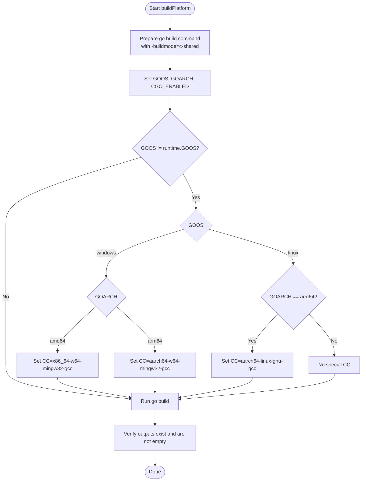
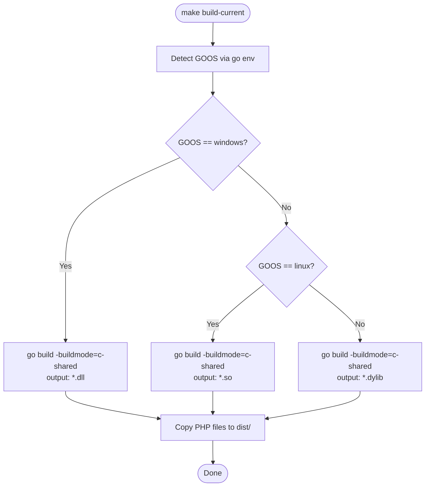
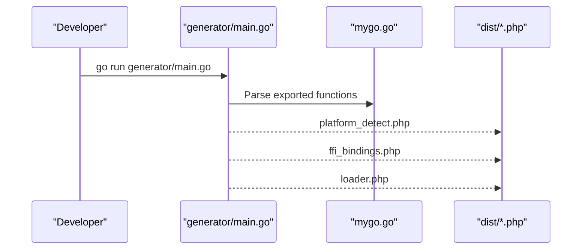
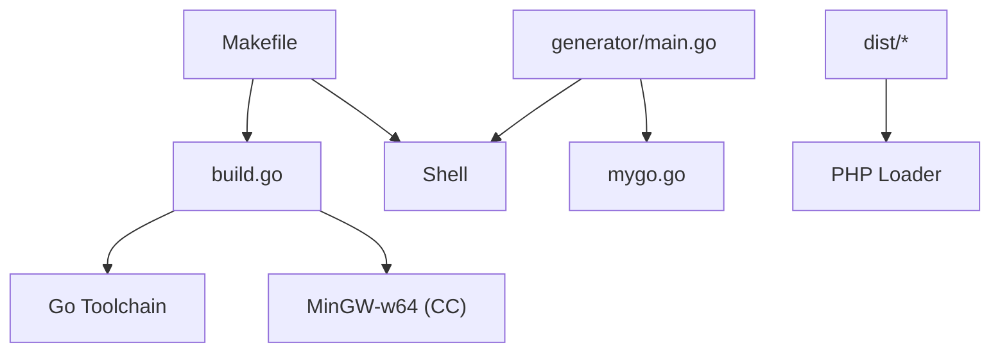

# Linux to Windows Cross-Compilation

<cite>
**Referenced Files in This Document**
- [build.go](file://build.go)
- [Makefile](file://Makefile)
- [README.md](file://README.md)
- [QUICKSTART.md](file://QUICKSTART.md)
- [generator/main.go](file://generator/main.go)
- [mygo.go](file://mygo.go)
</cite>

## Table of Contents
1. [Introduction](#introduction)
2. [Project Structure](#project-structure)
3. [Core Components](#core-components)
4. [Architecture Overview](#architecture-overview)
5. [Detailed Component Analysis](#detailed-component-analysis)
6. [Dependency Analysis](#dependency-analysis)
7. [Performance Considerations](#performance-considerations)
8. [Troubleshooting Guide](#troubleshooting-guide)
9. [Conclusion](#conclusion)
10. [Appendices](#appendices)

## Introduction
This document explains how to set up and execute cross-compilation from Linux to Windows using the MinGW-w64 toolchain. It covers installing the MinGW-w64 cross-compiler on major Linux distributions, how the build orchestrator automatically sets the C compiler for Windows targets, Makefile integration, manual build commands, and troubleshooting common issues such as missing compilers and architecture-specific linker errors. References to specific implementation details are provided via file paths and line ranges.

## Project Structure
The build system consists of:
- A Go-based build orchestrator that compiles shared libraries for multiple platforms and sets the correct C compiler for cross-compilation.
- A Makefile that integrates with the orchestrator and provides a fallback strategy for building only the current platform.
- A code generator that produces PHP FFI binding files from exported Go functions.
- Example Go code with exported functions for demonstration.

**Diagram sources**
- [build.go](file://build.go#L108-L164)
- [Makefile](file://Makefile#L1-L54)
- [generator/main.go](file://generator/main.go#L27-L75)
- [mygo.go](file://mygo.go#L1-L39)

**Section sources**
- [build.go](file://build.go#L108-L164)
- [Makefile](file://Makefile#L1-L54)
- [generator/main.go](file://generator/main.go#L27-L75)
- [mygo.go](file://mygo.go#L1-L39)

## Core Components
- Cross-compilation orchestrator: Sets GOOS, GOARCH, CGO_ENABLED, and the C compiler (CC) for Windows targets. It also validates output files and sizes.
- Makefile: Provides targets to generate bindings, build for all platforms (delegates to the orchestrator), build for the current platform only, and run the PHP example.
- Code generator: Parses exported functions from the Go source and generates PHP files for platform detection, FFI bindings, and loader.
- Example Go code: Demonstrates exported functions with the //export directive.

Key responsibilities:
- build.go: Orchestrates builds, sets CC for Windows amd64 and ARM64, and verifies outputs.
- Makefile: Offers a convenient workflow and a fallback to build for the current platform.
- generator/main.go: Produces PHP files consumed by the loader.
- mygo.go: Supplies exported functions for the shared library.

**Section sources**
- [build.go](file://build.go#L108-L164)
- [Makefile](file://Makefile#L1-L54)
- [generator/main.go](file://generator/main.go#L27-L75)
- [mygo.go](file://mygo.go#L1-L39)

## Architecture Overview
The build pipeline integrates code generation and cross-compilation:

**Diagram sources**
- [Makefile](file://Makefile#L7-L16)
- [generator/main.go](file://generator/main.go#L27-L75)
- [build.go](file://build.go#L108-L164)

## Detailed Component Analysis

### Cross-Compilation Orchestrator (build.go)
- Purpose: Builds shared libraries for all supported platforms and sets the correct C compiler for Windows targets.
- Conditional CC assignment:
  - Windows amd64: sets CC to the MinGW-w64 64-bit compiler.
  - Windows ARM64: sets CC to the MinGW-w64 ARM64 compiler.
- Environment variables:
  - GOOS and GOARCH are set per platform.
  - CGO_ENABLED is set to enable C compilation.
- Output verification:
  - Ensures the shared library and header files exist and are not empty.

**Diagram sources**
- [build.go](file://build.go#L108-L164)

**Section sources**
- [build.go](file://build.go#L108-L164)

### Makefile Integration
- Targets:
  - generate: Runs the code generator to produce PHP files.
  - build: Delegates to the Go orchestrator to build for all platforms.
  - build-current: Builds only for the current platform, acting as a fallback when cross-compilers are unavailable.
  - test: Builds current platform and runs the PHP example.
  - clean: Removes build artifacts.
- Fallback strategy:
  - The build-current target uses shell conditionals to select the appropriate output name and command for Windows, Linux, or macOS.

**Diagram sources**
- [Makefile](file://Makefile#L18-L30)

**Section sources**
- [Makefile](file://Makefile#L1-L54)

### Code Generation (generator/main.go)
- Parses exported functions from the Go source file.
- Generates:
  - platform_detect.php: Platform detection and path resolution.
  - ffi_bindings.php: PHP wrapper methods mirroring exported functions.
  - loader.php: Entry point to load the library and expose platform info.

**Diagram sources**
- [generator/main.go](file://generator/main.go#L27-L75)
- [mygo.go](file://mygo.go#L1-L39)

**Section sources**
- [generator/main.go](file://generator/main.go#L27-L75)
- [mygo.go](file://mygo.go#L1-L39)

### Manual Go Build Commands
- Linux to Windows cross-compilation requires MinGW-w64 and setting the C compiler explicitly.
- The orchestrator sets CC for Windows amd64 and ARM64 automatically during cross-compilation.
- Manual commands can be constructed using environment variables for GOOS, GOARCH, CGO_ENABLED, and CC.

References:
- Cross-compilation prerequisites and manual command examples are documented in the project’s README.
- The Makefile’s build-current target demonstrates platform-specific build commands for the current host.

**Section sources**
- [README.md](file://README.md#L210-L221)
- [Makefile](file://Makefile#L18-L30)

## Dependency Analysis
- build.go depends on:
  - The Go toolchain for compilation.
  - The presence of appropriate cross-compilers (MinGW-w64 for Windows).
- Makefile depends on:
  - The orchestrator for multi-platform builds.
  - Shell conditionals to adapt to the current platform.
- generator/main.go depends on:
  - The exported function declarations in mygo.go.
  - File system for writing generated PHP files.

**Diagram sources**
- [build.go](file://build.go#L108-L164)
- [Makefile](file://Makefile#L1-L54)
- [generator/main.go](file://generator/main.go#L27-L75)
- [mygo.go](file://mygo.go#L1-L39)

**Section sources**
- [build.go](file://build.go#L108-L164)
- [Makefile](file://Makefile#L1-L54)
- [generator/main.go](file://generator/main.go#L27-L75)
- [mygo.go](file://mygo.go#L1-L39)

## Performance Considerations
- Building for multiple platforms increases total build time. Use the current-platform build for quick iterations.
- The orchestrator validates outputs to avoid distributing broken artifacts.
- When distributing binaries, ensure the correct architecture and runtime dependencies are met.

[No sources needed since this section provides general guidance]

## Troubleshooting Guide

Common issues and resolutions:
- “cc: command not found”:
  - Cause: The C compiler (CC) is not installed or not in PATH.
  - Resolution: Install MinGW-w64 for Windows targets. The orchestrator sets CC appropriately for Windows amd64 and ARM64 during cross-compilation.
- Architecture mismatch:
  - Cause: Building a 64-bit DLL while running 32-bit PHP, or vice versa.
  - Resolution: Match the architecture of the PHP runtime to the built library.
- Missing dependencies on Windows:
  - Cause: The DLL requires Microsoft Visual C++ runtime libraries.
  - Resolution: Install the appropriate Visual C++ Redistributable packages.
- Unsupported platform:
  - Cause: Attempting to load a library for an unsupported OS/arch combination.
  - Resolution: Build the library for the target platform or update platform support logic.

Installation commands for MinGW-w64 on major Linux distributions:
- Debian/Ubuntu:
  - sudo apt-get install mingw-w64
- CentOS/RHEL/Fedora:
  - sudo yum install mingw64-gcc mingw32-gcc
- Arch Linux:
  - sudo pacman -S mingw-w64-gcc

Notes:
- The orchestrator sets CC for Windows amd64 and ARM64 automatically during cross-compilation.
- The Makefile’s build-current target serves as a fallback when cross-compilers are unavailable.

**Section sources**
- [build.go](file://build.go#L123-L135)
- [Makefile](file://Makefile#L18-L30)
- [README.md](file://README.md#L238-L295)

## Conclusion
This build system automates cross-compilation to Windows using MinGW-w64 and integrates seamlessly with Make and a code generator. The orchestrator sets the correct C compiler for Windows targets, while the Makefile provides a convenient workflow and a reliable fallback to build for the current platform. By following the installation steps and using the documented commands, you can reliably produce Windows binaries from Linux.

[No sources needed since this section summarizes without analyzing specific files]

## Appendices

### Appendix A: Cross-Compilation Setup Summary
- Install MinGW-w64 for Windows targets.
- Use the orchestrator for multi-platform builds or the Makefile’s build-current target for the current platform.
- Ensure CGO is enabled and the correct CC is set for Windows targets.

**Section sources**
- [README.md](file://README.md#L210-L221)
- [build.go](file://build.go#L123-L135)
- [Makefile](file://Makefile#L18-L30)