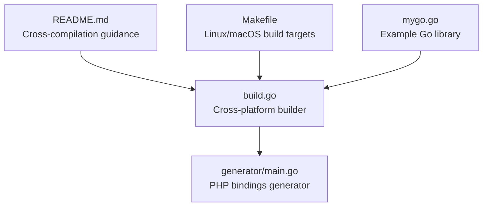
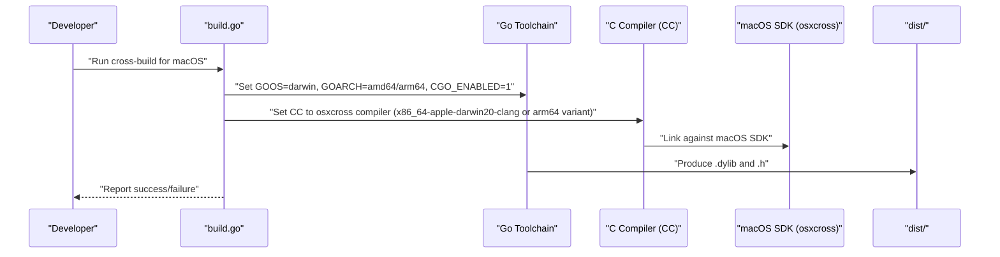
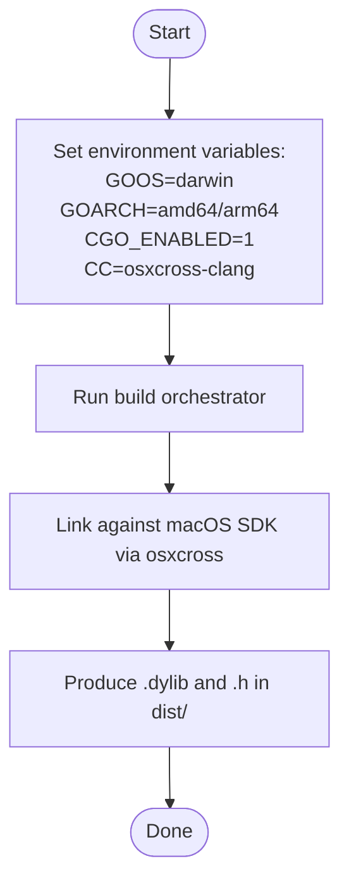
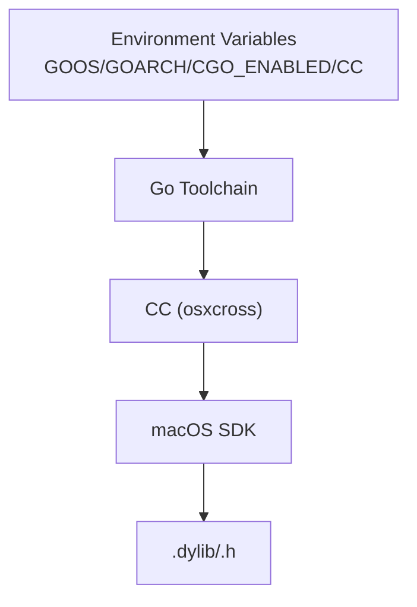

# Linux to macOS Cross-Compilation

<cite>
**Referenced Files in This Document**
- [README.md](file://README.md)
- [build.go](file://build.go)
- [Makefile](file://Makefile)
- [generator/main.go](file://generator/main.go)
</cite>

## Table of Contents
1. [Introduction](#introduction)
2. [Project Structure](#project-structure)
3. [Core Components](#core-components)
4. [Architecture Overview](#architecture-overview)
5. [Detailed Component Analysis](#detailed-component-analysis)
6. [Dependency Analysis](#dependency-analysis)
7. [Performance Considerations](#performance-considerations)
8. [Troubleshooting Guide](#troubleshooting-guide)
9. [Conclusion](#conclusion)
10. [Appendices](#appendices)

## Introduction
This document explains how to cross-compile Go shared libraries for macOS from Linux. It covers why osxcross is necessary, how to set up the toolchain using Docker or native installation, and how to address the current limitation in the build orchestration script that does not automatically configure the macOS cross-compiler. It also highlights security considerations for obtaining macOS SDKs and clarifies architecture compatibility (x86_64 vs arm64).

## Project Structure
The repository provides:
- A cross-platform build orchestrator written in Go that compiles shared libraries for multiple platforms.
- A Makefile for convenient Linux/macOS builds.
- A code generator that produces PHP FFI bindings and loaders.
- Clear documentation in the README about cross-compilation scenarios and prerequisites.

**Diagram sources**
- [README.md](file://README.md#L210-L230)
- [build.go](file://build.go#L1-L183)
- [generator/main.go](file://generator/main.go#L1-L705)
- [Makefile](file://Makefile#L1-L54)

**Section sources**
- [README.md](file://README.md#L1-L120)
- [Makefile](file://Makefile#L1-L54)

## Core Components
- Cross-platform builder: Orchestrates building shared libraries for all supported platforms and copies generated PHP files into the distribution directory.
- Platform-specific compiler selection: Sets environment variables for cross-compilation, including GOOS, GOARCH, CGO_ENABLED, and CC for certain targets.
- Makefile targets: Provide quick ways to build for the current platform or all platforms.

Key facts for macOS cross-compilation:
- The README explicitly states that cross-compiling to macOS from Linux is complex and requires osxcross.
- The build orchestrator sets CC for Windows targets but does not set CC for macOS targets.

**Section sources**
- [README.md](file://README.md#L210-L230)
- [build.go](file://build.go#L107-L164)
- [Makefile](file://Makefile#L12-L31)

## Architecture Overview
The cross-compilation pipeline integrates the Go toolchain with external cross-compilers. For Linux-to-macOS builds, the osxcross toolchain supplies the macOS SDK and clang toolchain so that the Go toolchain can produce macOS binaries.

**Diagram sources**
- [build.go](file://build.go#L107-L164)
- [README.md](file://README.md#L223-L226)

## Detailed Component Analysis

### Why osxcross is required for Linux → macOS cross-compilation
- The README explicitly notes that cross-compiling to macOS from Linux is complex and requires osxcross.
- osxcross provides a macOS SDK and a clang toolchain that can be invoked via CC, enabling the Go toolchain to produce macOS binaries.

Practical implications:
- Without osxcross, the Go toolchain cannot link against the macOS SDK and will fail during the build phase.
- The build orchestrator does not set CC for macOS targets, so manual CC configuration is required.

**Section sources**
- [README.md](file://README.md#L223-L226)
- [build.go](file://build.go#L107-L164)

### Limitation in build.go: No automatic CC configuration for macOS
- The build orchestrator sets CC for Windows targets and for Linux arm64, but it does not set CC for macOS targets.
- As a result, attempting to build macOS targets via the orchestrator will likely fail because the Go toolchain cannot locate the macOS linker and SDK.

Recommended workaround:
- Manually set the CC environment variable to point to the osxcross compiler before invoking the orchestrator.

**Section sources**
- [build.go](file://build.go#L107-L164)

### Step-by-step installation using Docker
- Use a container image that includes osxcross and the necessary macOS SDK.
- Configure CC to point to the osxcross compiler inside the container.
- Run the build orchestrator inside the container to produce macOS binaries.

Security considerations:
- Download osxcross and the macOS SDK from trusted sources.
- Verify checksums or signatures when available.
- Prefer official releases and official mirrors.

**Section sources**
- [README.md](file://README.md#L223-L226)

### Step-by-step installation using native Linux
- Install osxcross on your host Linux system.
- Ensure the macOS SDK is extracted and configured.
- Configure CC to point to the osxcross compiler (e.g., x86_64-apple-darwin20-clang).
- Run the build orchestrator.

Security considerations:
- Validate the integrity of downloaded SDK archives.
- Keep the SDK and toolchain updated.
- Restrict write permissions on SDK directories to reduce risk.

**Section sources**
- [README.md](file://README.md#L223-L226)

### Manual CC configuration for macOS targets
- Set CC to the osxcross compiler path before running the build orchestrator.
- For x86_64 macOS: use the x86_64-apple-darwin20-clang variant.
- For arm64 macOS: use the arm64-apple-darwin20-clang variant.
- Ensure CGO_ENABLED=1 and GOOS=darwin, GOARCH=amd64/arm64 are set.

**Diagram sources**
- [build.go](file://build.go#L107-L164)
- [README.md](file://README.md#L223-L226)

**Section sources**
- [build.go](file://build.go#L107-L164)

### Architecture compatibility: x86_64 vs arm64
- The project supports both x86_64 and arm64 for macOS targets.
- Ensure the osxcross toolchain matches the target architecture (x86_64 or arm64).
- The build orchestrator enumerates both darwin/amd64 and darwin/arm64 targets.

**Section sources**
- [README.md](file://README.md#L16-L24)
- [build.go](file://build.go#L19-L29)

### How the build orchestrator currently handles macOS targets
- The orchestrator sets GOOS=darwin and GOARCH=amd64/arm64.
- It does not set CC for macOS targets, relying on the environment to provide a suitable compiler.
- If CC is not set to an osxcross compiler, the build will fail.

**Section sources**
- [build.go](file://build.go#L107-L164)

### Makefile usage for macOS builds
- The Makefile builds for the current platform only and does not invoke the cross-platform orchestrator.
- For macOS builds on Linux, you still need to manually set CC to the osxcross compiler before running make.

**Section sources**
- [Makefile](file://Makefile#L18-L31)

## Dependency Analysis
The cross-compilation chain depends on:
- Go toolchain with CGO enabled.
- osxcross providing the macOS SDK and clang toolchain.
- Correct CC pointing to the osxcross compiler.
- Proper environment variables (GOOS, GOARCH, CGO_ENABLED).

**Diagram sources**
- [build.go](file://build.go#L107-L164)
- [README.md](file://README.md#L223-L226)

**Section sources**
- [build.go](file://build.go#L107-L164)
- [README.md](file://README.md#L223-L226)

## Performance Considerations
- Cross-compilation adds overhead due to linking against the macOS SDK and invoking external compilers.
- Use Docker to isolate toolchain dependencies and improve reproducibility.
- Cache osxcross and SDK downloads to speed up repeated builds.

## Troubleshooting Guide
Common issues and resolutions:
- Cross-compilation fails with missing toolchain:
  - Ensure osxcross is installed and CC points to the osxcross compiler.
  - Confirm GOOS=darwin, GOARCH=amd64/arm64, and CGO_ENABLED=1 are set.
- macOS SDK integrity:
  - Verify SDK downloads and keep them updated.
- Architecture mismatch:
  - Match CC to the target architecture (x86_64 vs arm64).
- Build orchestrator reports failures:
  - The orchestrator already notes that cross-compilation failures are often due to missing toolchains.

**Section sources**
- [build.go](file://build.go#L87-L105)
- [README.md](file://README.md#L223-L226)

## Conclusion
Cross-compiling Go shared libraries to macOS from Linux requires osxcross to supply the macOS SDK and clang toolchain. The current build orchestrator does not automatically configure CC for macOS targets, so you must manually set CC to the osxcross compiler before building. Follow the documented steps for Docker or native installation, adhere to security best practices for SDK acquisition, and ensure architecture alignment (x86_64 vs arm64).

## Appendices

### Appendix A: Where to find cross-compilation guidance
- The README includes a dedicated section covering Linux → macOS cross-compilation and links to osxcross documentation.

**Section sources**
- [README.md](file://README.md#L223-L226)

### Appendix B: Platform enumeration and naming conventions
- The build orchestrator enumerates darwin/amd64 and darwin/arm64 targets and uses the standard naming convention for macOS shared libraries (.dylib).

**Section sources**
- [build.go](file://build.go#L19-L29)
- [README.md](file://README.md#L16-L24)