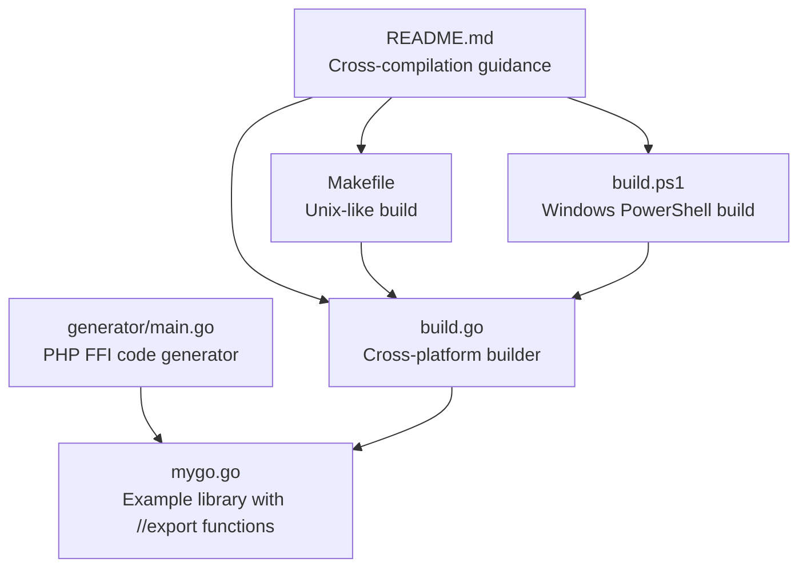
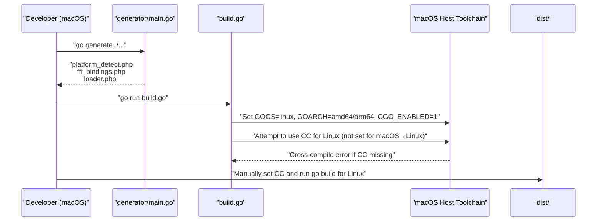
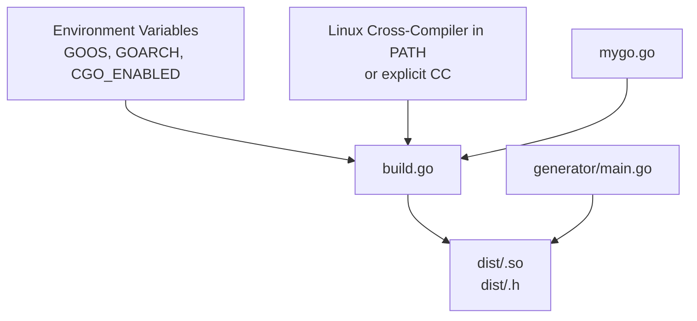

# macOS to Linux Cross-Compilation

<cite>
**Referenced Files in This Document**
- [README.md](file://README.md)
- [build.go](file://build.go)
- [build.ps1](file://build.ps1)
- [Makefile](file://Makefile)
- [generator/main.go](file://generator/main.go)
- [mygo.go](file://mygo.go)
</cite>

## Table of Contents
1. [Introduction](#introduction)
2. [Project Structure](#project-structure)
3. [Core Components](#core-components)
4. [Architecture Overview](#architecture-overview)
5. [Detailed Component Analysis](#detailed-component-analysis)
6. [Dependency Analysis](#dependency-analysis)
7. [Performance Considerations](#performance-considerations)
8. [Troubleshooting Guide](#troubleshooting-guide)
9. [Conclusion](#conclusion)
10. [Appendices](#appendices)

## Introduction
This document provides comprehensive setup instructions for cross-compiling a Go shared library from macOS to Linux targets. It focuses on installing the musl-based cross-compiler via Homebrew, configuring the build environment, and using the provided build scripts. It also explains how the build orchestrator handles GOOS and GOARCH correctly but depends on the host having the appropriate cross-compiler available in PATH, and clarifies that there is no automatic CC setting for Linux targets from macOS in the build orchestrator.

## Project Structure
The repository includes:
- A Go orchestrator that builds shared libraries for multiple platforms
- A code generator that produces PHP FFI binding files
- A minimal example library with exported functions
- Supporting scripts for macOS/Linux and Windows

**Diagram sources**
- [README.md](file://README.md#L227-L237)
- [build.go](file://build.go#L107-L164)
- [build.ps1](file://build.ps1#L32-L44)
- [Makefile](file://Makefile#L12-L16)
- [generator/main.go](file://generator/main.go#L27-L75)
- [mygo.go](file://mygo.go#L11-L12)

**Section sources**
- [README.md](file://README.md#L227-L237)
- [build.go](file://build.go#L107-L164)
- [build.ps1](file://build.ps1#L32-L44)
- [Makefile](file://Makefile#L12-L16)
- [generator/main.go](file://generator/main.go#L27-L75)
- [mygo.go](file://mygo.go#L11-L12)

## Core Components
- Cross-platform builder: Orchestrates building shared libraries for all supported platforms, sets GOOS/GOARCH/CFLAGS, and copies generated PHP files to the distribution directory.
- Code generator: Parses exported functions from the Go library and generates PHP files for platform detection, FFI bindings, and loader.
- Example library: Contains exported functions annotated with //export directives suitable for CGO shared library builds.
- macOS build scripts: Provide convenience targets for generating bindings and building for the current platform.

Key cross-compilation note:
- The builder sets GOOS and GOARCH correctly and enables CGO. For cross-compilation to Linux, it sets CC for Windows targets but does not set CC for Linux targets when building from macOS. Therefore, the host must have the appropriate Linux cross-compiler in PATH.

**Section sources**
- [build.go](file://build.go#L107-L164)
- [generator/main.go](file://generator/main.go#L27-L75)
- [mygo.go](file://mygo.go#L11-L12)
- [README.md](file://README.md#L227-L237)

## Architecture Overview
The cross-compilation pipeline integrates the code generator and the cross-platform builder. On macOS, you can either:
- Use the cross-platform builder to build for Linux targets (requires a Linux cross-compiler in PATH)
- Use the macOS build scripts to build for the current platform only

**Diagram sources**
- [README.md](file://README.md#L227-L237)
- [build.go](file://build.go#L107-L164)
- [generator/main.go](file://generator/main.go#L27-L75)

## Detailed Component Analysis

### Cross-Compilation from macOS to Linux
- Install musl-based cross-compiler via Homebrew as documented in the repository’s macOS → Linux section.
- The orchestrator sets GOOS=linux and GOARCH appropriately and enables CGO. However, it does not set CC for Linux targets when building from macOS. As a result, the build fails if the host lacks a Linux cross-compiler in PATH.
- Manual build commands are provided in the repository documentation. These commands demonstrate how to set CC explicitly for Linux targets.

Practical steps:
- Install musl-cross via Homebrew.
- Build for Linux using the documented manual command pattern, which sets CC to the appropriate Linux cross-compiler.
- Alternatively, use the cross-platform builder and ensure the required CC is available in PATH.

Compatibility considerations:
- Static vs shared linking: The repository uses CGO-enabled builds with a C compiler. Static linking is not configured here; dynamic linking is implied by the shared library build mode.
- Distribution compatibility: The resulting shared libraries are named according to the standardized naming convention and include a header file for FFI consumption.

**Section sources**
- [README.md](file://README.md#L227-L237)
- [build.go](file://build.go#L107-L164)

### Build Orchestrator Behavior
The orchestrator:
- Defines supported platforms and computes output/header filenames.
- Creates the distribution directory and copies generated PHP files.
- Builds each platform by invoking the Go toolchain with GOOS/GOARCH/CFLAGS set.
- Sets CC for Windows targets but does not set CC for Linux targets when the host is macOS.

Implications:
- When building Linux targets from macOS, you must ensure a Linux cross-compiler is available in PATH or supply CC explicitly in your manual build command.

**Section sources**
- [build.go](file://build.go#L19-L29)
- [build.go](file://build.go#L107-L164)

### Code Generator and Example Library
- The generator parses exported functions from the example library and generates PHP files for platform detection, FFI bindings, and loader.
- The example library includes //export directives suitable for CGO shared library builds.

These components are essential for end-to-end FFI integration and are produced during the generation phase.

**Section sources**
- [generator/main.go](file://generator/main.go#L27-L75)
- [mygo.go](file://mygo.go#L11-L12)

### macOS Build Scripts
- The Makefile provides convenience targets for generating bindings and building for the current platform only.
- The Windows PowerShell script provides equivalent functionality for Windows environments.

These scripts are useful for quick local builds but do not replace the cross-platform orchestrator for multi-target builds.

**Section sources**
- [Makefile](file://Makefile#L12-L31)
- [build.ps1](file://build.ps1#L32-L44)

## Dependency Analysis
The cross-compilation workflow depends on:
- Correct environment variables (GOOS, GOARCH, CGO_ENABLED)
- Availability of a compatible C cross-compiler in PATH for Linux targets
- Properly generated PHP files for FFI consumption

**Diagram sources**
- [build.go](file://build.go#L107-L164)
- [generator/main.go](file://generator/main.go#L27-L75)
- [mygo.go](file://mygo.go#L11-L12)

**Section sources**
- [build.go](file://build.go#L107-L164)
- [generator/main.go](file://generator/main.go#L27-L75)
- [mygo.go](file://mygo.go#L11-L12)

## Performance Considerations
- Building for multiple platforms increases total build time. Use the current-platform build for iterative development and reserve the cross-platform build for release preparation.
- Ensure the cross-compiler is up-to-date to avoid unnecessary recompiles due to toolchain mismatches.

[No sources needed since this section provides general guidance]

## Troubleshooting Guide
Common issues and resolutions:
- Missing cross-compiler on macOS when targeting Linux:
  - Install musl-cross via Homebrew as documented in the repository.
  - Ensure the cross-compiler is available in PATH or set CC explicitly in your manual build command.
- CGO disabled:
  - The orchestrator sets CGO_ENABLED=1. If your environment disables CGO, enable it before building.
- Empty or missing output files:
  - The orchestrator validates that output and header files exist and are not empty. Investigate toolchain errors if validation fails.
- Platform detection and loader:
  - The generator produces platform detection and loader PHP files. Confirm these files are copied to the distribution directory.

**Section sources**
- [README.md](file://README.md#L227-L237)
- [build.go](file://build.go#L145-L164)
- [generator/main.go](file://generator/main.go#L55-L75)

## Conclusion
Cross-compiling from macOS to Linux targets is straightforward when the correct Linux cross-compiler is available. The repository’s orchestrator correctly sets GOOS/GOARCH and CGO flags but does not automatically configure CC for Linux targets from macOS. Follow the documented manual build command pattern to supply CC explicitly, and rely on the generator and orchestrator to produce the necessary PHP files and shared libraries.

[No sources needed since this section summarizes without analyzing specific files]

## Appendices

### Appendix A: macOS → Linux Setup Steps
- Install musl-cross via Homebrew as documented in the repository.
- Use the manual build command pattern shown in the repository to set CC for Linux targets.
- Optionally, use the cross-platform orchestrator after ensuring the required CC is available in PATH.

**Section sources**
- [README.md](file://README.md#L227-L237)

### Appendix B: Orchestrator Environment Variable Handling
- The orchestrator sets GOOS, GOARCH, and CGO_ENABLED for all targets.
- For Windows targets, it sets CC to the appropriate MinGW cross-compiler.
- For Linux targets on macOS hosts, CC is not set by the orchestrator; supply CC manually or ensure it is available in PATH.

**Section sources**
- [build.go](file://build.go#L107-L164)