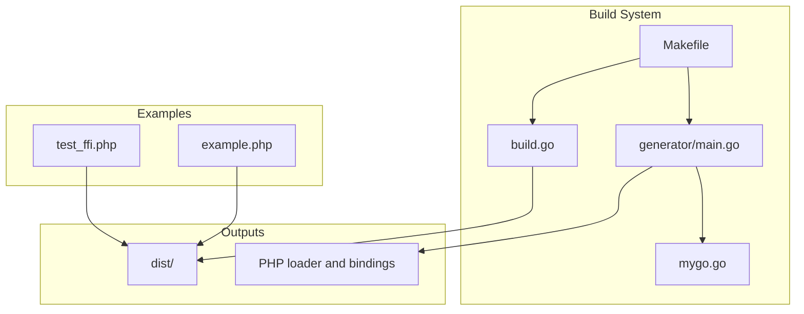
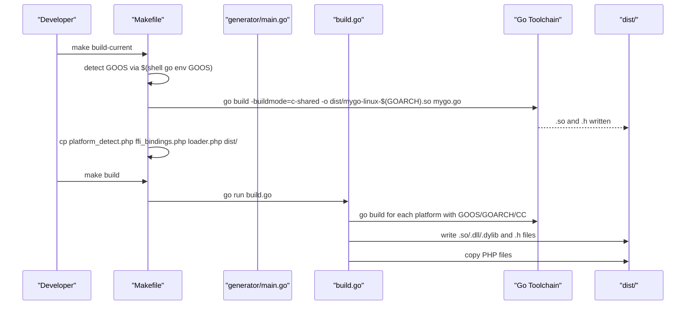
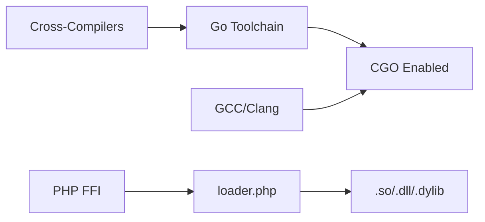

# Linux Platform Errors

<cite>
**Referenced Files in This Document**
- [Makefile](file://Makefile)
- [README.md](file://README.md)
- [QUICKSTART.md](file://QUICKSTART.md)
- [build.go](file://build.go)
- [generator/main.go](file://generator/main.go)
- [mygo.go](file://mygo.go)
- [example.php](file://example.php)
- [go.mod](file://go.mod)
- [test_ffi.php](file://test_ffi.php)
</cite>

## Table of Contents
1. [Introduction](#introduction)
2. [Project Structure](#project-structure)
3. [Core Components](#core-components)
4. [Architecture Overview](#architecture-overview)
5. [Detailed Component Analysis](#detailed-component-analysis)
6. [Dependency Analysis](#dependency-analysis)
7. [Performance Considerations](#performance-considerations)
8. [Troubleshooting Guide](#troubleshooting-guide)
9. [Conclusion](#conclusion)
10. [Appendices](#appendices)

## Introduction
This document focuses on diagnosing and resolving Linux-specific build failures in a cross-platform Go shared library build system targeting PHP FFI. It covers missing GCC compilers, CGO-enabled environment issues, missing cross-compilation toolchains (notably aarch64-linux-gnu-gcc), linker errors such as cannot find -lgo, permission problems writing to the dist/ directory, and shell-specific environment variable handling differences between bash and other shells. It also explains how the Makefile performs platform detection via $(shell go env GOOS) and provides practical examples from the Makefile and build orchestrator to ensure successful builds.

## Project Structure
The repository organizes build logic across a Makefile, a Go-based cross-platform builder, a code generator for PHP FFI bindings, and example/test assets. The Makefile drives platform detection and build targets, while build.go orchestrates cross-compilation and file copying. The generator parses exported functions from mygo.go to produce PHP loader and binding files.

**Diagram sources**
- [Makefile](file://Makefile#L1-L54)
- [build.go](file://build.go#L1-L183)
- [generator/main.go](file://generator/main.go#L1-L705)
- [mygo.go](file://mygo.go#L1-L39)
- [example.php](file://example.php#L1-L95)
- [test_ffi.php](file://test_ffi.php#L1-L31)

**Section sources**
- [Makefile](file://Makefile#L1-L54)
- [README.md](file://README.md#L1-L120)
- [QUICKSTART.md](file://QUICKSTART.md#L1-L60)

## Core Components
- Makefile: Defines targets for generate, build, build-current, test, clean, and help. Uses $(shell go env GOOS) to conditionally build per platform and copies PHP files to dist/.
- build.go: Cross-platform builder that sets GOOS, GOARCH, and CGO_ENABLED=1, configures CC for cross-compilation, and verifies output/header files.
- generator/main.go: Parses exported functions from mygo.go and generates platform_detect.php, ffi_bindings.php, and loader.php.
- mygo.go: Contains exported functions with //export directives and a minimal main() for shared library builds.
- example.php: Demonstrates loading and using the generated library via FFI.
- go.mod: Declares module and Go version.

Key Linux build targets and behaviors:
- build-current uses $(shell go env GOOS) to detect Linux and outputs a .so file to dist/.
- build orchestrates cross-compilation for all platforms and copies PHP files to dist/.

**Section sources**
- [Makefile](file://Makefile#L12-L31)
- [build.go](file://build.go#L107-L164)
- [generator/main.go](file://generator/main.go#L27-L75)
- [mygo.go](file://mygo.go#L11-L12)

## Architecture Overview
The build pipeline integrates shell scripting, Go tooling, and code generation to produce platform-specific shared libraries and PHP binding files.

**Diagram sources**
- [Makefile](file://Makefile#L18-L31)
- [build.go](file://build.go#L107-L164)
- [generator/main.go](file://generator/main.go#L55-L75)

## Detailed Component Analysis

### Makefile: Platform Detection and Build Targets
- Purpose: Centralized orchestration for generate, build, build-current, test, clean, and help.
- Platform detection: Uses $(shell go env GOOS) to branch for Windows, Linux, and macOS during build-current.
- Output naming: Generates mygo-{os}-{arch}.{ext} and copies PHP files to dist/.
- Shell environment: Relies on POSIX shell semantics; environment variables set locally in the same shell invocation.

Common Linux issues:
- Missing GCC: The build fails if a C compiler is unavailable because CGO is required for -buildmode=c-shared.
- CGO_ENABLED not set: Without CGO_ENABLED=1, the build fails even if a compiler is present.
- dist/ permissions: Writing to dist/ requires write permissions; failing to create or write files leads to missing outputs.

**Section sources**
- [Makefile](file://Makefile#L18-L31)
- [README.md](file://README.md#L267-L278)

### build.go: Cross-Compilation Orchestration
- Sets GOOS, GOARCH, and CGO_ENABLED=1 for each target platform.
- Configures CC for cross-compilation:
  - Linux arm64: aarch64-linux-gnu-gcc
  - Windows amd64/arm64: x86_64-w64-mingw32-gcc/aarch64-w64-mingw32-gcc
- Verifies output and header files exist and are non-empty.
- Copies PHP files to dist/ after builds.

Linux-specific considerations:
- Missing aarch64-linux-gnu-gcc leads to “cannot find -lgo” or linker failures.
- Missing libc6-dev or equivalent headers causes compilation errors.
- Missing build-essential packages (including gcc, make, libc6-dev) prevents successful builds.

**Section sources**
- [build.go](file://build.go#L107-L164)
- [README.md](file://README.md#L211-L237)

### generator/main.go: PHP Binding Generation
- Parses exported functions from mygo.go and generates:
  - platform_detect.php: platform detection logic
  - ffi_bindings.php: FFI wrapper classes
  - loader.php: main loader entry point
- Writes files with 0644 permissions.

Linux note:
- Ensure the generator can write files to the repository root; permission issues here will prevent generating PHP files.

**Section sources**
- [generator/main.go](file://generator/main.go#L27-L75)
- [generator/main.go](file://generator/main.go#L190-L200)
- [generator/main.go](file://generator/main.go#L341-L418)
- [generator/main.go](file://generator/main.go#L642-L705)

### mygo.go: Exported Functions and //export Directives
- Declares //export directives for functions intended for FFI consumption.
- Includes a minimal main() required for shared library builds.

Linux note:
- Ensure exported functions are correctly declared; missing //export directives will lead to missing symbols in the generated bindings.

**Section sources**
- [mygo.go](file://mygo.go#L11-L12)
- [mygo.go](file://mygo.go#L13-L39)

### example.php: Usage and Validation
- Demonstrates loading the library via loader.php and invoking exported functions.
- Validates outputs and shows how to handle returned strings and memory management.

Linux note:
- Requires dist/ to contain the correct .so file and header; otherwise, loader.php will fail.

**Section sources**
- [example.php](file://example.php#L1-L95)

## Dependency Analysis
The build system depends on:
- Go toolchain with CGO enabled
- C compiler toolchain (gcc for Linux)
- Cross-compilation toolchains for other platforms
- PHP FFI extension enabled

**Diagram sources**
- [README.md](file://README.md#L45-L65)
- [README.md](file://README.md#L211-L237)
- [generator/main.go](file://generator/main.go#L341-L418)

**Section sources**
- [README.md](file://README.md#L45-L65)
- [README.md](file://README.md#L211-L237)
- [go.mod](file://go.mod#L1-L4)

## Performance Considerations
- Prefer using build-current for local development to avoid cross-compilation overhead.
- Use persistent PHP processes (e.g., PHP-FPM) to minimize repeated library loading costs.
- Batch operations in PHP to reduce FFI overhead.

[No sources needed since this section provides general guidance]

## Troubleshooting Guide

### Missing GCC Compiler on Linux
Symptoms:
- Build fails with compiler not found or CGO disabled errors.

Resolution:
- Install a C compiler and build essentials:
  - Debian/Ubuntu: install build-essential and libc6-dev
  - RHEL/CentOS/Fedora: install gcc, make, glibc-devel
- Ensure the compiler is in PATH and executable.

Evidence in repository:
- README prerequisites list GCC for Linux and cross-compilation toolchains.
- build.go sets CGO_ENABLED=1 and CC for cross-compilation.

**Section sources**
- [README.md](file://README.md#L47-L56)
- [build.go](file://build.go#L115-L137)

### CGO_ENABLED Environment Variable Not Set
Symptoms:
- Build fails with CGO not enabled or undefined variable errors.

Resolution:
- Set CGO_ENABLED=1 in the same shell session before running build commands.
- On Linux/macOS, use export CGO_ENABLED=1.
- On Windows, use set CGO_ENABLED=1.

Evidence in repository:
- README provides explicit CGO_ENABLED=1 instructions.
- Makefile relies on shell environment; ensure variables are exported in the current shell.

**Section sources**
- [README.md](file://README.md#L267-L278)
- [Makefile](file://Makefile#L18-L31)

### Missing Cross-Compilation Toolchains (e.g., aarch64-linux-gnu-gcc)
Symptoms:
- Linker errors such as cannot find -lgo or unresolved symbols when targeting Linux arm64.

Resolution:
- Install the required cross-compiler:
  - Debian/Ubuntu: sudo apt install gcc-aarch64-linux-gnu
  - RHEL/CentOS/Fedora: install gcc-aarch64-linux-gnu via EPEL or equivalent
- Ensure CC is set to aarch64-linux-gnu-gcc for Linux arm64 builds.

Evidence in repository:
- build.go sets CC=aarch64-linux-gnu-gcc for Linux arm64 cross-compilation.
- README cross-compilation section lists toolchain installation steps.

**Section sources**
- [build.go](file://build.go#L127-L129)
- [README.md](file://README.md#L211-L221)

### Cannot Find -lgo Linker Errors
Symptoms:
- Linker reports cannot find -lgo or similar library resolution failures.

Root causes:
- Missing cross-compilation toolchain for the target architecture.
- Missing libc6-dev or equivalent headers.
- CGO disabled or misconfigured.

Resolutions:
- Install the correct cross-compiler package for the target architecture.
- Install libc6-dev or equivalent headers.
- Ensure CGO_ENABLED=1 and CC is set appropriately.

Evidence in repository:
- build.go verifies output and header files existence and non-empty state.
- README cross-compilation section documents toolchain and environment setup.

**Section sources**
- [build.go](file://build.go#L145-L161)
- [README.md](file://README.md#L211-L237)

### Permission Issues Writing to dist/
Symptoms:
- Build completes but dist/ is empty or partially populated.
- Copy operations fail with permission denied.

Resolutions:
- Ensure the current user has write permissions to the repository directory.
- Run the build with sufficient privileges (avoid running as root unless necessary).
- Verify dist/ directory creation and file copying steps succeed.

Evidence in repository:
- Makefile copies PHP files to dist/ after builds.
- build.go creates dist/ and copies PHP files.

**Section sources**
- [Makefile](file://Makefile#L27-L30)
- [build.go](file://build.go#L46-L51)
- [build.go](file://build.go#L76-L84)

### Shell-Specific Environment Variable Differences Between Bash and Other Shells
Symptoms:
- Variables set in bash are not visible to other shells (e.g., zsh, dash).
- Makefile build-current fails due to GOOS detection returning unexpected values.

Explanation:
- Different shells handle variable scoping and export differently.
- $(shell ...) in Make executes in the shell used by make; ensure variables are exported in that shell.

Resolutions:
- Use export to set variables in the current shell before invoking make.
- Prefer bash or zsh for interactive development and ensure variables are exported.

Evidence in repository:
- Makefile uses $(shell go env GOOS) to branch builds.
- README cross-compilation section documents setting CGO_ENABLED and CC.

**Section sources**
- [Makefile](file://Makefile#L18-L26)
- [README.md](file://README.md#L267-L278)

### How Makefile Handles Platform Detection via $(shell go env GOOS)
Behavior:
- build-current uses $(shell go env GOOS) to select the output format (.so for Linux).
- Outputs are named mygo-linux-$(GOARCH).so and copied to dist/.

Resolutions:
- Ensure the shell used by make has access to go and that GOOS resolves to linux.
- If cross-compiling, ensure CC is set for the target platform.

**Section sources**
- [Makefile](file://Makefile#L18-L31)

### Installing Required Build Packages on Debian/Ubuntu
- Install build-essential and libc6-dev to satisfy GCC and headers.
- For cross-compilation to Linux arm64, install gcc-aarch64-linux-gnu.

**Section sources**
- [README.md](file://README.md#L211-L221)

### Using the Provided Examples to Validate Builds
- Use example.php to verify that the library loads and functions correctly.
- Use test_ffi.php to probe DLL/so presence and basic FFI loading.

**Section sources**
- [example.php](file://example.php#L1-L95)
- [test_ffi.php](file://test_ffi.php#L1-L31)

## Conclusion
Linux build failures in this project commonly stem from missing toolchains, unset CGO_ENABLED, incorrect shell environment handling, and permission issues. By installing the required packages (build-essential, libc6-dev, and the appropriate cross-compiler), ensuring CGO_ENABLED=1 and CC are set correctly, and verifying dist/ permissions, most issues can be resolved. The Makefile’s platform detection and build.go’s cross-compilation logic provide robust mechanisms for building shared libraries; aligning environment variables and toolchains with these expectations ensures reliable builds across platforms.

[No sources needed since this section summarizes without analyzing specific files]

## Appendices

### Practical Build Target Execution and Dependency Management
- Generate bindings: go generate ./...
- Build for current platform: go build -buildmode=c-shared -o dist/mygo-linux-$(GOARCH).so mygo.go
- Build for all platforms: go run build.go
- Test: make test (builds current and runs example.php)
- Clean: make clean (removes dist/ and generated PHP files)

**Section sources**
- [README.md](file://README.md#L66-L109)
- [QUICKSTART.md](file://QUICKSTART.md#L1-L55)
- [Makefile](file://Makefile#L12-L31)