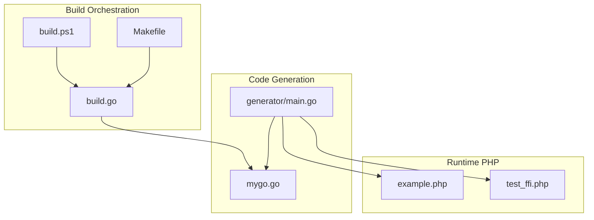
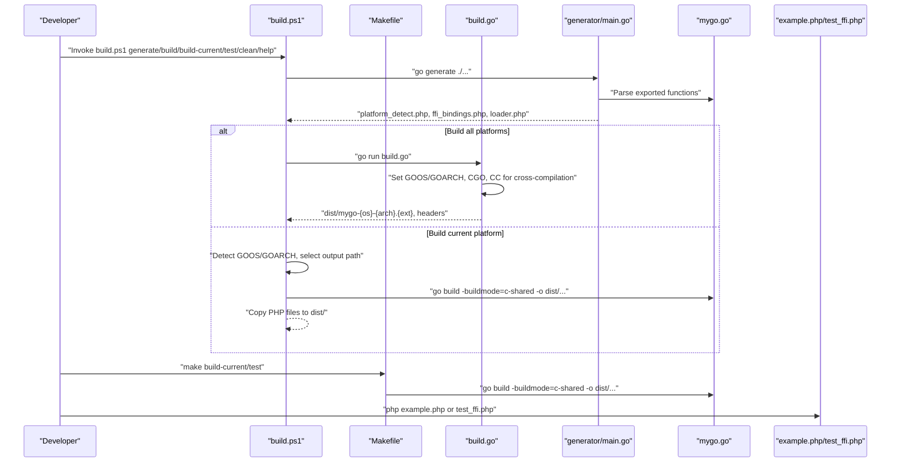
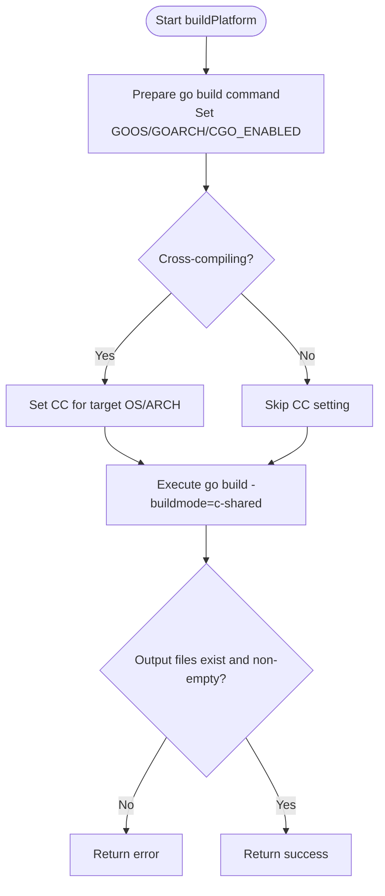
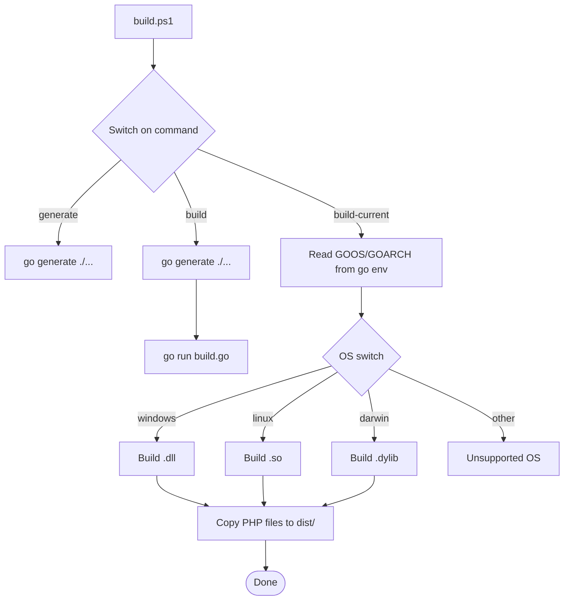
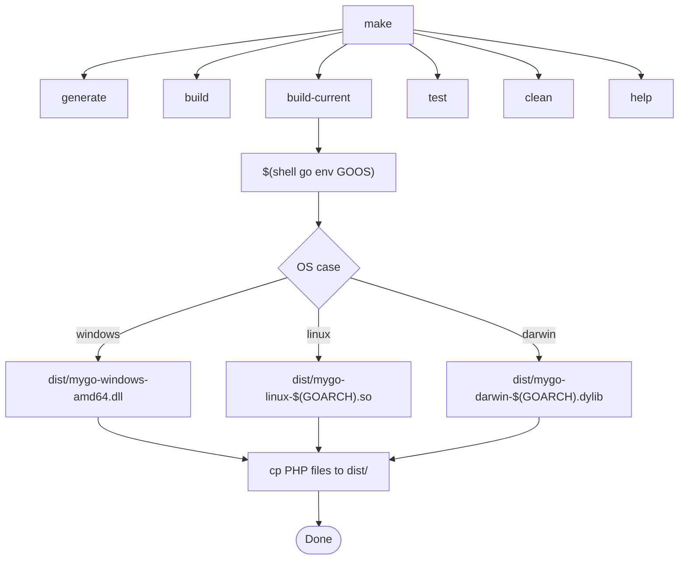
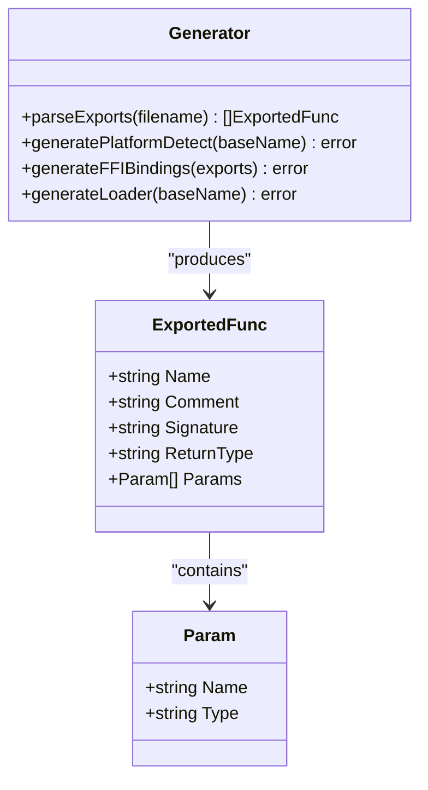
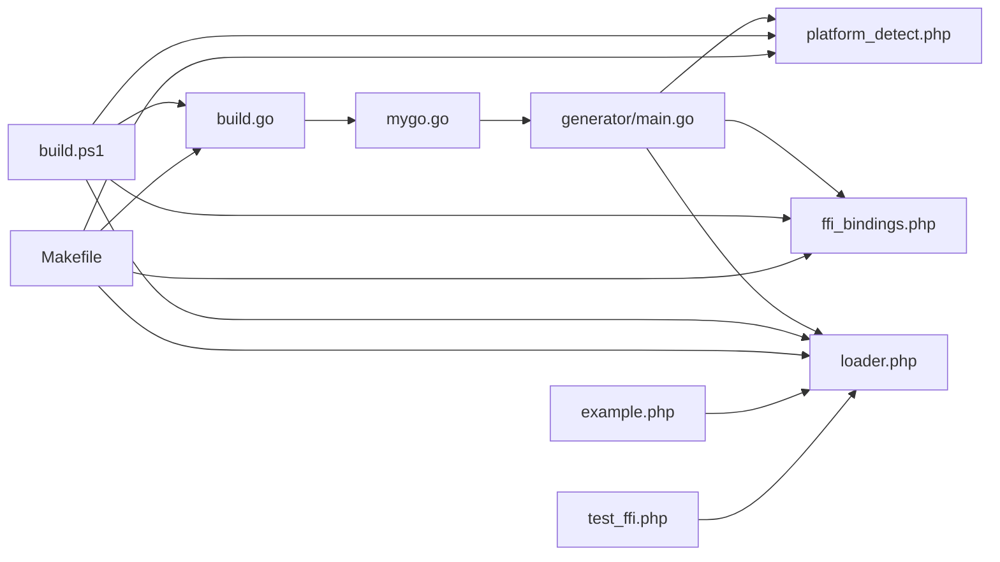

# Platform-Specific Errors

<cite>
**Referenced Files in This Document**
- [README.md](file://README.md)
- [build.go](file://build.go)
- [build.ps1](file://build.ps1)
- [Makefile](file://Makefile)
- [generator/main.go](file://generator/main.go)
- [mygo.go](file://mygo.go)
- [example.php](file://example.php)
- [test_ffi.php](file://test_ffi.php)
</cite>

## Table of Contents
1. [Introduction](#introduction)
2. [Project Structure](#project-structure)
3. [Core Components](#core-components)
4. [Architecture Overview](#architecture-overview)
5. [Detailed Component Analysis](#detailed-component-analysis)
6. [Dependency Analysis](#dependency-analysis)
7. [Performance Considerations](#performance-considerations)
8. [Troubleshooting Guide](#troubleshooting-guide)
9. [Conclusion](#conclusion)
10. [Appendices](#appendices)

## Introduction
This document explains platform-specific build failures across Windows, Linux, and macOS, focusing on:
- Architecture mismatches (32-bit vs 64-bit) and how they cause “not a valid Win32 application” errors on Windows
- Environment variable differences between shells (bash vs PowerShell) and how they affect build scripts
- File path separator issues and how they impact cross-platform compatibility
- Solutions for macOS code signing requirements and Linux library dependency issues
- Practical guidance using examples from build.ps1 and Makefile to detect platforms and apply conditional build logic

The repository provides a cross-platform build system that generates PHP FFI bindings and compiles Go shared libraries (.so/.dll/.dylib) for Linux, macOS, and Windows (amd64 and arm64). It also includes diagnostic helpers and example PHP code to validate builds.

## Project Structure
The repository organizes build logic across Go, PowerShell, and Makefiles, plus a code generator that produces PHP files for platform detection, FFI bindings, and loader logic.

**Diagram sources**
- [build.go](file://build.go#L1-L183)
- [build.ps1](file://build.ps1#L1-L152)
- [Makefile](file://Makefile#L1-L54)
- [generator/main.go](file://generator/main.go#L1-L705)
- [mygo.go](file://mygo.go#L1-L39)
- [example.php](file://example.php#L1-L95)
- [test_ffi.php](file://test_ffi.php#L1-L31)

**Section sources**
- [README.md](file://README.md#L1-L384)
- [build.go](file://build.go#L1-L183)
- [build.ps1](file://build.ps1#L1-L152)
- [Makefile](file://Makefile#L1-L54)
- [generator/main.go](file://generator/main.go#L1-L705)
- [mygo.go](file://mygo.go#L1-L39)
- [example.php](file://example.php#L1-L95)
- [test_ffi.php](file://test_ffi.php#L1-L31)

## Core Components
- Cross-platform builder (Go): Orchestrates building for supported platforms, sets GOOS/GOARCH, enables CGO, and configures cross-compilers when needed.
- PowerShell build script: Generates PHP bindings, builds for all platforms, or builds for the current platform, copying PHP files to dist/.
- Makefile: Provides POSIX-friendly targets for generate, build, build-current, test, clean, and help; uses shell variables to detect platform and architecture.
- Code generator: Parses exported functions from mygo.go and generates platform_detect.php, ffi_bindings.php, and loader.php.
- Example PHP apps: Demonstrate platform detection, library loading, and function calls.

Key platform support matrix:
- Linux amd64/arm64: .so
- macOS amd64/arm64: .dylib
- Windows amd64/arm64: .dll

**Section sources**
- [README.md](file://README.md#L14-L24)
- [build.go](file://build.go#L19-L29)
- [build.ps1](file://build.ps1#L20-L93)
- [Makefile](file://Makefile#L18-L30)
- [generator/main.go](file://generator/main.go#L190-L339)

## Architecture Overview
The build system integrates code generation with platform-aware compilation and packaging.

**Diagram sources**
- [build.ps1](file://build.ps1#L20-L93)
- [Makefile](file://Makefile#L7-L30)
- [build.go](file://build.go#L108-L164)
- [generator/main.go](file://generator/main.go#L27-L75)
- [mygo.go](file://mygo.go#L1-L39)
- [example.php](file://example.php#L1-L95)
- [test_ffi.php](file://test_ffi.php#L1-L31)

## Detailed Component Analysis

### Cross-Platform Builder (build.go)
- Defines supported platforms and their extensions.
- Builds a shared library per platform using go build with -buildmode=c-shared.
- Sets environment variables for cross-compilation:
  - GOOS, GOARCH, CGO_ENABLED=1
  - CC for cross-compilers (e.g., aarch64-linux-gnu-gcc, x86_64-w64-mingw32-gcc)
- Validates output existence and non-empty files.

**Diagram sources**
- [build.go](file://build.go#L108-L164)

**Section sources**
- [build.go](file://build.go#L19-L29)
- [build.go](file://build.go#L108-L164)

### PowerShell Build Script (build.ps1)
- Provides commands: generate, build, build-current, test, clean, help.
- Uses go env GOOS and GOARCH to determine current platform and output path.
- Copies generated PHP files to dist/ after successful build.
- Uses Windows-native path separators and PowerShell syntax.

**Diagram sources**
- [build.ps1](file://build.ps1#L20-L93)

**Section sources**
- [build.ps1](file://build.ps1#L1-L152)

### Makefile (POSIX Targets)
- Targets:
  - generate: runs go generate ./...
  - build: runs go run build.go
  - build-current: detects GOOS and GOARCH, builds current platform, copies PHP files
  - test: depends on build-current, runs php example.php
  - clean: removes dist/ and generated PHP files
  - help: prints available targets
- Uses shell constructs to conditionally set output paths.

**Diagram sources**
- [Makefile](file://Makefile#L7-L30)

**Section sources**
- [Makefile](file://Makefile#L1-L54)

### Code Generator (generator/main.go)
- Parses exported functions from mygo.go and generates:
  - platform_detect.php: platform detection and path resolution
  - ffi_bindings.php: FFI wrapper class with typed wrappers
  - loader.php: loadGoLibrary() and getMyGoPlatformInfo()
- Emits platform-specific filenames and uses DIRECTORY_SEPARATOR for path joining.

**Diagram sources**
- [generator/main.go](file://generator/main.go#L12-L26)
- [generator/main.go](file://generator/main.go#L27-L75)

**Section sources**
- [generator/main.go](file://generator/main.go#L190-L339)
- [generator/main.go](file://generator/main.go#L341-L418)
- [generator/main.go](file://generator/main.go#L642-L705)

### Example PHP Applications
- example.php: Loads loader.php, prints platform info, and exercises exported functions.
- test_ffi.php: Prints PHP architecture and OS family, checks DLL/header presence, attempts FFI load and a function call.

**Section sources**
- [example.php](file://example.php#L1-L95)
- [test_ffi.php](file://test_ffi.php#L1-L31)

## Dependency Analysis
- build.go depends on mygo.go exports and uses CGO-enabled builds with optional cross-compilers.
- build.ps1 and Makefile both orchestrate the same workflow: generate -> build -> copy PHP files.
- generator/main.go depends on mygo.go and emits PHP files consumed by example/test scripts.
- example.php/test_ffi.php depend on generated PHP files and the compiled shared library.

**Diagram sources**
- [build.go](file://build.go#L108-L164)
- [build.ps1](file://build.ps1#L20-L93)
- [Makefile](file://Makefile#L7-L30)
- [generator/main.go](file://generator/main.go#L27-L75)
- [example.php](file://example.php#L1-L95)
- [test_ffi.php](file://test_ffi.php#L1-L31)

**Section sources**
- [build.go](file://build.go#L108-L164)
- [build.ps1](file://build.ps1#L20-L93)
- [Makefile](file://Makefile#L7-L30)
- [generator/main.go](file://generator/main.go#L27-L75)
- [example.php](file://example.php#L1-L95)
- [test_ffi.php](file://test_ffi.php#L1-L31)

## Performance Considerations
- Library loading occurs once per PHP process; prefer persistent processes (e.g., PHP-FPM) for better performance.
- FFI overhead is minimal compared to native C extensions.
- String conversions between PHP and C incur overhead; batch operations when possible.
- Always free Go-allocated strings to prevent memory leaks.

[No sources needed since this section provides general guidance]

## Troubleshooting Guide

### Windows: “Not a valid Win32 application”
Symptoms:
- PHP reports “Failed loading ... not a valid Win32 application” when loading the DLL.

Root causes:
- Architecture mismatch: 32-bit PHP with 64-bit DLL (or vice versa)
- Missing runtime dependencies (e.g., Visual C++ Redistributable)
- Antivirus interference blocking DLL loading

Diagnosis:
- Confirm PHP architecture and library architecture match.
- Verify the DLL exists and is not empty.
- Use test_ffi.php to print paths and sizes and attempt FFI load.

Solutions:
- Match PHP and DLL architectures (both 32-bit or both 64-bit).
- Install required Visual C++ Redistributable packages.
- Temporarily disable antivirus to test loading.
- Ensure the correct .dll is built for the target architecture.

Evidence from repository:
- README documents the error and provides diagnostics and remedies.
- test_ffi.php demonstrates checking file existence and size and attempting FFI load.

**Section sources**
- [README.md](file://README.md#L279-L295)
- [test_ffi.php](file://test_ffi.php#L1-L31)

### Environment Variable Differences: Bash vs PowerShell
- Bash (Makefile): Uses shell variables like $(shell go env GOOS) and $(GOARCH).
- PowerShell (build.ps1): Uses go env GOOS and GOARCH and Windows-native path separators.

Implications:
- Ensure environment variables are set consistently across shells.
- Use the provided scripts to avoid manual environment setup mistakes.

Evidence from repository:
- Makefile uses shell constructs to detect platform and architecture.
- build.ps1 reads go env values and selects output paths accordingly.

**Section sources**
- [Makefile](file://Makefile#L18-L30)
- [build.ps1](file://build.ps1#L53-L83)

### File Path Separator Issues
- PHP code uses DIRECTORY_SEPARATOR for cross-platform path joining.
- PowerShell uses backslashes; Makefile uses forward slashes in paths.

Implications:
- When writing scripts or tools outside the provided build system, ensure consistent path handling.
- Prefer using PHP’s DIRECTORY_SEPARATOR or equivalent platform APIs.

Evidence from repository:
- platform_detect.php uses DIRECTORY_SEPARATOR for path construction.
- build.ps1 uses backslashes in Windows paths; Makefile uses forward slashes.

**Section sources**
- [generator/main.go](file://generator/main.go#L306-L319)
- [build.ps1](file://build.ps1#L63-L89)
- [Makefile](file://Makefile#L23-L29)

### macOS Code Signing Requirements
- On macOS, unsigned binaries may be blocked by Gatekeeper or security policies.
- Recommended action: Sign the .dylib with a valid developer identity or adjust security settings during development.

Evidence from repository:
- The build system compiles .dylib for macOS; ensure the binary is signed for distribution.

**Section sources**
- [build.go](file://build.go#L24-L26)
- [README.md](file://README.md#L14-L24)

### Linux Library Dependency Issues
- Cross-compiling to Linux from other platforms often requires installing cross-compilers (e.g., mingw-w64 for Windows targets).
- Running the produced .so may require system libraries to be present.

Evidence from repository:
- README documents cross-compilation prerequisites and examples.
- build.go sets CC for cross-compilation when targeting Linux/Windows.

**Section sources**
- [README.md](file://README.md#L211-L237)
- [build.go](file://build.go#L123-L137)

### Platform Detection and Conditional Build Logic
- PowerShell script detects GOOS and GOARCH, then selects the correct output path and extension.
- Makefile uses shell variables to detect platform and architecture and sets output paths accordingly.
- The generator writes platform-specific filenames and uses DIRECTORY_SEPARATOR for path joining.

Examples from repository:
- build.ps1 build-current logic: [build.ps1](file://build.ps1#L53-L83)
- Makefile build-current logic: [Makefile](file://Makefile#L18-L30)
- Generator path resolution: [generator/main.go](file://generator/main.go#L306-L319)

**Section sources**
- [build.ps1](file://build.ps1#L53-L83)
- [Makefile](file://Makefile#L18-L30)
- [generator/main.go](file://generator/main.go#L306-L319)

## Conclusion
This build system provides robust cross-platform support for generating PHP FFI bindings and compiling Go shared libraries across Windows, Linux, and macOS. Platform-specific pitfalls—architecture mismatches, shell environment differences, path separators, macOS signing, and Linux dependencies—are addressed by the provided scripts and diagnostic tools. Use build.ps1 and Makefile to automate platform detection and conditional builds, and rely on the generator and example PHP apps to validate correctness.

[No sources needed since this section summarizes without analyzing specific files]

## Appendices

### Platform Support Matrix
- Linux: amd64/arm64 -> .so
- macOS: amd64/arm64 -> .dylib
- Windows: amd64/arm64 -> .dll

**Section sources**
- [README.md](file://README.md#L14-L24)
- [build.go](file://build.go#L19-L29)

### Example Targets and Commands
- PowerShell: build.ps1 generate/build/build-current/test/clean/help
- Make: make generate/build/build-current/test/clean/help

**Section sources**
- [build.ps1](file://build.ps1#L10-L18)
- [Makefile](file://Makefile#L45-L54)