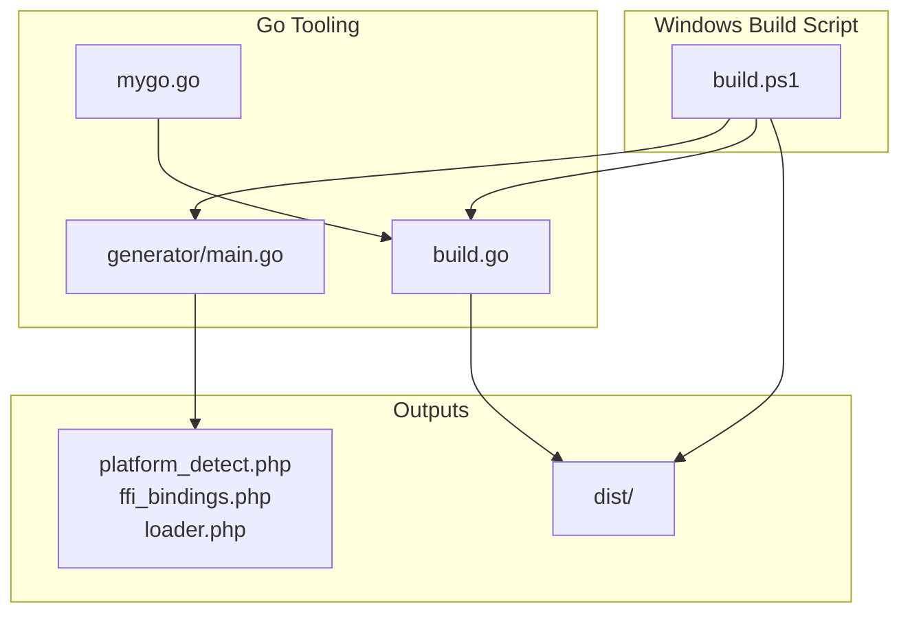
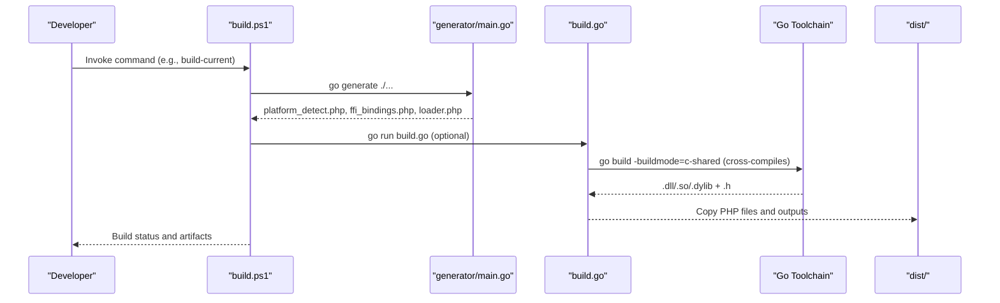
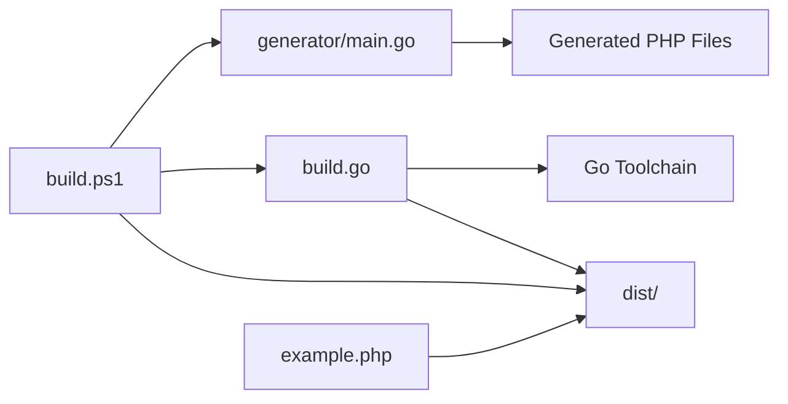

# Windows Platform Errors

<cite>
**Referenced Files in This Document**
- [build.ps1](file://build.ps1)
- [README.md](file://README.md)
- [QUICKSTART.md](file://QUICKSTART.md)
- [Makefile](file://Makefile)
- [build.go](file://build.go)
- [example.php](file://example.php)
- [mygo.go](file://mygo.go)
</cite>

## Table of Contents
1. [Introduction](#introduction)
2. [Project Structure](#project-structure)
3. [Core Components](#core-components)
4. [Architecture Overview](#architecture-overview)
5. [Detailed Component Analysis](#detailed-component-analysis)
6. [Dependency Analysis](#dependency-analysis)
7. [Performance Considerations](#performance-considerations)
8. [Troubleshooting Guide](#troubleshooting-guide)
9. [Conclusion](#conclusion)

## Introduction
This document focuses on diagnosing and resolving Windows-specific build and runtime errors when integrating a Go shared library with PHP FFI. It covers:
- “not a valid Win32 application” errors caused by architecture mismatches between PHP and the compiled DLL
- PowerShell execution policy restrictions that prevent script execution
- Missing MinGW-w64 compiler dependencies during cross-compilation
- Practical diagnostic steps using PHP and Go environment variables
- Guidance on correct command invocation and error handling as shown in the repository’s build scripts

## Project Structure
The repository provides a cross-platform build system with dedicated scripts and automation for generating PHP FFI bindings and compiling Go shared libraries. On Windows, the primary entry point is a PowerShell script that orchestrates generation, building, testing, and cleanup.

**Diagram sources**
- [build.ps1](file://build.ps1#L1-L152)
- [generator/main.go](file://generator/main.go#L1-L705)
- [build.go](file://build.go#L1-L183)
- [mygo.go](file://mygo.go#L1-L39)

**Section sources**
- [build.ps1](file://build.ps1#L1-L152)
- [README.md](file://README.md#L1-L120)
- [QUICKSTART.md](file://QUICKSTART.md#L1-L60)

## Core Components
- Windows build orchestration: PowerShell script that supports commands such as generate, build, build-current, test, clean, and help.
- Go-based cross-platform builder: A program that iterates supported platforms, sets environment variables for cross-compilation, and verifies outputs.
- Code generator: Produces PHP files (platform detection, FFI bindings, loader) from exported Go functions.
- Example PHP application: Demonstrates loading and using the generated library via FFI.

Key responsibilities:
- Diagnose and resolve Windows build/runtime issues
- Ensure correct architecture alignment between PHP and the compiled DLL
- Provide robust command invocation and error handling patterns

**Section sources**
- [build.ps1](file://build.ps1#L1-L152)
- [build.go](file://build.go#L1-L183)
- [generator/main.go](file://generator/main.go#L1-L120)
- [example.php](file://example.php#L1-L40)

## Architecture Overview
The build pipeline integrates PowerShell-driven orchestration with Go tooling for cross-compilation and code generation. The diagram below maps the actual components and their interactions.

**Diagram sources**
- [build.ps1](file://build.ps1#L1-L152)
- [generator/main.go](file://generator/main.go#L1-L120)
- [build.go](file://build.go#L100-L170)

## Detailed Component Analysis

### Windows PowerShell Build Script (build.ps1)
- Purpose: Provide a unified interface for generating bindings, building for current or all platforms, running tests, and cleaning artifacts.
- Key behaviors:
  - Generates PHP files via the Go generator
  - Builds the shared library for the current platform with platform-specific naming and extension
  - Copies generated PHP files into the distribution directory
  - Executes the example PHP script after successful build
  - Uses last exit code checks to report success or failure

Diagnostic and remediation hooks:
- Use the current platform build path to verify the correct output filename and extension for Windows (DLL).
- Use the test command to validate runtime loading and basic function calls.

**Section sources**
- [build.ps1](file://build.ps1#L1-L152)

### Go Cross-Platform Builder (build.go)
- Purpose: Automate cross-compilation for multiple platforms and produce platform-specific shared libraries and headers.
- Key behaviors:
  - Defines supported platforms and their extensions
  - Sets environment variables for GOOS, GOARCH, and CGO_ENABLED
  - Configures the C compiler for cross-compilation (e.g., MinGW-w64 on Windows)
  - Validates that outputs and headers exist and are non-empty
  - Copies generated PHP files to the distribution directory

Windows-specific cross-compilation:
- When targeting Windows, the builder sets the MinGW-w64 compiler for amd64 and arm64 architectures.

**Section sources**
- [build.go](file://build.go#L1-L183)

### Code Generator (generator/main.go)
- Purpose: Parse exported Go functions and generate PHP files that wrap the FFI interface.
- Key behaviors:
  - Parses exported functions from the Go source file
  - Generates platform detection, FFI bindings, and loader PHP modules
  - Writes generated files to the repository root and later copied to dist/

**Section sources**
- [generator/main.go](file://generator/main.go#L1-L120)

### Example PHP Application (example.php)
- Purpose: Demonstrate loading the library and invoking exported functions.
- Key behaviors:
  - Loads the generated loader
  - Retrieves platform information
  - Attempts to load the shared library and call exported functions
  - Handles exceptions and prints stack traces for diagnostics

**Section sources**
- [example.php](file://example.php#L1-L95)

## Dependency Analysis
The build system relies on the interplay between PowerShell orchestration, Go generators, and the Go toolchain for cross-compilation. The following diagram highlights the relationships among the main components.

**Diagram sources**
- [build.ps1](file://build.ps1#L1-L152)
- [generator/main.go](file://generator/main.go#L1-L120)
- [build.go](file://build.go#L100-L170)
- [example.php](file://example.php#L1-L40)

**Section sources**
- [build.ps1](file://build.ps1#L1-L152)
- [build.go](file://build.go#L1-L183)
- [generator/main.go](file://generator/main.go#L1-L120)
- [example.php](file://example.php#L1-L40)

## Performance Considerations
- Library loading occurs once per PHP process; using persistent processes (e.g., PHP-FPM) reduces repeated overhead.
- FFI overhead is minimal compared to native C extensions.
- String conversions between PHP and C incur overhead; batch operations when possible.
- Always free Go-allocated strings to prevent memory leaks.

[No sources needed since this section provides general guidance]

## Troubleshooting Guide

### 1) “not a valid Win32 application” — Architecture Mismatch
Symptoms:
- Runtime error indicating the DLL is not a valid Win32 application
- Occurs when the PHP runtime architecture does not match the compiled DLL architecture

Diagnosis:
- Determine PHP bitness using the documented PHP diagnostic command
- Determine Go build architecture using the documented Go environment command

Remediation:
- Ensure PHP and the compiled DLL share the same architecture (both 64-bit or both 32-bit)
- Rebuild the library for the matching architecture

References:
- Diagnostic command for PHP bitness
- Diagnostic command for Go architecture

**Section sources**
- [README.md](file://README.md#L279-L295)
- [QUICKSTART.md](file://QUICKSTART.md#L118-L129)

### 2) PowerShell Execution Policy Restrictions
Symptoms:
- Errors when trying to run the Windows build script due to execution policy
- Messages indicating the script cannot be loaded or executed

Diagnosis:
- Attempt to run the script and observe execution policy warnings

Remediation:
- Adjust the PowerShell execution policy to allow script execution in the current session or user scope
- Run the script with appropriate policy flags if permitted by your environment

References:
- Windows build script usage and commands

**Section sources**
- [build.ps1](file://build.ps1#L1-L20)
- [QUICKSTART.md](file://QUICKSTART.md#L25-L40)

### 3) Missing MinGW-w64 Compiler Dependencies (Cross-Compilation)
Symptoms:
- Cross-compilation fails on Windows targets with missing compiler errors
- Build logs indicate inability to find the MinGW-w64 compiler

Diagnosis:
- Confirm that the MinGW-w64 compiler is installed and available in PATH
- Verify that the correct compiler name is set for the target architecture

Remediation:
- Install MinGW-w64 (or compatible toolchain)
- Ensure the correct compiler executable is available (e.g., the amd64 MinGW-w64 compiler for Windows targets)
- Re-run the build process

References:
- Cross-compilation instructions for Windows targets
- Cross-compilation logic in the Go builder

**Section sources**
- [README.md](file://README.md#L212-L221)
- [build.go](file://build.go#L120-L140)

### 4) Command Invocation and Error Handling Patterns (Windows)
Recommended invocation patterns:
- Use the Windows build script to generate bindings, build for the current platform, and run the example
- Use the test command to build and immediately execute the example
- Use the clean command to remove generated artifacts

Error handling patterns:
- The script checks the last exit code to determine success or failure and reports accordingly
- The example PHP application wraps library usage in a try-catch block and prints stack traces for diagnostics

References:
- Windows build script commands and flow
- Example PHP application error handling

**Section sources**
- [build.ps1](file://build.ps1#L1-L152)
- [QUICKSTART.md](file://QUICKSTART.md#L25-L40)
- [example.php](file://example.php#L80-L95)

### 5) Additional Windows-Specific Notes
- Ensure the FFI extension is enabled in PHP
- Verify that the distribution directory contains the correct library and header files
- Confirm that the loader and generated PHP files are present in the distribution directory

References:
- Troubleshooting section for FFI-related issues
- Distribution directory structure and contents

**Section sources**
- [README.md](file://README.md#L240-L278)
- [README.md](file://README.md#L57-L80)
- [README.md](file://README.md#L252-L266)

## Conclusion
This document outlined practical diagnostics and remedies for Windows-specific build and runtime errors in the Go-PHP FFI integration pipeline. By aligning PHP and DLL architectures, adjusting PowerShell execution policies, installing the required MinGW-w64 toolchain, and following the repository’s command invocation patterns, developers can reliably build and run shared libraries on Windows. The included references point to concrete locations in the repository where these checks and fixes are implemented or documented.