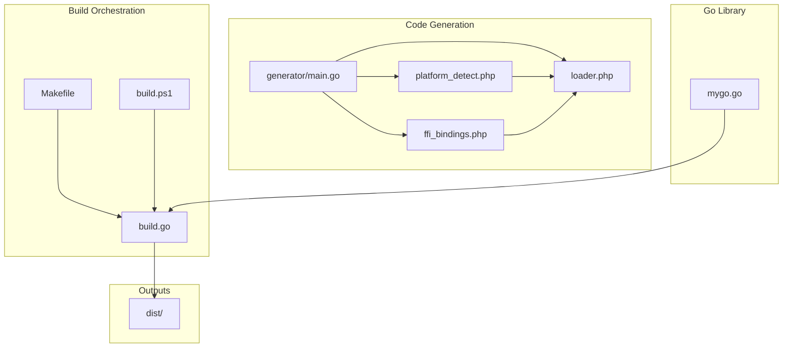
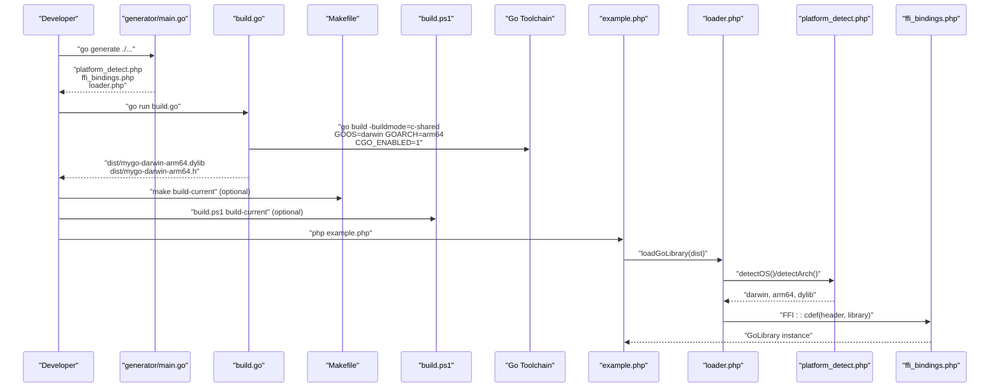
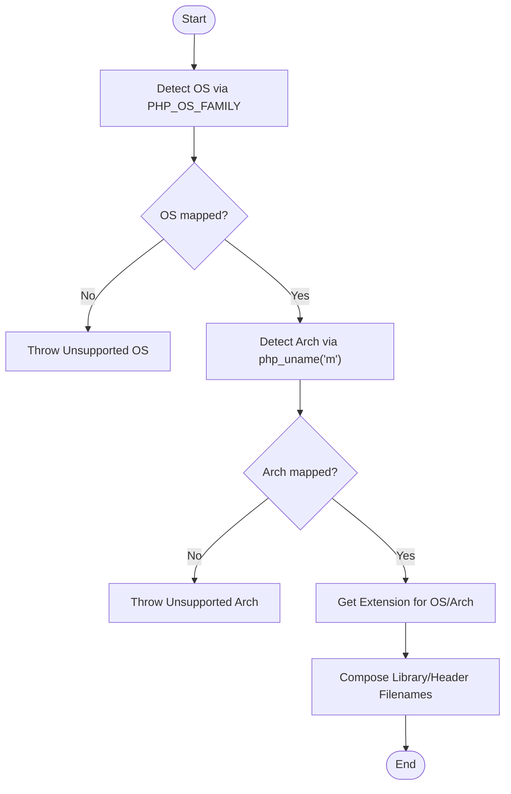
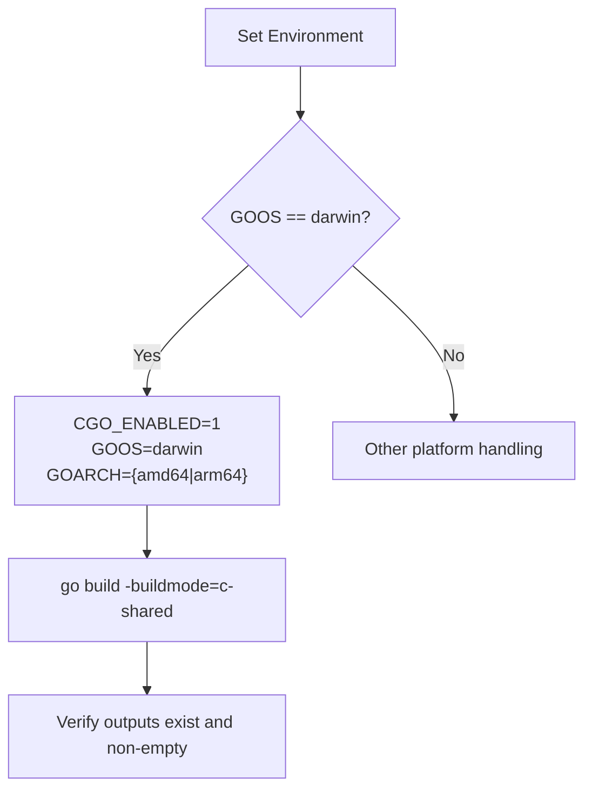
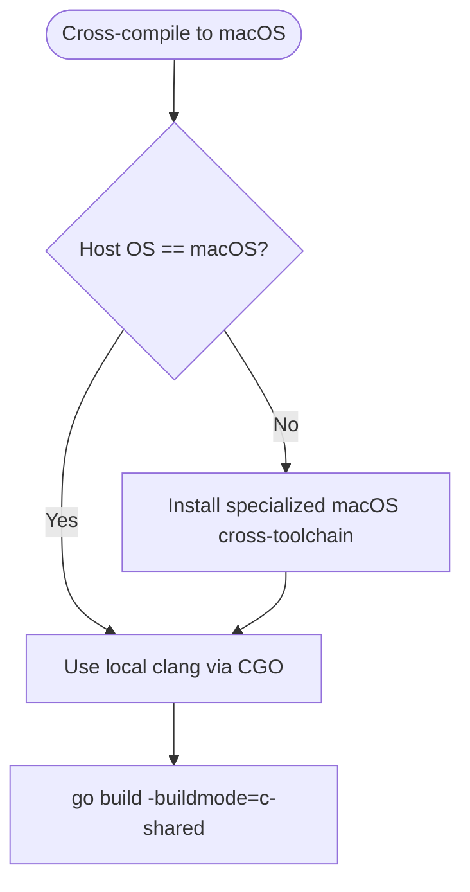
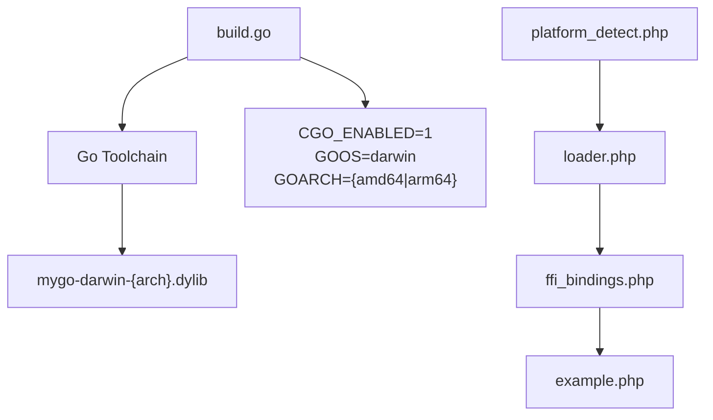

# macOS Platform Errors

<cite>
**Referenced Files in This Document**
- [build.go](file://build.go)
- [Makefile](file://Makefile)
- [build.ps1](file://build.ps1)
- [README.md](file://README.md)
- [QUICKSTART.md](file://QUICKSTART.md)
- [generator/main.go](file://generator/main.go)
- [platform_detect.php](file://platform_detect.php)
- [ffi_bindings.php](file://ffi_bindings.php)
- [loader.php](file://loader.php)
- [example.php](file://example.php)
- [mygo.go](file://mygo.go)
- [AGENTS.MD](file://AGENTS.MD)
</cite>

## Table of Contents
1. [Introduction](#introduction)
2. [Project Structure](#project-structure)
3. [Core Components](#core-components)
4. [Architecture Overview](#architecture-overview)
5. [Detailed Component Analysis](#detailed-component-analysis)
6. [Dependency Analysis](#dependency-analysis)
7. [Performance Considerations](#performance-considerations)
8. [Troubleshooting Guide](#troubleshooting-guide)
9. [Conclusion](#conclusion)
10. [Appendices](#appendices)

## Introduction
This document focuses on macOS-specific build issues encountered when compiling Go shared libraries for PHP FFI integration. It covers missing Xcode Command Line Tools, code signing requirements for dynamic library loading, architecture detection pitfalls between Apple Silicon (arm64) and Intel (amd64), and cross-compilation challenges from other platforms to macOS. It also explains how to resolve “library not loaded” errors due to code signing, handle transitions from dylib to universal binaries, and properly configure CGO for macOS targets using the build orchestration in this repository.

## Project Structure
The repository provides a cross-platform build system that compiles shared libraries for Linux, macOS, and Windows. On macOS, the build produces .dylib files with standardized naming conventions. The build system includes:
- A Go-based orchestrator that sets platform-specific environment variables and invokes the Go toolchain
- A code generator that creates PHP FFI bindings and loaders
- A Makefile and PowerShell script for convenience on Unix-like and Windows systems respectively

**Diagram sources**
- [build.go](file://build.go#L1-L183)
- [Makefile](file://Makefile#L1-L54)
- [build.ps1](file://build.ps1#L1-L152)
- [generator/main.go](file://generator/main.go#L1-L705)
- [platform_detect.php](file://platform_detect.php)
- [ffi_bindings.php](file://ffi_bindings.php)
- [loader.php](file://loader.php)
- [mygo.go](file://mygo.go#L1-L39)

**Section sources**
- [build.go](file://build.go#L1-L183)
- [Makefile](file://Makefile#L1-L54)
- [build.ps1](file://build.ps1#L1-L152)
- [generator/main.go](file://generator/main.go#L1-L705)
- [README.md](file://README.md#L1-L384)
- [AGENTS.MD](file://AGENTS.MD#L95-L134)

## Core Components
- macOS dylib naming and platform detection: The system recognizes darwin/amd64 and darwin/arm64 with .dylib extension and uses platform detection to select the correct library.
- CGO-enabled builds: The build orchestrator sets CGO_ENABLED=1 and uses the Go toolchain to produce c-shared libraries.
- Cross-compilation handling: While macOS builds are straightforward on macOS hosts, cross-compilation to macOS from other platforms is complex and requires specialized toolchains.

Key macOS-related behaviors:
- Supported platforms include darwin/amd64 and darwin/arm64 with dylib extension.
- Platform detection maps uname machine identifiers to standard arch names (amd64/arm64).
- Build scripts and orchestrator set GOOS/GOARCH and CGO_ENABLED appropriately for macOS.

**Section sources**
- [build.go](file://build.go#L19-L39)
- [generator/main.go](file://generator/main.go#L190-L339)
- [Makefile](file://Makefile#L20-L30)
- [build.ps1](file://build.ps1#L62-L82)
- [README.md](file://README.md#L16-L31)

## Architecture Overview
The macOS build pipeline integrates code generation, platform detection, and library compilation. The following sequence diagram maps the actual code paths used to build macOS libraries and load them in PHP.

**Diagram sources**
- [generator/main.go](file://generator/main.go#L1-L120)
- [build.go](file://build.go#L107-L164)
- [Makefile](file://Makefile#L18-L30)
- [build.ps1](file://build.ps1#L46-L93)
- [example.php](file://example.php#L1-L20)
- [loader.php](file://loader.php#L644-L704)
- [platform_detect.php](file://platform_detect.php)
- [ffi_bindings.php](file://ffi_bindings.php)

## Detailed Component Analysis

### macOS dylib Naming and Platform Detection
- The build orchestrator defines darwin/amd64 and darwin/arm64 with dylib extension.
- Platform detection logic maps uname machine identifiers to standard arch names and validates supported platforms.
- The loader composes library and header filenames based on detected OS/arch and extension.

**Diagram sources**
- [generator/main.go](file://generator/main.go#L190-L339)
- [platform_detect.php](file://platform_detect.php)

**Section sources**
- [build.go](file://build.go#L19-L39)
- [generator/main.go](file://generator/main.go#L190-L339)
- [platform_detect.php](file://platform_detect.php)

### CGO and macOS Build Configuration
- The build orchestrator sets CGO_ENABLED=1 and GOOS/GOARCH for macOS targets.
- On macOS hosts, the build uses the local clang (Xcode Command Line Tools) via CGO.
- Cross-compilation to macOS from Linux is documented as complex and requiring specialized toolchains.

**Diagram sources**
- [build.go](file://build.go#L107-L164)
- [AGENTS.MD](file://AGENTS.MD#L119-L129)

**Section sources**
- [build.go](file://build.go#L107-L164)
- [AGENTS.MD](file://AGENTS.MD#L119-L129)

### Cross-Compilation to macOS
- Cross-compiling to macOS from Linux is documented as complex and requires specialized toolchains.
- The build orchestrator does not set a C compiler for macOS cross-compilation; macOS builds are intended to run on macOS hosts.

**Diagram sources**
- [AGENTS.MD](file://AGENTS.MD#L223-L226)
- [build.go](file://build.go#L122-L137)

**Section sources**
- [AGENTS.MD](file://AGENTS.MD#L223-L226)
- [build.go](file://build.go#L122-L137)

### Code Signing and “Library Not Loaded” Errors
- macOS enforces strict security policies around dynamic libraries. Unsigned or improperly signed libraries may fail to load with “library not loaded” errors.
- Solutions include:
  - Ensuring the library is signed with a valid certificate or notarized where applicable.
  - Adjusting Gatekeeper and System Integrity Protection (SIP) settings temporarily for development if necessary.
  - Distributing libraries via official channels or packaging them as part of a signed application bundle.

[No sources needed since this section provides general guidance]

### Transition from dylib to Universal Binaries
- When distributing libraries for both Intel and Apple Silicon, create a universal binary containing both architectures.
- Use tools to merge architectures into a single .dylib or distribute separate architectures and let the loader select the correct one at runtime.

[No sources needed since this section provides general guidance]

### Architecture Detection Problems: arm64 vs amd64
- The platform detector maps uname machine identifiers to standard arch names (amd64/arm64).
- Ensure the PHP runtime’s architecture matches the compiled library (Intel vs Apple Silicon).
- Mismatched architectures lead to “library not loaded” or “not a valid Win32 application”-style errors.

**Section sources**
- [generator/main.go](file://generator/main.go#L227-L247)
- [platform_detect.php](file://platform_detect.php)

### Missing Xcode Command Line Tools
- macOS builds require clang via Xcode Command Line Tools when CGO is enabled.
- Symptoms include “cgo: C compiler not found” errors during builds.
- Resolution: Install Xcode Command Line Tools and ensure PATH includes clang.

**Section sources**
- [AGENTS.MD](file://AGENTS.MD#L119-L123)
- [README.md](file://README.md#L48-L56)

### Missing clang on macOS
- The build orchestrator relies on CGO and the system’s C compiler.
- If clang is missing, the build fails with a cgo-related error.
- Resolution: Install Xcode Command Line Tools.

**Section sources**
- [AGENTS.MD](file://AGENTS.MD#L119-L123)

### CGO Configuration for macOS Targets
- The build orchestrator sets CGO_ENABLED=1 and GOOS/GOARCH for macOS.
- Ensure CGO is enabled and a C compiler is available on macOS hosts.

**Section sources**
- [build.go](file://build.go#L113-L121)

## Dependency Analysis
The macOS build depends on:
- CGO-enabled Go toolchain
- clang (Xcode Command Line Tools) on macOS hosts
- Proper platform detection and loader selection

**Diagram sources**
- [build.go](file://build.go#L107-L164)
- [platform_detect.php](file://platform_detect.php)
- [loader.php](file://loader.php#L644-L704)
- [ffi_bindings.php](file://ffi_bindings.php)
- [example.php](file://example.php#L1-L20)

**Section sources**
- [build.go](file://build.go#L107-L164)
- [generator/main.go](file://generator/main.go#L190-L339)
- [loader.php](file://loader.php#L644-L704)

## Performance Considerations
- Library loading occurs once per PHP process; use persistent processes (e.g., PHP-FPM) for better performance.
- FFI overhead is minimal compared to native C extensions.
- String handling between PHP and C has overhead; batch operations when possible.
- Always free Go-allocated strings to prevent memory leaks.

[No sources needed since this section provides general guidance]

## Troubleshooting Guide

### “FFI extension is not loaded”
- Ensure the FFI extension is enabled in php.ini and restart the web server or PHP-FPM.

**Section sources**
- [README.md](file://README.md#L240-L251)

### “Library file not found”
- Confirm that go generate was run and the build completed successfully.
- Verify that dist/ contains the appropriate .dylib file for the current platform.
- Ensure the path passed to loadGoLibrary() is correct.

**Section sources**
- [README.md](file://README.md#L252-L266)

### “CGO_ENABLED=0 or not available”
- Enable CGO and ensure a C compiler is installed.
- On macOS, install Xcode Command Line Tools.

**Section sources**
- [README.md](file://README.md#L267-L278)
- [AGENTS.MD](file://AGENTS.MD#L119-L123)

### “cgo: C compiler not found”
- Install Xcode Command Line Tools to provide clang.

**Section sources**
- [AGENTS.MD](file://AGENTS.MD#L119-L123)

### “library not loaded” due to code signing
- Sign the library with a valid certificate or notarize it.
- Temporarily adjust Gatekeeper/SIP settings for development if necessary.
- Distribute via official channels or bundle with a signed application.

[No sources needed since this section provides general guidance]

### Cross-compilation to macOS from Linux
- Cross-compiling to macOS from Linux is complex and requires specialized toolchains.
- Consider building on macOS hosts or using a macOS CI runner.

**Section sources**
- [AGENTS.MD](file://AGENTS.MD#L223-L226)

### Architecture mismatch (arm64 vs amd64)
- Ensure the PHP runtime architecture matches the compiled library.
- Use the platform detector to confirm OS/arch and extension.

**Section sources**
- [generator/main.go](file://generator/main.go#L227-L247)
- [platform_detect.php](file://platform_detect.php)

## Conclusion
This repository provides a robust cross-platform build system for Go shared libraries targeting macOS with .dylib outputs. macOS-specific issues primarily revolve around missing Xcode Command Line Tools, code signing requirements, and architecture mismatches. By enabling CGO, installing clang, ensuring proper code signing, and aligning PHP runtime architecture with the compiled library, developers can reliably build and load macOS libraries for PHP FFI integration.

[No sources needed since this section summarizes without analyzing specific files]

## Appendices

### Appendix A: macOS Build Commands
- Generate PHP bindings: go generate ./...
- Build for current macOS platform: go build -buildmode=c-shared -o dist/mygo-darwin-{arch}.dylib mygo.go
- Build all platforms: go run build.go

**Section sources**
- [README.md](file://README.md#L67-L109)
- [QUICKSTART.md](file://QUICKSTART.md#L1-L21)
- [build.go](file://build.go#L107-L164)

### Appendix B: Platform Detection Reference
- OS detection uses PHP_OS_FAMILY and maps to linux/darwin/windows.
- Architecture detection uses php_uname('m') and maps to amd64/arm64.
- Extension selection is derived from OS/arch mapping.

**Section sources**
- [generator/main.go](file://generator/main.go#L190-L339)
- [platform_detect.php](file://platform_detect.php)