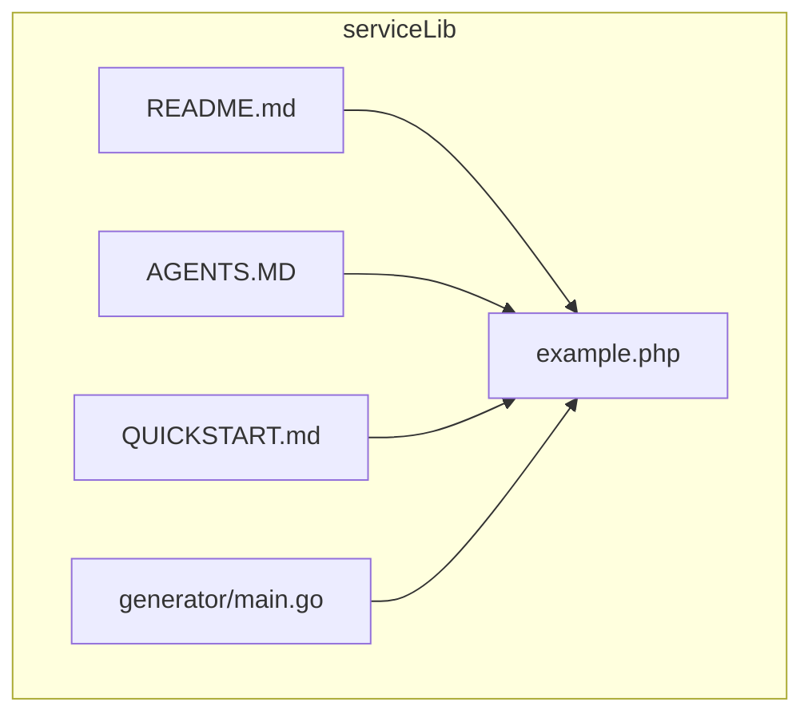
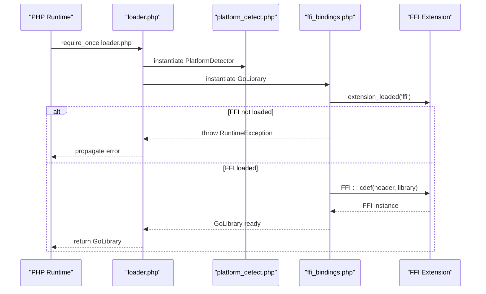
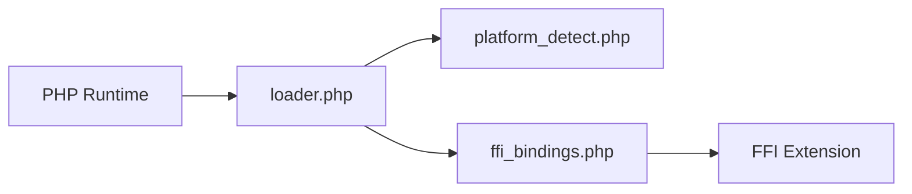

# FFI Extension Configuration

<cite>
**Referenced Files in This Document**
- [README.md](file://README.md)
- [AGENTS.MD](file://AGENTS.MD)
- [QUICKSTART.md](file://QUICKSTART.md)
- [example.php](file://example.php)
- [generator/main.go](file://generator/main.go)
</cite>

## Table of Contents
1. [Introduction](#introduction)
2. [Project Structure](#project-structure)
3. [Core Components](#core-components)
4. [Architecture Overview](#architecture-overview)
5. [Detailed Component Analysis](#detailed-component-analysis)
6. [Dependency Analysis](#dependency-analysis)
7. [Performance Considerations](#performance-considerations)
8. [Troubleshooting Guide](#troubleshooting-guide)
9. [Conclusion](#conclusion)

## Introduction
This document explains how to configure the PHP FFI extension for using serviceLib. It covers enabling the FFI extension in php.ini with the required directives, verifying the extension is loaded, and resolving common pitfalls. It also provides platform-specific guidance for Windows, Linux, and macOS, along with web server restart requirements for Apache and PHP-FPM.

## Project Structure
The repository provides a complete build system for generating Go shared libraries consumable by PHP via FFI. The FFI extension is required on the PHP side to load and call into the compiled shared library.

**Diagram sources**
- [README.md](file://README.md#L25-L41)
- [AGENTS.MD](file://AGENTS.MD#L15-L37)
- [QUICKSTART.md](file://QUICKSTART.md#L57-L67)
- [example.php](file://example.php#L1-L12)
- [generator/main.go](file://generator/main.go#L1-L20)

**Section sources**
- [README.md](file://README.md#L25-L41)
- [AGENTS.MD](file://AGENTS.MD#L15-L37)
- [QUICKSTART.md](file://QUICKSTART.md#L57-L67)

## Core Components
- FFI requirement: The PHP side requires the FFI extension to be enabled in php.ini with the directives extension=ffi and ffi.enable=true.
- Verification: The example application demonstrates FFI usage and indirectly verifies the extension is present when the loader executes successfully.
- Troubleshooting: The documentation explicitly lists “FFI extension is not loaded” as a known error and provides the fix.

**Section sources**
- [README.md](file://README.md#L57-L65)
- [README.md](file://README.md#L240-L251)
- [QUICKSTART.md](file://QUICKSTART.md#L110-L117)
- [example.php](file://example.php#L1-L12)

## Architecture Overview
The PHP application loads the Go shared library via FFI. The loader and bindings are generated by the code generator and included in the distribution package.

**Diagram sources**
- [generator/main.go](file://generator/main.go#L341-L418)
- [generator/main.go](file://generator/main.go#L642-L690)
- [example.php](file://example.php#L1-L12)

## Detailed Component Analysis

### Enabling FFI in php.ini
- Required directives:
  - extension=ffi
  - ffi.enable=true
- These directives are documented in the project’s primary documentation and quick start guide.
- After editing php.ini, restart your web server or PHP-FPM to apply the changes.

**Section sources**
- [README.md](file://README.md#L57-L65)
- [README.md](file://README.md#L240-L251)
- [QUICKSTART.md](file://QUICKSTART.md#L110-L117)

### Verifying FFI is Loaded
- Use the PHP runtime to confirm the extension is loaded. The loader checks extension_loaded('ffi') and throws a clear error if not present.
- The example application demonstrates successful loading and usage of the library.

**Section sources**
- [generator/main.go](file://generator/main.go#L366-L370)
- [example.php](file://example.php#L1-L12)

### Platform-Specific Considerations
- Windows:
  - Ensure the correct architecture (32-bit vs 64-bit) matches your PHP installation and the compiled DLL.
  - Some environments may require Microsoft Visual C++ Redistributable packages.
- Linux:
  - Ensure a C compiler is available and CGO is enabled when building the shared library.
- macOS:
  - Use Xcode Command Line Tools and appropriate compilers for your target architecture.

**Section sources**
- [README.md](file://README.md#L47-L56)
- [README.md](file://README.md#L279-L295)

### Web Server Restart Requirements
- After changing php.ini, restart Apache or PHP-FPM to ensure the FFI extension is loaded by the web server process.

**Section sources**
- [README.md](file://README.md#L240-L251)

### Common Configuration Pitfalls
- Incorrect php.ini location:
  - PHP may load from different locations depending on the SAPI (CLI vs Apache/FPM). Confirm which php.ini is in effect for your environment.
- Missing extension files:
  - Ensure the FFI extension dynamic library is discoverable by PHP and that the extension directive points to the correct path.
- Disabled FFI support:
  - The loader explicitly checks for the extension and throws an error if missing.

**Section sources**
- [generator/main.go](file://generator/main.go#L366-L370)
- [README.md](file://README.md#L240-L251)

## Dependency Analysis
FFI is a runtime dependency for the PHP loader and bindings. The loader depends on the presence of the FFI extension and the availability of the generated PHP files and the shared library.

**Diagram sources**
- [generator/main.go](file://generator/main.go#L642-L690)
- [generator/main.go](file://generator/main.go#L341-L418)

**Section sources**
- [generator/main.go](file://generator/main.go#L341-L418)
- [generator/main.go](file://generator/main.go#L642-L690)

## Performance Considerations
- Once loaded, the shared library remains bound to the PHP process for the duration of the request or worker lifecycle. Persistent processes (PHP-FPM) can improve performance by avoiding repeated loads.

**Section sources**
- [README.md](file://README.md#L296-L302)

## Troubleshooting Guide
- “FFI extension is not loaded”
  - Cause: The FFI extension is not enabled in php.ini.
  - Fix: Add extension=ffi and ffi.enable=true in php.ini. Restart Apache or PHP-FPM.
- “Library file not found”
  - Cause: The shared library or header file is missing from the expected path.
  - Fix: Ensure go generate and the build were executed, and that the dist/ directory contains the appropriate .so/.dll/.dylib and .h files.
- “Unsupported platform”
  - Cause: The current platform is not supported by the loader.
  - Fix: Build the library for the current platform or extend support in the build orchestrator.
- “CGO_ENABLED=0 or not available”
  - Cause: Building the shared library requires CGO.
  - Fix: Enable CGO and ensure a C compiler is installed.

**Section sources**
- [README.md](file://README.md#L240-L266)
- [README.md](file://README.md#L267-L278)
- [AGENTS.MD](file://AGENTS.MD#L340-L349)

## Conclusion
To use serviceLib with PHP FFI:
- Enable extension=ffi and ffi.enable=true in php.ini.
- Verify the extension is loaded by the target SAPI.
- Ensure the generated PHP files and the compiled shared library are present in the distribution directory.
- Restart Apache or PHP-FPM after php.ini changes.
- Resolve platform mismatches and CGO/compiler issues as needed.