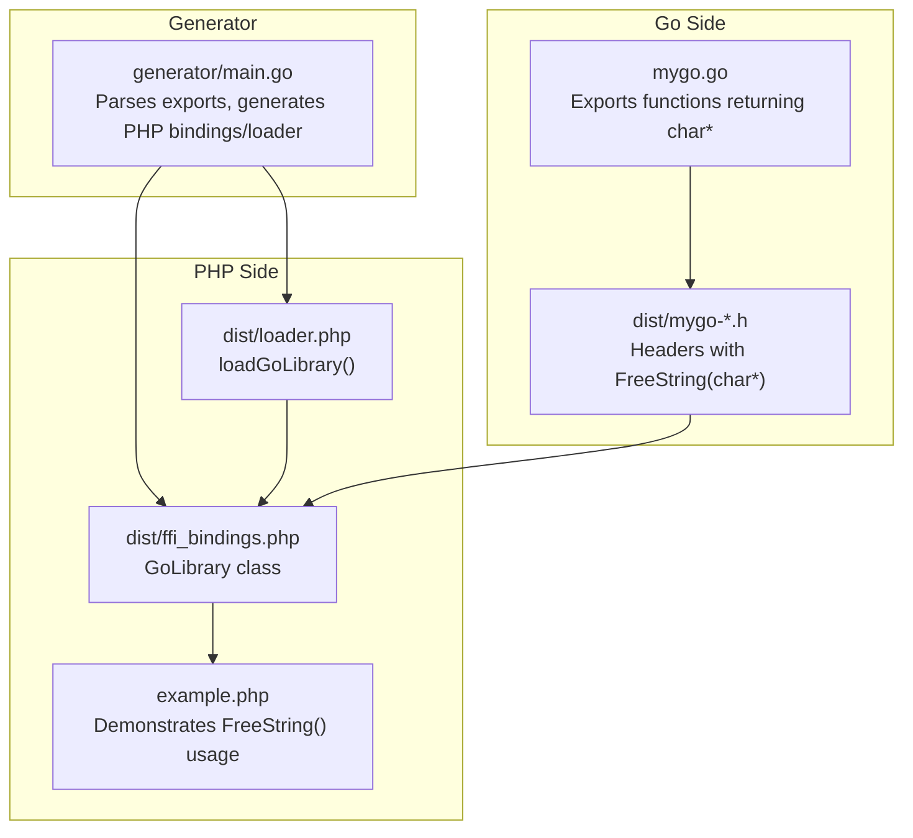
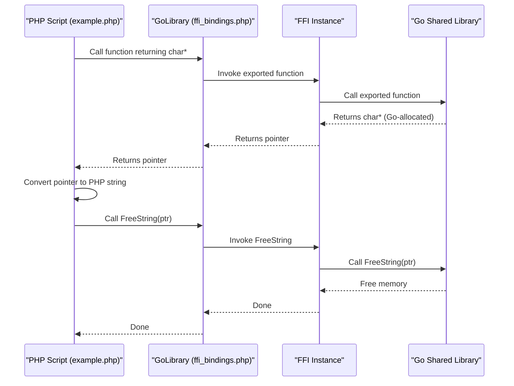
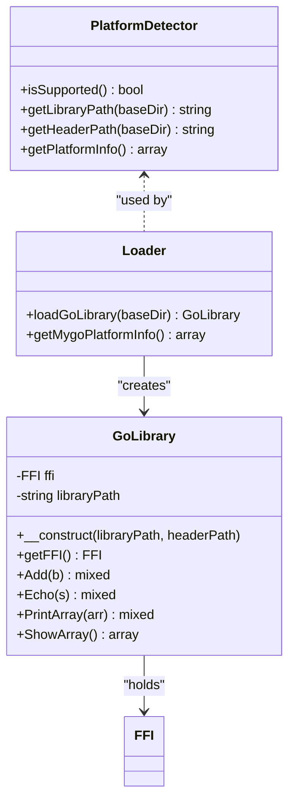
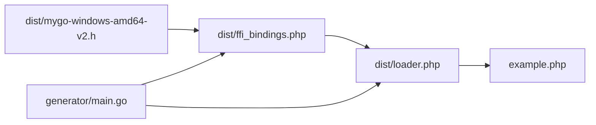

# Memory Management

<cite>
**Referenced Files in This Document**
- [example.php](file://example.php)
- [README.md](file://README.md)
- [AGENTS.MD](file://AGENTS.MD)
- [dist/ffi_bindings.php](file://dist/ffi_bindings.php)
- [dist/loader.php](file://dist/loader.php)
- [dist/mygo-windows-amd64-v2.h](file://dist/mygo-windows-amd64-v2.h)
- [generator/main.go](file://generator/main.go)
- [build.go](file://build.go)
</cite>

## Table of Contents
1. [Introduction](#introduction)
2. [Project Structure](#project-structure)
3. [Core Components](#core-components)
4. [Architecture Overview](#architecture-overview)
5. [Detailed Component Analysis](#detailed-component-analysis)
6. [Dependency Analysis](#dependency-analysis)
7. [Performance Considerations](#performance-considerations)
8. [Troubleshooting Guide](#troubleshooting-guide)
9. [Conclusion](#conclusion)

## Introduction
This document explains how to manage memory safely when using PHP FFI to call Go shared libraries that allocate C strings. The primary concern is avoiding memory leaks that occur when Go allocates memory for strings and returns pointers to PHP, but PHP does not free that memory. The repository demonstrates the correct lifecycle: receive a C string pointer from Go, convert it to a PHP string, and then explicitly free the Go-allocated memory using the exported FreeString function.

## Project Structure
The repository provides:
- A minimal Go library with exported functions returning C strings
- A code generator that produces PHP FFI bindings and loaders
- A build system that compiles shared libraries for multiple platforms
- An example PHP script that demonstrates correct memory management patterns

**Diagram sources**
- [mygo.go](file://mygo.go#L1-L38)
- [dist/mygo-windows-amd64-v2.h](file://dist/mygo-windows-amd64-v2.h#L100-L119)
- [generator/main.go](file://generator/main.go#L1-L75)
- [dist/ffi_bindings.php](file://dist/ffi_bindings.php#L1-L89)
- [dist/loader.php](file://dist/loader.php#L1-L58)
- [example.php](file://example.php#L1-L95)

**Section sources**
- [build.go](file://build.go#L1-L183)
- [generator/main.go](file://generator/main.go#L1-L75)
- [dist/loader.php](file://dist/loader.php#L1-L58)
- [dist/ffi_bindings.php](file://dist/ffi_bindings.php#L1-L89)
- [example.php](file://example.php#L1-L95)

## Core Components
- Go library exports functions returning char* (C strings). These strings are allocated by Go and must be freed by Go.
- The header file declares FreeString(char*), which is the counterpart to free Go-allocated memory.
- The PHP loader and bindings expose these functions to PHP.
- The example script demonstrates the correct pattern: convert the pointer to a PHP string, then call FreeString.

Key references:
- FreeString declaration in the header: [dist/mygo-windows-amd64-v2.h](file://dist/mygo-windows-amd64-v2.h#L100-L119)
- PHP loader and bindings: [dist/loader.php](file://dist/loader.php#L1-L58), [dist/ffi_bindings.php](file://dist/ffi_bindings.php#L1-L89)
- Example usage patterns in PHP: [example.php](file://example.php#L54-L86)

**Section sources**
- [dist/mygo-windows-amd64-v2.h](file://dist/mygo-windows-amd64-v2.h#L100-L119)
- [dist/loader.php](file://dist/loader.php#L1-L58)
- [dist/ffi_bindings.php](file://dist/ffi_bindings.php#L1-L89)
- [example.php](file://example.php#L54-L86)

## Architecture Overview
The memory lifecycle for Go-allocated strings is:

**Diagram sources**
- [example.php](file://example.php#L54-L86)
- [dist/ffi_bindings.php](file://dist/ffi_bindings.php#L1-L89)
- [dist/mygo-windows-amd64-v2.h](file://dist/mygo-windows-amd64-v2.h#L100-L119)

## Detailed Component Analysis

### Memory Lifecycle for C Strings Returned by Go
- Go allocates memory for returned strings and returns a char* pointer to PHP.
- PHP receives the pointer and must convert it to a PHP string. This conversion copies data into PHP’s string storage.
- PHP must then call FreeString(ptr) so Go can free the underlying memory.
- If FreeString is not called, the Go-allocated memory remains reachable from PHP, causing leaks.

Correct pattern in the example:
- Retrieve pointer from function call
- Convert to PHP string
- Immediately call FreeString on the original pointer

References:
- Example usage: [example.php](file://example.php#L54-L86)
- FreeString declaration: [dist/mygo-windows-amd64-v2.h](file://dist/mygo-windows-amd64-v2.h#L100-L119)

**Section sources**
- [example.php](file://example.php#L54-L86)
- [dist/mygo-windows-amd64-v2.h](file://dist/mygo-windows-amd64-v2.h#L100-L119)

### PHP FFI Bindings and Loader
- The loader determines the platform and constructs the GoLibrary instance with the correct library and header paths.
- The GoLibrary class exposes the exported functions and holds the FFI instance.
- The generator parses exported functions from Go source and creates the PHP bindings and loader.

Key responsibilities:
- Platform detection and library/header resolution: [dist/loader.php](file://dist/loader.php#L1-L58)
- FFI binding class and method forwarding: [dist/ffi_bindings.php](file://dist/ffi_bindings.php#L1-L89)
- Generation pipeline: [generator/main.go](file://generator/main.go#L1-L75)

**Diagram sources**
- [dist/loader.php](file://dist/loader.php#L1-L58)
- [dist/ffi_bindings.php](file://dist/ffi_bindings.php#L1-L89)
- [generator/main.go](file://generator/main.go#L1-L75)

**Section sources**
- [dist/loader.php](file://dist/loader.php#L1-L58)
- [dist/ffi_bindings.php](file://dist/ffi_bindings.php#L1-L89)
- [generator/main.go](file://generator/main.go#L1-L75)

### Error Handling and Memory Safety in Try-Catch
- The example wraps library calls in a try-catch block to handle errors gracefully.
- Even when exceptions occur, the correct pattern is to ensure FreeString is called to avoid leaks.
- Recommended approach: wrap string-returning calls in a scope where FreeString is guaranteed to run, or use a helper that ensures cleanup.

References:
- Example try-catch usage: [example.php](file://example.php#L21-L94)
- Memory leak guidance: [AGENTS.MD](file://AGENTS.MD#L360-L370)
- Function table and FreeString note: [README.md](file://README.md#L195-L209)

Best practice outline:
- Wrap each string-returning call in a local scope
- Convert the pointer to a PHP string immediately
- Call FreeString in a finally-like block or early return guard
- If an exception occurs, still ensure FreeString is executed

**Section sources**
- [example.php](file://example.php#L21-L94)
- [AGENTS.MD](file://AGENTS.MD#L360-L370)
- [README.md](file://README.md#L195-L209)

### Consequences of Improper Memory Management
- Memory exhaustion: Unfreed Go-allocated strings accumulate over repeated calls, increasing RSS and potentially causing out-of-memory conditions.
- Segmentation faults: Accessing freed memory or dangling pointers can crash the process.
- Resource leaks: Long-running PHP processes (e.g., PHP-FPM) will retain leaked memory across requests.

Mitigation:
- Always pair FFI::string() with FreeString() for char* results.
- Prefer RAII-like helpers or structured scopes to guarantee cleanup.
- Validate that FreeString is invoked even under error conditions.

References:
- Memory leak guidance: [AGENTS.MD](file://AGENTS.MD#L360-L370)
- Performance note on memory management: [README.md](file://README.md#L296-L302)

**Section sources**
- [AGENTS.MD](file://AGENTS.MD#L360-L370)
- [README.md](file://README.md#L296-L302)

## Dependency Analysis
The memory management depends on the following relationships:
- The header declares FreeString(char*), which the PHP bindings expose as a method on GoLibrary.
- The example script calls this method after converting the pointer to a PHP string.
- The loader and generator tie everything together by resolving platform-specific binaries and generating the bindings.

**Diagram sources**
- [dist/mygo-windows-amd64-v2.h](file://dist/mygo-windows-amd64-v2.h#L100-L119)
- [dist/ffi_bindings.php](file://dist/ffi_bindings.php#L1-L89)
- [dist/loader.php](file://dist/loader.php#L1-L58)
- [example.php](file://example.php#L1-L95)
- [generator/main.go](file://generator/main.go#L1-L75)

**Section sources**
- [dist/mygo-windows-amd64-v2.h](file://dist/mygo-windows-amd64-v2.h#L100-L119)
- [dist/ffi_bindings.php](file://dist/ffi_bindings.php#L1-L89)
- [dist/loader.php](file://dist/loader.php#L1-L58)
- [example.php](file://example.php#L1-L95)
- [generator/main.go](file://generator/main.go#L1-L75)

## Performance Considerations
- Converting C strings to PHP strings involves copying data; batch operations when possible to reduce overhead.
- Keep library loading costs amortized by reusing the GoLibrary instance across requests (e.g., in persistent workers).
- Avoid unnecessary conversions and frees; only free strings returned by functions documented as allocating memory on the Go side.

Reference:
- Performance notes: [README.md](file://README.md#L296-L302)

**Section sources**
- [README.md](file://README.md#L296-L302)

## Troubleshooting Guide
Common issues and remedies:
- FFI extension disabled: Ensure FFI is enabled in PHP configuration.
- Library not found: Verify the dist directory contains the correct platform binary and header.
- Unsupported platform: Build for your platform or extend platform detection.
- DLL loading errors on Windows: Match architecture and install required runtime libraries.

Memory-specific pitfalls:
- Forgetting to call FreeString leads to leaks. The documentation explicitly highlights this and shows the correct pattern.

References:
- Troubleshooting entries: [README.md](file://README.md#L238-L302)
- Memory leak guidance: [AGENTS.MD](file://AGENTS.MD#L360-L370)

**Section sources**
- [README.md](file://README.md#L238-L302)
- [AGENTS.MD](file://AGENTS.MD#L360-L370)

## Conclusion
When Go returns char* strings to PHP via FFI, the responsibility to free the underlying memory lies with the caller. The repository demonstrates the correct lifecycle: call the function, convert the pointer to a PHP string, and then call FreeString. The example script and documentation emphasize this pattern, and the header file explicitly declares FreeString. By following this pattern and ensuring FreeString is called even in error scenarios, you can avoid memory leaks, memory exhaustion, and segmentation faults while integrating Go shared libraries with PHP.